# OpenUDS 3.6 Installation, Administration and User Guide

1.  [INTRODUCTION 5](#introduction)

    1.  [Characterístics 7](#characterístics)

    2.  [Platform architecture with OpenUDS 8](#platform-architecture-with-uds-enterprise)

        1.  [Architecture of the network             10](#architecture-of-the-network)

    4.  [OpenUDS components 13](#uds-enterprise-components)

        1.  [UDS Server 14](#uds-server)

        2.  [UDS Tunnel 15](#uds-tunnel)

        3.  [UDS Dbserver 16](#uds-dbserver)

        4.  [UDS Actor 17](#uds-actor)

        5.  [UDS Client 19](#uds-client)

2.  [BEFORE INSTALLING UDS 20](#before-installing-uds)

    1.  [Installing on VMware vSphere 20](#installing-on-vmware-vsphere)

        1.  [Virtual platform requirements             20](#virtual-platform-requirements)

        2.  [Network connectivity 21](#network-connectivity)

    2.  [Installing on oVirt 22](#installing-on-ovirt)

        1.  [Virtual platform requirements             22](#virtual-platform-requirements-1)

        2.  [Network connectivity 23](#network-connectivity-1)

    3.  [Installing on RHV 24](#installing-on-rhv)

        1.  [Virtual platform requirements             24](#virtual-platform-requirements-2)

        2.  [Network connectivity 25](#network-connectivity-2)

    4.  [Installing on Microsoft Hyper-V
        26](#installing-on-microsoft-hyper-v)

        1.  [Virtual platform requirements
            26](#virtual-platform-requirements-3)

        2.  [Network connectivity 27](#network-connectivity-3)

    5.  [Installation on XenServer/XCP-ng
        28](#installation-on-xenserverxcp-ng)

        1.  [Virtual platform requirements
            28](#virtual-platform-requirements-4)

        2.  [Network connectivity 29](#network-connectivity-4)

    6.  [Installing on Nutanix Acropolis
        30](#installing-on-nutanix-acropolis)

        1.  [Virtual platform requirements
            30](#virtual-platform-requirements-5)

        2.  [Network connectivity 31](#network-connectivity-5)

    7.  [Installing on OpenStack 32](#installing-on-openstack)

        1.  [Virtual platform requirements
            32](#virtual-platform-requirements-6)

        2.  [Network connectivity 33](#network-connectivity-6)

    8.  [Installing on OpenNebula 34](#installing-on-opennebula)

        1.  [Virtual platform requirements
            34](#virtual-platform-requirements-7)

        2.  [Network connectivity 35](#network-connectivity-7)

3.  [INSTALLING OpenUDS 36](#installing-uds-enterprise)

    1.  [OpenUDS environment requirements
        36](#uds-enterprise-environment-requirements)

        1.  [Infrastructure requirememts
            36](#infrastructure-requirememts)

        2.  [Network requirements 36](#network-requirements)

    2.  [Installing OpenUDS components
        37](#installing-uds-enterprise-components)

        1.  [UDS Dbserver 37](#uds-dbserver-1)

        2.  [UDS Server 41](#uds-server-1)

        3.  [UDS Tunnel 58](#uds-tunnel-1)

        4.  [UDS Actor 74](#uds-actor-1)

        5.  [UDS Client 102](#uds-client-1)

4.  [MANAGING OpenUDS 114](#managing-uds-enterprise)

    1.  [Service Providers 117](#service-providers-1)

        1.  [VDI Platform with VMware vSphere
            118](#vdi-platform-with-vmware-vsphere)

        2.  [VDI platform with Nutanix Acropolis
            141](#vdi-platform-with-nutanix-acropolis)

        3.  [VDI Platform with Citrix XenServer / XCP-ng
            151](#vdi-platform-with-citrix-xenserver-xcp-ng)

        4.  [VDI Platform with oVirt / RHV
            162](#vdi-platform-with-ovirt-rhv)

        5.  [VDI Platform with Microsoft Hyper-V
            173](#vdi-platform-with-microsoft-hyper-v)

        6.  [VDI platform with Microsoft Azure
            184](#vdi-platform-with-microsoft-azure)

        7.  [Plataforma VDI con Amazon AWS
            195](#plataforma-vdi-con-amazon-aws)

        8.  [VDI platform with Proxmox 206](#vdi-platform-with-proxmox)

        9.  [Direct Connection to Persistent Devices
            217](#direct-connection-to-persistent-devices)

        10. [RDS Platform Provider 230](#rds-platform-provider)

    2.  [Authenticators 240](#authenticators)

        1.  [Active Directory 241](#active-directory)

        2.  [Azure AD 244](#azure-ad)

        3.  [IP 247](#ip)

        4.  [Internal Database 250](#internal-database)

        5.  [Radius Authenticator 253](#radius-authenticator)

        6.  [Regex LDAP 256](#regex-ldap)

        7.  [SAML 261](#saml)

        8.  [eDirectory 265](#edirectory)

    3.  [Multifactor 268](#multifactor)

        1.  [Email Multi Factor 269](#email-multi-factor)

        2.  [Radius OTP Challenge 271](#radius-otp-challenge)

        3.  [SMS via HTTP 273](#sms-via-http)

        4.  [TOTP Based MFA 275](#totp-based-mfa)
   
    5.  [Configure users, groups, and user metegtoups
        276](#configure-users-groups-and-user-metegtoups)

        1.  [Creation of groups and users \"Internal Database\"
            281](#creation-of-groups-and-users-internal-database)

        2.  [Creation of groups and users \"IP Authenticator\"
            283](#creation-of-groups-and-users-ip-authenticator)

    6.  [OS Managers 287](#os-managers)

        1.  [Linux 288](#linux-1)

        2.  [Linux Random Password 290](#linux-random-password)

        3.  [RDS 293](#rds)

        4.  [Windows Basic 295](#windows-basic)

        5.  [Windows Domain 297](#windows-domain)

        6.  [Windows Random Password 301](#windows-random-password)

    7.  [Transports 304](#transports)

        1.  [NICE DCV (direct) 306](#nice-dcv-direct)

        2.  [NoMachine Protocol (direct)
            310](#nomachine-protocol-direct)

        3.  [RDP (direct) 314](#rdp-direct)

        4.  [RDS For vApps (direct) 321](#rds-for-vapps-direct)

        5.  [SPICE (direct) 327](#spice-direct)

        6.  [URL Launcher (direct) 330](#url-launcher-direct)

        7.  [X2Go (direct) 333](#x2go-direct)

        8.  [HTML5 RDP (tunneled) 337](#html5-rdp-tunneled)

        9.  [HTML5 RDP For vApps (tunneled)
            344](#html5-rdp-for-vapps-tunneled)

        10. [NICE DCV (tunneled) 350](#nice-dcv-tunneled)

        11. [NoMachine Protocol (tunneled)
            356](#nomachine-protocol-tunneled)

        12. [PCoIP Cloud Access (tunneled)
            361](#pcoip-cloud-access-tunneled)

        13. [RDP (tunneled) 365](#rdp-tunneled)

        14. [RDS For vApps (tunneled) 374](#rds-for-vapps-tunneled)

        15. [SPICE (tunneled) 380](#spice-tunneled)

        16. [X2Go (tunneled) 384](#x2go-tunneled)

    8.  [Networks 389](#networks)

    9.  [Service Pools 392](#service-pools)

    10. [Meta Pools 401](#meta-pools)

    11. [Groups 407](#groups)

    12. [Access Calendars and scheduled tasks
        409](#access-calendars-and-scheduled-tasks)

        1.  [Calendars 409](#calendars)

    13. [Configure Permisions 417](#configure-permisions)

5.  [ACCESING VIRTUAL DESKTOPS WITH OpenUDS
    420](#accesing-virtual-desktops-with-uds-enterprise)

6.  [Tools 423](#tools)

    1.  [Gallery 423](#gallery)

    2.  [Reports 425](#reports)

    3.  [Configuration 427](#configuration)

        1.  [UDS 428](#uds)

        2.  [Security 429](#security)

        3.  [Admin 430](#admin)

        4.  [Custom 431](#custom)

        5.  [PCoIP 431](#pcoip)

        6.  [SAML 432](#saml-1)

        7.  [WYSE 433](#wyse)

        8.  [ENTERPRISE 433](#enterprise)

    4.  [Flush Cache 434](#flush-cache)

## INTRODUCTION

OpenUDS is a VDI connection broker that manages user access to different services: virtual desktops, virtual application sessions, remote computer sessions, etc\...

OpenUDS offers a set of software elements that make up a platform for managing. The life cycle, administration and deployment of desktop services

This document contains the basic instructions for installing the UDS Enterprise software elements on a virtual infrastructure and the procedures for proper administration and management of the different deployed services


### Characterístics

Among the main characteristics of OpenUDS, it is worth highlighting:

-   Very easy deployment, installation, and administration

-   Automated deployment of virtual desktops and management of access to     remote desktop sessions

-   Virtualization of Windows application sessions for users of Windows     / Linux environments using Remote Desktop Services (RDS)

-   Virtualization of Linux application sessions for users of Windows /     Linux environments using X2Go

-   Multi-hypervisor, being able to migrate the platform to more     efficient solutions (currently it is compatible with VMware vSphere,     KVM RHV/oVirt, Microsoft Hyper-V, Citrix XenServer, vCloud,     Microsoft Azure, AWS Amazon, OpenGnsys, OpenNebula, OpenStack,     Proxmox and Nutanix Acropolis)

-   Multi-authenticator. It allows defining users and user groups from     differen texternal sources and with virtually unlimited     configurations

-   Authentication system using multiple connectors, e.g.: Active     Directory, eDirectory, Azure AD, OpenLDAP, SAML, LDAP, CAS, Internal     authentication system, Device authentication system, IP\...

-   Generation of reports on the status and use of the platform

-   Tasks scheduling system (service deployment, user access control,     etc \...) through calendars

-   Secure WAN access for desktops and virtual applications using an SSL     Tunnel included in the subscription

-   Complete customization of the login portal and user services pages

-   Product roadmap based on customer and community requests

-   Subscription cost model that entitles support, new OpenUDS     versions, updates, and patches

-   Subscription model not redistributable by number of users up to     unlimited users

### Platform architecture with OpenUDS

The optimal design of a desktop services platform is a critical part of achieving all the benefits that an architecture can provide. Each layer that makes up this architecture must be designed in such a way that it fulfils its function without penalizing the rest.

The main elements that make up an architecture with OpenUDS are:

-   **Connection clients:** These are devices for accessing virtual     desktops and applications, such as thin clients, zero clients, PCs,     etc\... It is important to identify whether access to the desktops     will be made from a LAN or from a WAN

-   **UDS Servers:** They consist of a Database to store all the data     related to the environment, a connection broker that will manage the     life cycle of desktop services and communication with hypervisors     and other service providers; and a tunnel server to allow secure     access from the outside. All these elements are served in virtual     appliance format 

-   **Authenticator/s:** Active Directory, OpenLDAP, eDirectory servers,     etc\... Through their integration with OpenUDS they will     control user access to desktop services. Depending on the     environment, you can have from one to an unlimited number of     authenticators

####### Service Providers

-   **Hypervisor Platform:** : In charge of executing the tasks of     creating, turning on and eliminating the virtual desktops managed by     the broker. OpenUDS integrates with Microsoft Hyper-V, VMware     vSphere, KVM (oVirt, RHV, Proxmox, OpenStack and OpenNebula), Citrix     XenServer and Nutanix Acropolis hypervisors

-   **RDS Aplications:** In charge of providing the Windows application     sessions that will be managed by OpenUDS

-   **Storage:** They will host the servers, virtual and remote     desktops, applicationsor/and other services of the platform.     Choosing the type of storage is an important part of the design.     Depending on the needs that users demand in desktop services, you     must select the most appropriate type in terms of performance

When you have a clear idea of the architecture design, you can start scaling the platform, considering the number of users who will access it.

In the following image you can see an example of a VDI architecture with OpenUDS:


#### Architecture of the network

OpenUDS can be configured to be accessible by users located on a local network or users from a WAN (internet) without the need for VPN or LAN_extension.

Example of deployment of desktop services and virtual applications for user access through a LAN (drop-down to users who access from a VPN or LAN_extension):


Example of deployment of desktop services and virtual applications for user access through a WAN (internet).


To publish UDS on the internet and for its services to be accessible by users, two public IP addresses will be needed, one for UDS server and one for UDS Tunnel (it is possible to carry out this process with a single public IP address by changing the default ports and configuring an internal NAT).

####### Safe Employment Procedure: {#safe-employment-procedure .unnumbered}

It is recommended to open only the ports that are strictly necessary for the correct functioning of OpenUDS in the communication between its components.

It is recommended to install UDS Server and UDS Tunnel in the DMZ and UDS DbServer should be in the server zone. All these zones must be delimited by firewalls.

In the case of access to the UDS Server from the WAN, the use of port 443 is recommended to force the use of HTTPS in the UDS web portal.

The use of HTTPS requires the use of valid web certificates, it is the responsibility of the client to provide and install said certificates.

Example with 1 unique public IP:


####### Safe Employment Procedure: {#safe-employment-procedure-1 .unnumbered}

It is recommended to open only the ports that are strictly necessary for the correct functioning of OpenUDS in the communication between its components.

It is recommended to install UDS Server and UDS Tunnel in the DMZ and UDS DbServer should be in the server zone. All these zones must be delimited by firewalls.

In the case of access to the UDS Server from the WAN, the use of port 443 is recommended to force the use of HTTPS in the UDS web portal.

The use of HTTPS requires the use of valid web certificates, it is the responsibility of the client to provide and install said certificates.

### OpenUDS components

OpenUDS is made up of 5 elements that interact with each other.

-   **UDS Server:** It is installed as a virtual machine (VM) and is     provided in virtual appliance format

-   **UDS Tunnel:** It is installed as a VM and it is provided in     virtual appliance format

-   **UDS Dbserver:** It is installed as a VM and is provided in virtual     appliance format (Optional for UDS Free & Evaluation Edition)

-   **UDS Actor:** It is installed as a service in the VM that will be     used as a template for the deployment of the desktop groups and in     the RDS application servers to provide virtualized applications

-   **UDS Client:** It is installed on the client computer to be able to     connect with desktop services (with the HTML5 connection type it is     not necessary)


The features and technical requirements of each of them are defined below:

#### UDS Server

It is the software that mediates between connection clients and service providers. It is the essential piece of UDS, it performs the functions of connection broker to the desktop services allowing the administration and management of the platforms defined as implemented services.

####### Virtual Appliance with the following features: {#virtual-appliance-with-the-following-features .unnumbered}

-   Virtual Hard drivel: 8 GB

-   Memory: 2 GB

-   CPU: 2 vCPU

-   Network: 1 vNIC

####### Requirements: {#requirements .unnumbered}

-   1 IP Address

-   IP DNS

-   Network Mask

-   IP Gateway

-   Domain name

-   Database IP

-   DATABASE port and instance name

-   User and password of DATABASE user

-   Activation code (Enterprise, Free o Evaluation)

**Secure use procedure:** Passwords must be of sufficient length and include uppercase, lowercase, numbers, and special characters.

#### UDS Tunnel

This software is responsible for making secure connections to desktop services through the WAN and providing HTML5 access to virtual desktops.

The UDS tunnel allows you to connect from any device/browser/client to desktop services through an SSH tunnel without having previously installed any type of software.

Additionally, it enables RDP access to desktop services through HTML5.

####### Virtual Appliance with the following features: {#virtual-appliance-with-the-following-features-1 .unnumbered}

-   Hard drive: 14 GB

-   Memory: 2 GB

-   CPU: 2 vCPU

-   Network: 1 vNIC

####### Requirements: {#requirements-1 .unnumbered}

-   1 IP Direction

-   IP DNS

-   Network Mask

-   IP Gateway

-   Domanin Name

-   IP UDS Server

#### UDS Dbserver

It is the component responsible for storing all the data of the UDS system: service providers, authenticators, connectivity, etc\... and all the information that will make it possible to generate statistics and reports

The MySQL Database manager is supported as of version 5.7 and MariaDB 10.5.

It is necessary to have a MySQL Database at the time of installation properly configured with a valid instance and a user..

###### IMPORTANT! {#important .unnumbered}

If you do not have such a Database manager, Virtual Cable can provide this component as a virtual appliance. This component is not supported by the OpenUDS team.

####### Virtual Appliance with the following features: {#virtual-appliance-with-the-following-features-2 .unnumbered}

-   Hard Drive: 10 GB

-   Memory: 1 GB

-   CPU: 2 vCPU

-   Network: 1 vNIC

####### Requirements: {#requirements-2 .unnumbered}

-   1 IP address

-   DNS IP

-   Network mask

-   IP Gateway

-   Domain name

-   Database instance name

-   User with instance permission

#### UDS Actor

It is the software that performs the communication and interface function for the transmission of data (virtual desktop status, machine name\...) and commands between UDS Server and the desktop services managed by UDS.

It is installed as a service on the virtual machine to be used as a template (gold image) to generate groups of desktop services based on Linked Clones and on the Remote Desktop Services (RDS) servers to provide virtualized application sessions.

####### The supported operating systems to generate virtual desktops are: {#the-supported-operating-systems-to-generate-virtual-desktops-are .unnumbered}

-   Windows 11

-   Windows 10

-   Windows 8.1

-   Windows 8

-   Windows 7

-   Windows Server 2022

-   Windows Server 2019

-   Windows Server 2016

-   Windows Server 2012 R2

-   Linux (Debian, Ubuntu, CentOS, Fedora, OpenSuse, etc...)

####### Supported operating systems to generate virtual aplications are: {#supported-operating-systems-to-generate-virtual-aplications-are .unnumbered}

-   Windows Server 2012 R2

-   Windows Server 2016

-   Windows Server 2019

-   Windows Server 2022

####### Supported OS to generate Linux are: {#supported-os-to-generate-linux-are .unnumbered}

-   Ubuntu / Debian

####### Requirements: {#requirements-3 .unnumbered}

-   .Net Framework 3.5 SP1 (Windows Machines)

-   Python 3.6 (Linux Machines)

-   UDS Server IP

#### UDS Client

It is the software that makes the call to the connection protocol to connect with virtual desktops and applications

It is installed on the client computer from which the connection to desktop services is to be made.

####### The supported operating systems are: {#the-supported-operating-systems-are .unnumbered}

-   Windows 11

-   Windows 10

-   Windows 8.1

-   Windows 8

-   Windows 7

-   Windows Server 2022

-   Windows Server 2019

-   Windows Server 2016

-   Windows Server 2012 R2

-   Linux (Debian, Ubuntu, CentOS, Fedora, OpenSuse, etc...)

-   MAC OS (Versions 12 and 13)

## BEFORE INSTALLING UDS

OpenUDS components can be hosted on different virtualization platforms.

Although the OpenUDS components are hosted on a single virtual platform, UDS is capable of managing the deployment of virtual desktops on multiple virtual platforms, which are completely independent of the virtual platform where UDS is hosted.

The content of this section describes the requirements to install UDS Enterprise on different virtualization platforms and the requirements of the virtual platform on which the software will be installed.

### Installing on VMware vSphere

#### Virtual platform requirements

OpenUDS can be hosted on VMware vSphere 6.5 or above.

To know the requirements of a VMware vSphere platform you can consult the manufacturer\'s documentation

The VMware platform on which UDS will be deployed must meet the following Requirements:

-   At least one VMware ESXi server with a valid license is needed for     hosting the UDS servers and generating the virtual desktops

-   The vSphere platform must be administered by a vCenter with a valid     license

-   For OpenUDS to be able to integrate and send requests to     vCenter so that they can be executed, it is necessary to have the     credentials of a user with administration permissions on the VMware     vSphere platform on which the virtual desktops and applications will     be deployed

-   It is necessary to have defined at least one Virtual Machine Port     Group to which the virtual servers of the UDS platform will be     connected

-   It is necessary to have defined at least one Virtual Machine Port     Group to which the different virtual desktops managed by UDS will be     connected

-   At least 43 GB of free disk space is necessary to host the virtual     servers that make up UDS

-   At least 5 GB of free RAM is necessary to host the virtual servers     that make up UDS

#### Network connectivity

It is necessary to have the following communication ports enabled between the different elements that make up the UDS platform:

```
+--------------------+-----------------------+-------------------------+
| **Origin**       | **Destination**       | **Port**              |
+====================+=======================+=========================+
| UDS Server         | UDS MySQL             | 3306                  |
+--------------------+-----------------------+-------------------------+
| UDS Server         | vCenter               | 443                   |
+--------------------+-----------------------+-------------------------+
| UDS Server         | Autenticator          | 389, 636, XXX         |
+--------------------+-----------------------+-------------------------+
| UDS Server         | Virtual Desktops      | 3389 (RDP), 22 (NX),  |
|                    |                       | XXX                   |
+--------------------+-----------------------+-------------------------+
| UDS Server         | UDS Tunnel            | 443                   |
+--------------------+-----------------------+-------------------------+
| UDS Server (Actor) | Virtual Desktops      | 43910                 |
+--------------------+-----------------------+-------------------------+
| Virtual Desktops   | UDS Server (Actor)    | 443                   |
+--------------------+-----------------------+-------------------------+
| UDS Tunnel       | Virtual Desktops      | 3389 (RDP), 22 (NX),  |
|                    |                       | XXX                   |
+--------------------+-----------------------+-------------------------+
| UDS Tunnel       | UDS Server            | 443                   |
+--------------------+-----------------------+-------------------------+
| Users            | UDS Server            | 443                   |
+--------------------+-----------------------+-------------------------+
| Users (LAN)      | Virtual Desktops      | 3389 (RDP), 22 (NX),  |
|                    |                       | XXX                   |
+--------------------+-----------------------+-------------------------+
| Users            | UDS Tunnel            | 443                   |
+--------------------+-----------------------+-------------------------+
| Users            | UDS Tunnel (HTML5)    | 10443                 |
+--------------------+-----------------------+-------------------------+
```

### Installing on oVirt

#### Virtual platform requirements

OpenUDS can be deployed on oVirt 4.x platforms

The oVirt platform on which UDS will be deployed must meet the following requirements:

-   At least one oVirt node server is needed to host the UDS servers and     generate the virtual desktops

-   The oVirt platform must be managed by an oVirt-engine

-   For UDS to be installed and to send requests to oVirt-engine and for     them to be executed, it is necessary to have the credentials of a     user with administration permissions on the oVirt platform on which     the virtual desktops will be deployed

-   It is necessary to have at least one cluster defined to create and     configure the different virtual desktops managed by UDS

-   It is necessary to have defined at least one \"Logical network\" to     which the virtual servers of the UDS platform will be connected

-   It is necessary to have defined at least one \"Logical Network\" to     which the different virtual desktops managed by UDS will be     connected

-   At least 43 GB of free disk space is required to host the virtual     servers that make up UDS

-   At least 5 GB of free RAM is required to host the virtual servers     that make up UDS

#### Network connectivity

It is necessary to have the following communication ports enabled between the different elements that make up the UDS platform:

```
+--------------------+-----------------------+-------------------------+
| **Origin**       | **Destination**       | **Port**              |
+====================+=======================+=========================+
| UDS Server         | UDS MySQL             | 3306                  |
+--------------------+-----------------------+-------------------------+
| UDS Server         | oVirt-Engine          | 443                   |
+--------------------+-----------------------+-------------------------+
| UDS Server         | Autenticator          | 389, 636, XXX         |
+--------------------+-----------------------+-------------------------+
| UDS Server         | Virtual Desktops      | 3389 (RDP), 22 (NX),  |
|                    |                       | XXX                   |
+--------------------+-----------------------+-------------------------+
| UDS Server         | UDS Tunnel            | 443                   |
+--------------------+-----------------------+-------------------------+
| UDS Server (Actor) | Virtual Desktops      | 43910                 |
+--------------------+-----------------------+-------------------------+
| Virtual Desktops   | UDS Server (Actor)    | 443                   |
+--------------------+-----------------------+-------------------------+
| UDS Tunnel       | Virtual Desktops      | 3389 (RDP), 22 (NX),  |
|                    |                       | XXX                   |
+--------------------+-----------------------+-------------------------+
| UDS Tunnel       | UDS Server            | 443                   |
+--------------------+-----------------------+-------------------------+
| Users            | UDS Server            | 443                   |
+--------------------+-----------------------+-------------------------+
| Users (LAN)      | Virtual Desktops      | 3389 (RDP), 22 (NX),  |
|                    |                       | XXX                   |
+--------------------+-----------------------+-------------------------+
| Users            | UDS Tunnel            | 443                   |
+--------------------+-----------------------+-------------------------+
| Users            | UDS Tunnel (HTML5)    | 10443                 |
+--------------------+-----------------------+-------------------------+
```

### Installing on RHV

#### Virtual platform requirements

OpenUDS can be deployed on Red Hat Enterprise Virtualization platforms version 4. The RHV platform on which UDS will be deployed must meet the following requirements:

-   At least one RHV server is needed to host the UDS servers and     generate the virtual desktops

-   The RHV platform must be managed by a RHV-Manager server

-   For UDS to be installed and to send requests to RHV-Manager and for     them to be executed, it is necessary to have the credentials of a     user with administration permissions on the RHV platform on which     the virtual desktops will be deployed

-   It is necessary to have at least one cluster defined to create and     configure the different virtual desktops managed by UDS

-   It is necessary to have defined at least one \"Logical Network\" to     which the virtual servers of the UDS platform will be connected

-   It is necessary to have defined at least one \"Logical Network\" to     which the different virtual desktops managed by UDS will be     connected

-   There must be at least 43 GB of free space on the hard drive to host     the virtual servers that make up UDS

-   There must be at least 5 GB of free RAM to host the virtual servers     that make up UDS

#### Network connectivity

It is necessary to have the following communication ports enabled between the different elements that make up the UDS platform:

```
+--------------------+-----------------------+-------------------------+
| **Origin**       | **Destination**       | **Port**              |
+====================+=======================+=========================+
| UDS Server         | UDS MySQL             | 3306                  |
+--------------------+-----------------------+-------------------------+
| UDS Server         | RHV-Manager           | 443                   |
+--------------------+-----------------------+-------------------------+
| UDS Server         | Autenticator          | 389, 636, XXX         |
+--------------------+-----------------------+-------------------------+
| UDS Server         | Virtual desktops      | 3389 (RDP), 22 (NX),  |
|                    |                       | XXX                   |
+--------------------+-----------------------+-------------------------+
| UDS Server         | UDS Tunnel            | 443                   |
+--------------------+-----------------------+-------------------------+
| UDS Server (Actor) | Virtual desktops      | 43910                 |
+--------------------+-----------------------+-------------------------+
| Virtual desktops   | UDS Server (Actor)    | 443                   |
+--------------------+-----------------------+-------------------------+
| UDS Tunnel       | Virtual desktops      | 3389 (RDP), 22 (NX),  |
|                    |                       | XXX                   |
+--------------------+-----------------------+-------------------------+
| UDS Tunnel       | UDS Server            | 443                   |
+--------------------+-----------------------+-------------------------+
| Users            | UDS Server            | 443                   |
+--------------------+-----------------------+-------------------------+
| Users (LAN)      | Virtual desktops      | 3389 (RDP), 22 (NX),  |
|                    |                       | XXX                   |
+--------------------+-----------------------+-------------------------+
| Users            | UDS Tunnel            | 443                   |
+--------------------+-----------------------+-------------------------+
| Users            | UDS Tunnel (HTML5)    | 10443                 |
+--------------------+-----------------------+-------------------------+
```

### Installing on Microsoft Hyper-V

#### Virtual platform requirements

UDS can be deployed on Microsoft Hyper-V platforms version 3.

The Microsoft Hyper-V platform on which UDS will be deployed must meet the following requirements:

-   At least one Microsoft Hyper-V server with a valid license is     required to host the UDS servers and generate the virtual desktops

-   It is necessary to have defined at least one Virtual Switch to which     the virtual servers of the UDS platform will be connected

-   It is necessary to have defined at least one Virtual Switch to which     the different virtual desktops managed by UDS will be connected

-   It is necessary to have the credentials of a user with     administration permissions on the Microsoft Hyper-V platform on     which the virtual desktops will be deployed

-   There must be at least 43 GB of free space on the hard drive to host     the virtual servers that make up UDS

-   There must be at least 5 GB of free RAM to host the virtual servers     that make up UDS

-   The machines that are used as templates machines (Gold Image) must     be of the type: Generation 1

-   For the correct working of Microsoft Hyper-V with UDS, it is     necessary to execute the following script (as administrator) on all     Hyper-V hosts that will be used by UDS (even if they are no part of     Hyper-V cluster):

Invoke-Expression ((New-Object System.Net.Webclient).DownloadString(\'https://images.udsenterprise.com/files/hype rv/EnableRemoting.ps1\'))

#### Network connectivity

It is necessary to have the following communication ports enabled between the different elements that make up the UDS platform:

```
+--------------------+-----------------------+-------------------------+
| **Origin**       | **Destination**       | **Port**              |
+====================+=======================+=========================+
| UDS Server         | UDS MySQL             | 3306                  |
+--------------------+-----------------------+-------------------------+
| UDS Server         | Hyper-V             | 443                   |
+--------------------+-----------------------+-------------------------+
| UDS Server         | Autenticator          | 389, 636, XXX         |
+--------------------+-----------------------+-------------------------+
| UDS Server         | Virtual desktops      | 3389 (RDP), 22 (NX),  |
|                    |                       | XXX                   |
+--------------------+-----------------------+-------------------------+
| UDS Server         | UDS Tunnel            | 443                   |
+--------------------+-----------------------+-------------------------+
| UDS Server (Actor) | Virtual desktops      | 43910                 |
+--------------------+-----------------------+-------------------------+
| Virtual desktops   | UDS Server (Actor)    | 443                   |
+--------------------+-----------------------+-------------------------+
| UDS Tunnel       | Virtual desktops      | 3389 (RDP), 22 (NX),  |
|                    |                       | XXX                   |
+--------------------+-----------------------+-------------------------+
| UDS Tunnel       | UDS Server            | 443                   |
+--------------------+-----------------------+-------------------------+
| Users            | UDS Server            | 443                   |
+--------------------+-----------------------+-------------------------+
| Users (LAN)      | Virtual desktops      | 3389 (RDP), 22 (NX),  |
|                    |                       | XXX                   |
+--------------------+-----------------------+-------------------------+
| Users            | UDS Tunnel            | 443                   |
+--------------------+-----------------------+-------------------------+
| Users            | UDS Tunnel (HTML5)    | 10443                 |
+--------------------+-----------------------+-------------------------+
```

### Installation on XenServer/XCP-ng

#### Virtual platform requirements

OpenUDS can be deployed on XenServer/XCP-ng platforms from version 7 onwards.

The XenServer/XCP-ng platform on which UDS will be deployed must meet the following requirements:

-   At least one XenServer/XCP-ng server is required to host the UDS     servers and generate the virtual desktops

-   For UDS to be installed and to send requests to XenServer/XCP-ng and     for them to be executed, it is necessary to have the credentials of     a user with administration permissions on the XenServer/XCP-ng     platform on which you are going to deploy virtual desktops

-   It is necessary to have defined at least one network to which the     virtual servers of the UDS platform will be connected

-   It is necessary to have defined at least one network to which the     different virtual desktops managed by UDS will be connected

-   The storage used to host the virtual desktops must be of type SR

-   There must be at least 43 GB of free space on the hard drive to host     the virtual servers that make up UDS

-   There must be at least 5 GB of free RAM to host the virtual servers     that make up UDS

#### Network connectivity

It is necessary to have the following communication ports enabled between the different elements that make up the UDS platform:

```
+--------------------+-----------------------+-------------------------+
| **Origin**       | **Destination**       | **Port**              |
+====================+=======================+=========================+
| UDS Server         | UDS MySQL             | 3306                  |
+--------------------+-----------------------+-------------------------+
| UDS Server         | XenServer/XCP-ng      | 443                   |
+--------------------+-----------------------+-------------------------+
| UDS Server         | Autenticator          | 389, 636, XXX         |
+--------------------+-----------------------+-------------------------+
| UDS Server         | Virtual desktops      | 3389 (RDP), 22 (NX),  |
|                    |                       | XXX                   |
+--------------------+-----------------------+-------------------------+
| UDS Server         | UDS Tunnel            | 443                   |
+--------------------+-----------------------+-------------------------+
| UDS Server (Actor) | Virtual desktops      | 43910                 |
+--------------------+-----------------------+-------------------------+
| Virtual desktops   | UDS Server (Actor)    | 443                   |
+--------------------+-----------------------+-------------------------+
| UDS Tunnel       | Virtual desktops      | 3389 (RDP), 22 (NX),  |
|                    |                       | XXX                   |
+--------------------+-----------------------+-------------------------+
| UDS Tunnel       | UDS Server            | 443                   |
+--------------------+-----------------------+-------------------------+
| Users            | UDS Server            | 443                   |
+--------------------+-----------------------+-------------------------+
| Users (LAN)      | Virtual desktops      | 3389 (RDP), 22 (NX),  |
|                    |                       | XXX                   |
+--------------------+-----------------------+-------------------------+
| Users            | UDS Tunnel            | 443                   |
+--------------------+-----------------------+-------------------------+
| Users            | UDS Tunnel (HTML5)    | 10443                 |
+--------------------+-----------------------+-------------------------+
```

### Installing on Nutanix Acropolis

#### Virtual platform requirements

OpenUDS can be deployed on Nutanix Acropolis platforms.

The Nutanix Acropolis platform on which UDS will be deployed must meet the following requirements:

-   For UDS to be installed and to send requests to Acropolis and for     these to be executed, it is necessary to have the credentials of a     user with administration permissions on the Acropolis platform on     which the virtual desktops will be deployed

-   It is necessary to have defined at least one network to which the     virtual servers of the UDS platform will be connected

-   It is necessary to have at least one network defined to which the     different virtual desktops managed by UDS will be connected

-   There must be at least 43 GB of free space on the hard drive to host     the virtual servers that make up UDS

-   There must be at least 5 GB of free RAM to host the virtual servers     that make up UDS

#### Network connectivity

It is necessary to have the following communication ports enabled between the different elements that make up the UDS platform:

```
+--------------------+-----------------------+-------------------------+
| **Origin**       | **Destination**       | **Port**              |
+====================+=======================+=========================+
| UDS Server         | UDS MySQL             | 3306                  |
+--------------------+-----------------------+-------------------------+
| UDS Server         | Acropolis             | 443                   |
+--------------------+-----------------------+-------------------------+
| UDS Server         | Autenticator          | 389, 636, XXX         |
+--------------------+-----------------------+-------------------------+
| UDS Server         | Virtual Desktops      | 3389 (RDP), 22 (NX),  |
|                    |                       | XXX                   |
+--------------------+-----------------------+-------------------------+
| UDS Server         | UDS Tunnel            | 443                   |
+--------------------+-----------------------+-------------------------+
| UDS Server (Actor) | Virtual Desktops      | 43910                 |
+--------------------+-----------------------+-------------------------+
| Virtual Desktops   | UDS Server (Actor)    | 443                   |
+--------------------+-----------------------+-------------------------+
| UDS Tunnel       | Virtual Desktops      | 3389 (RDP), 22 (NX),  |
|                    |                       | XXX                   |
+--------------------+-----------------------+-------------------------+
| UDS Tunnel       | UDS Server            | 443                   |
+--------------------+-----------------------+-------------------------+
| Users            | UDS Server            | 443                   |
+--------------------+-----------------------+-------------------------+
| Users (LAN)      | Virtual Desktops      | 3389 (RDP), 22 (NX),  |
|                    |                       | XXX                   |
+--------------------+-----------------------+-------------------------+
| Users            | UDS Tunnel            | 443                   |
+--------------------+-----------------------+-------------------------+
| Users            | UDS Tunnel (HTML5)    | 10443                 |
+--------------------+-----------------------+-------------------------+
```

### Installing on OpenStack

#### Virtual platform requirements

OpenUDS can be deployed on OpenStack platforms starting with the Stein version.

The OpenStack platform on which UDS will be deployed must meet the following requirements:

-   For UDS to be installed and to send requests to OpenStack and for     these to be executed, it is necessary to have the credentials of a     user with administration permissions on the platform

-   It is necessary to have defined at least one network to which the     virtual servers of the UDS platform will be connected

-   It is necessary to have defined at least one network to which the     different virtual desktops managed by UDS will be connected

-   There must be at least 43 GB of free space on the hard drive to host     the virtual servers that make up UDS

-   There must be at least 5 GB of free RAM to host the virtual servers     that make up UDS.

#### Network connectivity

It is necessary to have the following communication ports enabled between the different elements that make up the UDS platform:

```
+--------------------+-----------------------+-------------------------+
| **Origin**       | **Destination**       | **Port**              |
+====================+=======================+=========================+
| UDS Server         | UDS MySQL             | 3306                  |
+--------------------+-----------------------+-------------------------+
| UDS Server         | OpenStack             | 5000                  |
+--------------------+-----------------------+-------------------------+
| UDS Server         | Autenticador          | 389, 636, XXX         |
+--------------------+-----------------------+-------------------------+
| UDS Server         | Virtual desktops      | 3389 (RDP), 22 (NX),  |
|                    |                       | XXX                   |
+--------------------+-----------------------+-------------------------+
| UDS Server         | UDS Tunnel            | 443                   |
+--------------------+-----------------------+-------------------------+
| UDS Server (Actor) | Virtual desktops      | 43910                 |
+--------------------+-----------------------+-------------------------+
| Virtual desktops   | UDS Server (Actor)    | 443                   |
+--------------------+-----------------------+-------------------------+
| UDS Tunnel       | Virtual desktops      | 3389 (RDP), 22 (NX),  |
|                    |                       | XXX                   |
+--------------------+-----------------------+-------------------------+
| UDS Tunnel       | UDS Server            | 443                   |
+--------------------+-----------------------+-------------------------+
| Users            | UDS Server            | 443                   |
+--------------------+-----------------------+-------------------------+
| Users (LAN)      | Virtual desktops      | 3389 (RDP), 22 (NX),  |
|                    |                       | XXX                   |
+--------------------+-----------------------+-------------------------+
| Users            | UDS Tunnel            | 443                   |
+--------------------+-----------------------+-------------------------+
| Users            | UDS Tunnel (HTML5)    | 10443                 |
+--------------------+-----------------------+-------------------------+
```

### Installing on OpenNebula

#### Virtual platform requirements

OpenUDS can be deployed on OpenNebula 5.x platforms.

The OpenNebula platform on which UDS will be deployed must meet the following requirements:

-   For UDS to be installed and to send requests to OpenNebula and for     these to be executed, it is necessary to have the credentials of a     user with administration permissions on the platform

-   It is necessary to have defined at least one network to which the     virtual servers of the UDS platform will be connected

-   It is necessary to have defined at least one network to which the     different virtual desktops managed by UDS will be connected

-   There must be at least 43 GB of free space on the hard drive to host     the virtual servers that make up UDS

-   There must be at least 5 GB of free RAM to host the virtual servers     that make up UDS.

#### Network connectivity

It is necessary to have the following communication ports enabled between the different elements that make up the UDS platform:

```
+--------------------+-----------------------+-------------------------+
| **Origen**       | **Destino**           | **Puerto**            |
+====================+=======================+=========================+
| UDS Server         | UDS MySQL             | 3306                  |
+--------------------+-----------------------+-------------------------+
| UDS Server         | OpenNebula            | 2633                  |
+--------------------+-----------------------+-------------------------+
| UDS Server         | Autenticator          | 389, 636, XXX         |
+--------------------+-----------------------+-------------------------+
| UDS Server         | Virtual desktops      | 3389 (RDP), 22 (NX),  |
|                    |                       | XXX                   |
+--------------------+-----------------------+-------------------------+
| UDS Server         | UDS Tunnel            | 443                   |
+--------------------+-----------------------+-------------------------+
| UDS Server (Actor) | Virtual desktops      | 43910                 |
+--------------------+-----------------------+-------------------------+
| Virtual desktops   | UDS Server (Actor)    | 443                   |
+--------------------+-----------------------+-------------------------+
| UDS Tunnel       | Virtual desktops      | 3389 (RDP), 22 (NX),  |
|                    |                       | XXX                   |
+--------------------+-----------------------+-------------------------+
| UDS Tunnel       | UDS Server            | 443                   |
+--------------------+-----------------------+-------------------------+
| Users            | UDS Server            | 443                   |
+--------------------+-----------------------+-------------------------+
| Users (LAN)      | Virtual desktops      | 3389 (RDP), 22 (NX),  |
|                    |                       | XXX                   |
+--------------------+-----------------------+-------------------------+
| Users            | UDS Tunnel            | 443                   |
+--------------------+-----------------------+-------------------------+
| Users            | UDS Tunnel (HTML5)    | 10443                 |
+--------------------+-----------------------+-------------------------+
```

## INSTALLING OpenUDS

At this point, we will detail the installation of the OpenUDS components and their requirements. The installation procedure will be the same for the different virtualization platforms (VMware vSphere, Microsoft Hyper-V, Citrix XenServer, etc...) supported by UDS.

### OpenUDS environment requirements

#### Infrastructure requirememts

The infrastructure requirements necessary for UDS to be deployed are:

-   **Virtualization Platform.** It will be in charge of hosting the UDS     servers, the generated virtual desktops and the application servers.

    -   Username and Password of the manager of the virtualization         platform with administrator permissions.

**Secure use procedure:** Passwords must be of sufficient length and include uppercase, lowercase, numbers, and special characters.

-   **DNS Server.** This service is necessary for both the proper     running of the virtual platform as well as for the UDS virtual     platform environment to be deployed.

-   **DHCP Server.** A DHCP server that enables to assign IP addresses     to the virtual desktop groups created by UDS.

#### Network requirements

To configure the UDS network, it is necessary to have at least 3 IP addresses (Server, Tunnel and Database).

It is also necessary to have available:

-   Network mask

-   IP address of the DNS server

-   Gatewa IP address

-   Domain name (if there is one)

-   IP address of the virtualization platform manager

**NOTE: If you install UDS Free Edition or UDS Evaluation Edition, you can do it without the Database component. In this case, only 2 IP addresses (Server and Tunnel) will be necessary.**

### Installing OpenUDS components

#### UDS Dbserver

Remember that in case of installing UDS Free Edition or UDS Evaluation Edition the Database can be configured internally in the UDS Server component. These editions do not require the installation of an external Database

If Virtual Cable provides the UDS Database virtual appliance, the following steps should be followed: Access MySQL server with the following credentials:

-   **User**: root

-   **Password**: uds

####### NOTE: It is recommended to modify the default password to give the system greater security. {#note-it-is-recommended-to-modify-the-default-password-to-give-the-system-greater-security. .unnumbered}

You can use the command: passwd

**Secure use procedure**: Passwords must be of sufficient length and include uppercase, lowercase, numbers, and special characters.


Configure the network parameters of the virtual machine. To do this, the file "***interfaces***" will be modified, and a static IP address will be assigned (by default, the virtual appliance is configured by **DHCP**).


Depending on the virtualization platform that you use to host the \"Database\" component, you must assign the new static IP address to the corresponding network interface (Normally it wil be "eth0"):


It is also necessary to modify the "***resolv.conf***" file in order to configure the DNS server:


Once all the necessary network data has been configured, restart the server and check that all the data have been correctly configured:


Once the server IP data have been configured, it would already be available for use with UDS. By default, the MySQL server has the following Database instance configured ready to use with the UDS server:

-   **Instance**: uds

-   **User**: uds

-   **Password**: uds

**NOTE:** It is recommended to modify the password to give the system greater security. To perform this task we can execute the next command in the MySQL console:

grant all on *database_name*.\* to \'*usuario*\'@\'%\' identified by \'new\_*password*\';

**Secure use procedure:** Passwords must be of sufficient length and include uppercase, lowercase, numbers, and special characters.

Once these tasks have been completed, the Database will be available for use with the UDS Server component.

If it were necessary to create a new Database instance for UDS, you would carry out the following process:

Access MySQL with these credentials:

-   **Usuario**: root

-   **Password**: uds


The Database is created using the following command:

create database *database_name* default charset utf8mb4 collate utf8mb4_general_ci;

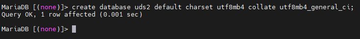

***database_name*** will be the name of the new Database instance.

Create a user with administrator permissions on the new Database instance using the command:

grant all on *database_name*.\* to \'*usuario*\'@\'%\' identified by \'*password*\';


***database_name*** will be the name of the Database instance, ***user*** will be the name of  the user with administration permissions on this Database instance and ***password*** the password assigned to the indicated user.

**Secure use procedure:** Passwords must be of sufficient length and include uppercase, lowercase, numbers, and special characters.

By default, the Database server includes the Cockpit tool, which allows you to manage and monitor certain server components.

To access, we will use the IP address or name of the server with the port: 9090 https://***ip_dbserver***:9090


####### Secure use procedure: {#secure-use-procedure .unnumbered}

In general, it is advisable to implement the basic and essential security mechanisms on any server; strong passwords, backup copies, having security solutions, keeping systems updated and modifying the configurations, users and passwords included, by default.

In addition, for a database server, although in the case of UDS Enterprise, we do not store any confidential information, but configuration and registration information, it is important:

-   Limit access

-   Encrypt the information

-   Monitor activity

It is advised to disable SSH access to this server, so that it is only accessible by console.

#### UDS Server

Once the UDS Server virtual appliance has been imported to a supported virtualization platform, turn on the virtual machine to proceed with its initial configuration.


**NOTE:** In order to successfully configure a UDS server, it is necessary to have a database server configured with an available instance. If using a database that has already been used with UDS and contains data from a previous UDS version, all data will be migrated for use with the new version (database migrations are only allowed from contiguous versions) .

The UDS Evaluation Edition version allows you to not use the external MySQL Database since the system allows you to automatically enable a local Database.

By default, the virtual appliance UDS Server will take a network configuration via DHCP. In case there is no server on the network that assigns IP addresses, you will have to assign the network data manually:


In order to do this, use the command ***uds ip set***

Its configuration options are:


Therefore, you will proceed to the manual configuration of the network data:

uds ip set *ip_server*/*mask gateway name_server*

Additionally, you can indicate the domain (extracted from the server name) and the DNS servers (with the \--dns parameter)


Once the IP is configured, restart the server to apply the changes.

If you already have an IP address assigned to the server, either by its manual configuration or by the automatic assignment of a DHCP server, you will proceed to configure the UDS Server component:
 
To do this, you will access the server\'s IP address via web browser, indicating port 9900


####### Security note: {#security-note .unnumbered}

To carry out the initial basic configuration, UDS Broker incorporates its own security mechanism. In order to perform the initial configuration we need two things:

-   The \"uds setup\" command must be running in the broker

-   We need to know the value of the Setup Code of our broker.

The "uds setup" command is executed automatically the first time the broker is turned on and can be executed manually at any time from the console.

The "uds setup" command is stopped automatically at the end of the initial configuration or manually by executing "uds setup -s".

When executing the \"uds setup\" command, the \"Setup Code\" of our broker appears on the screen, which will be requested if we want to carry out the basic configuration remotely.

The "Setup Code" is an eight-character token that does NOT circulate at any time through the network, which will be our "One-time pad".

"One-time pad" is part of an encryption technique that cannot be cracked, but requires the use of a one-time pre-shared key that is no smaller than the message being sent.

In this technique, a plain text is combined with a random secret key, our single-use "One-time pad".

With this token at each end of the connection through a \"salt\", a set of random bits that we use as part of the key of the cryptographic algorithm, and using a 512 hash function, we obtain a 3,072- byte key, which it is sliced and used by both parties to encrypt and decrypt the information  transmitted and received during this initial setup. This key is never used in its entirety or reused in any of its parts.


This \"Setup Code\" will be requested during the basic initial configuration.

####### NOTE: The http access should not be used to access the broker\'s web server, but rather the initial basic configuration application of the server software \"uds setup\" through https and port 9900. {#note-the-http-access-should-not-be-used-to-access-the-brokers-web-server-but-rather-the-initial-basic-configuration-application-of-the-server-software-uds-setup-through-https-and-port-9900. .unnumbered}


**Step 1.-** Select the language of the configuration wizard:


**Step 2.-** - Indicate the server's name, domain (optional) and server network data:


**NOTE:** If the indicated IP address is different from the one already configured by the server via DHCP or manual configuration, the system will automatically redirect to the new address to continue with the configuration wizard.

**NOTE:** If all the indicated data are correct and you do not want to modify any data, you can use the option \"Skip network config (leave it as is)\".

Check that the indicated data are correct and accept:


Wait for the configuration of the new network data to finish:


**Step 3.-** Add the security code ("Setup Code") that will appear in the console of our UDS Server appliance and that you saw at the beginning of this procedure:


**Step 4.-** We configure the keyboard language that the server will have, the time zone and an NTP server (optional):


**Step 5.-** Select the type of Database to be used:

-   **MySQL (remote)**: If you select this type, the system will require     an external database server (valid and recommended for any edition     of UDS).

-   **Embedded (local):** If you select this type, the system will     enable a local Database on the UDS server. Not recommended for     Enterprise Editions

###### NOTE: {#note .unnumbered}

If you select a local Database, you will not be able to update the system with new versions without losing existing data.

In the case of selecting "***MySQL (remote)***", you must indicate the connection data with the Database:

-   **Username:** Username with administrative permissions on the     Database instance

-   **Password:** User password

-   **Connection Type:** Type of connection to the database

-   **Database:** Name of the Database Instance


**NOTE:** If you use the database server provided by UDS, the default data are: Username: uds // Password: uds // Database: uds

**Security Procedure:** It is advisable to change the username and password of the database, this is done on the database server itself. **Passwords must be of sufficient length and include** uppercase, lowercase, **numbers** and special characters. ***tag.***

We wait for the connection to the database to be configured and continue:


**Step 5.-** Continue with the subscription activation process. You must select the activation mode:


-   **Online:** To carry out this activation mode, you will need to have     a valid serial number and a connection to the UDS activation servers     on the internet.

Select the opción ***"Online - UDS Broker will need internet connecion"*** and indicate a valid activation code:

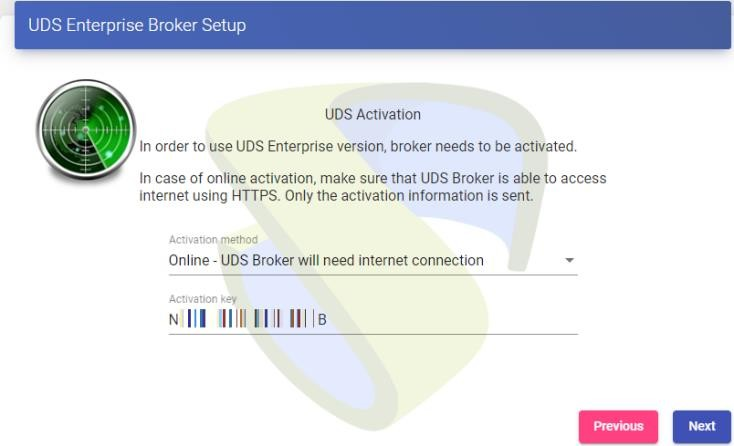

The system will validate the activation code with the UDS central remote servers and, if valid, will continue with the configuration process.


If the activation code is invalid or has no more instances, an activation error will appear and you should contact the OpenUDS support team:


-   **Offline:** This subscription activation procedure will only have     to be performed when the UDS server does not have a direct internet     connection to the activation servers.

You first select the option ***"Offline -- First step -- Create subscription activation request"***, indicate your activation code and click on ***"Generate request info from current activation key":***


A new window will automatically open with instructions to carry out the first part of the activation. It will indicate that you must send, via email, a text automatically generated by the system:


Once the response is received from the OpenUDS support team (which may take a while, since this request has to be processed and validated), you will receive a file called ***uds-subscription.key.***

Now select the option ***"Offline -- Second step -- Process received subscription file"***, indicating the file received in ***"Current subscription file"*** and continue with the configuration wizard


**Step 7.-** - Configure the password of the local user root of the UDS server and indicate the name and password of the UDS system administrator user (super-user to access the UDS web administration).


**Security Procedure:** For a secure installation it is recommended to use passwords with a minimum of 12 characters, uppercase, lowercase, numbers and special characters.

**Step 8.-** If you have the certificate files, enter them. Otherwise, you can install them after completing the wizard via console.

You need to indicate the certificate file in the \"Server certificate\" field (.crt, .pem, etc \...), the file with the \"Private key\" (.key, .pem, etc \...) and optionally you can indicate the certifying entity \"Chain file\" (.crt, .pem, etc \...).


**NOTE:** For a totally secure installation, and to be able to make connections via HTTPS, the use of valid certificates on the server will always be recommended, since otherwise anyone who wants to access the web portal will be notified with an error warning that the self-signed certificates of the UDS Server are insecure.

**Step 9.-** Finish the configuration of the UDS server by clicking on "***Reboot***" so that the server restarts and applies all the indicated configuration.


You will be able to close the page of the configuration wizard and, once the server has been restarted, it will be accessible from any browser by accessing the IP address or name of the server via http or https:


OpenUDS home page:


**NOTE:** Web access can be made by both HTTP and HTTPS, if the latter is not used, there may be a high security risk.

**Security procedure**: A certificate must have been installed on the broker\'s server in step 8 of the initial basic installation procedure to proceed with the use of OpenUDS securely via HTTPS.

We also recommend that you disable HTTP access or at least redirect HTTP access to HTTPS.

If you need to run the configuration wizard again to modify any data, you will have to validate yourself on the server (with the root user and the password established in step 6) and execute the command:

-   **uds setup:** Launch the setup wizard


This will re-enable the setup wizard

Additionally, with the command uds you can make other modifications on the server:


-   **uds cert:** It will allow the installation of certificates on the     server:


-   **uds subscription:** It will allow you to check the type of active     subscription on the server and, if necessary, update it:


-   **uds suscription refresh**: Update the data of the subscription     used (Internet connection required).

-   **uds suscription status**: Show current subscription information:

-   **uds suscription import**: Import a file to update or activate the     OpenUDS subscription.

-   **uds security**: It will allow to modify the name and password of     the super-user to access the web administration of UDS, we can also     enable or disable said user:


-   **uds security username**: Modify the username of the UDS     administrator user.

-   **uds security password**: Modify the password of the UDS     administrator user.

**Safe use procedure:** Passwords must be of sufficient length and include uppercase, lowercase, numbers and special characters.

-   **uds security allow**: Allows you to choose the ips/range that will     be able to access the administration.

-   **uds ip:** It will allow consulting, modifying, and resetting the     IP data of the server:


-   **uds ip get**: Shows the Ips information of the UDS server.

-   **uds ip set**: Assign the network data of the server manually.

-   **uds ip reset**: Restarts the network information of the UDS     Appliance.

-   **uds trust:** Comando que nos permitirá confiar en un certificado     de un servidor remoto.

####### Solo válido para certificados autofirmados. {#solo-válido-para-certificados-autofirmados. .unnumbered}


**Safe Employment Procedure:**

In general, it is advisable to implement the basic and essential security mechanisms to any server; Strong passwords, backups, have security solutions, keep systems updated and modify configurations, users and passwords included, by default. 
In addition, being a web server, Nginx, it is recommended to apply the following mechanisms:

1.  SSL/TLS

    1.  Implement SSL certificate

    2.  Optimize SSL/TLS

    3.  Disable weak SSL/TLS protocols

    4.  Disable weak cipher suites

    5.  Install Chain Certificate

    6.  Securing Diffie-Hellman for TLS

2.  Remove \"Information Leakage\"

3.  Web Application Security

    1.  Disable unwanted HTTP methods

    2.  Avoid clickjacking attacks, injection of x-frames

    3.  X-XSS Protection

    4.  Implement WAF Mod Security

4.  Update the Nginx server

We recommend that you disable SSH access to this server, so that it is only accessible by console.

#### UDS Tunnel

Once the UDS Tunnel virtual appliance has been imported to a supported virtualization platform, turn on the virtual machine to proceed with its initial configuration. 


**NOTE:** In order to successfully configure a UDS Tunnel server, it is necessary to have previously configured a UDS server and know its IP address or name.

By default, the virtual appliance UDS Tunnel will take a network configuration via DHCP. In case there is no server on the network that assigns IP addresses, you will have to assign the network data manually:


To do this, you will use the command ***uds ip set***

Its configuration options are:


Therefore, you will proceed to the manual configuration of the network data:

uds ip set *ip_server*/*mask gateway name_server*

Additionally, we can indicate the domain (extracted from the server name) and the DNS servers (with the \--dns parameter)


Once the IP is configured, restart the server to apply the changes.

If you already have an assigned IP address on the server, either due to its manual configuration or the automatic assignment of a DHCP server, you will proceed to configure the UDS Tunnel component.

To do this, you will access the server\'s IP address via web browser, indicating the port 9900:


Security Note:

To perform the initial basic configuration, UDS Tunnel incorporates its own security mechanism. In order to perform the initial configuration we need two things:

1.  The command \"uds setup\" must be running on the broker

2.  We need to know the value of our broker\'s Setup Code.

The \"uds setup\" command is executed automatically the first time the broker is turned on and can be executed manually at any time from the console.

The \"uds setup\" command stops automatically at the end of the initial configuration or manually by executing \"uds setup -s\".

When executing the command \"uds setup\" the \"Setup Code\" of our broker appears on the screen, which will be requested if we want to perform the basic configuration remotely.

The \"Setup Code\" is an eight-character token that does **[NOT]{.underline}** circulate at any time on the network, which will be our \"One-time pad\".

\"One-time pad\" is part of an encryption technique that cannot be cracked but requires the use of a one-time pre-shared key that is no smaller than the message being sent.

In this technique, a plain text is combined with a random secret key, our one-time \"One-time pad\".

With this token at each end of the connection through a \"salt\", a set of random bits that we use as part of the key of the cryptographic algorithm, and using a 512 hash function, we obtain a key of 3,072 bytes, which is chopped and used by both parties to encrypt and decrypt the information transmitted and received during this initial configuration. This key is never used in its entirety or reused in any of its parts.


This \"Setup Code\" will be requested during the basic initial configuration.

####### NOTE: http access should not be used to access the broker\'s web server, but the initial basic configuration application of the server software \"uds setup\" via https and port 9900. {#note-http-access-should-not-be-used-to-access-the-brokers-web-server-but-the-initial-basic-configuration-application-of-the-server-software-uds-setup-via-https-and-port-9900. .unnumbered}

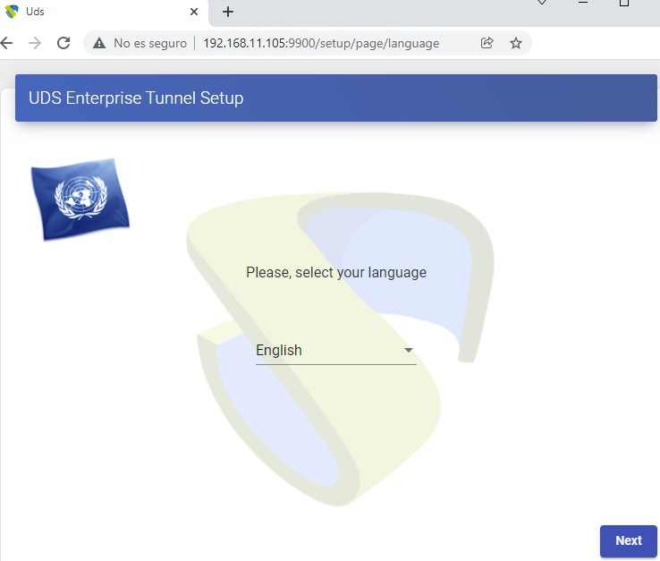

**Step 1.-** Select the language of the configuration assistant:


**Step 2.-** - Indicate the name of the server, domain (optional) and network data of the server


**NOTE:** If the indicated IP address is different from the one already configured by the DHCP server or via manual configuration, the system will automatically redirect to the new address to continue with the configuration wizard.

**NOTE:** If all the indicated data are correct and you do not want to modify any data, you can use the option *"***Skip network config (leave it as is)"**

Check that the indicated data is correct and accept:


Wait for the configuration of the new network data to finish:


**Step 3.-** Configure the keyboard language for the server, the time zone and an NTP server (optional):


**Step 4.-** We configure the keyboard language that the server will have, the time zone and an NTP server (optional):


**Step 5.-** Connect the Tunnel server with the UDS server (Broker) indicating its name or IP address, an existing authenticator, and a user with administration permissions. If the UDS server has a valid certificate installed, you can use \"***HTTPS (Secure Connection)***", otherwise, use "***HTTP***".

####### NOTE: For our tunnel to trust UDS Server certificates, it will be necessary to launch the \"uds trust\" command in the Tunnel explained on the following page. {#note-for-our-tunnel-to-trust-uds-server-certificates-it-will-be-necessary-to-launch-the-uds-trust-command-in-the-tunnel-explained-on-the-following-page. .unnumbered}


**NOTE:** If you do not have any authenticator configured in the UDS server, you can use the "Administration" authenticator to which the super-user indicated in step 6 of the UDS server configuration wizard belongs.UDS.

It is important to bear in mind that if you want to use an https connection between these two elements, you must indicate the DNS name of the UDS server (we cannot use the IP address) and you must also have valid certificates installed on the UDS server.

For the UDS Tunnel to trust the UDS Server\'s self-signed certificate and to validate the connection, we will have to use the command \"uds trust\"


Once done we will have to indicate to the UDS Tunnel the name of our UDS Server \"uds\"


You will have to check that in the file /etc/hosts appears the name of uds with the correct ip:


Once done you can continue with the configuration process


**Step 6.-** Configure the password of the local root user of the Tunnel server:

NOTE: For a totally secure installation it is recommended to use passwords with a minimum of 12 characters, uppercase, lowercase, numbers and special characters

**Step 7.-** If you have the certificate files, you will indicate them. Otherwise, you can install them after finishing the wizard via console.

You need to indicate the certificate file in the \"Server certificate\" field (.crt, .pem, etc \...), the file with the \"Private key\" key (.key, .pem, etc \...) and optionally you can indicate the certifying entity "Chain file" (.crt, .pem, etc...).


**NOTE**: For a totally secure installation, and to be able to make connections via HTTPS, the use of valid certificates on the server will always be recommended, otherwise anyone who wants to access the web portal will be notified with an error warning that the self-signed certificates of the UDS Server are insecure.

**Step 8.-** Finish the Tunnel server configuration by clicking on "Reboot" so that the server restarts and applies all the indicated configuration.


You can close the page of the configuration wizard and, once restarted, the UDS Tunnel server will be completely configured.


If you need to run the configuration wizard again to modify any data, you will have to validate yourself on the server (with the root user and the password established in step 4) and execute the command:

-   **uds setup:** Launch the server configuration wizard


####### This will re-enable the setup wizard. {#this-will-re-enable-the-setup-wizard. .unnumbered}

Additionally, with the command ***uds*** you can make other modifications on the server:


-   **uds cert:** Will allow the installation of certificates on the     server:


-   **uds register:** It will allow to register the Tunnel server in a     specific UDS server (broker):


-   **uds ip:** Will allow to consult, modify and reset the IP data of     the server:


-   **uds ip get**: Shows the Ips information of the UDS server.

-   **uds ip set**: Assign the network data of the server manually

-   **uds ip reset**: Restarts the network information of the UDS     Appliance


-   **uds support:** Commands related to support actions.


-   **uds trust:** Command that will allow us to trust a certificate     from a remote server.

####### Only valid for self-signed certificates. {#only-valid-for-self-signed-certificates. .unnumbered}


**Safe Deployment Procedure:**

In general, it is advisable to implement the basic and essential security mechanisms to any server; Strong passwords, backups, have security solutions, keep systems updated and modify configurations, users and passwords included, by default.

In addition, when including a web server, Apache, it is recommended to apply the following mechanisms:

-   Remove the server version banner

-   Disable the directory browser list

-   Run Apache from an unprivileged account

-   Securing Configuration Directory and Binary Permission

-   SSL/TLS

    -   Implement SSL certificate

    -   Optimize SSL/TLS

    -   Disable weak SSL/TLS protocols

    -   Disable weak cipher suites

    -   Install Chain Certificate

    -   Securing Diffie-Hellman for TLS

    -   Eliminar "Information Leakage"

-   Web Application Security

    -   Disable unwanted HTTP methods

    -   Avoid clickjacking attacks, injection of x-frames

    -   X-XSS Protection

    -   Implement WAF Mod Security

-   Update the Apache server.

We recommend that you disable SSH access to this server, so that it is only accessible by console.

#### UDS Actor

The UDS Actor is a software component that is installed in the O.S. templates Windows or Linux (gold image), to be used for virtual desktop deployment, on RDS application servers to be able to present virtual application sessions to users, and on static machines where user sessions need to be controlled.

To install the UDS Actor, you must previously download from the UDS Broker the suitable Actor for each platform (Windows, Linux and vApps).

In order to do that, connect to the UDS Broker via web browser and using credentials for a user with

**administration permission** to access the downloads:


Select \"Downloads\" In the user menu:


You will select the Actor corresponding to the operating system and service that is installed in the base template or application server on which the desktop services will be deployed:

-   **udsactor_3.6.0_all.deb :** UDS Actor for Linux template machines     (gold image) based on Debian distributions, such as: Ubuntu,     Xubuntu, etc...

-   **udsactor-3.6.0-1.noarch.rpm :** UDS Actor for Linux template     machines (gold image) based on Red Hat distributions, such as:     ContOS, Fedora, etc...

-   **udsactor-unmanaged_3.6.0_all.deb:** UDS Actor to control the     sessions of

-   Debian-based machines from the service provider "***Static IP     Machines Provider***" based on Debian, such as: Ubuntu, xUbuntu,     etc...

-   **RDSActorSetup-3.6.0.exe**: UDS Actor for Windows Server 2012 R2,     2016, 2019 or 2022 application servers with the RDS role configured.

-   **UDSActorSetup-3.6.0.exe:** UDS Actor for Windows template machines     (gold image).

-   **UDSActorUnmanagedSetup-3.6.0.exe:** : UDS Actor to control the     sessions of Windows machines from the service provider "***Static IP     Machines Provider***".

-   **udsactor-2.2.0_legacy.deb:** UDS Actor for Linux template machines     (gold image) based on Debian distributions, such as: Ubuntu,     Xubuntu, etc... where the Python3 version requirements cannot be     met.

-   **udsactor-legacy-2.2.1-1.noarch.rpm:** UDS Actor for Linux template     machines (gold image) based on Red Hat distributions, such as:     ContOS, Fedora, etc... where the Python3 version requirements cannot     be met.

-   **udsactor-opensuse-legacy-2.2.1-1.noarch.rpm:** UDS Actor for     template machines base don Opensuse distributions, como: OpenSuse,     etc... where the Python3 version requirements cannot be met.


####### Safe Employment Procedure: {#safe-employment-procedure-2 .unnumbered}

Verify that the server from which the actor is downloaded is the selected one, verifying the certificate if it has it installed.

All actors are their software signed, verify the signature corresponds to the actor. Enable SSL verification of the server certificate at the time of actor installation.

Enable all the security options you consider necessary on the machine where the actor is installed, these will be replicated to all ls of the publication.

In addition to the installation of the UDS Actor, it will be necessary to have installed and enabled the connection protocol to be used to connect to the generated desktops (For example, having the remote desktop enabled, the PCoIP client installed, etc \...).

Disable all sharing options via the protocol that you do not consider to be strictly necessary for the base machine where it is being installed.

##### Windows self-generated virtual desktops

To manage the life cycle of Windows virtual desktops self-generated by OpenUDS, it is necessary that the template machine (gold image) on which they will be based has the UDS Actor installed: ***UDSActorSetup-3.6.0.exe***

###### NOTE: {#note-1 .unnumbered}

Before installing the UDS Actor, it is necessary to have the IP address or name of the UDS server, the credentials of a user with administrative permissions on the UDS environment and at least one authenticator registered in the system.

After downloading the UDS Actor for Windows O.S. and transferring it to the template machine, run it to proceed with its installation.

Select the language of the installer


Indicate the installation path of the UDS Actor:

Click on **"Install"** to proceed with the installation:

Once the installation is finished, proceed to configure the UDS Actor:

In the UDS Server tab you will register the Actor with the UDS instance indicating the following parameters:

**SSL Validation:** Type of security with which the communication with the UDS server will be carried out.

It is recommended to obtain the greatest possible security, activate the verification of the certificate

**\"Verify Certificate**\" in case of not, there will be a great risk for the security of the platform.

**UDS Server:** Name or IP address of the UDS Server.

**Authenticator:** Authenticator to which the indicated administrator user belongs to register the UDS Actor.

Communication with the UDS server needs to be successful for the different authenticators to be displayed. At least one must be registered in the UDS administration (the "***Administration***" authenticator corresponds to the super-user created in the UDS server configuration wizard).

**Username:** Username with administration permissions in the UDS environment (must belong to the previously selected authenticator).

**Password:** Password of the administrator user.

**Safe use procedure:** Passwords must be of sufficient length and include uppercase, lowercase, numbers and special characters.


**NOTE**: To provide the platform with the greatest possible security, the \"Verify Certificate\" option must be selected in order to verify that the UDS Server certificate is valid.


In the "***Advanced***" tab you can indicate the following advanced parameters:

**Preconnect:** script to be run just before allowing the user to connect to the virtual desktop. UDS will automatically pass the following parameters, which can be used in the script:  username, protocol (rdp, nx, pcoip \...), IP (IP that you have recognized on the client (SRC IP)), hostname (SRC Host).

**Runonce:** script that runs only once and before the UDS Actor applies its settings.

After its execution, (very useful to, for example, run a sysprep for each generated virtual desktop). It is deleted from the configuration. Parameters can be passed directly to it.

The script that is running needs to finish by restarting the virtual desktop. Otherwise, the desktop will never apply the Actor settings, preventing reaching the "***Valid***" state in UDS administration.

**Postconfig:** script that runs when the UDS Actor has finished its configuration. Parameters can be passed directly to it.

The script runs only once, but unlike \"Runonce\" mode you don\'t have to restart the virtual desktop. This script is useful to add some \"own\" elements to the configuration made by the UDS Actor, such as copying files from the local network, executing configurations, etc\... 

**Log Level:** Types of logs to be shown in the UDS Actor log files. These log files (udsactor.log) will be located in the paths: %temp% (path of the user\'s temporary files) and C:\\Windows\\Temp (path of the O.S.\'s temporary files).


Una vez indicados todos los datos necesarios, pulsaremos sobre "***Register with UDS***":


You can also perform a test by clicking on "**Test configuration**" to verify the correct connection to the UDS server at any time:


It is very important to bear in mind that if any data is modified, it will always be necessary to carry out the registration process afterwards (by clicking on the "**Register with UDS**" button), if this action is not carried out, the changes will not be applied.

After the installation and configuration of the UDS Actor, the template machine (gold image) can now be turned off and will be available to be used by UDS to self-generate virtual desktops.

**NOTE: In addition to the installation of the UDS Actor, it will be necessary to have enabled the connection protocol to be used to connect to the generated desktops (For example, to have enabled the remote desktop, installed the PCoIP client, etc\...).**

##### Windows static desktops

To control the user sessions (login and logout) of a machine configured within the provider "***Static IP Machines Provider***", it is necessary that it has the UDS Actor installed: ***UDSActorUnmanagedSetup-3.6.0.exe***

In addition to controlling a user\'s session, the actor will detect if there is already a user connected (for example, when accessing a physical computer) and will prevent the connection of another who has requested access.

If these machines do not have the UDS Actor installed and are part of a service of type "***Static Multiple IP***", UDS will not be able to control the user\'s logout from the machine and, therefore, will not be able to release it to make it available to another user.

**NOTE:** Before installing the UDS Actor, it is necessary to have the IP address or name of the UDS server and the "**Service Token**" key registered in a "**Static Multiple IP**" type  service within the "**Static IP Machines Provider**"
 


After downloading the UDS Actor for Windows O.S. and transferring it to the machine to which you want to connect users (either physical or virtual), you will run it to proceed with its installation.

Select the language of the installer:


Indicate the installation path of the UDS Actor:


Click on **"Install"** to procede with the instalation:


Once the installation is finished, proceed to configure the UDS Actor:


Proceed to register the Actor with the UDS server indicating the following parameters:

**SSL Validation:** Type of security to communicate with the UDS server.

It is recommended to obtain the greatest possible security, activate the verification of the certificate

**\"Verify Certificate**\" in case of not, there will be a great risk for the security of the platform.

**UDS Server:** Name or IP address of the UDS server.

**Service Token:** Code created in the UDS administration, in the type of service "***Static Multiple IP***" within the service provider "***Static IP Machines Provider***".

**Log Level:** Types of logs to be shown in the UDS Actor log files. These log files (udsactor.log) will be located in the paths: %temp% (path of the user\'s temporary files) and C:\\Windows\\Temp (path of the temporary files of the O.S.).

**Restrict Net**: Adds the possibility of discriminating networks for the connection with UDS.

The network that we indicate will be used by UDS to notify the access to the machine by the user. Necessary for cases where we have more than one network card, otherwise leave blank


**NOTE**: To provide the platform with the greatest possible security, the \"Verify Certificate\" option must be selected in order to verify that the UDS Server certificate is valid.


Once these data are indicated, you will click on "***Save Configuration***":


Once the installation and configuration of the UDS Actor has been completed, the machine will be available to be assigned by UDS and to control user sessions.


Once the installation and configuration of the UDS Actor has been completed, the machine will be available to be assigned by UDS and to control user sessions.

**NOTE:** In addition to the installation of the UDS Actor, it will be necessary to have enabled the connection protocol to be used to connect to the generated desktops (For example, to have the remote writer enabled, etc\...).

##### Linux self-generated virtual desktops

To manage the life cycle of Linux virtual desktops self-generated by OpenUDS, the template machine (gold image) on which they will be based must have the UDS Actor installed for the different Linux distributions:

-   **Debian bases distributions: *udsactor_3.6.0_all.deb***

-   **Red Hat and Suse distributions: *udsactor-3.6.0-1.noarch.rpm***

**NOTE:** Before installing the UDS Actor it will be necessary to have the IP address or name of the UDS server, the credentials of a user with administration permissions on the UDS environment and at least one authenticator registered in the system

Once the UDS Actor for the chosen Linux distribution has been downloaded and transferred to the template machine, you will execute it to proceed with its installation.

It is highly recommended to perform such execution of the Actor via command console:


If you get an error due to lack of dependencies, you will proceed to install it:


Once the necessary dependencies are installed, run the UDS Actor configuration:


In the ***UDS Server*** tab you will register the Actor with the UDS instance indicating the following parameters:

**SSL Validation:** Type of security to communicate with the UDS Server.

It is recommended to obtain the greatest possible security, activate the verification of the certificate

**\"Verify Certificate**\" in case of not, there will be a great risk for the security of the platform.

**UDS Server:** Name or IP address of the UDS server.

**Authenticator:** Authenticator to which the indicated administrator user belongs to register the UDS Actor.

Communication with the UDS Server needs to be successful for the different authenticators to be displayed. At least one must be registered in the UDS administration (the "***Administration***" authenticator corresponds to the super-user created in the UDS Server configuration wizard).

**Username:** Username with administration permissions in the UDS environment (must belong to the previously selected authenticator).

**Password:** Password of the administrator user.


**NOTE:** To provide the platform with the greatest possible security, the \"Verify Certificate\" option must be selected in order to verify the certificate.


In the "***Advanced***" tab you can indicate the following advanced parameters:

**Preconnect:** Script to be run just before allowing the user to connect to the virtual desktop.

UDS will automatically pass the following parameters that can be used in the script: username, protocol (rdp, nx, pcoip\...), IP (IP that you have recognized on the client (SRC IP)), hostname (SRC Host).

**Runonce:** Script that runs only once and before the UDS Actor applies its settings. After execution it is deleted from the configuration. Parameters can be passed directly to it.

The script that is running needs to finish by restarting the virtual desktop. Otherwise,  the desktop will never apply the Actor settings, preventing it from reaching its "***Valid***" state in UDS administration

**Postconfig:** Script that is executed when the UDS Actor has finished its configuration. Parameters can be passed directly to it.

The script runs only once, but unlike \"Runonce\" mode it doesn\'t need to restart the virtual desktop. This script is useful to add some \"own\" element to the configuration made by the UDS Actor, such as copying files from the local network, executing configurations, etc\...

**Log Level:** Types of logs to be shown in the UDS Actor log files. These log files (udsactor.log) will be located in the path: /var/log/


Once these data are indicated, click on "Register with UDS":


You can also perform a test by clicking on \"Test configuration\" to verify the correct connection to the UDS Server at any time:


It is very important to note that if any data is modified, it will always be necessary to carry out the registration process afterwards (by clicking on the "Register with UDS" button), if this action is not carried out, the changes will not be applied.

After the installation and configuration of the UDS Actor, the template machine (gold image) can now be turned off and will be available to be used by UDS to self-generate virtual desktops.

**NOTE**: In addition to the installation of the UDS Actor, it will be necessary to have enabled the connection protocol to be used to connect to the generated desktops (for example, to  have installed and enabled XRDP, X2Go Server, etc...).

It will also be necessary to ensure that the screensaver is installed, but not enabled in addition to not have \"auto login\" enabled on the machine.

##### Linux static desktops

To control the user sessions (login and logout) of a machine configured within the provider "***Static IP Machines Provider***", it is necessary that it has the UDS Actor installed: ***udsactor- unmanaged_3.6.0_all.deb***

In addition to controlling a user\'s session, the actor will detect if there is already a user connected (for example, when accessing a physical computer) and will prevent the connection of another who has requested access.

If these machines do not have the UDS Actor installed and are part of a "***Static Multiple IP***", UDS will not be able to control the user\'s logout on the machine and, therefore, will not be able to release it to make it available to another user.

**NOTE:** Before installing the UDS Actor, it is necessary to have the IP address or name of the UDS Server and the "**Service Token**" key registered in a "**Static Multiple IP**" type  service within the service provider "**Static IP Machines Provider**".


After downloading the UDS Actor for Linux O.S. and transferring it to the machine to which you want to connect users (either physical or virtual), you will run it to proceed with its installation.

It is highly recommended to perform such execution of the Actor via command console:


If you get an error due to lack of dependencies, you will proceed to its installation:


Once the necessary dependencies are installed, you will run the UDS Actor configuration:


Proceed to register the Actor with the UDS Server indicating the following parameters:

**SSL Validation:** Type of security to communicate with the UDS Server

It is recommended to obtain the greatest possible security, activate the verification of the certificate

**\"Verify Certificate**\" in case of not, there will be a great risk for the security of the platform.

**UDS Server:** Name or IP address of the UDS Server

**Service Token:** Code created in the UDS administration, in the type of service "***Static Multiple IP***" within the service provider "***Static IP Machines Provider***".

**Log Level:** Types of logs to be shown in the UDS Actor log files. These log files (udsactor.log) will be located in the path: /var/log/

**Restrict Net**: Adds the possibility of discriminating networks for the connection with UDS.The network that we indicate will be used by UDS to notify the access to the machine by the user.

Necessary for cases where we have more than one network card, otherwise leave blank

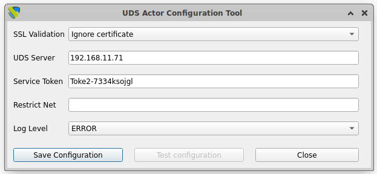

**NOTE**: To provide the platform with the greatest possible security, the \"Verify Certificate\" option must be selected in order to verify the certificate.


Once these data are indicated, click on "***Save Configuration***":


It will be necessary to run the configuration test to check if the indicated data are correct and there is connectivity with the UDS Server:


Once the installation and configuration of the UDS Actor have been completed, the machine will be available to be assigned by UDS and to control user sessions.

**NOTE:** In addition to the installation of the UDS Actor, it will be necessary to have the connection protocol to be used to connect to the generated desktops enabled (for example, having XRDP installed and enabled).

##### Windows virtual applications

In order for UDS to publish Windows application sessions and control their life cycle, the Windows Server application servers must have the UDS Actor installed: ***RDSActorSetup 3.6.0.exe***

###### NOTE: {#note-2 .unnumbered}

Before installing the UDS Actor it will be necessary to have the IP address or name of the UDS Server, the credentials of a user with administration permissions on the UDS environment and at least one authenticator registered in the system.

Once the UDS Actor for Windows Server application servers are downloaded, run it as administrator to proceed with its installation.

Select the language of the installer:


Indicate the installation path of the UDS Actor:


Click on **"Install"** to proceed with the installation:


Once the installation is finished, proceed to configure the UDS Actor:


Register the Actor with the UDS server indicating the following parameters:

**SSL Validation:** Type of security to communicate with the UDS Server.

It is recommended to obtain the greatest possible security, activate the verification of the certificate

**\"Verify Certificate**\" in case of not, there will be a great risk for the security of the platform.

**UDS Server:** Name or IP address of the UDS server.

**Authenticator:** Authenticator to which the administrator user belongs indicated to register the UDS Actor.

It is necessary that the communication with the UDS server be carried out correctly so that the different authenticators are displayed. There must be at least one registered in the UDS administration (the "***Administration***" authenticator corresponds to the super-user created in the UDS server configuration wizard).

**Username:** Username with administration permissions in the UDS environment (must belong to the authenticator selected above).

**Password:** Password of the administrator user.

**Safe use procedure:** Passwords must be of sufficient length and include uppercase, lowercase, numbers and special characters.

**Log Level:** Types of logs to be shown in the UDS Actor log files.


**NOTE**: To provide the platform with the greatest possible security, the \"Verify Certificate\" option must be selected in order to verify the certificate.


Once all the necessary data has been indicated, click on "Register with UDS":


Once these data are indicated, click on "Test parameters" to verify that the indicated data are correct and there is connectivity with the UDS Server.


It is very important to note that if any data is modified, it will always be necessary to carry out the registration process afterwards (by clicking on the "Register with UDS" button), if this action is not carried out, the changes will not be applied.

Once you have installed and configured the UDS Actor for RDS servers, you can now install the Remote Desktop Session (RDS) feature and integrate it with the UDS Actorto provide application sessions to users.

To proceed with the integration of UDS with Remote Desktop Services you can consult the guide "Installation and configuration of Microsoft RDS with OpenUDS" available in the [[documentation]{.underline}](https://www.udsenterprise.com/es/uds-enterprise/documentacion/) [[section]{.underline}](https://www.udsenterprise.com/es/uds-enterprise/documentacion/) of the OpenUDS website.

#### UDS Client

The UDS Client is a software component that is installed on the connection client computers that will launch UDS services (virtual desktops, application sessions, etc \...). For all connection types supported by UDS, this component will be required except for the HTML5 connection (which only requires a web browser)

To perform the installation of the UDS Client, it is necessary to make a previous download from the UDS Server (broker) by selecting the appropriate client for each type of O.S. from which we need to access services provided by UDS.

To make the download, access the UDS login portal and in the top menu select "***UDS Client***":


UDS clients that are available for download will be displayed in the browser. Select the client corresponding to the operating system from which you need to access the different services provided by UDS:

-   **Windows client:** UDS Client for Windows O.S. connection clients.

-   **Mac OS X client:** UDS Client for MacOS O.S. connection clients.

-   **Debian based Linux client:** UDS Client for connection clients     with Debianbased Linux O.S., such as Ubuntu, xUbuntu, etc\...

-   **RPM based Linux client:** UDS Client for connection clients with     O.S. Linux based on Red Hat, Suse, etc... like: CentOS, Fedora,     etc...

-   **Binary appimage X86_64 Linux client:** UDS Client for connection     clients with O.S. Linux . In addition to the UDS client, this client     includes the FreeRDP version 2.3 client and the X2Go client.

-   **Binary appimage Raspberry Linux client:** UDS Portable Client for     connection clients for Raspberry Pi devices. In addition to the UDS     client, this client includes the FreeRDP version

2.3 client and the X2Go client.

**NOTE**: To run the appimage client, it will be necessary to have the libfuse2 library installed (libfuse2 for Ubuntu 22, and the corresponding one for the rest of the distributions).

-   **Genenic.tar.gz Linux:** UDS client source files for O.S Linux


##### Windows

To connect to UDS services from Windows O.S connection clients, they need to have the UDS Client installed: ***UDSClientSetup-3.6.0.exe***

Once the UDS Client for Windows O.S. has been downloaded, run it to proceed with its installation. Select the language of the installer:


Indicate the installation path of the UDS Client:

Click on "***Install*"** to proceed with the installation:

Once the installation is completed, finish the installation wizard:

Once the installation is finished, the UDS Client will execute the selected connection protocol (Transport) and will connect with the requested service.

**NOTE:** If you access the service with the HTML5 connection type, it will not be necessary to have the UDS Client installed on the connection client computer. The only requirement for this connection is to have a current web browser.

##### MacOS

To connect to UDS services from connection clients with O.S. MacOS it is necessary that they have the UDS client installed: ***UDSClient-3.6.0.pkg***

Once the UDS Client for S.O. MacOS, we will execute it to proceed with its installation. Initially a warning will appear that prevents us from executing it:


To solve it, access: Apple menu \System Preferences, click Security & Privacy, General:


Click on "**Open Anyway**" to open the UDS Client.


Proceed with the instalation of the UDS Client:


Once the installation is done, the UDS Client will run the RDP protocol client (it must be previously installed) to make the connection with the requested service.

**NOTE:** If you access the service with the HTML5 connection type, it will not be necessary to have the UDS Client installed on the connection client computer. The only requirement for this connection is to have a current web browser.

The UDS client can use the RDP clients: FreeRDP or Microsoft Remote Desktop, for more information about its installation and configuration, you can consult the guide: "Enabling RDP connectin from MacOS devices" available in the [[documentation section]{.underline}](https://www.udsenterprise.com/en/uds-enterprise/documentation/) of the OpenUDS web.

##### Linux

To connect to UDS services from Linux O.S. connection clients, they need to have the UDS Client for the different Linux distributions installed:

-   **Debian based distributions: *udsclient3_3.6.0_all.deb***

-   **Red Hat and Suse distributions: *udsclient3-3.6.0-1.noarch.rpm***

Once the UDS Client for the chosen Linux distribution is downloaded, execute it to proceed with its installation.

It is highly recommended to perform such execution of the Actor via command console:


If you get an error due to lack of dependencies, proceed to install it:


Si tenemos problemas de dependencias tendremos que lanzar el siguiente comando:


Once the necessary dependencies are installed, the installation will finish. The UDS Client will execute the selected connection protocol (Transport) and will connect with the requested service.

**NOTE:** If you access the service with the HTML5 connection type, it will not be necessary to have the UDS Client installed on the connection client computer. The only requirement for this connection is to have a current web browser.

If you need to uninstall the UDS Client, you can do it through the command:

**dpkg -P udsclient3**


##### Linux AppImage

To connect to UDS services from connection clients with S.O. Linux it is necessary that they have the UDS client installed, this client in its modality "***Self-contained***" generated with AppImage will allow you to also have the UDS client: FreeRDP (version 2.3), the X2Go client and Python (3.8udsclient) without having these elements as a requirement to carry out its installation.

**NOTE:** This UDS AppImage client can be used in almost any Linux distribution (based on Debian, Red Hat, Suse, etc...).

**NOTE**: To run the appimage client, it will be necessary to have the libfuse2 library installed (libfuse2 for Ubuntu 22, and the corresponding one for the rest of the distributions).

Once the UDS AppImage Client has been downloaded: ***udsclient3-x86_64-3.6.0.tar.gz***, unzip it:


Execute the script with administrator permissions ***installer.sh***


Once the installation of the script is finished, we will be able to connect to Windows virtual desktops and applications via RDP protocol (through the FreeRDP client) and to Linux virtual applications via X2Go client.

**NOTE:** If you access the service with the HTML5 connection type, it will not be necessary tohave the UDS Client installed on the connection client computer. The only requirementfor this connection is to have a current web browser

Once the execution of the script is finished, we can delete the files resulting from decompressing the UDS AppImage

## MANAGING OpenUDS

Once the UDS platform components are installed, the system is ready to start its configuration. Enter the IP address or UDS Server name (Broker) through http or https access.

The first time you enter UDS administration dashboard, you must enter using the administrator user and the password indicated in the UDS Broker virtual appliance configuration script.

Once you access the administration dashboard, you will be able to change the password and create or select new users to enter the administration dashboard.

In the case that you already have a user with administration permissions in the UDS platform, indicate the user, the password, and select the authenticator that the user will validate with (only in case of having more than one authenticator).

If more than one authenticator is connected to UDS platform and you would like to access the administration dashboard with the administrator user and the password  indicated in the configuration script of the UDS Broker virtual appliance the selected authenticator won't be used, because this user won't be validated against any authenticator.

In the user menu, select \"***Dashboard"*** to enter UDS administration:


Once inside the UDS administration, the initial configuration of the components that will form a "***Service Pool***", is carried out. It will allow the deployment and connection of the different services supported by UDS (virtual desktops, virtual application sessions, etc...)


The configuration of each \"***Services Pool***\" \" must be approached like the building of a puzzle:

-   Each \"***Services Pool***\" is made up of different elements or     pieces: "***Base Services***", "***OS Managers***",     "***Transports***" y "***Authenticators***"

-   Once the elements of the first \"***Services Pool***\" have been     configured, the creation thereof will begin, repeating the process     with the next \"***Services Pool***\" if there is one

-   The sum of the \"***Services Pool*** already configured will make up     the type of deployment of the desktops and virtual applications     managed by the UDS platform

### Service Providers

A "***Service Providers***" is responsible for providing IP services.

The services offered by UDS will be on-demand virtual desktops or applications provided by a virtualization platform or persistent physical/virtual desktops assigned to specific users via IPs assignment.

In order to build a "***Service Pool***" and publish virtual desktops and applications, it is  necessary to have created at least one "***Service Providers***", UDS supports multiple "***Service Providers***" " to run simultaneously.

Currently, UDS supports the following "***Service Providers***":


#### VDI Platform with VMware vSphere

Deployment of UDS self-generated virtual desktops on a VMware vSphere virtualization infrastructure.

##### Register a Service provider "VMware vCenter Platform Provider"

Click on "***New***" and select "***VMware vCenter Platform Provider***":


In a "***VMware vCenter Platform Provider***" the minimum parameters to configure are:

-   Main:

Service provider name, vCenter server IP (field "***Host***"), Center connection port, and a username and password with administration rights on the vCenter.

-   Advanced:

**Creation concurrency**. The number of simultaneous desktop creation tasks. **Removal concurrency**. The number of simultaneous desktop removal tasks. **Timeout.** "***Timeout***" \" for the connection with vCenter.

**Macs range**. Range of MAC addresses used by UDS for the creation of virtual desktops.


Through the button "***Test***" you can test and make sure the connection is successful.

Save the configuration and you will have a valid \"***Service Providers***\" to start registering base services of the VMware vSphere platform.


###### NOTE: {#note-3 .unnumbered}

If we have several VMware vSphere platforms managed by different vCenter servers, we can register all the \"**Service Providers**\" of the type "**VMware vCenter Platform Provider**" that we need.

In order to modify any parameter in an already existing "***Service Providers***" select it and click on "***Edit***".

Through the button "***Enter Maintenance Mode***" you can suspend all the operations issued by UDS Broker for a given service provider. It is recommended to put your service provider in maintenance mode in case the connection to this latter has been lost or for a maintenance stop.

Once the VMware vSphere platform is integrated into UDS, different types of base  services can be created. To do this, double click on the service provider created select "***Detail***" in the provider menu:


You will have the following types of base services:

###### NOTE: {#note-4 .unnumbered}

To create any of the base services supported by UDS, you will need to have at least one network to connect virtual machines, a datastore to store the publications and desktops, and a folder in the \"VMs and Templates\" view. If you don\'t have any of these elements, you will get the following error:

##### Configure a Service based on "Clone based - Full"

This type of service will create, within the virtual infrastructure, complete virtual desktops independent of the active publication.

To create base services of type \"***Clone based - Full***\" access the"***Service Providers***", select the "***Services***" tab, click on "***New***" and select "***Clone based -- Full***".


In a \"Clone based - Full\" minimal parameters to be configured are:

-   Main:

**Name:** Service name.

**Datacenter**: Datacenter of the VMware vSphere environment to host the service.

**Pub. Resource Pool**: vCenter resource pool where the publications and virtual desktops will be hosted (if Pools are not available in the VMware infrastructure, they will be created in the root).

**Pub. Datastores**: Location where the service publication will be stored. You can select one, several or all the available datastores. In case of selecting several, the system will always locate the new publications in the datastore that has more free space.

**Keep on error**: When activated, the system ignores all service access errors.

**Remove found duplicates**: If this option is activated (default value), when UDS finds a virtual desktop with the same name (and generated by UDS) as the desktop you are about to create, it will delete it (its use is recommended to avoid the existence of "lost" VMs" In the vCenter inventory).

Try SOFT Shutdown first: When activated, the system will attempt to perform a "Soft" shutdown  in the O.S. of the virtual desktop.


-   Machine:

**Resource Pool:** vCenter resources pool where the virtual machine template (Gold Image) to be used by the service is located..

**Base Machine:** Virtual machine template (Gold Image) used by the UDS system for deploying the virtual desktops.

**Memory**: Amount of memory in Mb to be assigned to the virtual Full Clones generated.

**Main Network**: UDS Actor communication network with the UDS Server. It will also define the network interface to modify in the generated virtual desktops.

**Pub. Network**: Network where virtual desktops will connect.

**Clones Folder**: Folder where the new virtual desktops will be registered in the \"VMs and Templates\" view of vCenter.

**VMs Datastores**: Location where the generated virtual desktops will be stored. You can select one, several or all the datastores. In case of selecting several, the system will always locate the new virtual desktops in the datastore that has more free space.

**Machine Names**: Root name of all the Full Clones virtual desktops to be deployed on this service. (eg: Machine Names= Win10-full-).

**Name Length**: Number of digits of the counter attached to the root of the desktops  name (ex: Name Length = 3. The final name of the generated desktops would be: Win10-full-**000**, Win10-full-**001** \... Win10-full-**999**).

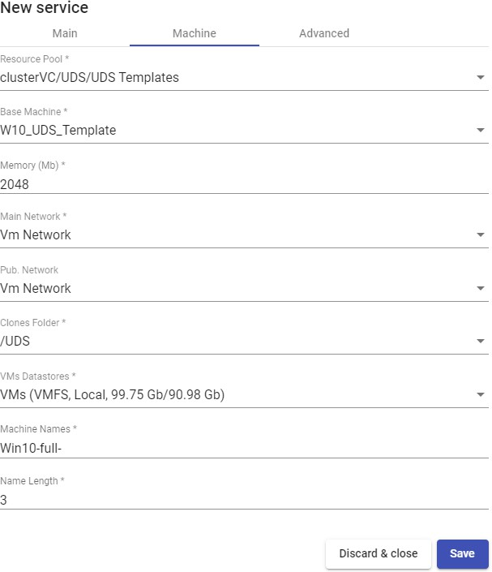

-   Advanced:

**Reserved Space:** When in a datastore there is less free space than indicated in this parameter (in GB), UDS will not use it to host publications or virtual desktops.


Save the configuration and you will have a valid\"***Clone based - Full***\" on the VMware vCenter platform. You can register all the services of the type\"***Clone based - Full*** that you need.


Once the full UDS environment has been configured (Services, Authenticators, OS Managers y Transports) and the first "***Service Pool***", you will be able to observe how the virtual desktops based on VMware Linked Clones are deployed on the vCenter server.

The first task that the vCenter will perform will be to create a base machine (this machine will be created each time you make a publication of a service) which will be a clone of the template selected when registering the service, with a hard drive size and features equal to those of said template.

Once the cloning process of the base machine is finished (the UDS system names it as: \"UDS Publication *nombre_pool-número_publicación*") he virtual desktops are  automatically created in vCenter (the system names them as: "UDS service

*Machine_Name+Name_Length*") based on the cache parameters configured in the "***Service Pools***".


###### NOTE: {#note-5 .unnumbered}

The disk space that the virtual desktops ("Full Clones") will occupy will be the same as that of the template machine.

##### Configure a Service based on "Clone based -- Linked"

This type of service will create, within the virtual infrastructure, virtual desktops in Linked Clone mode depending on the active publication.

To create base services of type "***Clone based -- Linked***" access the "***Service Providers***" section, select the "***Services***"tab, click on "***New***" y select \"***Clone based -Linked***\".


In a \"Clone based - Linked\", the minimal parameters to be configured are:

-   Main:

**Name:** Service name.

**Datacenter**: Datacenter of the VMware vSphere environment to host the service.

**Pub. Resource Pool**: vCenter resource pool where the publications and virtual desktops will be hosted (if Pools are not available in the VMware infrastructure, they will be created at the root).

**Pub. Datastores**: Location where the service publication will be stored. You can select one, several or all the available datastores. In case of selecting several, the system will always locate the new publications in the datastore that has more free space.

**Keep on error:** When activated, the system ignores all service access errors.

**Remove found duplicates**: If this option is activated (default value), when UDS finds a virtual desktop with the same name (and generated by UDS) as the desktop you are about to create, it will delete it (its use is recommended to avoid the existence of "lost" VMs In the vCenter inventory).

**Try SOFT Shutdown first:** When activated, the system will attempt to perform a "Soft" shutdown in the O.S. of the virtual desktop.


-   Machine:

**Resource Pool:** vCenter resources pool where the virtual machine template (Gold Image) to be used by the service is located.

**Base Machine:** Virtual machine template (Gold Image) used by the UDS system for deploying the virtual desktops.

**Memory**: Amount of memory in Mb to be assigned to the Full Clones virtual generated.

**Main Network**: UDS Actor communication network with the UDS Server.

**Pub. Network**: Network where virtual desktops will connec.

**Clones Folder**: Folder where the new virtual desktops will be registered in the \"VMs and Templates\" view of vCenter.

**VMs Datastores**: Location where the generated virtual desktops will be stored. You can select one, several or all the datastores. In case of selecting several, the system will always locate the new virtual desktops in the datastore that has more free space.

**Machine Names**: Root name of all of the Linked Clones virtual desktops to be deployed on this service. (eg: Machine Names= Win10-)

**Name Length:** Number of digits of the counter attached to the root of the desktops name (ex: Name Length = 3. The final name of the generated desktops would be:

Win10-**000**, Win10-**001** \... Win10-**999**)


-   Advanced:

**Reserved Space:** When in a datastore there is less free space than indicated in this parameter (in GB), UDS will not use it to host publications or virtual desktops


When saving this configuration, you'll already have a valid \"***Clone based - Linked***\" \" in  the VMware vCenter platform. You can register all \"***Clone based - Linked***\" that you need in the UDS platform.


Once the full UDS environment has been configured (Services, Authenticators, OS Managers and Transports) and the first "***Service Pool***", has been created, you will be able to observe how the virtual desktops based on VMware Linked Clones are deployed on the vCenter server.

The first task that the vCenter will perform will be to create a base machine (this machine will be created each time you make a publication of a service), which will be a clone of the template selected when registering the service, with a hard drive size and features equal to those of said template.

Once the cloning process of the base machine is finished (the UDS system names it as: \"UDS Publication *nombre_pool-número_publicación*") the virtual desktops are  automatically created in vCenter (the UDS system names them as: \"UDS service

*Machine_Name+Name_Length*") based on the cache parameters configured in the "***Service Pools***".


###### NOTE: {#note-6 .unnumbered}

The disk space occupied by the virtual dektops ("Linked Clones") will be exclusively the one occupied by the modifications made by the users on the machines after their  initial connection.

##### Configure a Service based on "Fixed Machines Pool"

This type of service will allow direct connection of users to existing virtual machines in a VMware vSphere environment pool.

To create base services of type "***Fixed Machines Pool***" access the "***Service Providers***", section, select the "***Services***",tab, click on "***New***" y and select "***Fixed Machines Pool***".


In a \"Fixed Machines Pool\" minimal parameters to be configured are:

-   Main:

**Name:** Service name.

**Service Token:** If it is required that UDS recognizes the "***login***" and the "***logout***" of a user who accesses a service of this type (so that when a "***logout***" UDS  automatically releases the machine and makes it available to another user) it will be necessary to fill this field with alphanumeric characters. If the field is left empty, UDS will permanently assign the machine to a user (until an administrator manually releases the service).

###### NOTE: {#note-7 .unnumbered}

If the "**Service Token**" field is filled in, on the machines selected for the connection it  will be necessary to have the UDS Actor "**UDSActorUnmanagedSetup-x.x.x.exe**" installed and, in its configuration, you need to indicate those same characters in the "**Service Token**" field.


-   Machine:

**Datacenter:** Datacenter of the vSphere environment where the virtual machines that we want to manage and assign to users are hosted.

**Resource Pool:** Resource pool where the virtual machines that we want to manage and assign to users are located.

**Machines:** Virtual machines existing in the resource pool indicated above that will be managed by UDS and to which access can be provided to different users. You can selectively choose the machines:


**Use Snapshots:** If this parameter is enabled, UDS will create a snapshot on the virtual machine before the user connects. Once its assignment is removed (by automatic detection of user logout or manual deletion by an administrator) the snapshot will be recovered so that the machine is in the same state it was before the user connection. If this parameter is not activated, UDS will not recover any previous state of the machinewhen the assignment to a user is removed.

###### NOTE: {#note-8 .unnumbered}

If the option "**Use Snapshots**" is activated and the virtual machine already has a snapshot, UDS will not perform any additional snapshot and will recover the existing one.


Save the configuration you will have a valid \"***Fixed Machines Pool***\" on the VMware

vCenter platform. You will be able to register all the \"***Fixed Machines Pool***\" services that you need


##### Summary of the Service usage and error logs

Within a "***Service Provider***" you will have a tab called "***Usage***" that will allow you to have a quick view with detailed information and perform basic actions with the services displayed in this "***Service Provider***".

To access this information on the use of services, access the "***Service Providers***" " and select "***Usage***":


You will see:

**Access:** Date and time when the service was accessed.

**Owner:** User and authenticator assigned to the service in format user@authenticator. If it appears empty, it means that the service has not been assigned to any user and is available in the cache.

**Service:** Name of the base service belonging to the "Service Provider" from which the service was generated.

**Pool:** Name of the "***Service Pools***" to which the service belongs.

**Unique ID:** Dirección MAC del servicio.

**IP:** IP address of the service.

**Friendly name:** Name of the service. In the base services "***Clone based -- Full***" and "***Clone base -- Linked***" it will also be the DNS name of the virtual machine selfgenerated by UDS.

**Src Ip**: IP address of the connection client accessing the service.

**Src Host:** DNS name of the connection client that accesses the service. If you cannot access this name, your IP address will be indicated.

It will also be possible to select one or several services to proceed with their elimination (in the base service of type "***Fixed Machine Pool***" you will only eliminate the assignment with the user).

The "***Logs***" tab will show information about any possible issue that occurred in the "***Service Provider***":


#### VDI platform with Nutanix Acropolis

Deploying and connecting to virtual desktops on a Nutanix AHV virtualization infrastructure

##### Register a Service provider "Nutanix Acropolis Platform Provider"

Click on \"***New***\" and select "***Nutanix Acropolis Platform Provider***".


In a "***Nutanix Acropolis Provider***" the minimum parameters to configure are:

- Main:

Name of the service provider, IP or name of the web console to access the AHV platform ("***Host***" field), connection port, username, and password with administration rights.


- Advanced:

**Creation concurrency:** Number of simultaneous desktop creation tasks. **Removal concurrency**: Number of simultaneous desktop deletion tasks. **Timeout:** "***Timeout*** for connection with the AHV platform.

**Macs range:** Range of MAC addresses used by UDS to create virtual desktops.


With the "***Test***" button you can check that the connection is done correctly.

Save the configuration and you will have a valid \"***Service Providers***\" to start registering base services on the Nutanix AHV platform


###### NOTE: {#note-9 .unnumbered}

If you have several Nutanix AHV platforms, you can register all the \"**Service Providers**\" of the type "**Nutanix Acropolis Provider**" that you need.

To modify any parameter in an existing "***Service Providers***" you will select it and click on "***Edit***".

Using the button "***Enter Maintenance Mode***" you can pause all operations performed by the UDS Server on a service provider. It is recommended to put a service provider in maintenance mode in cases where communication with that service provider has been lost or a maintenance stop is planned.

Once the Nutanix AHV platform is integrated into UDS, base services can be created. To do this, we double-click on the service provider created, or in the provider\'s menu we select "***Detail***":


##### Configure a Service based on "Nutanix Acropolis Service"

This type of service will create, within the virtual infrastructure, virtual desktops dependent on the active publication.

To create base services of type \"***Nutanix Acropolis Service***\" Access the "***Service Providers***", select the"***Services***"tab click on "***New***" and select "***Nutanix Acropolis Service***".


The minimum parameters to configure in this type of service are

- Main:

**Name:** Service name.

**Machine Names**: Root of the name of all virtual desktops to be deployed in this service. (ex: Machine Names= Desk-ubun-).

**Name Length:** Number of digits of the counter attached to the root of the desktops

name (ex: Name Length= 3. The final name of the generated desktops would be: Deskubun-**000**, Desk-ubun-**001**\... Desk-ubun-**999**).

**Remove found duplicates**: If this option is activated (default value), when UDS finds a virtual desktop with the same name (and generated by UDS) as the desktop you are about to create, it will delete it (its use is recommended to avoid the existence of \"lost\" VMs).

**Try SOFT Shutdown first:** When activated, the system will attempt to perform a "Soft" shutdown in the O.S. of the virtual desktop.


- Machine:

**Base Machine**: Template virtual machine (Gold Image) used by the UDS system for the deployment of virtual desktops.

**Memory:** Amount of memory in Mb to be allocated to the generated virtual desktops.

**VCPUS:** Number of vCPUs that the generated desktops will have (the value -1 will use the template configuration)

**Cores per VCPU:** Number of cores per vCPUs that the generated desktops will have (the value -1 will use the template configuration)

**Network**: Network where virtual desktops will connect.


Save the configuration and you will have a valid \"***Nutanix Acropolis Service***\" \" on the Nutanix platform. You can register all the \"***Nutanix Acropolis Service***" \" that you need on the UDS platform.


Once you have all the UDS environment configured (Services, Authenticators, OS Managers and Transports) and created the first "***Service Pool***", you will be able to observe in the Nutanix AHV web console how the desktop deployments are carried out.

The first task that will be performed will be to create a publication of the template (this machine will be generated every time you make a publication of a service). It will be a clone of the template chosen at service registration, with a disk size and characteristics equal to that template.

Once the publication creation process is finished (the system will name it as: "UDSP *nombre_pool- número_publicación*") the desktops will be automatically created (the

system names them as: "UDSS-*number_publicatión Machine_Name+Name_Length*") based on to the cache parameters configured in the "***Service Pools***".


##### Summary of the service usage and error logs

Within a "***Service Provider***" you will have a tab called "***Usage***" that will allow you to have a quick view with detailed information and perform basic actions with the services displayed in this "***Service Provider***".

To access this information on the use of services, access the "***Service Providers***" and select the "***Usage***" tab:


You will see:

**Access:** Date and time when the service was accessed.

**Owner:** User and authenticator assigned to the service in format user@authenticator. If it appears empty, it means that the service has not been assigned to any user and is available in the cache.

**Service:** Name of the base service belonging to the "***Service Provider***" from which the service was generated.

**Pool:** Name of the "***Service Pools***" to which the service belongs.

**Unique ID:** MAC address of the service.

**IP:** IP address of the service.

**Friendly name:** Name of the service. It will also be the DNS name of the UDS selfgenerated virtual machine.

**Src Ip:** IP address of the connection client accessing the service.

.

**Src Host:** DNS name of the connection client that accesses the service. If you cannot access this name, the IP address will be indicated.

It will also be possible to select one or several services to proceed with their elimination.

The "***Logs***" tab will show information about a possible issue that occurred in the "***Service Provider***":


#### VDI Platform with Citrix XenServer / XCP-ng

Deploy and connect to virtual desktops on a Citrix XenServer or XCP-ng virtualization infrastructure.

##### Register a service provider "XenServer / XCP-NG Platform Provider"

Click on \"***New***\" and select "***Xenserver / XCP-NG Platform Provider***".


In a "***Xenserver / XCP-NG Platform Provider***" the minimum parameters to configure are:

- Main:

Service provider name, IP or XenServer/XCP-ng server name. In case you want to connect a cluster (Pool), enter the Master server "***Host field***"), username and password with administration rights over XenServer/XCP-ng.


- Advanced:

**Creation concurrency:** Number of simultaneous desktop creation tasks.

**Removal concurrency:** Number of simultaneous desktop deletion tasks.

**Macs range:** Range of MAC addresses used by UDS to create virtual desktops.

**Verify Certificate:** Virtualization Host Certificate Verification.

**Backup Host:** Backup server that will be used when there is no communication with the main server indicated in the "**Host**" field of the "**Main**" tab.


With the "***Test***" you can verify that the conection is made correctly.

Save the configuration and you will have a valid \"***Service Providers***\" to start registering base services on the Citrix XenServer or XCP-ng platform.


###### NOTE: {#note-10 .unnumbered}

If you have several Citrix XenServer or XCP-ng platforms, you can register all the\"**Service Providers**\" of the type "**Xenserver / XCP-NG Platform Provider**" that you

need.

To modify any parameter in an existing "***Service Providers*** you will select it and click on "***Edit***".

Using the button "***Enter Maintenance Mode***" " you can pause all operations produced by the UDS Server on a service provider. It is recommended that a service provider is brought into maintenance mode in cases where communication with that service provider has been lost or a maintenance outage is planned

Once the Citrix XenServer or XCP-ng platform is integrated into UDS, base services can be created. To do this, double click on the service provider created or in the provider menu select "***Detail***":


##### Configure a service based on "Xen Linked Clone"

This type of service will create, within the virtual infrastructure, virtual desktops dependent on the active publication.

To create base services of type \"***Xen Linked Clone***\" access the "***Service Providers***", select the "***Services***" tab, click on "***New***" and select "***Xen Linked Clone***".


The minimum parameters to configure in this type of service are:

- Main:

**Name:** Service name.

**Storage SR**: Location where the generated virtual desktops and publications will be stored. **Only shared storages are supported (If you are connecting to a single Host and you want to use its local storage, you can manually modify it from the host console and convert it to SR storage so that you can use it with UDS)**

**Reserved Space**: When there is less free space on a storage than indicated in this parameter (in GB), UDS will not use it to host publications or virtual desktops.


- Machine:

**Base Machine**: Template virtual machine (Gold Image) used by the UDS system for the deployment of virtual desktops.

**Network**: Network where the virtual desktops will be connected.

**Memory**: Amount of memory in Mb that will be assigned to the generated Linked Clones virtual desktops.

**Shadow:** Memory multiplier.

**Machine Names**: Root of the name of all Linked Clones virtual desktops to be deployed in this service. (e.g.: Machine Names= Win10-)

**Name Length:** Number of digits of the counter attached to the root of the name of the desktops (ex: Name Length= 3. The final name of the desktops generated would be: Win10-**000**, Win10-**001**\... Win10-**999**).


Save the configuration and you will have a valid \" ***Xen Linked Clone*** \" on the XenServer or XCP-ng platform. You can register all the services of the type \" ***Xen Linked Clone*** \" that you need.


Once you have all the UDS environment configured (Services, Authenticators, OS Managers and Transports) and created the first "***Service Pool***", you will be able to observe in the XenCenter or XCP-ng Center how the desktop deployments are carried out.

The first task that will be carried out will be to create a publication of the template (this machine will be generated every time we make a publication of a service), which will be a clone of the template chosen at service registration, with a disk size and characteristics equal to said template.

Once the publication creation process is finished (the system will name it as: "UDS Pub *name_pool- númber_publication*") the desktops are automatically created (the

system names them as: "UDS service *Machine_Name-Name_Length*") based on the cache parameters configured in the "***Service Pools***".


##### Summary of Service usage and error logs

Within a "***Service Provider***" you will have a tab called "***Usage*** that will allow you to have a quick view with detailed information and perform basic actions with the services displayed in this "***Service Provider***".

To access this information on the use of services you access the "***Service Providers***" and select the "***Usage***" tab:


You will see:

**Access:** Date and time when the service was accessed.

**Owner:** User and authenticator assigned to the service in format user@authenticator. If it appears empty, it means that the service has not been assigned to any user and is available in the cache.

**Service:** Name of the base service belonging to the "***Service Provider***" from which the service was generated.

**Pool:** Name of the "***Service Pools***" to which the service belongs.

**Unique ID:** MAC address of the service.

**IP:** IP address of the service.

**Friendly name:** Name of the service. It will also be the DNS name of the UDS selfgenerated virtual machine.

**Src Ip:** IP address of the connection client accessing the service.

**Src Host:** DNS name of the connection client that accesses the service. If you cannot access this name, the IP address will be indicated.

It will also be possible to select one or several services to proceed with their elimination.

The "***Logs***" tab will show information about a possible issue that occurred in the "***Service Provider***":


#### VDI Platform with oVirt / RHV

Deployment and connection to virtual desktops on an oVirt or Red Hat Enterprise Virtualization (RHV) infrastructure.

##### Register a Service provider "oVirt Platform Provider"

Click on \"***New***\" and select "***oVirt / RHV Platform Provider***".


In an "***oVirt / RHV Platform Provider***" minimal parameters to be configured are:

- Main:

Service provider name, oVirt-engine or RHV-Manager server IP (field "***Host*** a username (in the format user@domain) and password with administration rights on oVirt-engine or RHV-Manager.

- Advanced:

**Creation concurrency:** Number of simultaneous desktop creation tasks. **Removal concurrency:** Number of simultaneous desktop deletion tasks. **Timeout:** "***Timeout***" for connection with oVirt-engine or RHV-Manager.

**Macs range:** Range of MAC addresses used by UDS to create virtual desktops.


Using the "***Test***" button you will check that the connection is made correctly.

Save the configuration and you will have a valid \"***Service Providers***\" to start registeringbase services on the oVirt or RHV platform.


###### NOTE: {#note-11 .unnumbered}

If you have several ovirt or RHV platforms, you will be able to register all the \"**Service Providers**\" of the type "**oVirt / RHV Platform Provider**" that we need.

To modify any parameter in an existing "***Service Providers***" you will select it and click on "***Edit***".

Using the button "***Enter Maintenance Mode*** you can pause all operations produced by the UDS Server on a service provider. It is recommended that a service provider is brought into maintenance mode in cases where communication with that service provider has been lost or a maintenance outage is planned

Once the oVirt or RHV platform is integrated into UDS, base services can be created.

To do this, double click on the service provider created or in the provider menu select "***Detail***":


##### Configure a Service based on "oVirt/RHV Linked Clone"

This type of service will create, within the virtual infrastructure, virtual desktops dependent on the active publication

To create base services of type \"***oVirt/RHV Linked Clone***\" access the "***Service Providers***", select the "***Services***" tab,click on "***New***" and select "***oVirt/RHV Linked Clone***".


The minimum parameters to configure in this type of service are:

- Main:

**Name:** Service name.

**Cluster:** oVirt/RHV node cluster that will host the generated virtual desktops.

**Datastore Domain**: Location where the generated virtual desktops and publications will be stored.

**Reserved Space**: When there is less free space on a storage than indicated in this parameter (in GB), UDS will not use it to host publications or virtual desktops.


- Machine:

**Base Machine** Virtual machine template (Gold Image) used by the UDS system for the deployment of virtual desktops.

**Memory**: Amount of memory in Mb that will be assigned to the Linked Clones virtual desktops.

**Memory Guaranteed**: : Amount of memory that will be guaranteed to the Linked Clones.

**USB:** If selected, virtual desktops will support USB redirection.

**Display:** Connection mode from oVirt-Manager or RHV-Manager that the generated virtual desktops will have configured.

**Machine Names**: Root name of all of the Linked Clones to be deployed in this service (ex: Machine Names= Desk-ubun-).

**Name Length:** Number of counter digits attached to the root name of the desktops

(e.g.: Name Length= 3, The final name of the generated desktops would be: Deskubun-**000**, Desk- ubun-**001**\... Desk-ubun-**999**).


After saving this configuration, you will already have a valid \"***oVirt/RHV Linked Clone***\" in the oVirt or RHV platform. You can register all \"***oVirt/RHV Linked Clone***\" that you need.


Once you have all the UDS environment configured (Services, Authenticators, OS Managers and Transports) and created the first "***Service Pool***", you will be able to observe in oVirt-engine or RHV-Manager how the desktops deployments are carried out.

The first task that will be performed will be to create a publication of the template (this machine will be generated every time you make a publication of a service). It will be a clone of the template chosen at service registration, with a disk size and characteristics equal to that template.

Once the publication creation process is finished (the system will name it as: "UDSP\_*name_pool-number_publication*") he desktops will be automatically created (the system names them as: "*Machine_Name-Name_Length*") based on the parameters of cache configured in the "***Service Pools***".


##### Summary of Service usage and errors

Within a "***Service Provider***" there's a tab called "***Usage***" that will allow you to have a quick view with detailed information and perform basic actions with the services displayed in this "***Service Provider***".

To access this information on the use of services, access the "***Service Providers***" and select the "***Usage***" tab:


You will see

**Access:** Date and time when the service was accessed.

**Owner:** User and authenticator assigned to the service in format user@authenticator. If it appears empty, it means that the service has not been assigned to any user and is available in the cache

**Service:** Name of the base service belonging to the "***Service Provider***" from which the service was generated.

**Pool:** Name of the "***Service Pools***" to which the service belongs.

**Unique ID:** MAC address of the service.

**IP:** P address of the service.

**Friendly name:** Name of the service. It will also be the DNS name of the UDS selfgenerated virtual machine.

**Src Ip:** IP address of the connection client accessing the service.

.

**Src Host:** DNS name of the connection client that accesses the service. If you cannot access this name, the IP address will be indicated.

It will also be possible to select one or several services to proceed with their elimination.

The "***Logs***" tab show information about a possible issue that occurred in the "***Service Provider***":


#### VDI Platform with Microsoft Hyper-V

Deployment of virtual desktops self-generated by UDS in a Microsoft Hyper-V virtualization infrastructure.

Click on \"***New***\" and select "***HyperV Platform Provider***":


In a "***HyperV Platform Provider***" you must configure at least the following parameters:

- Main:

Name of the service provider, IP/name of the Hyper-V Standalone server or IP/name of

the Hyper-V cluster ("***Host***" field). If you integrate a Hyper-V cluster (Cluster = "***Yes***") or a Standalone server (Cluster = "***No***"), you must use an SSL connection. A username

and password will have to be assigned with administration rights on the Hyper-V cluster or the Standalone server.


###### NOTE: {#note-12 .unnumbered}

If you try to directly connect a Hyper-V server that is part of a cluster, the system will notify you that you must connect against the cluster that manages it.

For the connection to be successful, it will be necessary to execute the following script from PowerShell on all Hyper-V nodes (even if they are part of a cluster):

Invoke-Expression ((New-Object System.Net.Webclient).DownloadString(\'https://images.udsenterprise.com/files/hyperv/EnableRemo ting.ps1\'))

- Advanced:

Number of simultaneous desktop creation tasks ("***Creation concurrency***" field), number of simultaneous desktop removal tasks ("***Removal concurrency***" field), range

of MAC addresses used by UDS for creating virtual desktops, connection port (the value 0 will use the default port: 5985) and the "***Timeout***" for the conection.


With the button "***Test***" you can test and make sure the connection is successful.

Save the configuration and you will have a valid \"***Service Providers***\" \" to start registering base services for the Microsoft Hyper-V platform.

###### NOTE: {#note-13 .unnumbered}

If you have several Microsoft Hyper-V platforms (in a cluster or Standalone), you can register all the \"**Service Providers**\" of the type "**HyperV Platform Provider**" that you need.

To modify any parameter in an existing "***Service Providers***" select it and click on "***Edit***".

Using the "***Enter Maintenance Mode***" button, you can pause all operations performed by the UDS Server on a service provider. It is recommended to put a service provider in maintenance mode in cases where communication with that service provider has been lost or a maintenance outage is planned.

Once the Microsoft Hyper-V platform is integrated into UDS, base services can be

created. To do this, double-click on the service provider created or selec "***Detail***"in the provider's menu:


##### Configure servicio based on "Hyper-V Linked Clone"

This type of service will create, within the virtual infrastructure, virtual desktops dependent on the active publication.

To create base services of type \"***HyperV Linked Clone***\" access the "***Service Providers***", select the tab "***Services***", click on "***New***" and select "***HyperV Linked Clone***".


The minimum parameters to configure in this type of service are:

- Main:

**Name:** Service name.

**Datastores Drives**: Location where the publications and virtual desktops generated will be stored (In this storage a folder called "***UDSData***" will be created where all the disks of the generated machines will be stored).

**Reserved Space**: When there is less free space in storage than indicated in this parameter (in GB), UDS will not use it to host publications or virtual desktops.


- Machine:

**Base Machine**: Virtual machine template (Gold Image) used by the UDS system for the deployment of virtual desktops.

**Network**: Network to connect virtual desktops.

**Memory**: Amount of memory in Mb that will be assigned to the Linked Clones virtual desktops.

**Machine Names**: Root name of all of the Linked Clones virtual desktops to be deployed on this service. (e.g.: Machine Names= xUbuntu-).

**Name Length:** Number of digits of the counter attached to the root name of the desktops (eg: Name Length= 3, the final name of the generated desktops would be: xUbuntu-**000**, xUbuntu-**001**\... xUbuntu-**999**).


Save the configuration and you will have a valid \"***HyperV Linked Clone***\" on the HyperV platform. You can register all the \"***HyperV Linked Clone***" that you need.


Once you have the full UDS environment configured (Services, Authenticators, OS Managers and Transports) and created the first "***Service Pool***", you can observe in the administration of the Hyper-V cluster or the Hyper-V Standalone server how the deployments of the desktops are carried out.

The first task that will be performed will be to create a publication of the template (this machine will be generated every time we publish a service). It will be a clone of the template chosen when registering the service, with a disk size and characteristics equal to that template.

Once the publication creation process is finished (the system will name it as: \"UDS Publication *name_pool-númber_publication*") he virtual desktops are automatically created (the system names them as: "UDS\_ *Machine_Name-Name_Length*") based on the cache parameters configured in the "***Service Pools***".

##### Summary of Service usage and error logs

Within a "***Service Provider***" you will have a tab called "***Usage***" that will allow you to have a quick view with detailed information and perform basic actions with the services displayed in this "***Service Provider***".

To access this information on the use of services, access the "***Service Providers***" and select the "***Usage***":


You will see:

**Access:** Date and time when the service was accessed.

**Owner:** User and authenticator assigned to the service in format user@authenticator. If it appears empty, it means that the service has not been assigned to any user and is available in the cache.

**Service:** Name of the base service belonging to the "***Service Provider***" " from which the service was generated.

**Pool:** Name of the "***Service Pools***" to which the service belongs.

**Unique ID:** MAC address of the service.

**IP:** IP address of the service.

**Friendly name:** Name of the service. It will also be the DNS name of the UDS selfgenerated virtual machine.

**Src Ip**: IP address of the connection client accessing the service.

**Src Host:** DNS name of the connection client that accesses the service. If you cannot access this name, the IP address will be indicated.

It will also be possible to select one or several services to proceed with them elimination.

The "***Logs***" tab will show information about a possible issue that occurred in the "***Service Provider***":


#### VDI platform with Microsoft Azure

Deploying and connecting to virtual desktops in a Microsoft Azure virtualization infrastructure.

##### Register a Service provider "Azure Platform Provider"

The integration of OpenUDS with an Azure platform requires a series of previous tasks and requirements to be carried out in the Azure environment itself. It is advisable to consult the manual "***VDI with OpenUDS and Microsoft Azure***" available at the [[sección de documentación]{.underline}](https://www.udsenterprise.com/en/uds-enterprise/documentacion/) of the OpenUDS website.

Click on \"***New***\" and select "***Azure Platform Provider***".


In an "***Azure Platform Provider***" the minimum parameters to configure are:

- Main:

Service name, Tenant ID, Client ID, Client Secret and subscription ID.

###### NOTE: {#note-14 .unnumbered}

To locate and generate all the requested data, you can consult the manual "VDI with OpenUDS and Microsoft Azure" available in the [[documentation](https://www.udsenterprise.com/en/uds-enterprise/documentacion/) section]{.underline} of the OpenUDS website.

- Advanced:

**Creation concurrency:** Number of simultaneous desktop creation tasks.

**Removal concurrency:** Number of simultaneous desktop removal tasks.

**Timeout:** "***Timeout***" for the connection with the Microsoft Azure environment


With the "***Test***" button you will check that the connection is successful.

Save the configuration and you will have a valid \"***Service Provider***\" to start registering base services on the Microsoft Azure platform.


###### NOTE: {#note-15 .unnumbered}

If you have several Microsoft Azure platforms, you can register all the \"**Service Providers**\" of the type "**Azure Platform Provider**" that you need.

To modify any parameter in an existing "***Service Provider***" select it and click on "***Edit***".

Using the "***Enter Maintenance Mode***" button, you can pause all operations performed by the UDS Server on a service provider. It is recommended to put a service provider into maintenance mode in cases where communication with that service provider has been lost or a maintenance outage is planned

Once the Azure platform is integrated into UDS, base services can be created. To do this, double-click on the service provider created or select "***Detail***" in the provider:

##### Configure a Service based on "Azure Clone Service"

This type of service will create, within the virtual infrastructure, virtual desktops dependent on the active publication.

To create "***Azure Clone Service***\" access "***Service Provider***", select the tab "***Services***", click on "***New***" and select "***Azure Clone Service***".


The minimum parameters to configure in this type of service are:

- Main:

**Name:** Name of the service.

**Resource Group:** Group of existing resources in the Azure platform on which the virtual desktops will be deployed.

**Virtual Machine:** Virtual machine template (Gold Image) used by the system for the deployment of virtual desktops.

**Machine Size:** Number of resources that the virtual desktops automatically deployed by UDS will have (this list will show all the types of machines available in Azure.

Therefore, make sure that the chosen type is supported by your Azure subscription).

**Machine Names:** Root of the name of all virtual desktops to be deployed in this service. (e.g.: Machine Names= Desk-ubun-).

**Name Length:** Number of digits of the counter attached to the root of the name of the desktops (ex: Name Length= 3. The final name of the generated desktops would be: Desk-ubun-**000**, Desk-ubun-**001**\... Desk-ubun-**999**).


- Network:

**Network:** Existing virtual network of the Azure environment to which the virtual desktops will be connected (there must be connectivity with the UDS Server component).

**Subnet**: Existing subnet of the Azure environment to which the virtual desktops will be connected.

**Security Group:** Security group (if necessary) to assign to the new virtual desktops.


- Advanced:

**Caching policy:** Disk cache settings.

**Accelerated network:** Enables the use of this technology (cannot be used with most types of machines, only with: D/DSv3, E/ESv3, Fsv2 and Ms/Mms and Linux OS).

**Pricing tier:** Redundancy level applied.


Save the configuration and you will have a valid \"***Azure Clone Service***\" \" on the

Microsoft Azure platform. You will be able to register all the services of the type \"***Azure Clone Service***\" that you need.


Once you have the full UDS environment configured (Services, Authenticators, OS Managers and Transports) and created the first "***Service Pool***", you will be able to observe in the Azure console ("***Virtual Machines***") how the desktops are deployed.

The first task that will be performed will be to create a publication of the template (this machine will be generated every time you publish a service). It will be a clone of the template chosen when registering the service, with a disk size and characteristics equal to that template.

Once the publication creation process is finished, the desktops are automatically

created (the system names them as: "UDS \_*Machine_Name_Name_Length*") based on the cache parameters configured in the "***Service Pools***".


##### Resumen Summary of Service usage and error logs

Within a "***Service Provider***" you will have a tab called "***Usage***" hat will allow you to have a quick view with detailed information and perform basic actions with the services displayed in this "***Service Provider***".

To access this information on the use of services, access "***Service Providers*** and select "***Usage***":


You will see:

**Access:** Date and time when the service was accessed.

**Owner:** User and authenticator assigned to the service in format user@authenticator. If it appears empty, it means that the service has not been assigned to any user and is available in the cache.

**Service:** Name of the base service belonging to the "**Service Provider**" from which the service was generated.

**Pool:** Name of the "***Service Pools***" to which the service belongs.

**Unique ID:** MAC address of the service.

**IP:** IP address of the service.

**Friendly name:** Name of the service. It will also be the DNS name of the UDS selfgenerated virtual machine.

**Src Ip:** IP address of the connection client accessing the service.

.

**Src Host:** DNS name of the connection client that accesses the service. If you cannot access this name, the IP address will be indicated.

It will also be possible to select one or several services to proceed with their elimination.

The "***Logs***" tab will show information about a possible issue that occurred in the "***Service Provider***":


#### Plataforma VDI con Amazon AWS

Despliegue y conexión a escritorios virtuales en una infraestructura de virtualización Amazon AWS.

##### Alta de proveedor de servicios "AWS Platform Provider"

The integration of OpenUDS with an AWS platform m requires a series of previous tasks and requirements to be carried out in the Azure environment itself. It is advisable to consult the manual "***VDI with OpenUDS and Amazon AWS***" available at [[Documentation section](https://www.udsenterprise.com/en/uds-enterprise/documentacion/)]{.underline} of the OpenUDS website.

Click on \"***New***\" and select "***AWS Platform Provider***".


In an "***AWS Platform Provider***" the minimum parameters to configure are:

- Main:

Service Name, Access Key ID and Secret Access Key.

###### NOTE: {#note-16 .unnumbered}

To locate and generate all the requested data, you can consult the manual "VDI with OpenUDS and Amazon AWS" available in the [[documentation](https://www.udsenterprise.com/es/uds-enterprise/documentacion/) section]{.underline} of the OpenUDS web.

- Advanced:

**Creation concurrency:** Number of simultaneous desktop creation tasks.

**Removal concurrency:** Number of simultaneous desktop removal tasks.

**Timeout:** "***Timeout***" for the connection with the AWS enviroment. **Proxy:** Proxy server used in the connection with the AWS environment. **Default region:** Region to use in the AWS environment.


With "***Test***" button you will check that the connection is successful.

Save the configuration and you will have a valid \"***Service Provider***\" to start registering base services on the Amazon AWS platform.


###### NOTE: {#note-17 .unnumbered}

If you have AWS platforms, you can register all the \"**Service Providers**\" of the type "**AWS Platform Provider**" that you need.

To modify any parameter in an existing "***Service Provider***" select it and click on "***Edit***".

Using the "***Enter Maintenance Mode***" button, you can pause all operations performed by the UDS Server on a service provider. It is recommended to put a service provider into maintenance mode in cases where communication with that service provider has been lost or a maintenance outage is planned.

Once theAWS platform is integrated into UDS, base services can be created. To do this, double-click on the service provider created or select "***Detail***"in the provider:


##### Configure service based on "AWS Existing AMI Service"

This type of service will create, within the virtual infrastructure, virtual desktops dependent on the active publication.

To create "***AWS Existing AMI Service***\" type access "***Service Provider***", select the "***Services***" tab, click on "***New***" and select "***AWS Existing AMI Service***".


The minimum parameters to configure in this type of service are:

- Main:

**Name:** Name of the service.

**Region:** Region of the AWS environment on which the desktops will be deployed. The AMIs to be used and the key pairs must also be hosted in this region.

**AMI:** Template (Gold Image) used by the system for the deployment of virtual desktops.

**Instance type:** Amount of resources that the virtual desktops automatically deployed by UDS will have (all the types of machines available in AWS will be shown in this list. Therefore, you must make sure that the chosen type is supported by our AWS region).

**Key pair:** Key pair to be assigned to generated virtual desktops.

**Machine Names:** Root of the name of all virtual desktops to be deployed in this service. (e.g.: Machine Names= Xubun-).

**Name Length:** Number of digits of the counter attached to the root of the name of the desktops (ex: Name Length= 3. The final name of the generated desktops would be: Desk-ubun-**000**, Desk-ubun-**001**\... Desk-ubun-**999**).


- Network:

**VPC:** Existing VPC of the AWS environment to which the virtual desktops will be connected (there must be connectivity with the UDS Server and UDS Tunnel components).

**Subnetwork**: Existing subnet of the AWS environment to which the virtual desktops will be connected (there must be connectivity with the UDS Server and UDS Tunnel components).

**Security Group:** Security group to which to assign the new virtual desktops (this security group must have the necessary rules so that the generated desktops have communication with the different elements of the infrastructure).


Save the configuration and you will have a valid\" ***AWS Existing AMI Service*** \" on the AWS platform. You will be able to register all the services of the type \"***AWS Existing AMI Service*** \" that you need.


Once you have the full UDS environment configured (Services, Authenticators, OS Managers y Transports and created the firs "***Service Pool***", you will be able to

Observe the EC2 of AWS console ("***Instances***") how the desktops are deployed..

The first task that will be performed will be to create a publication of the template (this machine will be generated every time you publish a service).

Once the publication creation process is finished, the desktops are automatically

created (the system names them as: "UDS\_*Machine_Name_Name_Length*") ) based on the cache parameters configured in thel "***Service Pools***".


##### Summary of Service usage and error logs

Within a "***Service Provider***" you will have a tab called "***Usage***" that will allow you to have a quick view with detailed information and perform basic actions with the services displayed in this "***Service Provider***".

To access this information on the use of services, access "***Service Providers*** and select "***Usage***":


You will see:

**Access:** Date and time when the service was accessed.

**Owner:** User and authenticator assigned to the service in format user@authenticator. If it appears empty, it means that the service has not been assigned to any user and is available in the cache.

**Service:** Name of the base service belonging to the "**Service Provider**" from which the service was generated.

**Pool:** Name of the "***Service Pools***" to which the service belongs.

**Unique ID:** MAC address of the service.

**IP:** IP address of the service.

**Friendly name:** Name of the service. It will also be the DNS name of the UDS selfgenerated virtual machine.

**Src Ip:** IP address of the connection client accessing the service.

.

**Src Host:** DNS name of the connection client that accesses the service. If you cannot access this name, the IP address will be indicated.

It will also be possible to select one or several services to proceed with their elimination.

The "***Logs***" tab will show information about a possible issue that occurred in the "***Service Provider***":


#### VDI platform with Proxmox

Deployment and connection to virtual desktops in a Proxmox infrastructure.

##### Register a Service provider "Proxmox Platform Provider"

Click on \"***New***\" and select "***Proxmox Platform Provider***".


In a "***Proxmox Platform Provider***" the minimum parameters to configure are:

- Main:

Name of the service provider, IP or name of the Proxmox server or cluster ("***Host***" field), the connection port, the user namew (with user@authenticator format) and

password with administrative rights.


- Advanced:

**Creation concurrency:** Number of concurrent desktop creation tasks. **Removal concurrency:** Number of concurrent desktop deletion tasks. **Timeout:** "***Timeout***" for connection with Proxmox.

**Starting Vmid:** Machine ID with which UDS will start generating machines.


With "***Test***" button you will check that the connection is made correctly.

Save the configuration and you will have a valid \"***Service Providers***\" to start registering base services on the Proxmox platform.


###### NOTE: {#note-18 .unnumbered}

If you have several Proxmox platforms (both independent servers and clusters), you

can register all the \"**Service Providers**\" of the type "**Proxmox Platform Provider**" thet we need.

To modify any parameter in an existing "***Service Providers***" existente, you will select it and click on "***Edit***".

Using the "***Enter Maintenance Mode***" you can pause all operations performed

by the UDS Server on a service provider. It is recommended to put a service provider into maintenance mode in cases where communication with that service provider has been lost or a maintenance outage is planned

Once the Proxmox platform is integrated into UDS, base services can be created. To do this, double click on the service provider created or on the provider\'s menu and selec "***Detail***":


##### Configure a service based on "Proxmox Linked Clone"

This type of service will create, within the virtual infrastructure, virtual desktops dependent on the active publication.

To create base services of the \"***Proxmox Linked Clone***\" type, access the "***Service Providers***", select the "***Services***", click on "***New***" and select "***Proxmox Linked Clone***".


The minimum parameters to configure in this type of service are:

- Main:

**Name:** Service name.

**Pool:** Pool that will contain the machines created by UDS.

**HA**: It allows enabling the generated machines to use "***HA Group***".


- Machine:

**Base Machine**: Virtual machine template (Gold Image) used by the UDS system for the deployment of virtual desktops.

**Storage**: Location where the generated virtual desktops and publications will be

stored. **Storages that allow the creation of "Snapshots". For more information visit the following URL: [[https://pve.proxmox.com/wiki/Storage]{.underline}](https://pve.proxmox.com/wiki/Storage)**.

**Memory**: Amount of memory in Mb to be allocated to the generated virtual desktops

**Machine Names**: Root of the name of all virtual desktops to be deployed in this service. (e.g.: Machine Names= Desk-ubun-).

**Name Length:** Number of digits of the counter attached to the root of the name of the desktops (ex: Name Length= 3. The final name of the generated desktops would be: Desk-ubun-**000,** Desk-ubun-**001**\... Desk-ubun-**999**).


Save the configuration and you will have a valid \"***Proxmox Linked Clone***\" on the

Proxmox platform. You can register all the services of the \"***Proxmox Linked Clone***\" that you need.


Once you have the full UDS environment configured (Services, Authenticators, OS Managers and Transports) and created the first "***Service Pool***", you can observe in the Proxmox environment how the desktops are deployed.

The first task that will be performed will be to generate a publication of the template (This machine will be generated every time you publish a service). It will be a clone of the template chosen when registering the service, with a disk size and characteristics equal to that template.

Once the publication creation process is finished (the system will name it as: "UDSPublication - *name_pool-number*-*publication*") the desktops are automatically created (the system will name them as: "*Machine_Name-Name_Length*") based on the cache parameters configured in the "***Service Pools***".


##### Summary of Service usage and error logs

Within a "***Service Provider***" you will have a tab called "***Usage***" that will allow you to have a quick view with detailed information and perform basic actions with the services displayed in this "***Service Provider***".

To access this information on the use of services, access the "***Service Providers***" and select the "***Usage***" tab:


You will see:

**Access:** Date and time when the service was accessed.

**Owner:** User and authenticator assigned to the service in format user@authenticator. If it appears empty, it means that the service has not been assigned to any user and is available in the cache.

**Service:** Name of the base service belonging to the "Service Provider" from which the service was generated.

**Pool:** Name of the "***Service Pools***" to which the service belongs.

**Unique ID:** MAC address of the service.

**IP:** IP address of the service.

**Friendly name:** Name of the service. It will also be the DNS name of the UDS selfgenerated virtual machine.

**Src Ip:** IP address of the connection client accessing the service.

.

**Src Host:** DNS name of the connection client that accesses the service. If you cannot access this name, the IP address will be indicated.

It will also be possible to select one or several services to proceed with their elimination.

The "***Logs***" tab will show information about a possible issue that occurred in the "***Service Provider***":


#### Direct Connection to Persistent Devices

This type of "***Service provider***" allows the assignment of users to persistent or static computers, whether they are physical machines or virtual machines.

You will have two types of services:

- "***Static Multiple IP***", It will allow you to create a base service to connect a single user with a computer (IP address). You may indicate one or more IP addresses so that the system can enable user access to said IPs.

The assignment will be made in order of access, that is, the first user to access this service will be assigned the first IP address in the list, although it is also possible to make a selective assignment (an existing user in an authenticator to an-IP address).

- "***Static Single IP***", which will allow you to create a base service to connect several users with a single computer. If the device allows multiple sessions, each user who accesses will start a new session.

###### NOTE: {#note-19 .unnumbered}

For users to be able to make a successful connection, it is necessary that the

machines indicated by their IP address (either in the "**Static Multiple IP**" o "**Static Single IP**") are previously turned on and have the connection protocol assigned to

access installed and enabled.

##### Register a Service provider "Static IP Machines Provider"

Click on \"***New***\" and select "***Static IP Machines Provider***".


In a "***Static IP Machines Provider***" the minimum parameters to configure are:

- Main:

Descriptive name for the service provider.


- Advanced:

**Advanced configuración:** You can indicate the \[wol\] option and enable "**Wake on LAN**" on physical machines.


###### NOTE: {#note-20 .unnumbered}

If you want to use the "Advanced configuration" section to enable WoL on physical computers, we recommend that you consult the manual: "**Wake on LAN on physical machines with OpenUDS**" located in the section [[documentation]{.underline}](https://www.udsenterprise.com/en/uds-enterprise/documentacion/) from the UDSEnteprise website.

Save the configuration and you will have a valid \"***Service Providers***\" to start registering basic services in a provider of the \"***Static IP Machines Provider***\" type.


###### NOTE: {#note-21 .unnumbered}

You can register all the \"**Service Providers**\" of the type "**Static IP Machines Provider**" that you need.

To modify any parameter in an existing "***Service Providers***" select it and click on "***Edit***".

Using the "***Enter Maintenance Mode***" button, you can pause all operations performed by the UDS Server on a service provider.

Once created, base services can be created. To do this, double-click on the service provider or select "***Detail***"in the provider's menu:


##### Configure a service based on "Static Multiple IP"

Este tipo de servicio permitirá al acceso de usuarios a diferentes equipos (físicos o virtuales). La conexión siempre se realizará uno a uno, es decir, un usuario a un equipo.

Para crear servicios base de tipo \"***Static Multiple IP***\" accedemos al "***Service Providers***", seleccionamos la pestaña "***Services***", pulsamos sobre "***New***" y seleccionamos "***Static Multiple IP***".


The minimum parameters to configure in this type of service are:

- Main:

**Name:** Name of the service.

**List of servers:** IP addresses of the computers to which users will connect Enter the different IP addresses separated by commas, and click on e "***Add***":

**Service Token**: If there is no token indicated in this field (empty), the system will not control the sessions of the users in the computers. Therefore, when a computer is assigned to a user, this assignment will be maintained until it will be manually deleted by an administrator. If there is a token, the sessions of the users will be controlled.

When they log out of the computers, they will be released to be available again for other users to access.

f you indicate a token, it will be necessary for the indicated computers (by means of

their IP address) to have installed the UDS Actor that manages static machines ("***UDSActorUnmanagedSetup-....***").


- Advanced:

**Skip time**: If a port is indicated in the "***Check Port***" field and a machine is not available, you can indicate a time that will prevent a new check of that machine. If you indicate 0, the machines will always be checked. By default, 15 is indicated (this parameter is indicated in minutes).

**Check Port**: If you indicate a port, before assigning a service to a user, the system checks that the machine is accessible. In case it is not available through the indicated port, the system assigns the next available machine in the list. If no port is indicated, access to the machines will not be verified and will be assigned regardless of their state.

**Max sesión per machine:** If the "**Lock machine by external Access**", parameter is enabled, a maximum time can be indicated for UDS to consider the equipment usable again even if access (from outside UDS) of a user has been detected.

**Lock machine by external access:** If it is enabled and the UDS "unmanage" actor is installed on the computer, UDS will prevent access to the service if there is already a user logged in. For example, a physical machine to which a user has accessed locally (not from UDS).


Save the configuration and you will have a valid \"***Static Multiple IP***\" You can register all the services of the \"***Static Multiple IP***\" type that you need.


Once you have the full UDS environment configured (Services, Authenticators and

Transports) and the first "***Service Pool***", has been created, users will access the IPs of the different computers registered in the service.

From a "***Service Pool***" it will also be possible to make a selective assignment, indicating which device is assigned to each user.

##### Configure a Service based on "Static Single IP"

This type of service will allow different users to access the same computer (physical or virtual). Each user will start a new session on the computer, as long as it is configured for this purpose

To create a "***Static Single IP***" type base service, access "***Service Providers***", select the tab "***Services***", click on "***New***" and select "***Static Single IP***".


The minimum parameters to configure in this type of service are:

**Name:** Name of the service.

**Machine IP:** IP address of the computer to which the users will connect. The machine must allow access through different user sessions.


Save the configuration and you will have a valid \"***Static Single IP***\" You will be able to register all the services of the \"***Static Single IP***\" type that you need.


Once you have the full UDS environment configured (Services, Authenticators and Transports) and the first "***Service Pool***", has been created, users will access the IP of the indicated device by starting a new session.

##### Service Usage Summary and Error Logs

Within a "***Service Provider***" you will have a tab called "***Usage***" that will allow you to have a quick view with detailed information and perform basic actions with the services displayed in this "***Service Provider***".

To access this information on the use of services, access the "***Service Providers***" and select the "***Usage***" tab:


You will see:

**Access:** Date and time when the service was accessed.

**Owner:** User and authenticator assigned to the service in format user@authenticator.

**Service:** Name of the base service belonging to the "***Service Provider*** from which the service was generated.

**Pool:** Name of the "***Service Pools***" to which the service belongs.

**Unique ID:** MAC address of the service.

**IP:** IP address of the service

**Friendly name:** Name of the service. It will also be the DNS name of the UDS selfgenerated virtual machine.

**Src Ip:** IP address of the connection client accessing the service.

**Src Host:** DNS name of the connection client that accesses the service. If you cannot access this name, the IP address will be indicated.

It will also be possible to select one or several services to proceed with their elimination.

The "***Logs***" tab will show information about a possible issue that occurred in the "***Service Provider***":


#### RDS Platform Provider

This type of "***Service provider***" allows the deployment and connection to virtual application sessions through Microsoft Remote Desktop Services (RDS)

Through this provider, users who validate from an authentication system other than \"Active Directory\" will also be able to access application sessions. It will be necessary to use mapping users that may be previously created in an AD (dedicated to the VDI environment) or that UDS automatically creates these users in an existing AD Server.

##### Register a Service provider "RDS Platform Provider"

Click on \"***New***\" and select "***RDS Platform Provider***":


In a "***RDS Platform Provider***" the minimum parameters to be configured are:

- Main:

**Name:** Service name.

**List of servers**: ist of Microsoft RDS application servers available to publish applications. In case of indicating more than one server, the connections of the users will be distributed among the different servers.

Enter the different IP addresses separated by commas, and click on "***Add***":


**Server checking:** Checks if the RDS application server is available every time there is a request from a user. In case of not being able to connect to the first server on the list, UDS will look for the next available one to provide the service.


###### NOTE: {#note-22 .unnumbered}

Only activate "**User mapping**" in case you need to specify generic users of an AD domain.

**User mapping:** "***Yes***" indicates that specific users (indicated in the "Users" section) will be used to access the applications. "***No***" will use the user of the UDS login portal to access the applications (in this case it must be an AD user).

**Users:** Only applicable if "***User mapping***" is set to "***Yes***". belonging

to an Active Directory that will be able to log in to the RDS application servers and that will be used by UDS only to execute an application session.

**User\`s password:** Password of all the users indicated in the previous section. All mapping users must have the same password.


- AD User management:

###### NOTE: {#note-23 .unnumbered}

Only enable "**User auto creation on AD**" in case you need to specify users from an AD domain. These users will be automatically created by UDS.

**User auto creation on AD:** "***Yes***" Indicates that specific users auto-created by UDS in an AD will be used to access the applications. "***No***" will use the user of the UDS login portal to access the applications (in this case it must be an AD user).

**AD Server:** IP or name of the Active Directory server where the new users will be created (the server must have the connection via LDAPS enabled).

**Port:** Port used in the connection.

**AD server OU for created users:** Organizational unit where the new users will be created

**Username:** Domain user with permissions to create and delete users. In format: [*user@domain.xxx*](mailto:user@domain.xxx)

**Password:** Password of the indicated user

**Prefix for created users:** Prefix that will be added to the name of the user created in the AD. The final name of the created user will be: *prefix*+*prefix_user*.

**AD Domain:** Name of the domain where the new users will be registered. If it is not indicated, the domain of the field will be used: "***Username***".

**AD Group:** Name of the group (must exist) to which UDS will add the new users created.


###### NOTE: {#note-24 .unnumbered}

Only one of the two methods can be activated for user mapping "User mapping" or "User auto creation on AD".

Using the "***Test***" button you will check that the connection is successful.

Save the configuration and you will have a valid \"***Service Providers***\" to start registering virtual application sessions.


###### NOTE: {#note-25 .unnumbered}

If you need to create new application servers, you can register all the \"**Service Providers**\" of the "**RDS Platform Provider**" type that you need.

To modify any parameter in an existing "***Service Providers***" you will select it and click on "***Edit***".

Using the "***Enter Maintenance Mode***" button, you can pause all operations performed by the UDS Server on a service provider. It is recommended to put a service provider into maintenance mode in cases where communication with that service provider has been lost or a maintenance outage is planned.

Once the application servers have been integrated into UDS, base services can be created. To do this, double click on the service provider created or on the provider\'s menu and select "***Detail***":


##### Configure a Service based on "RDS Platform RemoteAPP"

Once the application servers have been integrated into UDS, and the appropriate UDS Actor installed, \"***RDS Platform RemoteAPP***\", type base services must be created.

There you will indicate the application to be virtualized.

To create base services of the \"***RDS Platform RemoteAPP***\" type access "***Service Providers***", select the "***Services***" tab, click on "***New***" and select "***RDS Platform RemoteAPP***".


The minimum parameters to configure in this type of service are:

- Main:

**Name:** Name of the service.

**Application path**: Execution path of the application to be virtualized, hosted on the RDS servers.

**Application Parameters:** Parameters can be passed to any application in this field to customize the execution of the application.

**Start Path**: Path where the application will be executed.

**Max. Allowed services**: Maximum number of application sessions (0 = unlimited).


- Advanced:

**Wait spawned processes:** Waits until all processes derived from the application are finished before considering the application disconnected.


Save the configuration and you will have a valid \"***RDS Platform RemoteAPP***\" ou will be able to register all the \"***RDS Platform RemoteAPP***\" that you need in the UDS platform.


Once you have the full UDS environment configured (Services, Authenticators, OS Managers and Transports) and created the first "***Service Pool***", you will be able to give access to users to connect with the virtual application sessions.

###### NOTE: {#note-26 .unnumbered}

UDS needs one or more external RDS Windows Server 2012/2016/2019/2022 servers to be able to connect and provide applications. The application server must be correctly configured and integrated with the UDS Actor for proper operation.

To configure and integrate RDS with UDS, you can consult this document: **Windows application virtualization with OpenUDS 3.6** available in the section documentation of the OpenUDS web [**www.udsenterprise.com**](http://www.udsenterprise.com/).

##### Service Usage Summary and Error Logs

Within a "***Service Provider***" you will have a tab called "***Usage***" that will allow you to have a quick view with detailed information and perform basic actions with the services displayed in this "***Service Provider***".

To access this information on the use of services, access "***Service Providers***" and select "***Usage***":


You will see:

**Access:** Date and time when the service was accessed.

**Owner:** User and authenticator assigned to the service in format user@authenticator. If it appears empty, it means that the service has not been assigned to any user and is available in the cache.

**Service:** Name of the base service belonging to the "***Service Provider***" from which the service was generated

**Pool:** Name of the "***Service Pools***" to which the service belongs.

**Unique ID:** ID of the service.

**IP:** IP address of the service.

**Friendly name:** Name of the service. It will also be the DNS name of the UDS selfgenerated virtual machine.

**Src Ip:** IP address of the connection client accessing the service.

**Src Host:** DNS name of the connection client that accesses the service. If you cannot access this name, the IP address will be indicated.

It will also be possible to select one or several services to proceed with their elimination.

The "***Logs***" tab will show information about a possible issue that occurred in the "***Service Provider***":


### Authenticators

An "***Authenticator***" is an essential component within a UDS platform. It validates users in the login portal and provide users and user groups permissions to connect to the different virtual desktops and application services.

An \"***Authenticator***\" is not a necessary component for the creation of a \"***Service Pool***\", but if at least one is not assigned, there will be no users that can make connections

with the services in the UDS platform.

You can choose between many types of "***Authenticators,***" either external (Active Directory, eDirectory, OpenLDAP, etc...) or internal (Internal Database and IP Authentication).

UDS currently supports the following "***Authenticators***":


###### NOTE: {#note-27 .unnumbered}

You will be able to register all the authenticators, of the same type or different, that you

need. If you have more than one authenticator and they are in a visible state, a dropdown menu will be enabled in the login portal to select on which of them the system must validate the user.

#### Active Directory

This external Authenticator allows access to virtual desktops and applications to users and groups of users belonging to an Active Directory.


In an "***Active Directory Authenticator***" minimal parameter to be configured are:

- Main:

**Name:** Authenticator name.

**Priority:** Priority that this authenticator will have. If there are several authenticators, the lower its priority, the higher it will appear in the list of authenticators available in the UDS login portal. This field supports negative values.

**Label:** Enables direct validation in the authenticator. It allows the user to be validated in the login portal with said authenticator even if the UDS environment has more authenticators. In order to do this, you will have to access the UDS login portal with the following format: ***UDSServer/uds/page/login/label*** l (For example: https://UDSServer/uds/page/login/AD).

**Host:** IP address or Active Directory server name (we can directly indicate the name of the AD domain, for example: vc.local).

**Use SSL:** If enabled, SSL connection will be used against the authenticator. **Compatibility:** Select the compatibility level of your Active Directory authenticator. **Timeout:** "***Timeout***" for the connection to the authenticator.

- Credentials:

**User:** User with reading rights on the authenticator in the format: ***usuario@dominio***

**Password:** User password.


- Advanced:

**Overrride Base:** This field allows you to use a search base different from the one used

by default (the search base by default is extracted from the user indicated in the "***User***" field of the "***Credentials***" section). Fill in this field only in case you need to indicate a

specific user search base (for example: dc=vdi2, dc=local).

**Default domain:** Domain that will be added to the username to login.

**Backup server:** AD server that will be used if the main server indicated in the "***Host***" field of the "***Main***" ection is not available.


- Display:

**Visible:** If disabled, the authenticator will not be shown as available on the UDS login page.


Using the "***Test***" button you will verify that the connection to the authenticator is successful.

#### Azure AD

This external Authenticator allows users and groups of users belonging to an Azure Active Directory to access virtual desktops and applications.


In an "***Azure AD Authenticator***" the minimum parameters to configure are:

- Main:

**Name:** Name of the authenticator.

**Priority:** Priority that this authenticator will have. The lower that priority, the higher it will appear in the list of authenticators available in the user access window. This field admits negative values.

**Label:** Enables direct validation in this authenticator. It allows the user to login with said authenticator even if the UDS environment has more authenticators. To do this,

you will have to access the "login" screen of UDS with the following format:

***UDSServer/uds/page/login/label*** (For example: https://UDSServer/uds/page/login/azure).

**Tenant ID:** You can obtain this value from the "Azure Active Directory" service, "Properties", "Directory ID".

**Client ID:** To obtain this value it will be neccessary to access the "Application registration" previously created and copy the value of "Application ID".

**Client Secret:** This field is automatically filled by UDS once the authenticator is saved, and its content will need to be copied to the "***App registrations***") service) and access "***settings***".

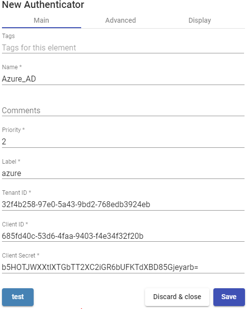

- Advanced:

**Callback:** This field is automatically filled by UDS once the authenticator is saved and its content will need to be copied to the "***App Registrations***" created in the Azure environment.

**Proxy:** Proxy server to be used in the connection with the authenticator

**Enable School Data Sync Integration:** If checked, it will allow integration with the tool "***School Data Sync Integration***" which must be connected to the authenticator "***Azure AD***".


- Display:

**Visible:** If disabled, the authenticator will not be shown as available on the UDS login page.


###### NOTE: {#note-28 .unnumbered}

The integration of OpenUDS with an Azure Active Directory authenticator requires a series of previous tasks and requirements to be performed in the Azure environment

itself, so it is advisable to consult the manua "VDI with UDS Enterprise y Microsoft Azure" available at the [[documentation]{.underline}](https://www.udsenterprise.com/en/uds-enterprise/documentacion/) of the OpenUDS web.

With the "***Test***" button you will check that the connection is successful.

#### IP

This internal Authenticator allows direct access to connection clients (Single Sign-On), through their IP address, to desktops and virtual applications.

The IP addresses works as the users of other authenticators, allowing the direct

validation of the connection clients in the UDS login portal. User groups on an "***IP Authenticator***" can be from specific network ranges to full subnets or specific IPs


In an "***IP Authenticator***" the minimal parameters to be configured are:

- Main:

**Name:** Authenticator name.

**Priority:** The priority of this authenticator. The lower that priority is, the higher it will appear on the list of authenticators available in the user access window. This field admits negative values.

**Label:** Enables direct validation in the authenticator. It allows to validate this latter in the login page URL without going through the whole dashboard interface using this format: ***UDSServer/uds/page/login/label*** (For example: https://UDSServer/uds/page/login/IP).


- Advanced:

**Visible only from these networks:** Allows you to filter the networks from which the authenticator will be visible.

**Accept proxy:** You need to enable this option when there is a previous component to the access of UDS server, such as a load balancer.

UDS automatically detects the IP address of the connection client. In environments where there are load balancers configured, this detection is not successful since the IP address corresponds to the detected balancers. Enabling this option will get correct IP detection.


- Display:

**Visible:** If disabled, the authenticator will not be shown as available on the UDS login page.


#### Internal Database

In environments where no external authenticator is available, it is possible to use the "***Internal Database***". authenticator. This authenticator allows the creation of users and groups manually to access the different desktop services and virtual applications

provided by the UDS platform.

All user and group data are stored in the Database to which the UDS Server is connected.


In "***Internal Database***" minimal parameters to be configured are

- Main:

**Name:** Authenticator name.

**Priority:** Priority that this authenticator will have. The lower that priority, the higher it will appear on the list of authenticators available in the user access window. This field admits negative values.

**Label:** Enables direct validation in this authenticator. It allows the user to validate with said authenticator, although the UDS environment has more authenticators. To do this, you will have to access the UDS "login" screen with the following format: ***UDSServer/uds/page/login/label*** (For example: https://UDSServer/uds/page/login/int1).


- Advanced:

**Different user for each host:** This option allows connections to virtual desktops using a single connection user, adding a root to the name of an existing user at the time of connection to the virtual desktop. This root is the IP address of the connection client or its DNS name.

The new created username has the following structure:

######## IP of the client -generic \_cenection user {#ip-of-the-client--generic-_cenection-user .unnumbered}

**Reverse DNS:** It behaves exactly the same as the "***Different user for each host***", option, but the root added to the user is the DNS name of the connection client. A

correct DNS resolution is required. Otherwise, the IP address will be used. The new user created has the following structure:

######## Generic_user-connection_client_name {#generic_user-connection_client_name .unnumbered}

**Accept proxy:** This option must be enabled when there is a component prior to the access of the UDS Server, such as a load balancer.

By default, UDS automatically detects the IP address of the connection client. In environments where load balancers or other similar elements are configured, this detection is not performed correctly, since the detected IP address corresponds to these balancers. By enabling this option, you will get a correct IP detection.

In environments where the "***Different user for each host***" option is used and there are load balancers, it is necessary to enable this option.


- Display:

**Visible:** If disabled, the authenticator will not be shown as available on the UDS login page.


#### Radius Authenticator

This External Authenticator allows giving access to virtual desktops and applications to users and user groups belonging to a RADIUS-based authenticator.


In an "***Radius Authenticator***" minimal parameters to be configured are:

- Main:

**Name:** Authenticator name.

**Priority:** Priority that this authenticator will have. If there are several authenticators, the lower its priority, the higher it will appear in the list of available authenticators in the UDS login portal. This field admits negative values.

**Label:** Enables direct validation in this authenticator. It allows the user to validate with said authenticator, although the UDS environment has more authenticators. To do this,

you will have to access the login screen of UDS with the following format:

***UDSServer/uds/page/login/label*** (For example: https://UDSServer/uds/page/login/Radi).

**Host:** IP address or RADIUS server name.

**Port:** Communication port with the RADIUS server.

**Secret:** Validation string against the RADIUS server (defined on the RADIUS server itself).


- Advanced:

**NAS Identified:** Identifies UDS within the RADIUS server, allowing you to filter if necessary.

**App Prefix for Class Attributes:** Allows filtering which groups we obtain from the "class" attribute of the RADIUS server.

**Global group:** Allows you to force all users to belong to a group. This allows a RADIUS server (which is still a \"simple\" authenticator) that does not contain groups, to be able to assign ALL users to a group (even if it also contains groups).


###### NOTE: {#note-29 .unnumbered}

By default, UDS will extract from the Radius \"Class\" Attribute the elements that have the form \"group=\...\"

If we define in \"App Prefix for Class Attributes\", for example, \"lab\", UDS will search only for \"class\" attributes that have the form \"labgroup=\...\"

- Display:

**Visible:** If disabled, the authenticator will not be shown as available on the UDS login page.


With the "***Test***" button you can check that the connection is successful.

#### Regex LDAP

This Authenticator allows users and groups of users, belonging to almost any LDAPbased authenticator, to access virtual desktops and applications.


In a "***Regex LDAP Authenticator***" the minimun parameters to configure are:

- Main:

**Name:** Name of the authenticator.

**Priority:** Priority that this authenticator will have. The lower that priority, the higher it will appear in the list of authenticators available in the user access window. This field admits negative values.

**Label:** Enables direct validation in this authenticator. It allows the user to validate in the login window with said authenticator even if the UDS environment has more authenticators. To this end, is we will have to access the "login" screen of UDS with the following format: ***UDSServer/uds/page/login/label*** (For example: https://UDSServer/uds/page/login/LDAP).

**Host:** IP address or LDAP server name.

**Use SSL:** If enabled, SSL connection will be used against the authenticator.

**Timeout:** "***Timeout***" for the connection to the authenticator.


- Credentials:

**User:** User with reading permissions on the authenticator. Format: ***uid=\...,ou=....,dc=...,dc=...***

**Password:** User password.


- Ldap info:

**Base:** Search directory where the system will locate groups and users to validate in the system.

**User class:** Common class that all users must have.

**User Id Attr:** LDAP attribute that will define the name of the user to log in to the UDS access portal.

**User Name Attr:** LDAP attribute that will define the name of the user to login the UDS

access portal. It also allows the use of regular expressions to extract or compose specific values.

**Group Name Attr:** LDAP attribute that will define a user\'s membership in a group. Different attributes can be indicated to define different group attributes (one on each line). It also allows the use of regular expressions to extract or compose specific values.


- Advanced:

**Alt. class:** You can indicate more kinds of objects to search for users and user groups.

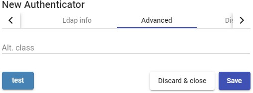

- Display:

**Visible:** If disabled, the authenticator will not be shown as available on the UDS login page.


With the "***Test***" button you can check that the connection is successful.

#### SAML

This external Authenticator allows users and groups of users belonging to an identity provider with SAML 2.0 support to access virtual desktops and applications.

SAML is used for the exchange of authentication and authorization data between security domains, that is, between an identity provider (a claim producer) and a service provider (a claim consumer).


In a "***SAML Authenticator***" minimal parameters to be configured are:

- Main:

**Name:** Authenticator name (Can't contain spaces).

**Priority:** Priority that this authenticator will have. The lower that priority, the higher it will appear in the list of authenticators available in the user access window. This field admits negative values.

**Label:** Enables direct validation in this authenticator. It allows the user to validate in the login window with said authenticator, although the UDS environment has more authenticators. To do this, you will have to access the UDS login screen with the following format: ***UDSServer/uds/page/login/label*** (For example: https://UDSServer/uds/page/login/SAML).


- Certificates:

**Private key:** Private RSA key that is used for signatures and encryptions.

**Certificate:** Public key that is used by SSL sessions.


- Metadata:

**IDP Metadata:** You can indicate a URL or file in XML format.

**Entity ID:** This field must initially be empty. The URL will be automatically generated when saving the authenticator. The URL generated in this field usually needs to be used to register UDS as SP (service provider) on the SAML server).


- Attributes:

**User name attrs:** Attribute that will define the name of the user to perform the login in the UDS access porta.

**Group name attrs:** Attribute that will define a user\'s membership in a group. Different attributes can be indicated to define different group attributes (one on each line) and it also allows the use of regular expressions to extract or compose specific values.

**Real name attrs:** Attribute that defines the username information. It does not affect the UDS login portal.


- Display:

**Visible:** If disabled, the authenticator will not be shown as available on the UDS login page


#### eDirectory

This external Authenticator allows users and groups of users belonging to a Novell network to access virtual desktops and applications.


In a "**eDirectory Authenticator**" minimal parameters to be configured are:

- Main:

**Name:** Authenticator name.

**Priority:** Priority that this authenticator will have. The lower that priority, the higher it will appear on the list of authenticators available in the user access window. This field admits negative values.

**Label:** Enables direct validation in this authenticator. It allows the user to validate with said authenticator, although the UDS environment has more authenticators. To do this,

you will have to access the login screen of UDS with the following format:

***UDSServer/uds/page/login/label*** (For example: https://UDSServer/uds/page/login/ED).

**Host: I**P address or eDirectory server name.

**Use SSL:** If enabled, SSL connection will be used against the authenticator r.

**Timeout:** "***Timeout***" or the connection with the authenticator.


- Credentials:

**User:** User with reading rights on the authenticator in the format:***CN=user, O=domain.***

**Password:** User password.


- Display:

**Visible:** If disabled, the authenticator will not be shown as available on the UDS login page


Clicking on the "***Test***" button, you can check whether the connection has been correctly made.

### Multifactor

Multi-factor authentication (MFA) adds a layer of protection to the sign-in process.

When an account or app is accessed, users must go through additional identity verification. UDS natively supports several multi-factor authentication systems natively:

- Email Multi Factor

- Radius OTP Challenge

- SMS via HTTP

- TOTP Based MFA

And it also supports other MFAs integrated into the authenticator itself, so that when the authenticator is incorporated into UDS Enterprise, the MFA is automatically incorporated.

In OpenUDS you can perform a double authentication of users natively, through the use of different methods explained below.


A \"**Multifactor**\" configuration is not a necessary component for the creation of a **\"Service Pool**\"


####### Safe Employment Procedure: {#safe-employment-procedure-3 .unnumbered}

It is recommended to use any system, at least one, of multi-factor authentication.

#### Email Multi Factor

Through this method, the user will first authenticate with his username and password and then be redirected to a second authentication process where he will receive an email with the necessary code to finally authenticate on his OpenUDS platform.

In a \"***Multi factor Email\"*** The minimum parameters to configure are:

- Main:

**Name:** Name that the item will be indicated.

**Device Caching:** Time in hours to cache the device so that MFA is not needed again.

**MFA code validity:** Time in minutes to allow MFA code use.


- SMTP Server:

**SMTP Host:** Host name or IP address of the SMTP server.

**Security:** Security protocol to be used.

**Username:** Time in minutes to allow the use of MFA code.

**Password**: Password of the user with access to the SMTP server

**Safe use procedure:** Passwords must be of sufficient length and include uppercase, lowercase, numbers and special characters.


- Config:

**Subject: Subject** of the email to be sent to users.

**From Email:** Email address that will be used as a sender.

####### Policy for users without MFA Support: Policy to be used with those users without MFA configured. {#policy-for-users-without-mfa-support-policy-to-be-used-with-those-users-without-mfa-configured. .unnumbered}

**Mail Text**: Text that will be displayed in the sent mail.


#### Radius OTP Challenge

Through this method, the user will first authenticate with his username and password and then be redirected to a second authentication process where he must enter the corresponding code provided by his radius server in order to finally authenticate on his OpenUDS platform.

Through this method, the user will first authenticate with his username and password and then be redirected to a second authentication process where he must enter the corresponding code provided by his radius server in order to finally authenticate on his OpenUDS platform.

o Main:

**Name**: Name that will be indicated to the element.

**Host**: Host name or IP of the Radius server

**Port**: Radius authentication port.

**Secret: \"**Secret\" of the Radius client.

**NAS Identifier**: NAS identifier for Radius Server.

**Device Caching:** Time in hours to cache the device so that MFA is not needed again.

**MFA code validity:** Time in minutes to allow the use of the MFA code.


o Config:

**Radius OTP communication error action**: Action to be performed by the Radius server in the event of an error.

####### Radius OTP Networks: Networks for Radius OTP authentication {#radius-otp-networks-networks-for-radius-otp-authentication .unnumbered}

**Users without defined OTP in server**: Policy that will be used with those users without MFA configured.


#### SMS via HTTP

Through this method, the user will first authenticate with his username and password and then be redirected to a second authentication process where he will receive an SMS with the necessary code to finally authenticate on his OpenUDS platform.

In an \"***SMS Via HTTP***\" The minimum parameters to configure are o Main:

**Name:** Name that the item will be indicated.

**Device Caching:** Time in hours to cache the device so that MFA is not needed again.

**MFA code validity:** Time in minutes to allow MFA code use.


- HTTP Server:

***URL pattern for SMS Sending***: URL pattern for sending SMS. It can contain the following variables:

- {code} - the code to send

- {phone/+phone} - the phone number

- {username} - the username

- {justUsername} - the username without @.

**SMS Sending method**: Method that will be used to send SMS.

**SMS Enccoding**: Encryption to be used for sending SMS.


- HTTP Authentication:

**SMS Authentication Method**: SMS authentication method

**SMS Authentication user or Token**: User or token for SMS authentication

**SMS Authentication paswword**: Password for SMS authentication


- Config:

**SMS response error action:** Action to be taken by the server in case of error.

**User without MFA policy**: Action to be performed on users without an MFA policy configured.


#### TOTP Based MFA

Through this method, the user will first authenticate with his username and password and then be redirected to a second authentication process where he must enter the TOTP code generated from time to time in our application such as **Google authenticator**, **Microsoft**, etc. to be able to authenticate finally in your UDS Enterprise platform..

Through this method, the user will first authenticate with his username and password and then be redirected to a second authentication process where he must enter the TOTP code generated from time to time in our application such as **Google authenticator**, **Microsoft**, etc. to be able to authenticate finally in your UDS Enterprise platform.

o Main:

**Name**: Name that the item will be indicated.

**Issuer**: OTP issuer, once created it cannot be changed

**Device Caching**: Time in hours to cache the device so that MFA is not needed again.

**MFA code validity**: Time in minutes to allow MFA code use.


o Config:

**Valid Window**: Number of codes that will be valid before and after the current one.

**TOTP networks**: The user who is added in these networks will not be asked for OTP.


### Configure users, groups, and user metegtoups

Once the authenticator or authenticators have been configured, you must configure the user groups that contain the users to which access to the desktop services is to be granted. It is also possible to create metagroups, which will be used to combine several groups.

To add groups or metagroups to an authenticator, select it and double click on it, or select "***Detail***" in the provider\'s menu:


Once inside the authenticator, select the "***Groups***" tab, and in "***New***" sselect "***Group***":


You will indicate the name of the group through the "***Group***", with its status (enabled or disabled) In addition, you can directly assign it to one or more "***Service Pools***".


In some authenticators such as "***Active Directory***", an automatic search will be performed:


In others, such as "***Regex LDAP***", "***SAML***", "***eDirectory***"... it will be necessary to indicate it manually.

###### NOTE: {#note-30 .unnumbered}

For internal type authenticators such as "Internal Database" and "IP Authenticator", it will be necessary to create groups manually, since they do not connect to any external authentication system.

Access to the UDS login portal will be granted to all users belonging to a group (of a specific authenticator).

To create a metagroup (group made up of several groups), select the "***Groups***" tab and select "***Meta group***" in "**New**"


You will indicate the name of the metagroup in the "***Meta group name***", field, its status (Enabled or disabled), the operating mode through the "***Match mode***" field and you will also select the groups that will be part of the metagroup.


In the "***Users***" tab of an authenticator, users will be added automatically when they are validated in the UDS login portal, provided that these users belong to existing groups in the authenticator:


If you need to register users manually, to assign special permissions before they connect for the first time, you will click on \"***New***\" and you will select the user, their status (enabled or disabled) and the access level ("***Role***" field). In case of not using

the "***Internal Database***" authenricator, the "***Groups***" field will be left empty, since the system must automatically add the user to their membership group (once the user has been saved, you can edit it and check if it has been assigned correctly to the group).


###### NOTE: {#note-31 .unnumbered}

Users of an "Internal Database" authenticator always have to be manually created.

The access leve "**Admin**" " makes a user an administrator of the environment. "**Staff member**" allows access to UDS Actor downloads and UDS administration in a limited

way, based on the permissions assigned. "**User**" will only allow access to the UDS services window (the latter is the default)

Once the user has been added, you can modify it using the\"***Edit***\" section.

To delete a user, group or metagroup, select it and click on the \"***Delete***\". button. If you have registered users in the system who belong to a group, and it is deleted, the users will be left without an assigned group and cannot be validated in the system.

#### Creation of groups and users \"Internal Database\"

In an authenticator of type \"***Internal Database***\" t wil be necessary to create manually groups of users that you will assign to a "***Service Pool***".

Access the \"***Internal Database***\" authenticator previously created and in the\"***Groups***\" tab click on\"***New - Group***\".


You indicate the name of the new group, its status (enabled or disabled) and you can also assign it directly to one or more "***Service Pools***".


Follow the same procedure if you need to create a metagroup.

Once you have created the group or groups of users, register the users and assign them to one or several groups.

Access the \"***Internal Database***" authenticator previously created and in the \"***Users***\" tab click on \"***New***\".


Enter the name of the new user, its status (enabled or disabled), the access level ("***Role***" field) and a password. In the "***Groups***" field, indicate which groups he will

belong to (you can select one or more of the existing groups).


#### Creation of groups and users \"IP Authenticator\"

In an \"***IP Authenticator***\" it wil be necessary to create manually the groups of users. In this case, a group it will be a range of IPs, a complete subnet or a single IP address. In each case you will use the following format:

- Unique IP: xxx.xxx.xxx.xxx (For example:192.168.11.33)

- Complete subnet: xxx.xxx.xxx.xxx/xx (For example: 192.168.11.0/24)

- IP addresses range: xxx.xxx.xxx.xxx-xxx.xxx.xxx.xxx (For example: 192.168.11.1- 192.168.11.155)

Access the "***IP Authenticator*** authenticator previously created and in the\"***Groups***\" tab click on \"***New- Group***\".


Enter a range of IPs, a complete subnet or comma-separated IP addresses ("***IP Range***" field) and their status (enabled or disabled). You can also assign it directly to

one or more "***Service Pools***".


When a user selects this authenticator in the UDS login portal (that is, the default authenticator), the system will check the IP address of his connection client. If this address is within the range indicated in the group ( "***IP Range***" field), the user will be automatically validated.


Once the user is validated in the UDS login portal, his IP address will be automatically registered in the \"Users\" tab.


If you need to change its status (enabled or disabled) or the access level ("***Role***" field), select it and click on \"Edit".


OpenUDS 3.6 Installation, Administration and User Guide

pagePág286ina of286436 436

# OpenUDS 3.6 Installation, Administration and User Guide {#uds-enterprise-3.6-installation-administration-and-user-guide-1 .unnumbered}

### OS Managers

An \"***OS Manager***\" runs a previously configured service type.

The UDS Actor, hosted on the virtual desktop or application server, is in charge of the interaction between the O.S. and the UDS Server based on the configurations or

type of \"***OS Manager***\" chosen.

You can register as many \"***OS Managers***\" as you need in the UDS Enterprise platform. You can choose different types based on the needs of the services to be deployed.


###### NOTE: {#note-32 .unnumbered}

Any type of service deployed in UDS will require an "**OS Manager**" except when you use the provide "**Static IP Machines Provider**".

#### Linux

A \"***Linux OS Manager***\" is used for virtual desktops based on Linux systems. It performs the renaming tasks and session control of the virtual desktops.


In a "***Linux OS Manager***" minimal parameters to be configured are:

- Main:

**Name:** Name of the "***OS Manager***\".

**Logout Action:** You will indicate the action that UDS will perform on the virtual desktop when a user session is closed:

- **Keep service assigned (Semi persistent virtual desktop):** When a user logs out of the virtual desktop, the system will not take any action. When

reconnecting, you will be assigned the same desktop that you had previously

been working with. If a new publication of the "***Service Pool***", is made, when the user logs out his virtual desktop will be deleted, and he will connect to a new one generated in the new version.

- **Remove service (Non-persistent VM):** When a user logs out, the system will destroy the desktop. If this same user requests a virtual machine to the system again, the system will provide a new virtual desktop.

- **Keep service assigned even on new publication (persistent virtual desktop):** When a user logs out of the virtual desktop, the system will not take

any action. When reconnecting, he will be assigned the same desktop that he had previously been working with. If a new publication of the "***Service Pool***", is made, when the user logs out, his virtual desktop will remain assigned and will only be deleted when the administrator indicates it.

**Max. Idle time:** Maximun time (Indicated in seconds) of inactivity in the virtual desktop. After this time of inactivity, the UDS Actor will automatically close the session. Negative values and less than 300 second disable this option.


- Advanced:

**Calendar logout:** Allows you to select the behavior that the system will have with a user\'s session when the end date of a calendar is met. If it is to "***Yes***", When the end date of the calendar assigned to the service is fulfilled, the system will disconnect the user from said service, if he is "***No***", the system will not log the user out, but if the user logs out, or even drops the connection, they won\'t be able to log back in.


#### Linux Random Password

A \"***Linux Random Password OS Manager***\" is used for virtual desktops based on Linux systems and that require a higher level of security in user access. It performs the tasks of renaming, session control and changing the password of an existing local user on virtual desktops.


Through its use, a random password is assigned to an existing local user during the configuration of each new virtual desktop deployed, thus providing a higher level of access security.

In a "***Linux Random Password OS Manager***" minimmal parameters to be configured are:

- Main:

**Name:** Name of the \"***OS Manager***\".

**Account:** Name of the existing local user in the virtual desktop to which UDS will change the password by a self-generated random one.

**Logout Action:** Here you can indicate the action that UDS will perform on the virtual desktop when a user session is closed:

- **Keep service assigned (semi persistent virtual desktop):** When a user logs out of the virtual desktop, the system will not take any action. When reconnecting, he will be assigned the same desktop he you had previously

been working with. If a new publication of the "***Service Pool***", is made, when the user logs out, his virtual desktop will be deleted, and he will connect to a new one generated in the new version.

- **Remove service (non-persistent VM):** When a user logs out, the system will destroy the desktop. If this same user requests a virtual machine to the system again, the system will provide a new virtual desktop.

- **Keep service assigned even on new publication (persistent virtual desktop):** When a user logs out of the virtual desktop, the system will not take any action. When reconnecting, he will be assigned the same desktop that he had previously been working with. If a new publication of the "***Service Pool***", is made, when the user logs out, his virtual desktop will remain assigned and will only be deleted when the administrator indicates it.

**Max. Idle time:** Maximun time (Indicated in seconds) of inactivity in the virtual desktop. After this time of inactivity, the UDS Actor will automatically close the session. Negative values and less than 300 second disable this option.


- Advanced:

**Calendar logout:** Allows you to select the behavior that the system will have with a user\'s session when the end date of a calendar is met. If it is set to "**Yes**", when the end date of the calendar assigned to the service is fulfilled, the system will disconnect the user from said service, if it is set to "**No**", the system will not disconnect the user, but if it is disconnected, it will log out or even the connection is cut off, you will no longer be able to reconnect.


#### RDS

An \"***RDS OS Manager***\" is used to configure a "***Service Pool***" that provides virtual application to users.


In a "***RDS OS Manager***" minimal parameters to be configured are:

**Name:** Name of the \"***OS Manager***\".

**Max. Sesión time:** Maximum time that the user session of an application will remain registered in the assigned services tab of a "***Service Pool***" expressed in hours (0 = unlimited). In no case will the user\'s application session be terminated.


#### Windows Basic

A \"***Windows Basic OS Manager***\" is used for virtual desktops based on Windows systems which aren't part of an AD domain. It performs the renaming tasks and the session control of the virtual desktops.


In a "***Windows Basic OS Manager***" minimal parameters to be configured are:

- Main:

**Name:** Name of the \"***OS Manager***\".

**Logout Action:** Here you can indicate the action that UDS will perform on the virtual desktop when a user session is closed:

- **Keep service assigned (semi persistent virtual desktop):** When a user logs out of the virtual desktop, the system will not take any action. When reconnecting, he will be assigned the same desktop that he had previously

been working with. If a new publication of the "***Service Pool***", is made, when the user logs out, his virtual desktop will be deleted, and he will connect to a new one generated in the new version.

- **Remove service (non-persistent VM):** When a user logs out, the system will destroy the desktop. If this same user requests a virtual machine to the system again, the system will provide a new virtual desktop.

- **Keep service assigned even on new publication (persistent virtual desktop):** When a user logs out of the virtual desktop, the system will not take any action. When reconnecting, he will be assigned the same desktop that he had previously been working with. If a new publication of the "***Service Pool***", is made, when the user logs out, his virtual desktop will remain assigned and will only be deleted when the administrator indicates it.

**Max. Idle time:** Maximun time (Indicated in seconds) of inactivity in the virtual desktop. After this time of inactivity, the UDS Actor will automatically close the session. Negative values and less than 300 second disable this option.


- Advanced:

**Calendar logout:** Allows you to select the behavior that the system will have with a user\'s session when the end date of a calendar is met. If it is set to "Yes", when the end date of the calendar assigned to the service is fulfilled, the system will disconnect the user from said service, if it is set to "No", the system will not disconnect the user, but if it is disconnected, it will log out or even the connection is cut off, you will no longer be able to reconnect.


#### Windows Domain

A \"***Windows Domain OS Manager***\" is used for virtual desktops based on Windows systems that are part of an AD domain. It performs renaming, AD domain enrollment, and session control on virtual desktops.


In a "***Windows Domain OS Manager***" minimal parameters to be configured are:

- Main:

**Name:** Name of the\"***OS Manager***\".

**Domain:** Name of the AD domain to which the virtual desktops will join. It is required to use the FQDN format (For example: vc.local), NetBIO is not supported.

**Account:** Username with rights to add machines to the domain.

**Password:** Password of the user in the field "***Account***".

**OU:** Organizational unit where the virtual desktops will be registered (if none are indicated, the desktops will be registered in the default OU "***Computers***The format of the supported OU is:

OU=name_OU_last_level,...OU=name_OU_first_level,DC=name_domain,DC=extenstion_domain

To avoid errors in the introduction of the format, it is recommended to consult the "***distinguishedName***" field on the properties of the OU attribute.


**Logout Action:** Here you can indicate the action that UDS will perform on the virtual desktop when a user session is closed:

- **Keep service assigned (semi persistent virtual desktop):** When a user logs out of the virtual desktop, the system will not take any action. When reconnecting, he will be assigned the same desktop that he had previously

been working with. If a new publication of the "***Service Pool***", is made, when the user logs out, his virtual desktop will be deleted, and he will connect to a new one generated in the new version.

- **Remove service (non-persistent VM):** When a user logs out, the system will destroy the desktop. If this same user requests a virtual machine to the system again, the system will provide a new virtual desktop.

- **Keep service assigned even on new publication (persistent virtual desktop):** When a user logs out of the virtual desktop, the system will not take any action. When reconnecting, he will be assigned the same desktop that he had previously been working with. If a new publication of the "***Service Pool***", is made, when the user logs out, his virtual desktop will remain assigned and will only be deleted when the administrator indicates it.

**Max. Idle time:** Maximun time (Indicated in seconds) of inactivity in the virtual desktop. After this time of inactivity, the UDS Actor will automatically close the session. Negative values and less than 300 second disable this option.


- Advanced:

Machine Group: Indicates to which machine group of an AD the virtual desktops generated by UDS will be added.

Machine clean: If enabled, UDS will delete the records of the virtual desktops in the indicated OU once the desktop is deleted. It is necessary that the user indicated in the field "***Account***" have permissions to perform said action on the indicated OU.

Server Hint: In case there are several AD servers, an indication will be given on which one to use preferably.

**Use SSL:** If enabled, SSL connection will be used against the AD server.

**Calendar logout:** Allows you to select the behavior that the system will have with a user\'s session when the end date of a calendar is met. If it is set to "***Yes***", when the end date of the calendar assigned to the service is fulfilled, the system will disconnect the user from said service, if it is "***No***", the system will not log the user out, but if the user logs out, logs out, or even drops the connection, they will no longer be able to log in again.


#### Windows Random Password

A \"***Windows Random Password OS Manager***\" is used for virtual desktops based on Windows systems and that require a higher level of security in user access. It performs the tasks of renaming, session control and changing the password of an existing local user on virtual desktops.


Throught its use, a random password is assigned to an existing local user during the configuration of each new deployed virtual desktop, thus providing a higher level of access security.

In a "***Windows Random Password OS Manager***" " minimal parameters to be configured are:

- Main:

**Name:** Name of the \"***OS Manager***\".

**Account:** Name of an existing local user on the virtual desktop to which UDS will change the password to a self-generated random one.

**Password:** Password of the user in the field "***Account***".

**Logout Action:** Here you can indicate the action that UDS will perform on the virtual desktop when a user session is closed:

- **Keep service assigned (semi persistent virtual desktop):** When a user logs out of the virtual desktop, the system will not take any action. When

reconnecting, he will be assigned the same desktop that he had previously

been working with. If a new publication of the "***Service Pool***", is made, when the user logs out, his virtual desktop will be deleted and he will connect to a new one generated in the new version

- **Remove service (non-persistent VM):** When a user logs out, the system will destroy the desktop. If this same user requests a virtual machine to the system again, the system will provide a new virtual desktop.

- **Keep service assigned even on new publication ((persistent virtual desktop):** When a user logs out of the virtual desktop, the system will not take any action. When reconnecting, he will be assigned the same desktop that he had previously been working with. If a new publication of the "***Service Pool***", is made, when the user logs out, his virtual desktop will remain assigned and will only be deleted when the administrator indicates it

**Max. Idle time:** Maximun time (indicated in seconds) of inactivity in the virtual desktop. After this time of inactivity, the UDS Actor will automatically close the session. Negative values and less than 300 second disable this option.


- Advanced:

**Calendar logout:** Allows you to select the behavior that the system will have with a user\'s session when the end date of a calendar is met. If it is set to "**Yes**", when the end date of the calendar assigned to the service is fulfilled, the system will disconnect the user from said service, if it is set to "**No**", the system will not disconnect the user, but if it is disconnected, it will log out or even the connection is cut off, you will no longer be able to reconnect.


### Transports

To connect to virtual desktops and applications, it is necessary to create "***Transports***". They are applications that will be executed on the connection client and will be in

charge of providing access to the implemented service.

Depending on the type of virtual desktop that you configure, the location and the device used to connect to your virtual desktops, you will need to create different types of transports.

The connection client and the desktop/application server must have installed the connection protocol (client - server) used in the transport for the transport to work correctly.

To access the "***Transports***", section, go to the "***Conectivity***" section and select "***Transports***". The following are currently available:

- Direct:


- Tunneled:


The \"***Transports***\" indicated as \"***direct***\" ill be used for user access to virtual desktops and applications from an internal LAN, VPN, LAN Extension, etc\.....

The \"***Transports***\" indicated as \"***Tunneled***\" will be used for user access to virtual desktops and applications from a WAN. These\"***Transports***\" will be supported by the UDS Tunnel server to make the connection.

The \"***Transport***\" can be used for user access to virtual desktops from all types

of access (LAN, WAN, etc \...). This \"***Transport***\" uses the UDS Tunnel server to make the connection against the virtual desktop.

###### NOTE: {#note-33 .unnumbered}

If you need to access from a network that is not your LAN, you will have to use tunnelled transports, which must have the public IP address of the UDS-Tunnel server. The Tunnel server will use two ports depending on the service to provide. When it is a connection via HTML5, you will use port 10443, and when it is any tunnelled connection (RDP, RDS, X2Go, etc...), port 443 will be used.

#### NICE DCV (direct)

An "***NICE DCV***" trasnport (direct) allows users to access Windows, Linux desktops using NICE DCV protocol. Both connection clients and desktops are required to have NICE DCV software installed and enabled.

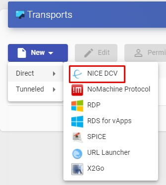

In a trasnport "***NICE DCV***" the minimum parameters to configure are:

- Main:

**Name:** Name of the transport.

**Priority:** Priority that the transport will have. The lower that priority, the higher it will appear in the list of available transports for a service. The transport with the lowest priority will be the one used by default when clicking on the image of service

**Port:** Listening por NICE DCV

**Networks Access:** Allows or disables user access to a service based on the network from which it is accessing, and the network indicated in the "***Networks***" field.

**Networks:** Network ranges, subnets or IP addresses indicated in the "***Networks***" of the "***Connectivity***" field. It is used together with the "***Network Access***" field to allow or disable user access to a service based on his network location.

**Allowed Devices:** Enables access to the service only with selected devices. If there is none selected, no filtering is performed.

**Service Pools:** Allows you to assign this transport directly to one or more "***Service Pools***" previously created.


- Credentials:

**Empty creds:** If it is set to "***Yes***", when you make the connection with the service, it will ask for the credentials to access the virtual desktop. If it is set to "***No***" the credentials entered in the UDS login portal will be redirected.

**Username:** Username that will be used to log into the desktop (the user must exist in the desktop). If this field is empty, an attempt will be made to use the UDS portal login user if the "***Empty creds***" field is set to "***No***", or it will ask for credentials to indicate them manually if it is set to "***Yes***".

Password: Password of the user in the "***Username field***".


- Display:

**Full screen:** Indicates if the connection to the service is made in full screen.

**Multiple monitors:** Indicates if several monitors will be used in the connection with the service.


- Advanced:

**Label:** It allows to group transports to be shown, through the name of a label, in a meta pool. By using these labels, we can indicate that a metapool has several transports.


#### NoMachine Protocol (direct)

Un transporte \"***NoMachine Protocol***\" allows users to access Windows, Linux, and MacOS desktops using the NoMachine protocol (both connection clients and desktops need to have NoMachine software installed).


In a transport "***NoMachine Protocol***\" the minimum parameters to configure are:

- Main:

**Name:** Name of the transport.

**Priority:** Priority that the transport will have. The lower that priority, the higher it will appear in the list of available transports for a service. The transport with the lowest priority will be the one used by default when clicking on the image of service.

**Listening port:** NX software listening port.

**Networks Access:** Allows or disables user access to a service based on the network from which it is accessing, and the network indicated in the "***Networks***" field.

**Networks:** Network ranges, subnets or IP addresses indicated in the "***Networks***" of the "***Connectivity***" section. It is used together with the "***Network Access***" field to allow or disable user access to a service based on his network location.

**Allowed Devices:** Enables access to the service only with selected devices. If there is none selected, no filtering is performed.

**Service Pools:** Allows you to assign this transport directly to one or more "***Service Pools***" previously created.


- Parameters:

**Use UDP traffic for multimedia:** It allows to indicate if the UDP protocol will be used in the multimedia traffic.

**Window Size:** Indicates the size of the window in the connection to the service.


- Credentials:

**Empty creds:** If it is set to "***Yes***", when you make the connection with the service, it will ask for the credentials to access the virtual desktop. If it is set to "***No***", he credentials entered in the UDS login portal will be redirected.

**Username:** Username that will be used to log into the desktop (the user must exist in the desktop). If this field is empty, an attempt will be made to use the UDS portal login user if the "***Empty creds***" field is set to "***No***", or it will ask for credentials to indicate them manually if it is set to "***Yes***".

**Password:** Password of the user in the "***Username*** " field.


- Advanced:

**Label:** It allows to group transports to be shown, through the name of a label, in a meta pool. By using these labels, we can indicate that a metapool has several transports.


#### RDP (direct)

An ***"RDP"*** (direct) transport allows users to access Windows/Linux virtual desktops using the Remote Desktop Protocol (RDP). Both connection clients and virtual desktops must have RDP installed and enabled (for Linux virtual desktops, XRDP must be used).).


In A ***"RDP"*** (direct) transport, the minimum parameters to configure are:

- Main:

**Name:** Name of the transport.

**Priority:** Priority that the transport will have. The lower that priority, the higher it will appear in the list of available transports for a service. The transport with the lowest priority will be the one used by default when clicking on the image of service.

**Networks Access:** Allows or disables user access to a service based on the network from which he is accessing, and the network indicated in the "***Networks***" field.

**Networks:** Network ranges, subnets or IP addresses indicated in the "***Networks***" of the "***Connectivity***" section. It is used together with the "***Network Access***" field to allow or disable user access to a service based on his network location.

**Allowed Devices:** Enables access to the service only with selected devices. If none are selected, no filtering is performed.

**Service Pools:** Allows you to assign this transport directly to one or more "***Service Pools"*** previously created.


- Credentials:

**Empty creds:** If is set to "***Yes***", when you make the connection with the service, it will ask you for the credentials to access the virtual desktop. If it is set to "***No***", the credentials entered in the UDS login portal will be redirected.

**Username:** Username that will be used to log into the desktop (the user must exist in the desktop). If this field is empty, an attempt will be made to use the UDS portal login user if the "***Empty creds***" field is set to "***No***", or it will ask for credentials to indicate them manually if it is set to "***Yes***".

**Password:** Password of the user in the "***Username***" field.

**Without Domain:** Indicates if the domain name is redirected together with the user.

**Domain:** Name of the domain that will be sent with the user\'s credentials.

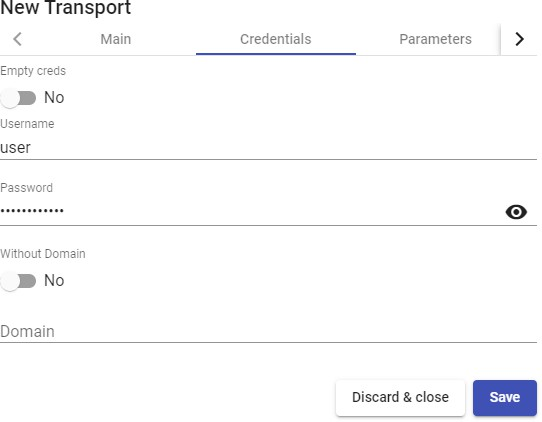

- Parameters:

**Allow Smartcards:** Enables the redirection of Smartcards.

**Allow Printers:** Enables printer redirection.

**Local drives policy:** Enables drive redirection:

- **Allow none:** No drive is redirected.

- **Allow PnP drives:** Only connected drives are redirected during an active session.

- **Allow any drive:** All drives are redirected.

**Force drives:** Forces the redirection of specific drives. You can specify several separated by commas. (Ex: F:,G: ).

**Allow Serials:** Enable serial port redirection.

**Enable clipboard:** If it is activated, it will allow copy/paste between the connection client and the desktop

**Enable Sound:** If activated, it will allow the redirection of the audio from the desktop to the connection client.

**Enable webcam:** If enabled, it will allow the redirection of web cameras between the connection client and the desktop.

**Credssp Support:** If it is activated, it will use "Credential Security Support Provider".

**RDP Port:** Connection port against the RDP server


- Display

**Screen Size:** Determines the size of the desktop window.

**Color depth:** Indicates the colour depth. **Wallpaper/theme:** Displays the desktop background. **Multiple monitors:** Allows the use of multiple monitors. **Allow Desk. Comp.:** Enables "Desktop Composition". **Font Smoothing:** Activates font smoothing.

**Connection Bar:** Allows you to enable or disable the connection bar.


- Linux Client (only applies to Linux connection clients): **Multimedia sync:** Enables the multimedia parameter on the FreeRDP client. **Use Alsa:** Enables the use of audio through Alsa.

**Printer string:** Example: \"Zebra\",\"ZDesigner TM400 200 dpi (ZPL)\"

*(\"Zebra\" is the name of the local printer, \"ZDesigner TM400 200 dpi (ZPL)\" is the exact name of the printer driver in Windows).*

**Smartcard string:** Example: \"Gemalto PC Twin Reader 00 00\" (\"Gemalto PC Twin Reader 00 00\" *is the name of the smartcard).*

**Custom parameters:** Any parameter supported by the FreeRDP client can be indicated (if several are indicated, they must be separated by spaces). They will be applied when connecting to the virtual desktop.


###### NOTE: {#note-34 .unnumbered}

Some important parameters are indicated in the capture as an example: /gfx:rfx greatly improves the quality of video and audio, /drive:media,/media allows redirection of local drives connected to the connection client, /smartcard allows redirection of a smartcard...

- Mac OS X (only applies to MacOS connection clients):

**Allow Microsoft Rdp Client:** Allows you to use the Microsoft RDP client instead of the FreeRDP client. In order to use it, it must be enabled and the FreeRDP client must not be installed on the MacOS connection client computer.

**Custom parameters:** Any parameter supported by the FreeRDP client can be indicated (if several are indicated, they must be separated by spaces). They will be applied when connecting to the desktop.


- Advanced:

**Label:** It allows to group transports to be shown, through the name of a label, in a meta pool. By using these labels, we can indicate that a metapool has several transports.


#### RDS For vApps (direct)

A "***RDS for vAPPs***\" allows users to access virtual Windows applications using RemoteAPP. The connection clients can be Windows or Linux

A Windows connection client must have RemoteAPP to open virtual applications. A Linux connection client must have the freerdp2 package to open virtual applications.


In a "***RDS for vAPPs***\" transport (direct) the minimum parameters to configure are:

- Main:

**Name:** Name of the transport.

**Priority:** Priority that the transport will have. The lower that priority, the higher it will appear in the list of available transports for a service. The transport with the lowest priority will be the one used by default when clicking on the image of the service.

**Networks Access:** Allows or disables user access to a service based on the network from which he is accessing, and the network indicated in the "***Networks***" field.

**Networks:** Network ranges, subnets or IP addresses indicated in the "***Networks***" section "***Connectivity***". It is used together with the "***Network Access***" field to allow or disable user access to a service based on his network location.

**Allowed Devices:** Enables access to the service only with selected devices. If none are selected, no filtering is performed.

**Service Pools:** Allows to assign this transport directly to one or more "***Service Pools***" previously created.


- Credentials:

**Empty creds:** If it is set to "***Yes***", when you make the connection to the service, it will ask you for the credentials to access the virtual application. If it is set to "***No***", the credentials entered in the UDS login portal will be redirected.

**Without Domain:** Indicates if the domain name is redirected together with the user.

**Domain:** Name of the domain that will be sent with the user\'s credentials.


- Parameters:

**Allow Smartcards:** Enables the redirection of smartcards.

**Allow Printers:** Enables printer redirection.

**Local drives policy:** Enables redirection of disk drives:

- **Allow none:** No drive is redirected.

- **Allow PnP drives:** Only connected drives are redirected during an active session.

- **Allow any drive:** All drives are redirected.

**Force drives:** Forces the redirection of specific drives. You can enter several separated by commas. (Ex: F:, G:).

**Allow Serials:** Enables serial port redirection.

**Enable clipboard: I**f it is activated, it will allow copy/paste between the connection client and the virtual application l.

**Credssp Support: I**f enabled, it will use "Credential Security Support Provider".

**Enable Sound:** If activated, it will allow the redirection of the audio from the virtual application to the connection client.

**Enable webcam:** If activated, it will allow the redirection of webcams between the connection client and the virtual application.


- Display:

**Color depth:** Indicates the depth of the colour.

**Windows state:** Indicates the window mode in which the application will start.

**Font Smoothing:** Enable font smoothing.


- Linux Client:

**Execute as shell:** Run an application in session mode offering a better visualization.

**Multimedia sync:** Enables the multimedia parameter in FreeRDP.

**Use Alsa:** Enables the use of audio through Alsa.

**Printer string:** Example: \"Zebra\",\"ZDesigner TM400 200 dpi (ZPL)\"

*(\"Zebra\" is the name of the local printer, \"ZDesigner TM400 200 dpi (ZPL)\" is the exact name of the printer driver in Windows).*

**Smartcard string:** Example: \"Gemalto PC Twin Reader 00 00\" (\"Gemalto PC Twin Reader 00 00\" *is the name of the smartcard).*

**Custom parameters:** You can specify any parameter supported by the FreeRDP client. They will be applied when establishing the connection with the virtual application.


###### NOTE: {#note-35 .unnumbered}

In the screenshot some important parameters are indicated as an example:/t:"name_aplicacton" allows to force a title to the window (if not indicated, the name will be that of the service pool),

/dynamic-resolution +toggle-fullscreen allows to maximize the application window\...

- Advanced:

**RDP Port:** Connection port against RDP server.

**Label:** It allows to group transports to be shown, through the name of a label, in a meta pool. By using these labels, we can indicate that a metapool has several transports.


#### SPICE (direct)

A "***SPICE***" (direct) allows users to access Windows/Linux virtual desktops

using the "***SPICE***". protocol. The connection clients must have the "***SPICE***" client (Virt-Manager).

The "***SPICE***" transport can only be used with a service provider such as oVirt/Red Hat Enterprise Virtualization (RHV) and OpenNebula.


In a "***SPICE***" transport (direct), the minimum parameters to configure are:

- Main:

**Name:** Name of the transport.

**Priority:** Priority that the transport will have. The lower that priority, the higher it will appear in the list of available transports for a service. The transport with the lowest priority will be the one used by default when clicking on the image of the service.

**Certificate:** Certificate generated in ovirt-engine/RHV-manager or in OpenNebula. It is required to connect to virtual desktops (usually hosted at **/etc/pki/ovirt-engine/certs/ca.cer** ).

**Networks Access:** Allows or disables user access to a service based on the network from which it is being accessed and the network indicated in the "***Networks***" field.

**Networks:** Network ranges, subnets or IP addresses indicated in the "***Networks***" of the "***Connectivity***" section. It is used together with the "***Network Access***" field to allow or disable user access to a service based on his network location.

**Allowed Devices:** Enables access to the service only with selected devices. If none are selected, no filtering is performed.

**Service Pools:** Allows to assign this transport directly to one or more "**Service Pools**" previously created.


- Advanced:

**Fullscreen Mode:** Enables full screen in the virtual desktop.

**Smartcard Redirect:** Enables the redirection of smartcards on the virtual desktop.

**Enable USB:** Allows the redirection of devices connected to a USB port.

**New USB Auto Sharing:** Allows the redirection of PnP devices connected to a USB port.

**Label:** It allows to group transports to be shown, through the name of a label, in a meta pool. By using these labels, we can indicate that a metapool has several transports.


#### URL Launcher (direct)

A "***URL Launcher***" (direct) allows users to access a specific URL that will be executed in the browser (the default one) of their connection client computer.


In a "***URL Launcher***" transport (direct), the minimum parameters to configure are:

- Main:

**Name:** Name of the transport.

**Priority:** Priority that the transport will have. The lower that priority, the higher it will appear in the list of available transports for a service. The transport with the lowest priority will be the one used by default when clicking on the image of the service

**URL Pattern:** URL that will launch the browser when the service is accessed. \_IP\_ can be used to send the IP address specified in the field "**Machine IP**" of type base service "**Static Single IP**" or you can also use \_USER\_ to send the name of the user that started the service.

**Networks Access:** Allows or disables user access to a service based on the network from which it is being accessed and the network indicated in the "***Networks***" field.

**Networks:** Network ranges, subnets or IP addresses indicated in the "***Networks***" of the "***Connectivity***". It is used together with the "**Network Access**" field to allow or disable user access to a service based on his network location.

**Allowed Devices:** Enables access to the service only with selected devices. If none are selected, no filtering is performed.

**Service Pools:** Allows you to assign this transport directly to one or more "**Service Pools**" previously created.


- Advanced:

**Force new HTML Window:** If enabled, the URL indicated in the field "**URL Pattern"** will launch in a new browser tab.

**Label:** It allows to group transports to be shown, through the name of a label, in a meta pool. By using these labels, we can indicate that a metapool has several transports.


###### NOTE: {#note-36 .unnumbered}

To publish a service pool and associate this transport, it is recommended to use the service provider type "**Static IP Machine Provider**" with a base service of type "**Static Single IP**".

#### X2Go (direct)

An "***X2Go***" tansport (direct) allows users to access Linux virtual desktops using "***X2Go***".

Both the connection clients (client) and the virtual desktops (server) must have "***X2Go***" installed and enabled.


In an "***X2Go***" transport (direct), the minimum parameters to configure are:

- Main:

**Name:** Name of the transport.

**Priority:** Priority that the transport will have. The lower that priority, the higher it will appear in the list of available transports for a service. The transport with the lowest priority will be the one used by default when clicking on the image of the service.

**Networks Access:** Allows or disables user access to a service based on the network from which it is being accessed and the network indicated in the "***Networks***".

**Networks:** Network ranges, subnets or IP addresses indicated in the "***Networks***" of the "***Connectivity***". section. It is used together with the "***Network Access***" field to allow or disable user access to a service based on his network location.

**Allowed Devices:** Enables access to the service only with selected devices. If none are selected, no filtering is performed.

**Service Pools:** Allows you to assign this transport directly to one or more "***Service Pools***" previously created.


- Credentials:

**Username:** User name that will be used to log into the virtual desktop.


- Parameters:

**Screen size:** Resolution of the connection window.

**Desktop:** Selection of the desktop manager (xfce, Mate, Gnome, etc...) or virtualization of Linux applications (UDS vAPP)

**vAPP:** Execution path of the application to virtualize (only applies if the parameter "***Desktop"*** is selected "***UDS vAPP***").

**Enable sound:** Enables sound in the connection. **Redirect home folder:** Redirects the user\'s /home. **Speed:** Connection optimization.


- Advanced:

**Sound:** Selection of the type of sound server.

**Keyboard:** Keyboard language.

**Pack:** Method used to compress images.

**Quality:** Image quality (0-9).

**Label:** It allows to group transports to be shown, through the name of a label, in a meta pool. By using these tags, we can indicate that a metapool has several transports.


#### HTML5 RDP (tunneled)

An \"***HTML5 RDP***\" transport allows access to Windows and Linux virtual desktops using the RDP protocol through a web browser that supports HTML5 (for Linux desktops the machines must have the XRDP package installed. For Windows desktops, RDP access must be enabled)).

This transport uses the UDS Tunnel server to make the connection against the virtual desktops. It must be previously configured for its correct operation.


In an "***HTML5 RDP***" transport, the minimum parameters to configure are:

- Main:

**Name:** Name of the transport.

**Priority:** Priority that the transport will have. The lower that priority, the higher it will appear in the list of available transports for a service. The transport with the lowest priority will be the one used by default when clicking on the image of a service.

**Networks Access:** Allows or disables user access to a service based on the network from which it is being accessed and the network indicated in the "***Networks***" field.

**Networks:** Network ranges, subnets or IP addresses indicated in the "***Networks***" of the "***Connectivity***". section. It is used together with the "***Network Access***" field to allow or disable user access to a service based on his network location.

**Allowed Devices:** Enables access to the service only with selected devices. If none are selected, no filtering is performed.

**Service Pools:** Allows to assign this transport directly to one or more "**Service Pools**" previously created.


- Tunnel:

**Tunnel Server:** IP address or name with the connection port of the UDS Tunnel server. If access to the desktop is done from a WAN, the public IP address or name of the UDS Tunnel server must be entered. Format:

https://*IP_Tunnel*:10443

**Use Glyptodon Enterprise tunnel:** Allows to use the Glyptodon Enterprise server tunnel for HTML5 connections


- Credentials:

**Empty creds:** If it is set to "***Yes***", when you make the connection with the service, it will ask you for the credentials to access the virtual desktop. If it is set to "***No*** the credentials entered in the UDS login portal will be redirected.

**Username:** Username that will be used to log into the desktop (the user must exist in

the desktop). If this field is empty, it will try to use the UDS portal login user if the "***Empty creds***" field is "***No***", or it will ask for credentials to indicate them manually if it is "***Yes***".

**Password:** Password of the user in the "***Username***" field.

**Without Domain:** Indicates if the domain name is redirected together with the user.

**Domain:** A domain name that will be sent with the user\'s credentials.


- Parameters:

**Show wallpaper:** Shows the wallpaper.

**Allow Desk.Comp.:** Enables "**Desktop Composition**".

**Font Smoothing:** Activates font smoothing (improves display).

**Enable Audio:** Enables redirection of audio (speaker) in the virtual desktop.

**Enable Microphone:** Enable audio redirection (Microphone) on desktop.

**Enable Printing:** Enables printing in the virtual desktop. A printer will be automatically enabled to print documents in pdf format and download them to the connection client.

**File Sharing:** It enables a temporary repository (located on the UDS Tunnel server) to be able to upload or download files between the virtual desktop and the connection client.

**Clipboard:** Enables the ability to copy and paste text between the connection client and the desktop.

**Layout:** Keyboard language to be enabled on the desktop.


- Advanced:

**Ticket Validity**: Indicates the validity time (in seconds) of the ticket generated by UDS in the connection client for the HTML5 connection.

**Force new HTML Window** Forces each connection that is started to be in a new window.

**Security**: Indicates the security level of the connection. If you want to use NLA, it is necessary to redirect valid credentials (you will not be able to request credentials from the user by enabling the option "***Empty creds***"). If you want to use RDP security with O.S Windows, it will be necessary to disable NLA on the desktop, both at the remote desktop configuration level and at the registry level:

[[https://www.udsenterprise.com/es/wiki/Troubleshooting/Windows/Windows10-HTML5/]{.underline}](https://www.udsenterprise.com/es/wiki/Troubleshooting/Windows/Windows10-HTML5/)

It is recommended to use the option "***Any***", which provides greater flexibility.

**RDP Port:** Connection port against the RDP server

**Glyptodon Enterprise context path:** In case of using the Glyptodon Enterprise tunnel and it was not in the default route, we must indicate the new route.

**Label:** It allows to group transports to be shown, through the name of a label, in a meta pool. By using these labels, we can indicate that a metapool has several transports.


#### HTML5 RDP For vApps (tunneled)

An \"***HTML5 RDP for vAPPs***\" \" transport allows access to Windows virtual applications via RemoteAPP through a web browser that supports HTML5. The connection client can have any O.S. that includes a browser with HTML5 support.

This transport uses the UDS Tunnel server to make the connection. It must be previously configured for its correct operation.


In an "***HTML5 RDP***" transport, the minimum parameters to configure are:

- Main:

**Name:** Name of the transport.

**Priority:** Priority that the transport will have. The lower that priority, the higher it will appear in the list of available transports for a service. The transport with the lowest priority will be the one used by default when clicking on the image of a service.

**Networks Access:** Allows or disables user access to a service based on the network from which it is being accessed and the network indicated in the "***Networks***".

**Networks:** Network ranges, subnets or IP addresses indicated in the "***Networks***" of the "***Connectivity***". section. It is used together with the "***Network Access***" field to allow or disable user access to a service based on his network location

**Allowed Devices:** Enables access to the service only with selected devices. If none are selected, no filtering is performed.

**Service Pools:** Allows to assign this transport directly to one or more "***Service Pools***" previously created.


- Tunnel:

**Tunnel Server:** IP address or name with the connection port of the UDS Tunnel server. If access to the desktop is done from a WAN, the public IP address or name of the UDS Tunnel server must be entered. Format:

https://*IP_Tunnel*:10443

**Use Glyptodon Enterprise tunnel:** Allows to use the Glyptodon Enterprise server tunnel for HTML5 connections.


- Credentials:

**Empty creds:** If it is set to "***Yes***", when you make the connection with the service it will ask for the credentials. If it is set to "***No***", the credentials entered in the UDS login portal or those indicated in the "***mapping users***" will be redirected.

**Without Domain:** Indicates if the domain name is redirected together with the user.

**Domain:** Name of the domain that will be sent with the user\'s credentials (normally it is not necessary to indicate the domain since it is already defined together with the user\'s name).


- Parameters:

**Show wallpaper:** Shows the wallpape.

**Allow Desk.Comp.:** Enables "***Desktop Composition***".

**Font Smoothing:** Activates font smoothing (improves display).

**Enable Audio:** Enables audio redirection (speaker) in the virtual application.

**Enable Microphone:** Enable audio redirection (Microphone) in the app.

**Enable Printing:** Enables printing in the virtual application. A printer will be automatically enabled to print documents in pdf format and download them to the connection client.

**File Sharing:** Enables a temporary repository (located on the UDS Tunnel

server) to upload or download files between the virtual application and the connection client computer.

**Clipboard:** Enables the ability to copy and paste text between the connection client and the application.

**Layout:** Keyboard language to be enabled in the app.


- Advanced:

**RDP Port**: Connection port against RDP server

**Ticket Validity**: Indicates the validity time (in seconds) of the ticket generated by UDS in the connection client.

**Force new HTML Window** Forces each new connection to be in a new window.

**Security**Indicates the security level of the connection. If you want to use NLA, it is necessary to redirect valid credentials (you will not be able to request credentials from the user by enabling the option "***Empty creds***").

It is recommended to use the option "***Any***", which provides greater flexibility.

**Glyptodon Enterprise context path:** In case of using the Glyptodon Enterprise tunnel and it was not in the default route, we must indicate the new route.

**Label:** It allows to group transports to be shown, through the name of a label, in a meta pool. By using these labels, we can indicate that a metapool has several transports.


#### NICE DCV (tunneled)

A transport "***NICE DCV***" (tunneled) allows users to access Windows and Linux desktops located on a WAN using the NICE DCV protocol. Both connection clients and desktops are required to have NICE DCV software installed and enabled.

This transport uses the UDS Tunnel server to make the connection against the desktops, having to be previously configured for its correct operation.


In a "***NICE DCV***" (tunneled) transport, the minimum parameters to configure are:

- Main:

**Name:** Name of the transport.

**Priority:** Priority that the transport will have. The lower that priority, the higher it will appear in the list of available transports for a service. The transport with the lowest priority will be the one used by default when clicking on the image of a service.

**Port:** NICE DCV listening port

**Networks Access:** Allows or disables user access to a service based on the network from which it is being accessed and the network indicated in the "***Networks***" field.

**Networks:** Network ranges, subnets or IP addresses indicated in the "***Networks***" of the "***Connectivity***" section.it is used together with "***Network Access***" field to allow or disable user access to a service based on his network location.

**Allowed Devices:** Enables access to the service only with selected devices. If none are selected, no filtering is performed.

**Service Pools:** Allows to assign this transport directly to one or more "***Service Pools***" previously created.


- Tunnel:

**Tunnel Server:** IP address or name with the connection port of the UDS Tunnel server. If access to the desktop is done from a WAN, the public IP address or name of the UDS Tunnel server must be entered. Format:

*IP_Tunnel*:443

**Tunnel wait time:** Validity time of the UDS Tunnel server ticket for the connection.

**Force SSL certificate verification:** Enables certificate verification. The UDS Tunnel server must have a valid certificate installed.


- Credentials:

**Empty creds:** If it is set to "***Yes***", when you make the connection with the service it will

ask for the credentials. If it is set to "***No***" the credentials entered in the UDS login portal will be redirected.

**Username:** Username to be used to log in to the desktop (the user must exist on the desktop). If this field is empty, an attempt will be made to use the UDS portal login user if the field "***Empty creds***" It\'s in "***No***", or it will ask for credentials to indicate them manually if it is "***Yes***".

**Password:** User password of the field "***Username***".


- Display:

**Full screen:** Indicates if the connection to the service is made in full screen.

**Multiple monitors:** Indicates if several monitors will be used in the connection with the service.


- Advanced:

**Label:** It allows to group transports to be shown, through the name of a label, in a meta pool. By using these labels, we can indicate that a metapool has several transports.


#### NoMachine Protocol (tunneled)

A \"***NoMachine Protocol***\" (tunneled) allows users located on a WAN to access Windows, Linux, and MacOS desktops using the NoMachine protocol (both connection clients and desktops require NoMachine software to be installed).

This transport uses the UDS Tunnel server to make the connection against the desktops, having to be previously configured for its correct operation.


In a transport "***NoMachine Protocol***\" (tunneled) the minimum parameters to configure are:

- Main:

**Name:** Name of the transport.

**Priority:** Priority that the transport will have. The lower that priority, the higher it will appear in the list of available transports for a service. The transport with the lowest priority will be the one used by default when clicking on the image of a service.

**Listening port:** NoMachine software listening port.

**Networks Access:** Allows or disables user access to a service based on the network from which it is being accessed and the network indicated in the "***Networks***" field.

**Networks:** Network ranges, subnets or IP addresses indicated in the "***Networks***" of the "***Connectivity***" section. It is used together with the "***Network Access***" field to allow or disable user access to a service based on his network location.

**Allowed Devices:** Enables access to the service only with selected devices. If none are selected, no filtering is performed.

**Service Pools:** Allows to assign this transport directly to one or more "***Service Pools***" previously created.


- Credentials:

**Empty creds:** If it is set to "***Yes***", when you make the connection with the service, it will ask you for the credentials to access the virtual desktop. If it is set to "***No***", the credentials entered in the UDS login portal will be redirected.

**Username:** Username that will be used to log into the desktop (the user must exist on the desktop). If this field is empty, an attempt will be made to use the UDS portal login user if the "***Empty creds***" field is set to "***No***", or it will ask for credentials to indicate them manually if it is set to "***Yes***".

**Password:** Password of the user in the "***Username*** "field.


- Tunnel:

**Tunnel Server:** IP address or name with the connection port of the UDS Tunnel server. If access to the desktop is from a WAN, the public IP address or name of the UDS Tunnel server must be entered. Format:

*IP_Tunnel*:443

**Tunnel wait time:** Validity time of the UDS Tunnel server ticket for the connection.

**Force SSL certificate verification:** Enables certificate verification. The UDS Tunnel server must have a valid certificate installed.


- Parameters:

**Window Size:** Indicates the size of the window in the connection to the service.


- Advanced:

**Label:** It allows to group transports to be shown, through the name of a label, in a meta pool. By using these labels, we can indicate that a metapool has several transports.


#### PCoIP Cloud Access (tunneled)

A \"***PCoIP Cloud Access***\" transport allows access to Windows/Linux virtual desktops by users located on a WAN using the Teradici PCoIP protocol. Both the virtual desktops and the connection clients must have the PCoIP server and client installed and enabled respectively.

Additionally, it will be necessary to have previously installed and configured the rest of the elements that make up the PCoIP Cloud Access suite (License Server, Connection Manager and Security Gateway).


In a "***PCoIP Transport (tunneled)***" the minimum parameters to configure are:

- Main:

**Name:** Nombre del transporte.

**Priority:** Priority that the transport will have. The lower that priority, the higher it will appear in the list of available transports for a service. The transport with the lowest priority will be the one used by default when clicking on the image of a service.

**Networks Access:** Allows or disables user access to a service based on the network from which it is being accessed and the network indicated in the "***Networks***" field.

**Networks:** Network ranges, subnets or IP addresses indicated in the "***Networks***" of the "***Connectivity***" field. It is used together with the "***Network Access***" field to allow or disable user access to a service based on his network location.

**Allowed Devices:** Enables access to the service only with selected devices. If none is selected, no filtering is performed.

**Service Pools:** Allows to assign this transport directly to one or more "***Service Pools***" previously created.


- Credentials:

**Username:** Username that will be used to log into the desktop. If this field is empty, the user\'s name will be requested when making the connection

**Password:** Password of the user in the "***Username***" field.

**Domain:** Domain name that will be sent with the user\'s credentials.


- Advanced:

**Label:** It allows to group transports to be shown, through the name of a label, in a meta pool. By using these labels, we can indicate that a metapool has several transports.


#### RDP (tunneled)

An "***RDP (tunneled)***" transport allows access to Windows/Linux virtual desktops by users located on a WAN using the Remote Desktop Protocol (RDP). Both the connection clients and the virtual desktops must have RDP installed and enabled (if connection clients with Linux OS are used, the "***FreeRDP***" client will be needed and if

the connection is made to Linux virtual desktops "***XRDP***" must be installed and configured).

This transport uses the UDS Tunnel server to make the connection against the virtual desktops. It must be previously configured for its correct operation.


In an "***RDP (tunneled)***" transport, the minimum parameters to configure are:

- Main:

**Name:** Name of the transport.

**Priority:** Priority that the transport will have. The lower that priority, the higher it will appear in the list of available transports for a service. The transport with the lowest priority will be the one used by default when clicking on the image of a service.

**Networks Access:** Allows or disables user access to a service based on the network from which it is being accessed and the network indicated in the "***Networks***" field.

**Networks:** Network ranges, subnets or IP addresses indicated in the "***Networks***" of the "***Connectivity***" field. It is used together with the "***Network Access***" field to allow or disable user access to a service based on his network location.

**Allowed Devices:** Enables access to the service only with selected devices. If none are selected, no filtering is performed.

**Service Pools:** Allows to assign this transport directly to one or more "***Service Pools***" previously created.


- Tunnel:

**Tunnel Server:** IP address or name with the connection port of the UDS Tunnel server. If access to the desktop is done from a WAN, the public IP address or name of the UDS Tunnel server must be entered. Formato:

*IP_Tunnel*:443

**Tunnel wait time:** UDS Tunnel server ticket validity time for the connection.

**Force SSL certificate verification:** Enables certificate verification. The UDS Tunnel server must have a valid certificate installed.


- Credentials:

**Empty creds:** If it is set to "***Yes***", when you make the connection with the service, it will ask you for the credentials to access the virtual desktop. If it is set to "***No***", the credentials entered in the UDS login portal will be redirected.

**Username:** Username that will be used to log into the desktop (the user must exist on

the desktop). If this field is empty, it will try to use the UDS portal login user if the "***Empty creds***" field is "***No***", or it will ask for credentials to indicate them manually if it is "***Yes***".

**Password:** Password of the user in the "***Username***" field.

**Without Domain: I**ndicates if the domain name is redirected together with the user.

**Domain:** Name of the domain that will be sent with the user\'s credentials.


- Parameters:

**Allow Smartcards:** Enables the redirection of Smartcards.

**Allow Printers:** Enables printer redirection.

**Local drives policy:** Enables redirection of disk drives:

- **Allow none:** No drive is redirected.

- **Allow PnP drives:** Only connected drives are redirected during an active session.

- **Allow any drive:** All drives are redirected.

**Force drives:** Forces the redirection of specific drives. You can enter several separated by commas. (Ex: F:,G: ).

**Allow Serials:** Enables serial port redirection.

**Enable clipboard:** If it is activated, it will allow copy/paste between the connection client and the desktop.

**Enable Sound:** If activated, it will allow the redirection of the audio from the desktop to the connection client.

**Enable webcam:** If it is activated, it will allow the redirection of web cameras between the connection client and the writer.

**Credssp Support:** If enabled, it will use "Credential Security Support Provider".

**RDP Port:** Connection port against the RDP server


- Display:

**Screen Size:** Indicates the size of the desktop window.

**Color depth:** Indicates the depth of the colour. **Wallpaper/theme:** Displays the desktop background. **Multiple monitors:** Allows the use of multiple monitors. **Allow Desk. Comp.:** Enables "Desktop Composition". **Font Smoothing:** Activates font smoothing.

**Connection Bar:** Allows to enable or disable the connection bar.


- Linux Client (only applies to Linux connection clients): **Multimedia sync:** Enables the multimedia parameter on the FreeRDP client. **Use Alsa:** Enables the use of audio through Alsa.

**Printer string:** Example: \"Zebra\",\"ZDesigner TM400 200 dpi (ZPL)\"

*(\"Zebra\" is the name of the local printer, \"ZDesigner TM400 200 dpi (ZPL)\" is the exact name of the printer driver in Windows).*

**Smartcard string:** Example: \"Gemalto PC Twin Reader 00 00\" (\"Gemalto PC Twin Reader 00 00\" *is the name of the smartcard).*

**Custom parameters:** You can specify any parameter supported by the FreeRDP

client. (If several are indicated, they must be separated by spaces). They will be applied when connecting to the virtual desktop**.**


###### NOTE: {#note-37 .unnumbered}

The screenshot shows some important parameters as an example: /gfx:rfx greatly improves video and audio quality, /drive:media,/media allows to redirect connected local drives in connection client,

/smartcard allows to redirect a smartcard ...

- Mac OS X (only applies to MacOS connection clients):

**Allow Microsoft Rdp Client:** Allows you to use the Microsoft RDP client instead of the FreeRDP client. In order to use it, it must be enabled and the FreeRDP client must not be installed on the MacOS connection client computer.

**Custom parameters:** Any parameter supported by the FreeRDP client can be indicated (if several are indicated, they must be separated by spaces). They will be applied when connecting to the desktop.


- Advanced:

**Label:** It allows to group transports to be shown, through the name of a label, in a meta pool. By using these labels, we can indicate that a metapool has several transports.


#### RDS For vApps (tunneled)

An "***RDS Transport (tunneled)***" allows access to virtual Windows applications by users located on a WAN using RemoteAPP. Connection clients can have Windows or Linux systems.

.

A Windows connection client must have RemoteAPP to open virtual applications. A Linux connection client must have the freerdp2 package to open virtual applications.

This transport uses the UDS Tunnel server to make the connection to the virtual applications. It must be previously configured for its correct operation.


In an "***RDS Transport (tunneled)***" he minimum parameters to configure are:

- Main:

**Name:** Name of the transport.

**Priority:** Priority that the transport will have. The lower that priority, the higher it will appear in the list of available transports for a service. The transport with the lowest priority will be the one used by default when clicking on the image of a service

**Networks Access:** Allows or disables user access to a service based on the network from which it is being accessed and the network indicated in the "***Networks***" field.

**Networks:** Network ranges, subnets or IP addresses indicated in the "***Networks***" of the "***Connectivity***" field. t is used together with the "***Network Access***" field to allow or disable user access to a service based on his network location.

**Allowed Devices:** Enables access to the service only with selected devices. If none are selected, no filtering is performed.

**Service Pools:** Allows to assign this transport directly to one or more "***Service Pools***" previously created.


- Credentials:

**Empty creds:** If it is set to "***Yes***", when you make the connection to the service, it will ask you for the credentials to access the virtual application. If it is set to "***No***", the credentials entered in the UDS login portal will be redirected.

**Without Domain:** Indicates if the domain name is redirected together with the user.

**Domain:** Domain name that will be sent with the user\'s credentials.


- Tunnel:

**Tunnel Server:** IP address or name with the connection port of the UDS Tunnel server. If access to the desktop is done from a WAN, the public IP address or name of the UDS Tunnel server must be entered. Formato: *IP_Tunnel*:443 (default port).

**Tunnel wait time:** UDS Tunnel server ticket validity time for the connection.

**Force SSL certificate verification:** Enables certificate verification. The UDS Tunnel server must have a valid certificate installed.


- Parameters:

**Allow Smartcards:** Enables the redirection of Smartcards.

**Allow Printers:** Enables printer redirection.

**Local drives policy:** Enables drive redirection:

- **Allow none:** No drive is redirected.

- **Allow PnP drives:** Only connected drives are redirected during an active session.

- **Allow any drive:** All drives are redirected.

**Force drives:** Forces the redirection of specific drives. You can specify several separated by commas. (Ex: F:,G: )

**Allow Serials:** Enables serial port redirection.

**Enable clipboard:** If activated, it will allow copy/paste between the connection clients and the virtual application.

**Credssp Support:** If it is activated, it will use "Credential Security Support Provider".

**Enable Sound:** If enabled, it will allow the redirection of the audio from the virtual application to the connection client.

**Enable webcam:** If activated, it will allow the redirection of webcams between the connection client and the virtual application.


- Display:

**Color depth:** Indicates the depth of the color.

**Windows state:** Indicates the window mode in which the application will start.

**Font Smoothing:** Enable font smoothing.


- Linux Client:

**Execute as shell:** Run an application in session mode offering a better visualization.

**Multimedia sync:** Enables multimedia parameter in FreeRDP.

**Use Alsa:** Enables the use of audio through Alsa.

**Printer string:** Example: \"Zebra\",\"ZDesigner TM400 200 dpi (ZPL)\"

*(\"Zebra\" is the name of the local printer, \"ZDesigner TM400 200 dpi (ZPL)\" is the exact name of the printer driver in Windows).*

**Smartcard string:** Example: \"Gemalto PC Twin Reader 00 00\" (\"Gemalto PC Twin Reader 00 00\" *is the name of the smartcard).*

**Custom parameters:** You can specify any parameter supported by the FreeRDP client. They will be applied when establishing the connection with the virtual application.


###### NOTE: {#note-38 .unnumbered}

The screenshot shows some important parameters as an example: /t:"name_aplication" allows you to force a title to the window (if not indicated, the name will be that of the service pool), /dynamic- resolution +toggle-fullscreen allows you to maximize the application window...

- Advanced:

**RDP Port:** Connection port against RDP server

**Label:** It allows to group transports to be shown, through the name of a label, in a meta pool. By using these tags, we can indicate that a metapool has several transports.

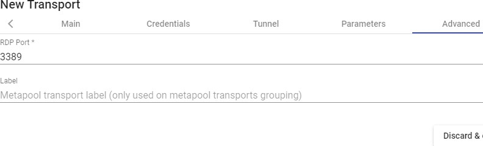

#### SPICE (tunneled)

An "***SPICE (tunneled)***" ransport allows access to Windows/Linux virtual desktops by users located on a WAN using the SPICE protocol. Connection clients must have the SPICE client (Virt-Manager) installed.

The SPICE transport can only be used with a service provider such as oVirt/Red Hat Enterprise Virtualization (RHV) and OpenNebula.

This transport uses the UDS Tunnel server to make the connection to the virtual applications. It must be previously configured for its correct operation.


In a "***SPICE (tunneled)***" transport the minimum parameters to configure are:

- Main:

**Name:** Name of the transport.

**Priority:** Priority that the transport will have. The lower that priority, the higher it will appear in the list of available transports for a service. The transport with the lowest priority will be the one used by default when clicking on the image of a service.

**Certificate:** Certificate generated in ovirt-engine / RHV-manager or OpenNebula

necessary to connect with virtual desktops (usually hosted at **/etc/pki/ovirt-engine/certs/ca.cer** ).

**Networks Access:** Allows or disables user access to a service based on the network from which he is accessing, and the network indicated in the "***Networks***" field.

**Networks:** Network ranges, subnets or IP addresses indicated in the "***Networks***" of the "***Connectivity***" field. It is used together with the "**Network Access**" field to allow or disable user access to a service based on their network location.

**Allowed Devices:** Enables access to the service only with selected devices. If none are selected, no filtering is performed.

**Service Pools:** Allows to assign this transport directly to one or more "**Service Pools**" previously created.


- Tunnel:

**Tunnel Server:** IP address or name with the connection port of the UDS Tunnel server. If access to the desktop is done from a WAN, the public IP address or name of the UDS Tunnel server must be entered. Format:

*IP_Tunnel*:443

**Tunnel wait time:** Validity time of the UDS Tunnel server ticket for the connection.

**Force SSL certificate verification:** Enables certificate verification. The UDS Tunnel server must have a valid certificate installed.


- Advanced:

**Fullscreen Mode:** Enables the full screen when connecting to the virtual desktop.

**Smartcard Redirect:** Enables the redirection of smartcards on the virtual desktop.

**Enable USB:** Allows the redirection of devices connected to a USB port.

**New USB Auto Sharing:** Allows the redirection of PnP devices connected to a USB port.

**Label:** It allows to group transports to be shown, through the name of a label, in a meta pool. By using these tags, we can indicate that a metapool has several transports.


#### X2Go (tunneled)

An "***X2Go (tunneled)***" transport allows access to Linux virtual desktops by users using the X2Go software.

Both connection clients (client) and virtual desktops (server) must have X2Go installed and enabled.

This transport uses the UDS Tunnel server to make the connection against the virtual desktops. It must be previously configured for its correct operation.


In an "***X2Go (tunneled)***" transport the minimum parameters to configure are:

- Main:

**Name:** Name of the transport.

**Priority:** Priority that the transport will have. The lower that priority, the higher it will appear in the list of available transports for a service. The transport with the lowest priority will be the one used by default when clicking on the image of a service.

**Networks Access:** Allows or disables user access to a service based on the network from which it is being accessed and the network indicated in the "***Networks***" field.

**Networks:** Network ranges, subnets or IP addresses indicated in the "***Networks***" of the "***Connectivity***" field. It is used together with the "***Network Access***" field to allow or disable user access to a service based on their network location.

**Allowed Devices:** Enables access to the service only with selected devices. If none is selected, no filtering is performed.

**Service Pools:** Allows to assign this transport directly to one or more "***Service Pools***" created previously.


- Tunnel:

**Tunnel Server:** P address name with the connection port of the UDS Tunnel server. If access to the desktop is from a WAN, the public IP address or name of the UDS Tunnel server must be entered. Format:

*IP_Tunnel*:443

**Tunnel wait time:** Validity time of the UDS Tunnel server ticket for the connection.

**Force SSL certificate verification:** Enables certificate verification. The UDS Tunnel server must have a valid certificate installed.


- Credentials:

**Username:** User name that will be used to log into the virtual desktop.


- Parameters:

**Desktop:** Selection of the desktop manager (xfce, Mate, Gnome, etc...) or virtualization of Linux applications (UDS vAPP).

**vAPP:** Execution path of the application to be virtualized (only applicable if the parameter "Desktop" is selected "UDS vAPP").

**Enable sound:** Enables sound.

**Redirect home folder:** Redirects the user\'s /home.

**Speed:** Optimization of the connection.


- Advanced:

**Sound:** Selection of the type of audio server.

**Keyboard:** Keyboard language.

**Pack:** Method used to compress images

**Quality:** Image quality (0-9)

**Label:** It allows to group transports to be shown, through the name of a label, in a meta pool. By using these tags, we can indicate that a metapool has several transports.


### Networks

UDS allows you to register different networks to view or hide the access of connection clients to virtual desktops or applications (when accessing the UDS login portal, the IP address of the connection client is detected). These networks will be the ones that together with the \"***Transport***\" will define what type of access users will have to their virtual desktops or applications generated by UDS.

To add a network, go to the\"***Connectivity***\" section and select "***Networks***".


Indicate a descriptive name and a network range, complete subnet or IP address. The following formats are supported:

- Unique IP address: xxx.xxx.xxx.xxx (For example: 192.168.11.33).

- Entire subnet: xxx.xxx.xxx.xxx/x (For example: 192.168.11.0/24).

- IP address range: xxx.xxx.xxx.xxx-xxx.xxx.xxx.xxx (For example: 192.168.11.1- 192.168.11.155).


The defined networks will appear available in the transports. You can configure whether a connection client that is in that network displays the transport or not:


If a user has administration rights, he will see the IP address that UDS detects in the connection client in the user\'s services dashboard.


If no networks are defined on a transport, the system will not limit access to desktop services and virtual applications from any location


### Service Pools

The creation of a "***Service Pool***" will allow the deployment of desktop services or virtual applications, which will be available for access by different groups of users.

The necessary elements to create a "**Service Pools**" are a "**Base Service**" (composed of a "**Service Providers**" + a service created in it) and an "**OS Manager**". Once created, you will have to assign one or several user groups and one or more transports to enable user access.

To create a\"***Service Pool***\" go to the\"***Pools***\" section and select\"***Service Pool***\".


To configure a\"***Service Pool***\" it will be necessary to indicate:

- Main:

**Name:** Name of the "***Service Pool***" (this name will be the one shown to a user to access his desktop or virtual application).

In this section you can add variables to display information about the services:

- **{use}**: Indicates the percentage of pool use (calculated based on the maximum services to be provided and the services assigned).

- **{total}**: Total number of machines (data extracted from the maximum services to be provided from the service pool).

- **{usec}**: Number of machines being used by users in the pool.

- **{left}**: Number of machines available in the pool for user connection.

**Short name:** If indicated; it will be the name of the service that will be shown to the user. When hovering over it, the content of the "***Name***" field will appear.

**Base Service:** Base service to be used (virtual desktop or application). It is made up of a service provider and a base service previously configured in the "***Services***".

**OS Manager:** \"***OS Manager***\" previously created whose configuration will be applied to each of the generated virtual desktops. In the case of publishing a vAPP service, it will also be required. But if you use a "***Static IP***", type service, this field will not be used.

**Publish on creation:** If enabled, when we save the service pool, the system will automatically launch the first publication. If it is set to "***No***", it will be necessary to launch the publication of the service manually (from the "***Publications***" tab).


- Display:

**Visible:** If disabled, the\"**Service Pool**\" will not be shown as available to users on the UDS services page ("***User mode***").

**Associated Image**: Image associated to the service. It has to be previously added to the image repository, accessible from the "***Tools***" -- "***Gallery***" section.

**Pool group**: Allows to group different services. To assign a "***Pool group***", it must be previously created in the "***Pools***" -- "***Groups***" section.

**Calendar Access denied text**: Text that will be displayed when a service has access denied by the application of an access calendar.


- Advanced:

**Allow removal by users:** If enabled, users can remove the services assigned to them. If the service is a virtual desktop auto-generated by UDS, it will be deleted and a new one will be assigned to it on the next connection. If it is another type of service (vAPP / Static IP), the assignment will only be removed and a new one will be assigned on the next connection.

**Allow reset by users:** If it is activated, the user will be able to restart or reset the services assigned to him (only applies to virtual desktops auto-generated by UDS).

**Ignores unused:** If enabled, non-persistent user services that are not in use will not be removed.

**Show transports:** With this option activated, all the transports assigned to the service will be displayed. If it is not activated, only the default transport with the highest priority (The lowest number in the "***priority***" field of transport) will be displayed.

**Accounting:** Assigning a service to a previously created "***Accounts***" ("***Pools***" -- "***Accounts***")


- Availability:

**Initial available services:** The minimum number of virtual desktops created, configured and assigned/available for the service.

**Services to keep in cache:** Number of virtual desktops available. These will always be configured and ready to be assigned to a user (they will be automatically generated

until the maximum number of machines indicated in the\"***Maximum number of services to provide***\" field is reached).

**Services to keep in L2 cache:** Number of virtual desktops in sleep or shutdown state. These desktops will be configured and ready for allocation when the system demands new cached desktops.

The virtual desktops generated at the L2 cache level will be cached as soon as the system demands them. They will never be directly assigned to users.

**Maximum number of services to provide:** Maximum number of virtual desktops created by the system in the\"***Service Pool***\" (desktops generated in L2 cache will not be counted).


Save the "***Service Pool***" and the system will start to generate virtual desktops based on the configured cache (Availability tab).

Using the \"***Delete***\" button you can completely delete a\"***Service Pool***\" and with \"***Edit***\" you can modify it.


If you access the "***Service Pool***" created, in the "***publications***" section (if you have checked the \"***Publish on creation***\"), he system will start with the publication of

the service generating the base machine on which the virtual desktops will be based.


Once you have created a\"***Service Pool***\", if you access it, you will find the following control and configuration menus:

- **Assigned Services:** Virtual desktops that have been assigned to users. Displays information about the desktop creation date, the revision (or publication) number on which the desktop is generated, the MAC address of the VM\'s network card, the DNS and IP name of the virtual desktop, the status of the desktop, if it is in use, the name and IP of the connection client, the owner of the machine and the version of the UDS Actor installed on the template machine.


Selecting the virtual desktop and clicking on "***Change owner***", you can change the user assigned to the desktop


By clicking on \"***Delete***\" you can delete it manually and on "***Logs***" you will see all the information reported by the "***Actor UDS***" installed on the desktop.

- **Cache**: Virtual desktops available for user connection, (including L2 cache machines). These desktops will go through different states:

 - **In Preparation**: In this state, the virtual desktops are being created on the virtualization platform.

 - **Waiting OS:** In this state, the virtual desktops are being configured with the parameters indicated in the "***OS Manager***" (name change, inclusion in the domain, etc \...)

 - **Valid:** When a virtual desktop is in this state, it will mean that it is available for user access.


- Groups: To allow users to connect, it is necessary to assign access groups or metagroups. These groups or metagroups must be created in the "Authenticators" section and you can assign one or more access groups or metagroups to each "Service Pool".


Select the "**Authenticator**" and based on your choice, choose the "**Group Name**".


- Transports: The "Transports" to make the connection with the virtual desktop

(Previously added in the "**Transports**" section) will be indicated. The \"**Transports**\" with the lowest priority will be the ones configured by default by the system. To use the rest of the transports, the user will have to open the drop-down menu on the virtual desktop access screen and select the one that corresponds.


Select the \"**Transport**\" that you want to use in this \"**Service** Pool\" and save.


- **Publications:** From this menu, you can make a new publication of the service (for example, if you have updated your base machine with new applications or OS patches and you want all your virtual desktops to take these changes). Once the publishing process is finished, the entire system cache will be regenerated with the new desktops based on this latest publication.


If you make a new publication, a new base machine will be generated and, once available, the system will proceed to eliminate the virtual desktops of the previous version and generate new ones based on the new publication


### Meta Pools

The creation of a "**Meta Pool**" will allow access to desktop services or vApps made up of different "**Services Pools**". These Pools will work together providing different services in a completely transparent way for users.

The "**Service Pools**" that form a "**Meta Pool**" will work under a policy that will allow the provision of services according to the needs of the Pool. Currently, the supported policies will be defined by priorities, platform capacity and use.

To create a "**Meta Pool**", go to the "**Pools**" section and select "**Meta Pools**".


To configure a "***Meta Pool***" it will be necessary to indicate:

- Main:

**Name:** Name of the "**Meta Pool**" (this name will be the one that is shown to a user to access his service: virtual desktop or application)

**Short name:** If indicated, it will be the name of the service that will be shown to the user. When hovering over it, the content of the "**Name**" field will appear".

**Policy**: Policy that will be applied when generating services in the "**Services Pools**" that are part of the "**Meta Pool**".

- **Evenly distributed**: The services will be created and consumed equally in all the "**Services Pool**" that make up the "**Meta Pool**".

- **Priority**: The services with the highest priority will be created and consumed from the "**Service Pool**" (the priority is defined by the "**priority**" field. The lower the value of this field, the more priority the element will have). When the "**Service Pool**" reaches the maximum number of services, the services of the next one will be consumed.

- **Greater % available**: The services will be created and consumed from the "**Service Pool**" that has the highest percentage of free use.


- Display:

**Associated Image**: Image associated to the "**Meta Pool**". It has to be previously added to the image repository and accessible from the "**Tools**" -- "**Gallery**" section.

.

**Pool group**: Enables the ability to group different "**Meta Pools**" in order to assign a "**Pool group**". It must be previously created in the "**Pools**" -- "Groups" section.

**Visible:** If disabled, the "**Meta Pool**" will not be shown as available to users on the UDS services page ("**User mode**").

**Calendar Access denied text**: Text that will be displayed when the "**Meta Pool**" has access denied by the application of an access calendar

**Transport Selection:** It will indicate how the transports will be assigned to the "***meta pool***":

- **Automatic selection**: The transport available and with the lowest priority assigned to the \"**Service Pool**\" will be available in the \"**meta pool**\". Transport selection is not allowed.

- **Use only common transports**: Those existing transports that are shared by all the \"**Service Pool**\" will be available in the \"**meta pool**\".

- **Group Transports by label**: Those transports that have different and grouped \"l**abels**\" will be available in the \"**meta pool**\" (this field is inside each \"**Transport**\" in the \"**advanced**\" tab).


Save the configuration and you will have a valid "**Meta Pool**" to start registering "**Services Pools**".


To modify any parameter in an existing "**Meta Pool**", select it and click on "**Edit**".

Once created, you must add "**Services Pools**". To do this, double click on the created "**Meta Pool**" or select "**Detai**l" in the provider menu:


Click on "**New**" to add all the "**Services Pools**" that the "**Meta Pool**" will contain. You can add as many as you need, combining services hosted on different virtualization platforms (VMware, KVM, Azure, etc...), application servers and static devices.


To add a "**Service Pool**" you must indicate the following parameters:

**Priority:** Priority that the "**Service Pool**" will have in the "**Meta Pool**". The lower the value, the more priority it has with respect to the rest of the elements.

**Service pool:** Name of the "**Service Pool**" that you want to add. It must be previously created

**Enabled:** Enables or disables the visibility of the "**Meta Pool**"

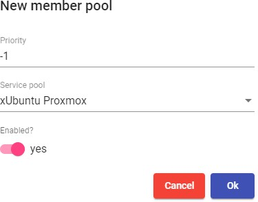

You can add as many as you need, combining services hosted on different virtualization platforms (VMware, KVM, Azure, etc...), application servers and static devices.


Like in a "**Service Pool**", here you will also have the following information and configuration tabs:

- **Assigned services:** Shows the services assigned to users, allowing their manual removal and reassignment to another user.

- **Groups:** Indicates which user groups of the different authenticators registered in the system will have access to the service.

- **Access calendars:** Allows to apply a previously created access calendar.

- **Logs:** Shows all the issues that occurred in the "***Meta Pool***".

### Groups

UDS allows you to group services to facilitate their access and location. Additionally, each service grouping can be assigned a name and an image. If "**Groups**" are not defined, the services will be located in the default site, which is created by the system

To create "**Groups**", go to the "Pools" section and select "**Groups**":


Select **"New**" and indicate a descriptive name. Assign the priority of the pool group (the lower the value, the more priority it will have, concerning the rest of the elements.) and associate an image:


Once created, it will be available for assignment to a "***Service Pool***".


### Access Calendars and scheduled tasks

OpenUDS incorporates a system to allow or deny access through calendars. They allow enabling or restricting user access to desktop services and virtual applications by dates and time slots.

With the use of calendars, it is also possible to schedule and automate certain tasks on a "**Service Pool**", such as making new publications, adjusting the system cache values, adding or removing groups and transports or changing the maximum number of services.

#### Calendars

To create "**Calendars**", go to the "Pools" section and select "**Calendars**".


Indicate a descriptive name to identify the calendar.


Save and you will already have a valid calendar to start creating the rules that you will later apply to a service through the "**Services Pool**".


In a \"Calendar\", you can register various types of rules to schedule the availability of services at certain times.

To create a rule, access the calendar and click on "***New***".


The minimum parameters to configure in a \"**Rule**\" are:

**Name:** Name of the rule.

**Event:** Configuration of the execution periods. For this end, indicate the start time and the duration of the event (in minutes, hours, days and months.

**Repetition:** In this section, you can configure that the rule is repeated in days, weeks, months, years, and even allows to specify working days. Finally, you can indicate repetition intervals per day.

**Summary:** Shows a summary of all the configuration previously made.

Upon saving you will have a valid rule to be assigned to a "**Service Pool**" (virtual desktop and/or application).


##### Enable or deny user access

Once the rules in the calendars are configured, you can use them to enable or deny user access to desktop services and virtual applications.

To apply these calendars with their rules, select a "**Service Pool**", go to the "**Access Calendars**" tab and click on "**New**":


Indicate the priority of access, select an existing calendar and check the action to be applied when accessing the service


Upon saving you will have a "**Service Pool**" with a configured access calendar.


###### NOTE: {#note-39 .unnumbered}

La You will have to adjust the default rule "FallBack" based on the needs of the service to allow or deny access to the service when the calendar does not apply.

##### Scheduled Actions:

Once the rules in the calendars have been configured, you can use them to schedule certain tasks on a "**Service Pool**".

To apply these calendars with their rules, select a "**Service Pool**", go to the "**Scheduled actions**" tab and click on "**New**".


Indicate an existing calendar, the time during which the action will be executed and select the action to be carried out:

**Set initial services:** Resets the minimum virtual desktops created and configured.

**Set cache size:** Resets the virtual desktops available in the system cache. These desktops will be configured and ready for assignment to a user.

**Set máximum number of services:** Modifies the maximum number of virtual desktops in the "***Service Pool***".

**Publish:** Creation of a new publication in a "***Service Pool***".

**Add a transport:** Adds an existing transport in a "***Service Pool***".

**Remove a transport:** Removes transport from a "***Service Pool***".

**Add a group:** Adds existing group in a "***Service Pool***".

**Remove a group:** Removes group from a "***Service Pool***".

**Sets the ignore unused:** Sets the "***Ignores unused***" option.

**Remove ALL assigned user service:** Removes all the services assigned to users in a "***Service Pool***".

We save and we will have a scheduled task that performs a specific action on a \"**Service Pool**\".


### Configure Permisions

Within the OpenUDS administration, it is possible to assign access and management permissions to the different elements, to users and groups of users. The

permissions will be assigned directly on each element and will also apply to its subelements.

To allow a user to access the administration and apply for these permissions, the usermust have the "**Staff member**" option enabled:


To enable permissions in the different elements of the administration, select the element and click on "**Permissions**". For example, in a "**Service Provider**".


In the permissions window, click on "**New permission**..." for groups and users and select the authenticator and group/user to which the permission will be applied.


You will have to specify if this user or group will have reading access to the element ("**Read Only**") or full control ("**Full Access**").

Once applied, users who have the "**Staff member**" option enabled will be able to access this element of the administration with the permissions that have been assigned

To remove the permissions to a group or user, click on the "***X***".

Permissions of type "***Full Access***" ("***Manage***") may only be applied to elements that have a second leve ("***Services***", "***Calendars***", "***Service Pools***", etc...).

## ACCESING VIRTUAL DESKTOPS WITH OpenUDS

Once you have available one or more "**Service Pools**" with published services on valid status, you can make a connection to a virtual desktop. You will access via a web browser the address or name of the UDS Server. Enter a valid user name and password and select the authenticator in the case of having more than one available.

In the available services screen, you will see the services to which the user with whom you have logged into the UDS system has access. Click on the one you want to start the connection with.

By default, if you click on the service image directly, you will make the connection with the \"**Transport**\" that has the lowest priority. If you have configured several ones, a drop-down menu will appear where you can select the \"**Transport**\" with which you will connect to the virtual desktop.

If necessary, or in case of having several types of services (applications, Linux desktops or Windows desktops), you can group the services to facilitate access to users:

To start the connection with the virtual machine, it is necessary to have the "UDS Client" installed on the connection client machine. It is necessary to start the connection with all transports except HTML5

To connect to the virtual desktop or application, it is necessary to have the clients of each protocol installed (RDP, NX, RGS, SPICE, etc...).

HTML5 connection example:


### Tools

OpenUDS provides a series of tools that give the system greater flexibility, providing customization, usage reports, advanced parameters, etc\...

### Gallery

UDS has a repository of images that can be associated with a "Service Pool" or "Pool Group" to facilitate the identification of the virtual desktop. Accepted formats are PNG, JPEG and GIF. If the image size is larger than 128x128, it will be resized.

To access the UDS image gallery, access the "**Tools**" section and select "**Gallery**":

Select "**New**" to add a new image to the repository. It will be necessary to indicate a name and, using the "**Select image**" button, you will look for the image you want to upload.

Once the image is stored, it will be available for assignment to a "**Service Pool**" or "**Pool Group**"

### Reports

UDS allows the automatic generation of reports on different elements of the platform To access the reports, enter the "Tools" section and select "**Reports**":


It is possible to generate different reports in UDS. Notable among them are:

- **Users list:** Generates a report with all the users that belong to an authenticator. Select the authenticator and click on "**Save**".

Once generated, you will have a list of all the users belonging to that authenticator:

- **Users access report by date:** Generates a report with all user accesses to the system in a specific date range. You can indicate a range of dates and number of intervals:

- **Pools performance by date:** Generates a report on the use of a services pool in a specific date range. You can indicate the pool on which you want to generate the report, date range and number of intervals

### Configuration

OpenUDS provides a series of parameters that will define the operation of the system. These parameters will be responsible for defining aspects such as security, operating mode, connectivity, etc\... both of the UDS system itself and of its communication with the virtual platforms registered in UDS.

In this manual, only some of the system variables are shown, which are considered the most useful for the management of virtual desktops.

In the rest of the variables, it is recommended not to modify the default values, since some of them indicate to the system how it should work (number of simultaneous tasks, task execution time, scheduled checks, etc \...) and an incorrect modification of a parameter may cause the system to stop completely or not work properly.

###### NOTE: {#note-40 .unnumbered}

Once the values of any of the UDS advanced configuration variables have been modified, it will be necessary to restart the UDS Server to apply the changes

If you want to modify any value that is not documented in this section, it is recommended to contact the OpenUDS support team to verify said change and confirm that it does not negatively affect the operation of the UDS system

To access the parameters of the advanced configuration of UDS, access the "**Tools**" section and select "**Configuration**":

#### UDS

**UDS ID:** Identification of the OpenUDS installation

**AutorunService =** Performs direct access to the user\'s service if the user only has a single service assigned.

By activating this parameter, users who are assigned a single service will make a direct connection to it, hiding the service selection screen and using the "**Transport**" configured first.

Default: no.

**DisallowGlobalLogin =** If enabled, does not display the global list of authenticators.

If enabled, users will be validated on the authenticator \"by default\" or with higher priority. To validate with other authenticators and allow user access to the system, it will be necessary to use the \"label\" in the access URL (defined in the authenticator).

Default: no.

**KeepInfoTime =** Defines the time that the completed events of a "Service Pool" remain visible. Expressed in seconds

Default: 14401 seconds (4 hours)

**RedirectToHttps =** Automatically redirects access to OpenUDS from http to https. Default: no

**SessionExpireTime** = Indicates the maximum time that a user session will be open after having made a new publication. After that time, the system will close the user session and proceed to remove the service. If the service has an OS Manager with "**Keep service assigned even on new publication** "as the persistence policy on the virtual desktop, this won't apply.

Default: 24 hours.

**StatsDuration =** Time that the system will store the statistics. Default: 365 days.

#### Security

Parameters related to the security of the UDS system are described:

**AllowRootWebAccess =** Allows the superuser to login (user created in the UDS-Server configuration wizard) in the UDS login portal.

Modifying this variable will not affect the access of the root user through the Linux OS console

Default: yes.

**Behind a proxy =** Indicates to the system that the UDS servers are "**behind**" a proxy (For example, a UDS environment in high availability with a load balancer type HA Proxy).

Default: no.

**Block ip on login failure**: Enables that in addition to blocking a user who has failed several times in the login portal, the IP address of his connection client is also blocked.

Default: no.

**LoginBlockTime:** Time that a user will be blocked (in seconds) after entering his password incorrectly the times indicated in the variable "**maxLoginTries**".

Default: 300 seconds (5 minutes).

**Master Key:** Security code for the UDS Actor (only applies to versions prior to UDS 3.0)

**MaxLoginTries:** Number of attempts a user will have to enter his password before the system locks it.

**RootPass =** Password of the superuser created in the UDS-Server configuration wizard.

**SuperUser =** Name of the superuser created in the UDS-Server configuration wizard.

**Session timeout for Admin =** Time in seconds until an administration that does not perform any action is logged out.

**Session timeout for User =** Time in seconds until a user who performs no action is logged out.

**Trusted Hosts =** Hosts that UDS considers safe. These hosts can make "**sensitive**" requests to UDS, such as tunnels.

It allows completes subnets, range of ips and specific public ips By default: \"\*\" (all allowed), admits address range values.

#### Admin

**Enable VNC for user services =** If enabled, a new option will appear in the assigned services of a "**Service Pool**" to allow connection via VNC.

Clicking on \"**VNC**\" will generate a file with all the information to connect to the service through a VNC client (the client must be previously installed and there must also be direct network connectivity with the service)

Default: no

**List page size =** Number of items to display. Applies to all sections of the administration. Default: 10

**Trusted Hosts for Admin:** Filter from which IP addresses it is possible to manage UDS (includes from web access to administration with the API) separated by comas.

It allows completes subnets, range of ips and specific public ips.


#### Custom

Parameters related to the graphical customization of UDS (login and user services portal) are described:

**CSS =** Supports code to modify UDS default style pages

**Logo name =** Text that is displayed next to the upper left image of the user menu bar.

**Min. Services to show filter =** Minimum number of services that must exist in a user\'s services window (user mode) for the filter option to be displayedr.

**Show Filter on Top =** Allows you to modify the location of the service search bar on the user services page (user mode).

**Site copyright info =** Text that will appear in the lower right part of the login and user services page.

**Site copyright link =** Web address in the text of the section "***Site copyright info***".

**Site information =** HTML code for partial customization of UDS login page. The code entered will appear below the user login box in the UDS login portal

**Site name =** Texto que aparecerá en la parte superior del cuadro de login de los usuarios en el portal de login de UDS.

#### PCoIP

Parameters related to the Teradici PCoIP "**Transport**" are described:

**DownloadUrl =** PCoIP client software download address.

#### SAML

Parameters related to the operation of the SAML authenticator are described:

**Global logout on exit =** Indicates the "**logout**" mode.

If enabled, when UDS is logged out, SAML is also performed. Default: no.

**IDP Metadata Cache =** Time the IDP\'s cached metadata is kept. Default: 86400 seconds (24 hours).

**Organization Display Name =** Organization name displayed.

**Organization Name =** Name of the organization.

**Organization URL =** Web address of the organization.

#### WYSE

Parameters related to connecting with Wyse clients are described:

**Autoconnect =** Allows auto-connection of the device. Default: no.

**Colors =** Defines the quality of the colors offered during the connection. Default: High.

**DefaultUser =** Default user redirected to device. Default: UDS.

**Language =** Device language. Default: us.

**Privilege =** Privilege level of a user. Default: NONE.

For more details on these parameters see the official Wyse documentation or also this reference guide:

[[http://www.freewysemonkeys.com/downloads/wtos/Wyse%20Thin%20OS%2064%20Parameters.p]{.underline}](http://www.freewysemonkeys.com/downloads/wtos/Wyse%20Thin%20OS%2064%20Parameters.pdf) [[df]{.underline}](http://www.freewysemonkeys.com/downloads/wtos/Wyse%20Thin%20OS%2064%20Parameters.pdf)

#### ENTERPRISE

Parameters related to the OpenUDS subscription are described (only visible in environments migrated from previous versions):

**Serial Number =** Subscription activation code.

### Flush Cache

To empty the cache of the UDS system, access the "**Tools**" section and select "**Flush cache**":

The most common reasons for clearing the system cache are:

- **Blocking user:** When a user enters his password incorrectly the times indicated in the variable "**maxloginTries**" (security section in the UDS

configuration), the system blocks said user. To unblock him immediately, it will be necessary to empty the system cache.

- **Inventory update:** It is possible that when a \"**Service**\" is edited, some elements such as datastores, networks, base machines, etc\... recently added, are not available (since these have been cached to avoid unnecessary requests). To view them, you will have to empty the system cache. In this way, the broker will make the request to the hypervisor again and the data will be updated.

\-**END OF DOCUMENT**-
