# OpenUDS 3.6 Установка, администрирование и руководство пользователя

## ВВЕДЕНИЕ

OpenUDS — это брокер VDI-соединений, который управляет доступом пользователей к различным сервисам: виртуальным рабочим столам, сеансам виртуальных приложений, сеансам удаленных компьютеров и т. д.

OpenUDS предлагает набор программных элементов, составляющих платформу для управления. Жизненный цикл, администрирование и развертывание служб настольных компьютеров

В этом документе содержатся основные инструкции по установке программных элементов UDS Enterprise в виртуальной инфраструктуре, а также процедуры надлежащего администрирования и управления различными развернутыми службами


### Характеристика

Среди основных характеристик OpenUDS стоит выделить:

- Очень простое развертывание, установка и администрирование

- Автоматизированное развертывание виртуальных рабочих столов и управление доступом к сеансам удаленного рабочего стола

- Виртуализация сеансов приложений Windows для пользователей сред Windows/Linux с помощью служб удаленных рабочих столов (RDS)

- Виртуализация сессий приложений Linux для пользователей сред Windows/Linux с использованием X2Go

- Мультигипервизор, возможность переноса платформы на более эффективные решения (в настоящее время совместим с VMware vSphere, KVM RHV/oVirt, Microsoft Hyper-V, Citrix XenServer, vCloud, Microsoft Azure, AWS Amazon, OpenGnsys, OpenNebula, OpenStack, Proxmox и Nutanix Acropolis)

- Мультиаутентификатор. Он позволяет определять пользователей и группы пользователей из различных внешних источников и с практически неограниченными конфигурациями

- Система аутентификации с использованием нескольких коннекторов, например: Active Directory, eDirectory, Azure AD, OpenLDAP, SAML, LDAP, CAS, Внутренняя система аутентификации, Система аутентификации устройств, IP...

- Формирование отчетов о состоянии и использовании платформы

- Система планирования задач (развертывание сервисов, контроль доступа пользователей и т.д.) через календари

- Безопасный доступ к глобальной сети для настольных компьютеров и виртуальных приложений с помощью SSL-туннеля, включенного в подписку

- Полная настройка портала входа и страниц пользовательских сервисов

- Дорожная карта продукта, основанная на запросах клиентов и сообщества.

- Модель стоимости подписки, которая дает право на поддержку, новые версии OpenUDS, обновления и исправления

- Модель подписки не распространяется по количеству пользователей до неограниченного количества пользователей

### Архитектура платформы с OpenUDS

Оптимальное проектирование платформы служб настольных компьютеров является важнейшей частью достижения всех преимуществ, которые может предоставить архитектура. Каждый уровень, составляющий эту архитектуру, должен быть спроектирован таким образом, чтобы он выполнял свою функцию, не нанося ущерба остальным.

Основными элементами, составляющими архитектуру с OpenUDS, являются:

* **Клиенты подключения:** Это устройства для доступа к виртуальным рабочим столам и приложениям, такие как тонкие клиенты, нулевые клиенты, ПК и т. д. Важно определить, будет ли доступ к рабочим столам осуществляться из локальной сети или из глобальной сети
* **UDS-серверы:** Они состоят из базы данных для хранения всех данных, связанных со средой, брокера подключений, который будет управлять жизненным циклом служб рабочего стола и связью с гипервизорами и другими поставщиками услуг; и туннельный сервер для обеспечения безопасного доступа извне. Все эти элементы обслуживаются в формате виртуального устройства
* **Аутентификатор(ы):** Серверы Active Directory, OpenLDAP, eDirectory и т.д. Благодаря интеграции с OpenUDS они будут контролировать доступ пользователей к службам рабочего стола. В зависимости от среды у вас может быть от одного до неограниченного количества аутентификаторов

Поставщики услуг #######

* **Платформа гипервизора:** : Отвечает за выполнение задач по созданию, включению и устранению виртуальных рабочих столов, управляемых брокером. OpenUDS интегрируется с гипервизорами Microsoft Hyper-V, VMware vSphere, KVM (oVirt, RHV, Proxmox, OpenStack и OpenNebula), Citrix XenServer и Nutanix Acropolis
* **Приложения RDS:** Отвечает за предоставление сеансов приложений Windows, которые будут управляться OpenUDS
* **Хранилище:** На них будут размещены серверы, виртуальные и удаленные рабочие столы, приложения и/или другие сервисы платформы. Выбор типа хранилища является важной частью конструкции. В зависимости от потребностей, предъявляемых пользователями к службам настольных компьютеров, необходимо выбрать наиболее подходящий тип с точки зрения производительности

Когда у вас есть четкое представление о дизайне архитектуры, можно приступать к масштабированию платформы, учитывая количество пользователей, которые будут к ней обращаться.

На следующем рисунке показан пример архитектуры VDI с OpenUDS:


#### Архитектура сети

OpenUDS может быть сконфигурирован таким образом, чтобы он был доступен пользователям, находящимся в локальной сети, или пользователям из глобальной сети (Интернета) без необходимости использования VPN или LAN_extension.

Пример развертывания служб рабочего стола и виртуальных приложений для доступа пользователей через локальную сеть (выпадающий список для пользователей, которые получают доступ через VPN или LAN_extension):


Пример развертывания служб рабочего стола и виртуальных приложений для доступа пользователей через глобальную сеть (интернет).

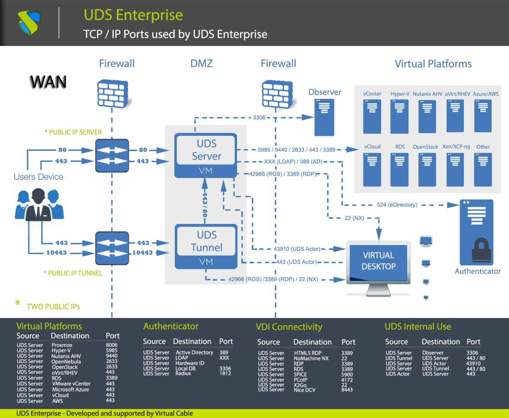

Для публикации UDS в Интернете и для того, чтобы его сервисы были доступны пользователям, потребуется два публичных IP-адреса, один для UDS-сервера и один для UDS-туннеля (этот процесс можно осуществить с одним публичным IP-адресом, изменив порты по умолчанию и настроив внутренний NAT).

####### Безопасная процедура развертывания: {#safe-employment-procedure .unnumbered}

Рекомендуется открывать только те порты, которые строго необходимы для корректного функционирования OpenUDS при коммуникации между его компонентами.

Рекомендуется устанавливать UDS Server и UDS Tunnel в DMZ, а UDS DbServer должен находиться в серверной зоне. Все эти зоны должны быть разграничены брандмауэрами.

В случае доступа к UDS-серверу из глобальной сети рекомендуется использовать порт 443 для принудительного использования HTTPS на веб-портале UDS.

Использование HTTPS требует использования действительных веб-сертификатов, ответственность за предоставление и установку указанных сертификатов лежит на клиенте.

Пример с 1 уникальным публичным IP-адресом:

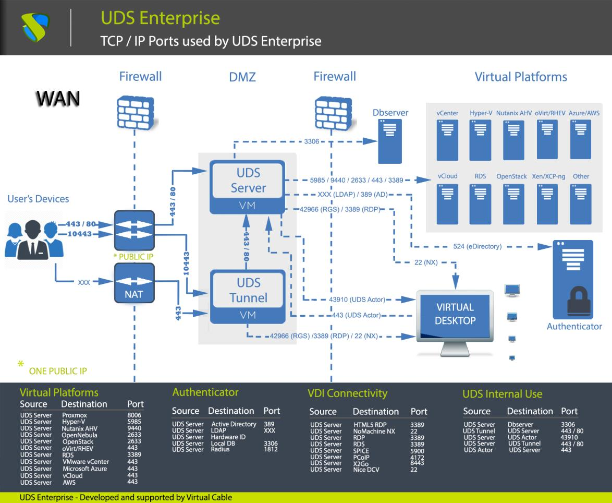

####### Безопасная процедура развертывания: {#safe-employment-procedure-1 .unnumbered}

Рекомендуется открывать только те порты, которые строго необходимы для корректного функционирования OpenUDS при коммуникации между его компонентами.

Рекомендуется устанавливать UDS Server и UDS Tunnel в DMZ, а UDS DbServer должен находиться в серверной зоне. Все эти зоны должны быть разграничены брандмауэрами.

В случае доступа к UDS-серверу из глобальной сети рекомендуется использовать порт 443 для принудительного использования HTTPS на веб-портале UDS.

Использование HTTPS требует использования действительных веб-сертификатов, ответственность за предоставление и установку указанных сертификатов лежит на клиенте.

### Компоненты OpenUDS

OpenUDS состоит из 5 элементов, которые взаимодействуют друг с другом.

* **UDS-сервер:** Он устанавливается как виртуальная машина (ВМ) и предоставляется в формате виртуального устройства
* **Туннель UDS:** Он устанавливается как виртуальная машина и предоставляется в формате виртуального устройства
* **UDS Dbserver:** Он устанавливается как виртуальная машина и предоставляется в формате виртуального устройства (необязательно для UDS Free & Evaluation Edition)
* **UDS Actor:** Он устанавливается как служба на виртуальной машине, которая будет использоваться в качестве шаблона для развертывания групп рабочих столов и на серверах приложений RDS для предоставления виртуализированных приложений
* **UDS Client:** Устанавливается на клиентский компьютер для подключения к службам рабочего стола (при типе подключения HTML5 это не обязательно)


Особенности и технические требования каждого из них определены ниже:

#### UDS-сервер

Это программное обеспечение, которое является посредником между клиентами и поставщиками услуг. Это неотъемлемая часть UDS, она выполняет функции брокера подключения к службам рабочего стола, позволяя администрировать и управлять платформами, определенными как реализованные сервисы.

####### Виртуальное устройство со следующими функциями: {#virtual-appliance-with-the-following-features .unnumbered}

* Виртуальный жесткий диск: 8 ГБ
* Оперативная память: 2 ГБ
* Процессор: 2 vCPU
* Сеть: 1 vNIC

####### Требования: {#requirements .unnumbered}

* 1 IP-адрес
* IP DNS
* Маска сети
* IP-шлюз
* Доменное имя
* IP-адрес базы данных
* Порт DATABASE и имя экземпляра
* Пользователь и пароль пользователя DATABASE
* Код активации (Enterprise, Free o Evaluation)

**Процедура безопасного использования:** Пароли должны быть достаточной длины и включать прописные, строчные буквы, цифры и специальные символы.

#### Туннель UDS

Это программное обеспечение отвечает за создание безопасных подключений к службам рабочего стола через глобальную сеть и предоставление доступа HTML5 к виртуальным рабочим столам.

Туннель UDS позволяет подключаться с любого устройства/браузера/клиента к службам рабочего стола через SSH-туннель без предварительной установки какого-либо программного обеспечения.

Кроме того, он обеспечивает RDP-доступ к службам рабочего стола через HTML5.

####### Виртуальное устройство со следующими функциями: {#virtual-appliance-with-the-following-features-1 .unnumbered}

* Жесткий диск: 14 ГБ
* Оперативная память: 2 ГБ
* Процессор: 2 vCPU
* Сеть: 1 vNIC

####### Требования: {#requirements-1 .unnumbered}

* 1 IP-направление
* IP DNS
* Маска сети
* IP-шлюз
* Имя Доманина
* IP UDS сервер

#### UDS Dbserver

Это компонент, отвечающий за хранение всех данных UDS-системы: поставщиков услуг, аутентификаторов, связности и т.д. и всю информацию, которая позволит формировать статистику и отчеты

Диспетчер баз данных MySQL поддерживается начиная с версии 5.7 и MariaDB 10.5.

На момент установки необходимо иметь базу данных MySQL, правильно настроенную с действительным экземпляром и пользователем.

###### ВАЖНО! {#important .ненумерованный}

Если у вас нет такого менеджера баз данных, Virtual Cable может предоставить этот компонент в качестве виртуального устройства. Этот компонент не поддерживается командой OpenUDS.

####### Виртуальное устройство со следующими функциями: {#virtual-appliance-with-the-following-features-2 .unnumbered}

* Жесткий диск: 10 ГБ
* Оперативная память: 1 ГБ
* Процессор: 2 vCPU
* Сеть: 1 vNIC

####### Требования: {#requirements-2 .unnumbered}

* 1 IP-адрес
* DNS IP
* Маска сети
* IP-шлюз
* Доменное имя
* Имя экземпляра базы данных
* Пользователь с разрешением экземпляра

#### Актер UDS

Это программное обеспечение, которое выполняет функцию связи и интерфейса для передачи данных (состояние виртуального рабочего стола, имя машины и т. д.) и команд между UDS-сервером и службами рабочего стола, управляемыми UDS.

Он устанавливается как служба на виртуальной машине для использования в качестве шаблона (золотого образа) для создания групп служб рабочего стола на основе связанных клонов и на серверах служб удаленных рабочих столов (RDS) для предоставления сеансов виртуализированных приложений.

####### Поддерживаемые операционные системы для создания виртуальных рабочих столов: {#the-supported-operating-systems-to-generate-virtual-desktops-are .unnumbered}

* Окна 11
* Окна 10
*Windows 8.1
* Windows 8
* Окна 7
* Windows Server 2022
* Windows Server 2019
* Windows Server 2016
* Windows Server 2012 R2
* Linux (Debian, Ubuntu, CentOS, Fedora, OpenSuse и т.д.)

####### Поддерживаемые операционные системы для создания виртуальных приложений: {#supported-operating-systems-to-generate-virtual-aplications-are .unnumbered}

* Windows Server 2012 R2
* Windows Server 2016
* Windows Server 2019
* Windows Server 2022

####### Поддерживаемые ОС для создания Linux: {#supported-os-to-generate-linux-are .unnumbered}

* Ubuntu / Debian

####### Требования: {#requirements-3 .unnumbered}

* .Net Framework 3.5 SP1 (компьютеры с Windows)
* Python 3.6 (Linux-машины)
* IP-адрес UDS-сервера

#### UDS-клиент

Это программное обеспечение, которое вызывает протокол подключения для подключения к виртуальным рабочим столам и приложениям

Он устанавливается на клиентском компьютере, с которого будет осуществляться подключение к службам рабочего стола.

####### Поддерживаемые операционные системы: {#the-supported-operating-systems-are .unnumbered}

* Окна 11
* Окна 10
*Windows 8.1
* Windows 8
* Окна 7
* Windows Server 2022
* Windows Server 2019
* Windows Server 2016
* Windows Server 2012 R2
* Linux (Debian, Ubuntu, CentOS, Fedora, OpenSuse и т.д.)
* MAC OS (версии 12 и 13)

## ПЕРЕД УСТАНОВКОЙ UDS

Компоненты OpenUDS могут размещаться на различных платформах виртуализации.

Несмотря на то, что компоненты OpenUDS размещаются на одной виртуальной платформе, UDS может управлять развертыванием виртуальных рабочих столов на нескольких виртуальных платформах, которые полностью независимы от виртуальной платформы, на которой размещена UDS.

Содержание этого раздела описывает требования к установке UDS Enterprise на различных платформах виртуализации и требования к виртуальной платформе, на которую будет установлено программное обеспечение.

### Установка на VMware vSphere

#### Требования к виртуальной платформе

OpenUDS можно разместить на VMware vSphere 6.5 или более поздней версии.

Чтобы узнать требования к платформе VMware vSphere, обратитесь к документации производителя

Платформа VMware, на которой будет развернута UDS, должна соответствовать следующим требованиям:

* Для размещения UDS-серверов и создания виртуальных рабочих столов требуется как минимум один сервер VMware ESXi с действующей лицензией
* Платформа vSphere должна администрироваться компанией vCenter с действующей лицензией
* Для интеграции OpenUDS и отправки запросов в vCenter для их выполнения необходимо иметь учетные данные пользователя с правами администратора на платформе VMware vSphere, на которой будут развернуты виртуальные рабочие столы и приложения
* Необходимо определить хотя бы одну группу портов виртуальных машин, к которой будут подключены виртуальные серверы платформы UDS
* Необходимо определить хотя бы одну группу портов виртуальных машин, к которой будут подключаться различные виртуальные рабочие столы, управляемые UDS
* Для размещения виртуальных серверов, входящих в состав UDS, необходимо не менее 43 ГБ свободного дискового пространства
* Для размещения виртуальных серверов, входящих в состав UDS, необходимо не менее 5 ГБ свободной оперативной памяти

#### Сетевое подключение

Между различными элементами, составляющими платформу UDS, должны быть включены следующие коммуникационные порты:

```
+--------------------+-----------------------+-------------------------+
| **Origin**       | **Destination**       | **Port**              |
+====================+=======================+=========================+
| UDS Server         | UDS MySQL             | 3306                  |
+--------------------+-----------------------+-------------------------+
| UDS Server         | vCenter               | 443                   |
+--------------------+-----------------------+-------------------------+
| UDS Server         | Autenticator          | 389, 636, XXX         |
+--------------------+-----------------------+-------------------------+
| UDS Server         | Virtual Desktops      | 3389 (RDP), 22 (NX),  |
|                    |                       | XXX                   |
+--------------------+-----------------------+-------------------------+
| UDS Server         | UDS Tunnel            | 443                   |
+--------------------+-----------------------+-------------------------+
| UDS Server (Actor) | Virtual Desktops      | 43910                 |
+--------------------+-----------------------+-------------------------+
| Virtual Desktops   | UDS Server (Actor)    | 443                   |
+--------------------+-----------------------+-------------------------+
| UDS Tunnel       | Virtual Desktops      | 3389 (RDP), 22 (NX),  |
|                    |                       | XXX                   |
+--------------------+-----------------------+-------------------------+
| UDS Tunnel       | UDS Server            | 443                   |
+--------------------+-----------------------+-------------------------+
| Users            | UDS Server            | 443                   |
+--------------------+-----------------------+-------------------------+
| Users (LAN)      | Virtual Desktops      | 3389 (RDP), 22 (NX),  |
|                    |                       | XXX                   |
+--------------------+-----------------------+-------------------------+
| Users            | UDS Tunnel            | 443                   |
+--------------------+-----------------------+-------------------------+
| Users            | UDS Tunnel (HTML5)    | 10443                 |
+--------------------+-----------------------+-------------------------+
```

### Установка на oVirt

#### Требования к виртуальной платформе

OpenUDS может быть развернут на платформах oVirt 4.x

Платформа oVirt, на которой будет развернута UDS, должна соответствовать следующим требованиям:

- Для размещения UDS-серверов и создания виртуальных рабочих столов необходим как минимум один сервер узла oVirt

- Платформа oVirt должна управляться oVirt-движком

- Для установки UDS и отправки запросов к oVirt-engine и их выполнения необходимо иметь учетные данные пользователя с правами администратора на платформе oVirt, на которой будут развернуты виртуальные рабочие столы

- Для создания и настройки различных виртуальных рабочих столов, управляемых UDS, необходимо определить хотя бы один кластер.

- Необходимо определить хотя бы одну "Логическую сеть", к которой будут подключены виртуальные серверы платформы UDS

- Необходимо определить хотя бы одну «Логическую сеть», к которой будут подключены различные виртуальные рабочие столы, управляемые UDS.

- Для размещения виртуальных серверов, входящих в состав UDS, требуется не менее 43 ГБ свободного дискового пространства

- Для размещения виртуальных серверов, входящих в состав UDS, требуется не менее 5 ГБ свободной оперативной памяти.


#### Сетевое подключение

Между различными элементами, составляющими платформу UDS, должны быть включены следующие коммуникационные порты:

```
+--------------------+-----------------------+-------------------------+
| **Origin**       | **Destination**       | **Port**              |
+====================+=======================+=========================+
| UDS Server         | UDS MySQL             | 3306                  |
+--------------------+-----------------------+-------------------------+
| UDS Server         | oVirt-Engine          | 443                   |
+--------------------+-----------------------+-------------------------+
| UDS Server         | Autenticator          | 389, 636, XXX         |
+--------------------+-----------------------+-------------------------+
| UDS Server         | Virtual Desktops      | 3389 (RDP), 22 (NX),  |
|                    |                       | XXX                   |
+--------------------+-----------------------+-------------------------+
| UDS Server         | UDS Tunnel            | 443                   |
+--------------------+-----------------------+-------------------------+
| UDS Server (Actor) | Virtual Desktops      | 43910                 |
+--------------------+-----------------------+-------------------------+
| Virtual Desktops   | UDS Server (Actor)    | 443                   |
+--------------------+-----------------------+-------------------------+
| UDS Tunnel       | Virtual Desktops      | 3389 (RDP), 22 (NX),  |
|                    |                       | XXX                   |
+--------------------+-----------------------+-------------------------+
| UDS Tunnel       | UDS Server            | 443                   |
+--------------------+-----------------------+-------------------------+
| Users            | UDS Server            | 443                   |
+--------------------+-----------------------+-------------------------+
| Users (LAN)      | Virtual Desktops      | 3389 (RDP), 22 (NX),  |
|                    |                       | XXX                   |
+--------------------+-----------------------+-------------------------+
| Users            | UDS Tunnel            | 443                   |
+--------------------+-----------------------+-------------------------+
| Users            | UDS Tunnel (HTML5)    | 10443                 |
+--------------------+-----------------------+-------------------------+
```

### Установка на RHV

#### Требования к виртуальной платформе

OpenUDS можно развернуть на платформах Red Hat Enterprise Virtualization версии 4. Платформа RHV, на которой будет развернута UDS, должна соответствовать следующим требованиям:

- Для размещения UDS-серверов и создания виртуальных рабочих столов необходим по крайней мере один RHV-сервер

- Платформа RHV должна управляться сервером RHV-Manager

- Для установки UDS, отправки запросов в RHV-Manager и их выполнения необходимо иметь учетные данные пользователя с правами администратора на платформе RHV, на которой будут развернуты виртуальные рабочие столы

- Для создания и настройки различных виртуальных рабочих столов, управляемых UDS, необходимо определить хотя бы один кластер.

- Необходимо определить хотя бы одну «Логическую сеть», к которой будут подключены виртуальные серверы платформы UDS

- Необходимо определить хотя бы одну «Логическую сеть», к которой будут подключены различные виртуальные рабочие столы, управляемые UDS.

- На жестком диске должно быть не менее 43 ГБ свободного места для размещения виртуальных серверов, составляющих UDS.

- Должно быть не менее 5 ГБ свободной оперативной памяти для размещения виртуальных серверов, входящих в состав UDS


#### Сетевое подключение

Между различными элементами, составляющими платформу UDS, должны быть включены следующие коммуникационные порты:

```
+--------------------+-----------------------+-------------------------+
| **Origin**       | **Destination**       | **Port**              |
+====================+=======================+=========================+
| UDS Server         | UDS MySQL             | 3306                  |
+--------------------+-----------------------+-------------------------+
| UDS Server         | RHV-Manager           | 443                   |
+--------------------+-----------------------+-------------------------+
| UDS Server         | Autenticator          | 389, 636, XXX         |
+--------------------+-----------------------+-------------------------+
| UDS Server         | Virtual desktops      | 3389 (RDP), 22 (NX),  |
|                    |                       | XXX                   |
+--------------------+-----------------------+-------------------------+
| UDS Server         | UDS Tunnel            | 443                   |
+--------------------+-----------------------+-------------------------+
| UDS Server (Actor) | Virtual desktops      | 43910                 |
+--------------------+-----------------------+-------------------------+
| Virtual desktops   | UDS Server (Actor)    | 443                   |
+--------------------+-----------------------+-------------------------+
| UDS Tunnel       | Virtual desktops      | 3389 (RDP), 22 (NX),  |
|                    |                       | XXX                   |
+--------------------+-----------------------+-------------------------+
| UDS Tunnel       | UDS Server            | 443                   |
+--------------------+-----------------------+-------------------------+
| Users            | UDS Server            | 443                   |
+--------------------+-----------------------+-------------------------+
| Users (LAN)      | Virtual desktops      | 3389 (RDP), 22 (NX),  |
|                    |                       | XXX                   |
+--------------------+-----------------------+-------------------------+
| Users            | UDS Tunnel            | 443                   |
+--------------------+-----------------------+-------------------------+
| Users            | UDS Tunnel (HTML5)    | 10443                 |
+--------------------+-----------------------+-------------------------+
```

### Установка на Microsoft Hyper-V

#### Требования к виртуальной платформе

UDS можно развернуть на платформах Microsoft Hyper-V версии 3.

Платформа Microsoft Hyper-V, на которой будет развернута UDS, должна соответствовать следующим требованиям:

- Для размещения серверов UDS и создания виртуальных рабочих столов требуется по крайней мере один сервер Microsoft Hyper-V с действующей лицензией.

- Необходимо определить хотя бы один виртуальный коммутатор, к которому будут подключены виртуальные серверы платформы UDS

- Необходимо определить хотя бы один виртуальный коммутатор, к которому будут подключаться различные виртуальные рабочие столы, управляемые UDS.

- Необходимо иметь учетные данные пользователя с правами администратора на платформе Microsoft Hyper-V, на которой будут развернуты виртуальные рабочие столы.

- На жестком диске должно быть не менее 43 ГБ свободного места для размещения виртуальных серверов, составляющих UDS.

- Должно быть не менее 5 ГБ свободной оперативной памяти для размещения виртуальных серверов, входящих в состав UDS

- Машины, которые используются в качестве шаблонных машин (Gold Image), должны быть типа: Поколение 1

- Для корректной работы Microsoft Hyper-V с UDS необходимо выполнить следующий сценарий (от имени администратора) на всех узлах Hyper-V, которые будут использоваться UDS (даже если они не являются частью кластера Hyper-V):

Invoke-Expression ((New-Object System.Net.Webclient).DownloadString(\'https://images.udsenterprise.com/files/hype rv/EnableRemoting.ps1\'))


Invoke-Expression ((новый-объект System.Net.Webclient). DownloadString('https://images.udsenterprise.com/files/hype rv/EnableRemoting.ps1'))

#### Сетевое подключение

Между различными элементами, составляющими платформу UDS, должны быть включены следующие коммуникационные порты:

```
+--------------------+-----------------------+-------------------------+
| **Origin**       | **Destination**       | **Port**              |
+====================+=======================+=========================+
| UDS Server         | UDS MySQL             | 3306                  |
+--------------------+-----------------------+-------------------------+
| UDS Server         | Hyper-V             | 443                   |
+--------------------+-----------------------+-------------------------+
| UDS Server         | Autenticator          | 389, 636, XXX         |
+--------------------+-----------------------+-------------------------+
| UDS Server         | Virtual desktops      | 3389 (RDP), 22 (NX),  |
|                    |                       | XXX                   |
+--------------------+-----------------------+-------------------------+
| UDS Server         | UDS Tunnel            | 443                   |
+--------------------+-----------------------+-------------------------+
| UDS Server (Actor) | Virtual desktops      | 43910                 |
+--------------------+-----------------------+-------------------------+
| Virtual desktops   | UDS Server (Actor)    | 443                   |
+--------------------+-----------------------+-------------------------+
| UDS Tunnel       | Virtual desktops      | 3389 (RDP), 22 (NX),  |
|                    |                       | XXX                   |
+--------------------+-----------------------+-------------------------+
| UDS Tunnel       | UDS Server            | 443                   |
+--------------------+-----------------------+-------------------------+
| Users            | UDS Server            | 443                   |
+--------------------+-----------------------+-------------------------+
| Users (LAN)      | Virtual desktops      | 3389 (RDP), 22 (NX),  |
|                    |                       | XXX                   |
+--------------------+-----------------------+-------------------------+
| Users            | UDS Tunnel            | 443                   |
+--------------------+-----------------------+-------------------------+
| Users            | UDS Tunnel (HTML5)    | 10443                 |
+--------------------+-----------------------+-------------------------+
```

### Установка на XenServer/XCP-ng

#### Требования к виртуальной платформе

OpenUDS может быть развернут на платформах XenServer/XCP-ng, начиная с версии 7.

Платформа XenServer/XCP-ng, на которой будет развернута UDS, должна соответствовать следующим требованиям:

* Для размещения серверов UDS и создания виртуальных рабочих столов требуется по крайней мере один сервер XenServer/XCP-ng
* Для установки UDS и отправки запросов к XenServer/XCP-ng и их выполнения необходимо иметь учетные данные пользователя с правами администратора на платформе XenServer/XCP-ng, на которой вы собираетесь развертывать виртуальные рабочие столы
* Необходимо определить хотя бы одну сеть, к которой будут подключены виртуальные серверы платформы UDS
* Необходимо определить хотя бы одну сеть, к которой будут подключены различные виртуальные рабочие столы, управляемые UDS
* Хранилище, используемое для размещения виртуальных рабочих столов, должно быть типа SR
* На жестком диске должно быть не менее 43 ГБ свободного места для размещения виртуальных серверов, составляющих UDS
* Для размещения виртуальных серверов, входящих в состав UDS, должно быть не менее 5 ГБ свободной оперативной памяти.

#### Сетевое подключение

Между различными элементами, составляющими платформу UDS, должны быть включены следующие коммуникационные порты:

```
+--------------------+-----------------------+-------------------------+
| **Origin**       | **Destination**       | **Port**              |
+====================+=======================+=========================+
| UDS Server         | UDS MySQL             | 3306                  |
+--------------------+-----------------------+-------------------------+
| UDS Server         | XenServer/XCP-ng      | 443                   |
+--------------------+-----------------------+-------------------------+
| UDS Server         | Autenticator          | 389, 636, XXX         |
+--------------------+-----------------------+-------------------------+
| UDS Server         | Virtual desktops      | 3389 (RDP), 22 (NX),  |
|                    |                       | XXX                   |
+--------------------+-----------------------+-------------------------+
| UDS Server         | UDS Tunnel            | 443                   |
+--------------------+-----------------------+-------------------------+
| UDS Server (Actor) | Virtual desktops      | 43910                 |
+--------------------+-----------------------+-------------------------+
| Virtual desktops   | UDS Server (Actor)    | 443                   |
+--------------------+-----------------------+-------------------------+
| UDS Tunnel       | Virtual desktops      | 3389 (RDP), 22 (NX),  |
|                    |                       | XXX                   |
+--------------------+-----------------------+-------------------------+
| UDS Tunnel       | UDS Server            | 443                   |
+--------------------+-----------------------+-------------------------+
| Users            | UDS Server            | 443                   |
+--------------------+-----------------------+-------------------------+
| Users (LAN)      | Virtual desktops      | 3389 (RDP), 22 (NX),  |
|                    |                       | XXX                   |
+--------------------+-----------------------+-------------------------+
| Users            | UDS Tunnel            | 443                   |
+--------------------+-----------------------+-------------------------+
| Users            | UDS Tunnel (HTML5)    | 10443                 |
+--------------------+-----------------------+-------------------------+
```

### Установка на Nutanix Acropolis

#### Требования к виртуальной платформе

OpenUDS может быть развернут на платформах Nutanix Acropolis.

Платформа Nutanix Acropolis, на которой будет развернута UDS, должна соответствовать следующим требованиям:

* Для установки UDS и отправки запросов в Acropolis, а также для их выполнения, необходимо иметь учетные данные пользователя с правами администратора на платформе Acropolis, на которой будут развернуты виртуальные рабочие столы
* Необходимо определить хотя бы одну сеть, к которой будут подключены виртуальные серверы платформы UDS
* Необходимо иметь хотя бы одну сеть, к которой будут подключены различные виртуальные рабочие столы, управляемые UDS
* На жестком диске должно быть не менее 43 ГБ свободного места для размещения виртуальных серверов, составляющих UDS
* Для размещения виртуальных серверов, входящих в состав UDS, должно быть не менее 5 ГБ свободной оперативной памяти.

#### Сетевое подключение

Между различными элементами, составляющими платформу UDS, должны быть включены следующие коммуникационные порты:

```
+--------------------+-----------------------+-------------------------+
| **Origin**       | **Destination**       | **Port**              |
+====================+=======================+=========================+
| UDS Server         | UDS MySQL             | 3306                  |
+--------------------+-----------------------+-------------------------+
| UDS Server         | Acropolis             | 443                   |
+--------------------+-----------------------+-------------------------+
| UDS Server         | Autenticator          | 389, 636, XXX         |
+--------------------+-----------------------+-------------------------+
| UDS Server         | Virtual Desktops      | 3389 (RDP), 22 (NX),  |
|                    |                       | XXX                   |
+--------------------+-----------------------+-------------------------+
| UDS Server         | UDS Tunnel            | 443                   |
+--------------------+-----------------------+-------------------------+
| UDS Server (Actor) | Virtual Desktops      | 43910                 |
+--------------------+-----------------------+-------------------------+
| Virtual Desktops   | UDS Server (Actor)    | 443                   |
+--------------------+-----------------------+-------------------------+
| UDS Tunnel       | Virtual Desktops      | 3389 (RDP), 22 (NX),  |
|                    |                       | XXX                   |
+--------------------+-----------------------+-------------------------+
| UDS Tunnel       | UDS Server            | 443                   |
+--------------------+-----------------------+-------------------------+
| Users            | UDS Server            | 443                   |
+--------------------+-----------------------+-------------------------+
| Users (LAN)      | Virtual Desktops      | 3389 (RDP), 22 (NX),  |
|                    |                       | XXX                   |
+--------------------+-----------------------+-------------------------+
| Users            | UDS Tunnel            | 443                   |
+--------------------+-----------------------+-------------------------+
| Users            | UDS Tunnel (HTML5)    | 10443                 |
+--------------------+-----------------------+-------------------------+
```

### Установка на OpenStack

#### Требования к виртуальной платформе

OpenUDS может быть развернут на платформах OpenStack, начиная с версии Stein.

Платформа OpenStack, на которой будет развернута UDS, должна соответствовать следующим требованиям:

* Для установки UDS и отправки запросов в OpenStack и их выполнения необходимо иметь учетные данные пользователя с правами администратора на платформе
* Необходимо определить хотя бы одну сеть, к которой будут подключены виртуальные серверы платформы UDS
* Необходимо определить хотя бы одну сеть, к которой будут подключены различные виртуальные рабочие столы, управляемые UDS
* На жестком диске должно быть не менее 43 ГБ свободного места для размещения виртуальных серверов, составляющих UDS
* Для размещения виртуальных серверов, составляющих UDS, должно быть не менее 5 ГБ свободной оперативной памяти.

#### Сетевое подключение

Между различными элементами, составляющими платформу UDS, должны быть включены следующие коммуникационные порты:

```
+--------------------+-----------------------+-------------------------+
| **Origin**       | **Destination**       | **Port**              |
+====================+=======================+=========================+
| UDS Server         | UDS MySQL             | 3306                  |
+--------------------+-----------------------+-------------------------+
| UDS Server         | OpenStack             | 5000                  |
+--------------------+-----------------------+-------------------------+
| UDS Server         | Autenticador          | 389, 636, XXX         |
+--------------------+-----------------------+-------------------------+
| UDS Server         | Virtual desktops      | 3389 (RDP), 22 (NX),  |
|                    |                       | XXX                   |
+--------------------+-----------------------+-------------------------+
| UDS Server         | UDS Tunnel            | 443                   |
+--------------------+-----------------------+-------------------------+
| UDS Server (Actor) | Virtual desktops      | 43910                 |
+--------------------+-----------------------+-------------------------+
| Virtual desktops   | UDS Server (Actor)    | 443                   |
+--------------------+-----------------------+-------------------------+
| UDS Tunnel       | Virtual desktops      | 3389 (RDP), 22 (NX),  |
|                    |                       | XXX                   |
+--------------------+-----------------------+-------------------------+
| UDS Tunnel       | UDS Server            | 443                   |
+--------------------+-----------------------+-------------------------+
| Users            | UDS Server            | 443                   |
+--------------------+-----------------------+-------------------------+
| Users (LAN)      | Virtual desktops      | 3389 (RDP), 22 (NX),  |
|                    |                       | XXX                   |
+--------------------+-----------------------+-------------------------+
| Users            | UDS Tunnel            | 443                   |
+--------------------+-----------------------+-------------------------+
| Users            | UDS Tunnel (HTML5)    | 10443                 |
+--------------------+-----------------------+-------------------------+
```

### Установка на OpenNebula

#### Требования к виртуальной платформе

OpenUDS может быть развернут на платформах OpenNebula 5.x.

Платформа OpenNebula, на которой будет развернута UDS, должна соответствовать следующим требованиям:

* Для установки UDS и отправки запросов в OpenNebula, а также для их выполнения, необходимо иметь учетные данные пользователя с правами администратора на платформе
* Необходимо определить хотя бы одну сеть, к которой будут подключены виртуальные серверы платформы UDS
* Необходимо определить хотя бы одну сеть, к которой будут подключены различные виртуальные рабочие столы, управляемые UDS
* На жестком диске должно быть не менее 43 ГБ свободного места для размещения виртуальных серверов, составляющих UDS
* Для размещения виртуальных серверов, составляющих UDS, должно быть не менее 5 ГБ свободной оперативной памяти.

#### Сетевое подключение

Между различными элементами, составляющими платформу UDS, должны быть включены следующие коммуникационные порты:

```
+--------------------+-----------------------+-------------------------+
| **Origen**       | **Destino**           | **Puerto**            |
+====================+=======================+=========================+
| UDS Server         | UDS MySQL             | 3306                  |
+--------------------+-----------------------+-------------------------+
| UDS Server         | OpenNebula            | 2633                  |
+--------------------+-----------------------+-------------------------+
| UDS Server         | Autenticator          | 389, 636, XXX         |
+--------------------+-----------------------+-------------------------+
| UDS Server         | Virtual desktops      | 3389 (RDP), 22 (NX),  |
|                    |                       | XXX                   |
+--------------------+-----------------------+-------------------------+
| UDS Server         | UDS Tunnel            | 443                   |
+--------------------+-----------------------+-------------------------+
| UDS Server (Actor) | Virtual desktops      | 43910                 |
+--------------------+-----------------------+-------------------------+
| Virtual desktops   | UDS Server (Actor)    | 443                   |
+--------------------+-----------------------+-------------------------+
| UDS Tunnel       | Virtual desktops      | 3389 (RDP), 22 (NX),  |
|                    |                       | XXX                   |
+--------------------+-----------------------+-------------------------+
| UDS Tunnel       | UDS Server            | 443                   |
+--------------------+-----------------------+-------------------------+
| Users            | UDS Server            | 443                   |
+--------------------+-----------------------+-------------------------+
| Users (LAN)      | Virtual desktops      | 3389 (RDP), 22 (NX),  |
|                    |                       | XXX                   |
+--------------------+-----------------------+-------------------------+
| Users            | UDS Tunnel            | 443                   |
+--------------------+-----------------------+-------------------------+
| Users            | UDS Tunnel (HTML5)    | 10443                 |
+--------------------+-----------------------+-------------------------+
```

## УСТАНОВКА OpenUDS

На этом этапе мы подробно расскажем об установке компонентов OpenUDS и требованиях к ним. Процедура установки будет одинаковой для различных платформ виртуализации (VMware vSphere, Microsoft Hyper-V, Citrix XenServer и т. д.), поддерживаемых UDS.

### Требования к окружению OpenUDS

#### Требования к инфраструктуре

Требования к инфраструктуре, необходимые для развертывания UDS:

* **Платформа виртуализации.** Она будет отвечать за размещение UDS-серверов, сгенерированных виртуальных рабочих столов и серверов приложений.
- Логин и Пароль менеджера платформы виртуализации с правами администратора.

**Процедура безопасного использования:** Пароли должны быть достаточной длины и включать прописные, строчные буквы, цифры и специальные символы.

* **DNS-сервер.** Эта служба необходима как для правильной работы виртуальной платформы, так и для развертывания среды виртуальной платформы UDS.
* **DHCP-сервер.** DHCP-сервер, позволяющий назначать IP-адреса группам виртуальных рабочих столов, созданным UDS.

#### Требования к сети

Для настройки сети UDS необходимо иметь не менее 3 IP-адресов (Server, Tunnel и Database).

Также необходимо иметь в наличии:

* Маска сети
* IP-адрес DNS-сервера
* IP-адрес Gatewa
* Доменное имя (если есть)
* IP-адрес менеджера платформы виртуализации

**ПРИМЕЧАНИЕ: Если вы устанавливаете UDS Free Edition или UDS Evaluation Edition, вы можете сделать это без компонента базы данных. В этом случае потребуется только 2 IP-адреса (Сервер и Туннель).**

### Установка компонентов OpenUDS

#### UDS Dbserver

Помните, что в случае установки UDS Free Edition или UDS Evaluation Edition база данных может быть настроена внутренне в компоненте UDS Server. Эти редакции не требуют установки внешней базы данных

Если виртуальный кабель предоставляет виртуальное устройство базы данных UDS, необходимо выполнить следующие действия: Получите доступ к серверу MySQL со следующими учетными данными:

* **Пользователь**: root
* **Пароль**: uds

####### ПРИМЕЧАНИЕ: Рекомендуется изменить пароль по умолчанию, чтобы обеспечить большую безопасность системы. {#note-рекомендуется-модифицировать-пароль-по умолчанию-чтобы-дать-системе-большей-безопасности..unnumbered}

Вы можете использовать команду: passwd

**Процедура безопасного использования**: Пароли должны быть достаточной длины и включать прописные и строчные буквы, цифры и специальные символы.

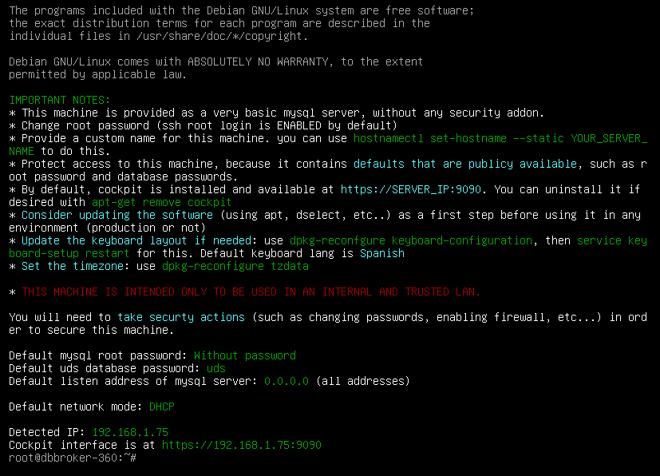

Настройте сетевые параметры виртуальной машины. Для этого будет изменен файл "***interfaces**_" и назначен статический IP-адрес (по умолчанию виртуальное устройство настраивается __DHCP_*).

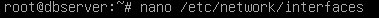

В зависимости от платформы виртуализации, которую вы используете для размещения компонента "База данных", вы должны назначить новый статический IP-адрес соответствующему сетевому интерфейсу (обычно это будет "eth0"):

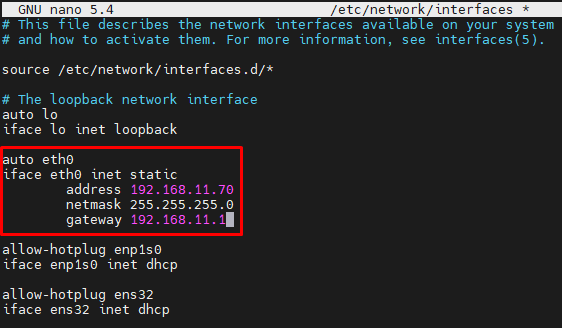

Также необходимо модифицировать файл "***resolv.conf***" для настройки DNS-сервера:

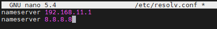

После того, как все необходимые сетевые данные настроены, перезапустите сервер и убедитесь, что все данные настроены правильно:


После того, как данные IP-адреса сервера будут настроены, они уже будут доступны для использования с UDS. По умолчанию на сервере MySQL настроен следующий экземпляр базы данных, готовый к использованию с сервером UDS:

* **Экземпляр**: uds
* **Пользователь**: uds
* **Пароль**: uds

**ПРИМЕЧАНИЕ:** Рекомендуется изменить пароль, чтобы обеспечить большую безопасность системы. Для выполнения этой задачи мы можем выполнить следующую команду в консоли MySQL:

предоставить все на _database_name_.* '_usuario_'@'%', обозначенный 'new__password_';

**Процедура безопасного использования:** Пароли должны быть достаточной длины и включать прописные, строчные буквы, цифры и специальные символы.

Как только эти задачи будут выполнены, база данных будет доступна для использования с компонентом UDS Server.

Если бы необходимо было создать новый экземпляр базы данных для UDS, необходимо выполнить следующий процесс:

Получите доступ к MySQL со следующими учетными данными:

* **Usuario**: корень
* **Пароль**: uds

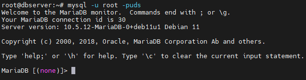

База данных создается с помощью следующей команды:

создать базу данных _database_name_ кодировкой по умолчанию utf8mb4 collate utf8mb4_general_ci;


database_name*** будет именем нового экземпляра базы данных.

Создайте пользователя с правами администратора в новом экземпляре базы данных с помощью команды:

предоставить все на _database_name_.* '_usuario_'@'%', идентифицированный '_password_';

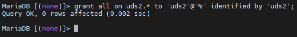

database_name*** - имя экземпляра Базы данных, ***user*** - имя пользователя с правами администратора на данный экземпляр Базы данных, а ***пароль*** - пароль, присвоенный указанному пользователю.

**Процедура безопасного использования:** Пароли должны быть достаточной длины и включать прописные, строчные буквы, цифры и специальные символы.

По умолчанию сервер базы данных включает в себя инструмент Cockpit, который позволяет управлять определенными компонентами сервера и отслеживать их.

Для доступа мы будем использовать IP-адрес или имя сервера с портом: 9090 https://***ip_dbserver***:9090

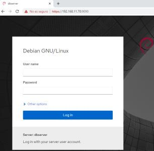

####### Процедура безопасного использования: {#secure-use-procedure .unnumbered}

В целом, целесообразно реализовать основные и необходимые механизмы безопасности на любом сервере; Надежные пароли, резервные копии, наличие решений безопасности, обновление систем и изменение конфигураций, пользователей и паролей по умолчанию.

Кроме того, для сервера баз данных, хотя в случае с UDS Enterprise мы храним не конфиденциальную информацию, а конфигурационную и регистрационную информацию, важно:

* Ограничьте доступ
* Шифрование информации
* Мониторинг активности

Рекомендуется отключить доступ по SSH к этому серверу, чтобы он был доступен только через консоль.

#### UDS-сервер

После импорта виртуального устройства UDS Server на поддерживаемую платформу виртуализации включите виртуальную машину, чтобы продолжить ее первоначальную настройку.

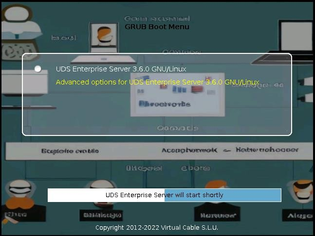

**ПРИМЕЧАНИЕ:** Для успешной настройки UDS-сервера необходимо иметь сервер базы данных, настроенный с доступным экземпляром. При использовании базы данных, которая уже использовалась с UDS и содержит данные из предыдущей версии UDS, все данные будут перенесены для использования с новой версией (перенос базы данных разрешен только из смежных версий).

Версия UDS Evaluation Edition позволяет не использовать внешнюю базу данных MySQL, так как система позволяет автоматически включать локальную базу данных.

По умолчанию сервер UDS виртуального устройства принимает конфигурацию сети через DHCP. В случае, если в сети нет сервера, который назначает IP-адреса, вам придется назначить сетевые данные вручную:

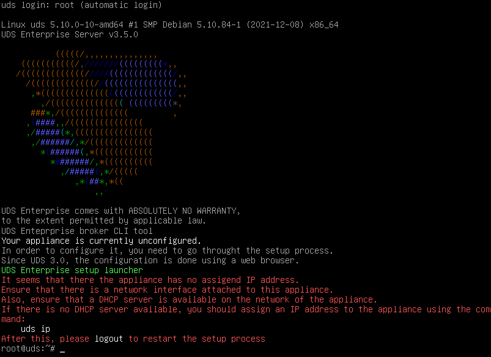

Для этого используйте команду ***uds ip set***

Возможны следующие варианты конфигурации:

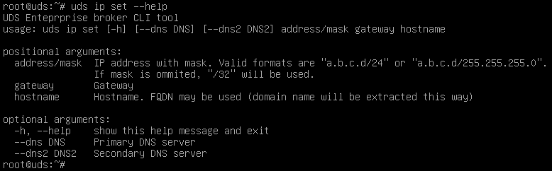

Поэтому перейдем к ручной настройке сетевых данных:

Набор IP-адресов UDS _ip_server_/_mask шлюза name_server_

Дополнительно можно указать домен (извлекается из имени сервера) и DNS-серверы (с параметром --dns)

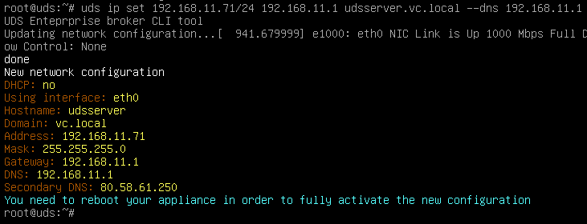

После настройки IP-адреса перезапустите сервер, чтобы изменения вступили в силу.

Если у вас уже есть IP-адрес, назначенный серверу, либо путем его ручной настройки, либо путем автоматического назначения DHCP-сервера, вы перейдете к настройке компонента UDS Server:

Для этого вы получите доступ к IP-адресу сервера через веб-браузер, указав порт 9900


####### Примечание по безопасности: {#security-примечание .unnumbered}

Для выполнения первоначальной базовой настройки UDS Broker включает в себя собственный механизм безопасности. Для того, чтобы выполнить первоначальную настройку, нам понадобятся две вещи:

* В брокере должна быть запущена команда "uds setup"
* Нам необходимо знать значение Setup Code нашего брокера.

Команда "uds setup" выполняется автоматически при первом включении брокера и может быть выполнена вручную в любое время из консоли.

Команда "uds setup" останавливается автоматически в конце первоначальной настройки или вручную выполнением команды "uds setup -s".

При выполнении команды "uds setup" на экране появляется "Setup Code" нашего брокера, который будет запрошен, если мы захотим выполнить базовую настройку удаленно.

«Код установки» — это восьмизначный токен, который НИКОГДА не циркулирует по сети, который будет нашим «Одноразовым блокнотом».

«Одноразовый блокнот» — это часть метода шифрования, который не может быть взломан, но требует использования одноразового ключа, который не меньше отправляемого сообщения.

В этой технике обычный текст сочетается со случайным секретным ключом, нашим одноразовым «одноразовым блокнотом».

С помощью этого токена на каждом конце соединения через «соль», набор случайных битов, которые мы используем как часть ключа криптографического алгоритма, и используя хеш-функцию 512, мы получаем ключ размером 3 072 байта, который нарезается и используется обеими сторонами для шифрования и расшифровки информации, передаваемой и получаемой во время этой первоначальной настройки. Этот ключ никогда не используется полностью и не используется повторно ни в одной из его частей.

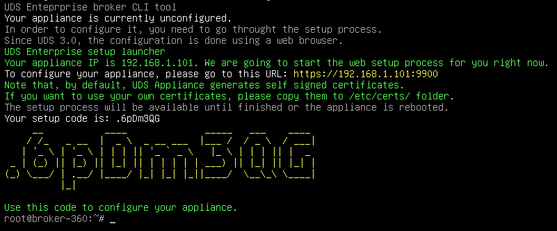

Этот "Код установки" будет запрошен во время базовой начальной настройки.

####### ПРИМЕЧАНИЕ: Для доступа к веб-серверу брокера не следует использовать http-доступ, а использовать начальную базовую конфигурацию серверного программного обеспечения "uds setup" через https и порт 9900. {#note-the-http-access-should-not-be-use-to-access-the-brokers-web-server-but-rather-the-initial-basic-configuration-application-of-the-server-software-uds-setup-through-https-and-port-9900. .unnumbered}

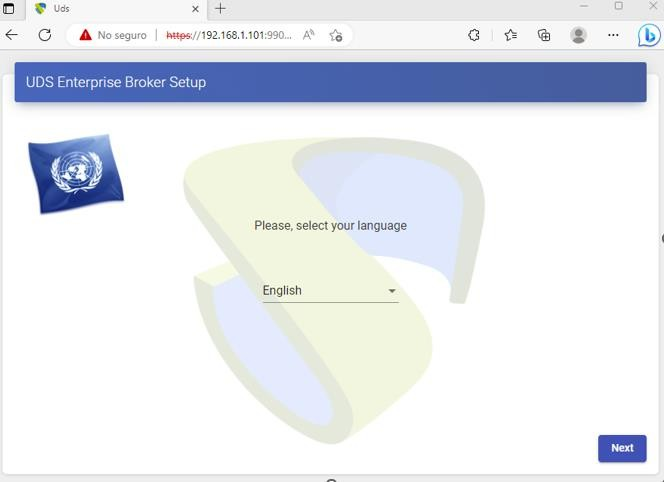

**Шаг 1.-** Выберите язык мастера настройки:

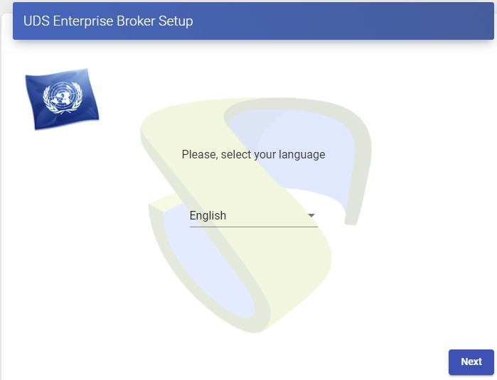

**Шаг 2.-** - Укажите имя сервера, домен (необязательно) и сетевые данные сервера:


**ПРИМЕЧАНИЕ:** Если указанный IP-адрес отличается от того, который уже был настроен сервером через DHCP или ручную настройку, система автоматически перенаправит на новый адрес для продолжения работы мастера настройки.

**ПРИМЕЧАНИЕ:** Если все указанные данные верны и вы не хотите изменять какие-либо данные, вы можете воспользоваться опцией "Пропустить конфигурацию сети (оставить как есть)".

Проверьте правильность указанных данных и принимайте:

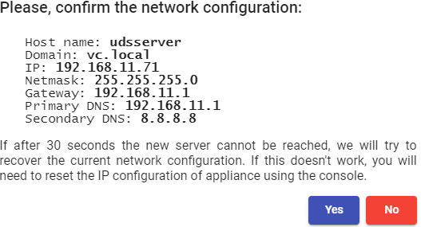

Дождитесь завершения настройки новых сетевых данных:


**Шаг 3.-** Добавьте код безопасности ("Код настройки"), который появится в консоли нашего устройства UDS Server и который вы видели в начале этой процедуры:

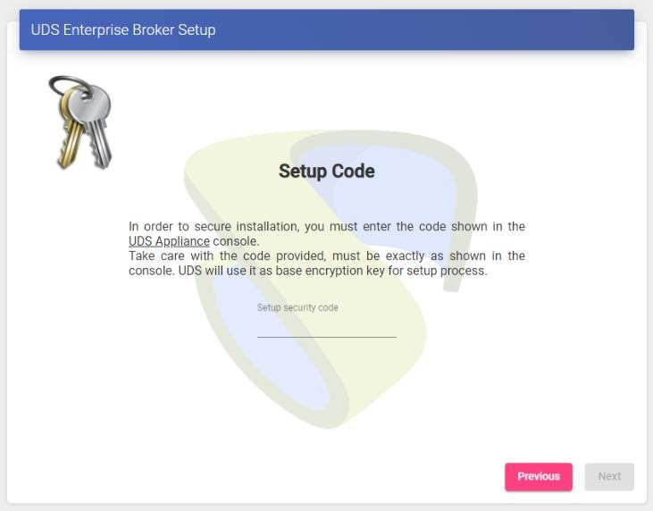

**Шаг 4.-** Настраиваем язык клавиатуры, который будет на сервере, часовой пояс и NTP-сервер (опционально):


**Шаг 5.-** Выберите тип базы данных, которая будет использоваться:

* **MySQL (удаленный)**: Если вы выберете этот тип, системе потребуется внешний сервер базы данных (допустимо и рекомендуется для любой версии UDS).
* **Встроенная (локальная):** Если вы выберете этот тип, система включит локальную базу данных на UDS-сервере. Не рекомендуется для выпусков Enterprise

###### ПРИМЕЧАНИЕ: {#note .unnumbered}

Если вы выберете локальную базу данных, вы не сможете обновить систему новыми версиями без потери существующих данных.

В случае выбора "***MySQL (remote)***", необходимо указать данные подключения к Базе данных:

* **Имя пользователя:** Имя пользователя с правами администратора на экземпляре базы данных
* **Пароль:** Пароль пользователя
* **Тип подключения:** Тип подключения к базе данных
* **База данных:** Имя экземпляра базы данных

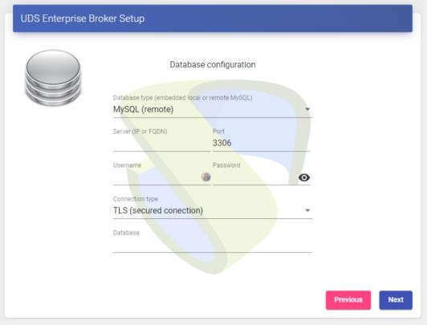

**ПРИМЕЧАНИЕ:** Если вы используете сервер базы данных, предоставляемый UDS, данные по умолчанию: Имя пользователя: uds // Пароль: uds // База данных: uds

**Процедура безопасности:** Желательно изменить логин и пароль базы данных, это делается на самом сервере базы данных. **Пароли должны быть достаточной длины и включать** прописные, строчные буквы, **цифры** и специальные символы. ярлык.***

Ждем, когда настроится подключение к базе данных и продолжаем:


**Step 5.-** Continue with the subscription activation process. You must select the activation mode:

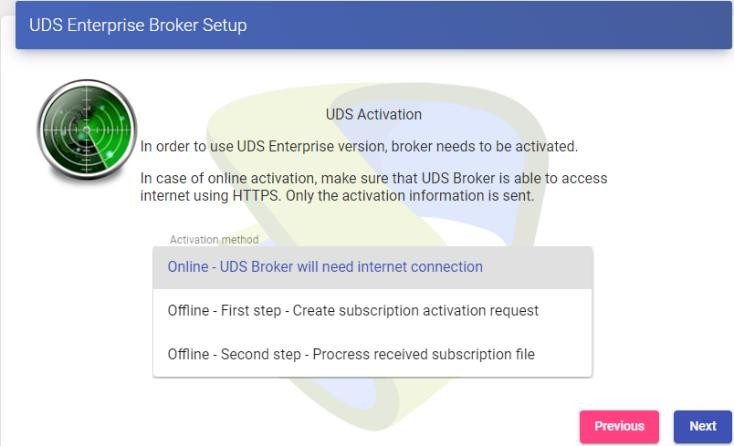

* **Онлайн:** Для выполнения этого режима активации вам потребуется действительный серийный номер и подключение к серверам активации UDS в Интернете.

Выберите опцию ***"Онлайн - UDS Broker потребуется подключение к Интернету"*** и укажите действительный код активации:


Система проверит код активации на центральных удаленных серверах UDS и, если он действителен, продолжит процесс настройки.


Если код активации недействителен или у него больше нет экземпляров, появится ошибка активации и вам следует обратиться в службу поддержки OpenUDS:

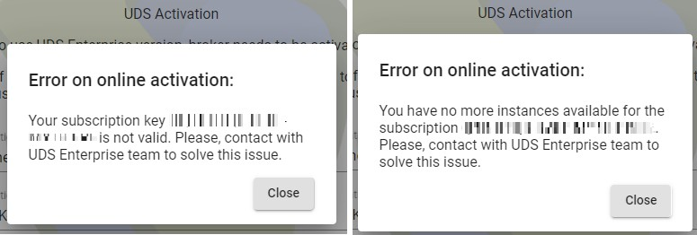

* **Не в сети:** Эта процедура активации подписки должна быть выполнена только в том случае, если UDS-сервер не имеет прямого подключения к Интернету к серверам активации.

Сначала вы выбираете опцию *** "Оффлайн -- Первый шаг -- Создать запрос на активацию подписки"**_, указываете код активации и нажимаете на _** "Сгенерировать информацию о запросе из текущего ключа активации":***

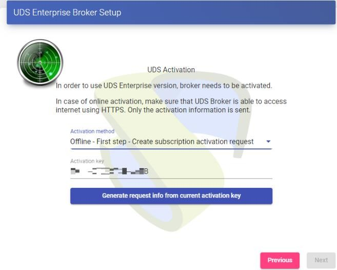

Автоматически откроется новое окно с инструкцией по проведению первой части активации. В нем будет указано, что вы должны отправить по электронной почте текст, автоматически сгенерированный системой:


Как только ответ будет получен от службы поддержки OpenUDS (что может занять некоторое время, так как этот запрос должен быть обработан и проверен), вы получите файл с именем ***uds-subscription.key.***

Теперь выберите опцию ***"Offline -- Second step -- Process received subscription file"**_, указав полученный файл в _**"Current subscription file"*** и продолжите работу мастера настройки


**Шаг 7.-** - Настройте пароль локального пользователя root UDS-сервера и укажите имя и пароль пользователя UDS-системного администратора (суперпользователя для доступа к веб-администрированию UDS).


**Процедура безопасности:** Для безопасной установки рекомендуется использовать пароли длиной не менее 12 символов, прописные, строчные, цифры и специальные символы.

**Шаг 8.-** Если у вас есть файлы сертификатов, введите их. В противном случае вы можете установить их после завершения работы мастера через консоль.

В поле "Сертификат сервера" необходимо указать файл сертификата (.crt, .pem, etc...), файл с "Закрытым ключом" (.key, .pem, etc...) и по желанию можно указать сертифицирующий объект "Файл цепочки" (.crt, .pem, etc...).

!{}(./media_admin_guide_36/image48.jpeg)

**ПРИМЕЧАНИЕ:** Для полностью безопасной установки и возможности подключения по протоколу HTTPS всегда рекомендуется использовать действительные сертификаты на сервере, так как в противном случае любой, кто хочет получить доступ к веб-порталу, будет уведомлен предупреждением об ошибке о том, что самоподписанные сертификаты UDS-сервера небезопасны.

**Шаг 9.-** Завершите настройку UDS-сервера, нажав на «***Reboot***», чтобы сервер перезапустился и применил все указанные настройки.

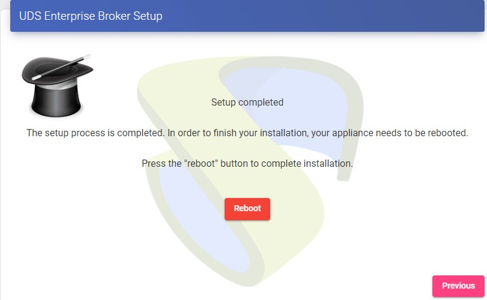

Вы сможете закрыть страницу мастера настройки и, как только сервер будет перезапущен, он будет доступен из любого браузера, обратившись к IP-адресу или имени сервера по http или https:


Домашняя страница OpenUDS:


**ПРИМЕЧАНИЕ:** Веб-доступ может осуществляться как по HTTP, так и по HTTPS, если последний не используется, может возникнуть высокий риск безопасности.

**Процедура безопасности**: Сертификат должен быть установлен на сервере брокера на шаге 8 начальной базовой процедуры установки, чтобы продолжить безопасное использование OpenUDS через HTTPS.

Мы также рекомендуем отключить HTTP-доступ или, по крайней мере, перенаправить HTTP-доступ на HTTPS.

Если вам нужно снова запустить мастер настройки для изменения каких-либо данных, вам нужно будет подтвердить себя на сервере (с пользователем root и паролем, установленным на шаге 6) и выполнить команду:

* **uds setup:** Запустите мастер установки

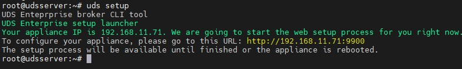

Это снова включит мастер настройки

Кроме того, с помощью команды uds вы можете внести другие изменения на сервере:


* **uds cert:** Это позволит установить сертификаты на сервере:


* **uds subscription:** Это позволит вам проверить тип активной подписки на сервере и при необходимости обновить ее:

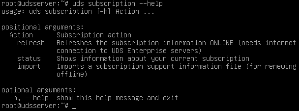

* **uds suscription refresh**: Обновление данных используемой подписки (требуется подключение к Интернету).
* **uds suscription status**: Показать текущую информацию о подписке:
* **uds suscription import**: импорт файла для обновления или активации подписки OpenUDS.
* **uds security**: Это позволит изменить имя и пароль суперпользователя для доступа к веб-администрированию UDS, мы также можем включить или отключить указанного пользователя:


* **uds security username**: изменение имени пользователя администратора UDS.
* **пароль безопасности uds**: изменение пароля пользователя-администратора UDS.

**Процедура безопасного использования:** Пароли должны быть достаточной длины и включать прописные, строчные буквы, цифры и специальные символы.

* **uds security allow**: Позволяет выбрать IPS/диапазон, который будет иметь доступ к администрированию.
* **uds ip:** Это позволит сверяться, изменять и сбрасывать IP-данные сервера:

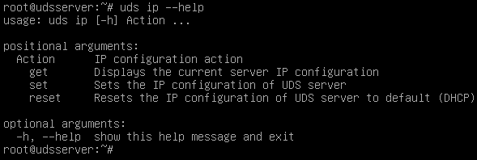

* **uds ip get**: Показывает информацию об IP-адресах UDS-сервера.
* **uds ip set**: Назначьте сетевые данные сервера вручную.
* **uds ip reset**: Перезапускает сетевую информацию устройства UDS.
* **uds trust:** Comando que nos permitirá confiar en un certificado de un servidor remoto.

####### Solo válido para certificados autofirmados. {#solo-válido-para-certificados-autofirmados. .unnumbered}


**Безопасная процедура развертывания:**

В целом, рекомендуется внедрить основные и необходимые механизмы безопасности на любом сервере; Надежные пароли, резервные копии, решения для обеспечения безопасности, обновление систем и изменение конфигураций, включая пользователей и пароли, по умолчанию.
Кроме того, будучи веб-сервером Nginx, рекомендуется применять следующие механизмы:

1. Протокол SSL/TLS
1. Внедрите SSL-сертификат
2. Оптимизируйте SSL/TLS
3. Отключите слабые протоколы SSL/TLS
4. Отключите слабые наборы шифров
5. Установите сертификат цепи
6. Защита Диффи-Хеллмана для TLS
2. Устраните «утечку информации»
3. Безопасность веб-приложений
1. Отключите нежелательные методы HTTP
2. Избегайте атак кликджекинга, внедрения x-кадров
3. Защита X-XSS
4. Реализация безопасности модификаций WAF
4. Обновите сервер Nginx

Мы рекомендуем вам отключить доступ по SSH к этому серверу, чтобы он был доступен только через консоль.

#### Туннель UDS

После импорта виртуального устройства UDS Tunnel на поддерживаемую платформу виртуализации включите виртуальную машину, чтобы продолжить ее первоначальную настройку.


**ПРИМЕЧАНИЕ:** Для успешной настройки сервера UDS Tunnel необходимо предварительно настроить UDS-сервер и знать его IP-адрес или имя.

По умолчанию туннель UDS виртуального устройства принимает сетевую конфигурацию через DHCP. В случае, если в сети нет сервера, который назначает IP-адреса, вам придется назначить сетевые данные вручную:


Для этого вы будете использовать команду ***uds ip set***

Возможны следующие варианты конфигурации:


Поэтому перейдем к ручной настройке сетевых данных:

Набор IP-адресов UDS _ip_server_/_mask шлюза name_server_

Дополнительно мы можем указать домен (извлекается из имени сервера) и DNS-серверы (с параметром --dns)


После настройки IP-адреса перезапустите сервер, чтобы изменения вступили в силу.

Если у вас уже есть назначенный IP-адрес на сервере, либо из-за его ручной настройки, либо из-за автоматического назначения DHCP-сервера, вы перейдете к настройке компонента UDS Tunnel.

Для этого вы получите доступ к IP-адресу сервера через веб-браузер, указав порт 9900:


Примечание по безопасности:

Для выполнения первоначальной базовой настройки UDS Tunnel включает в себя собственный механизм безопасности. Для того, чтобы выполнить первоначальную настройку, нам понадобятся две вещи:

1. На брокере должна быть запущена команда "uds setup"
2. Нам нужно знать значение установочного кода нашего брокера.

Команда "uds setup" выполняется автоматически при первом включении брокера и может быть выполнена вручную в любое время из консоли.

Команда "uds setup" останавливается автоматически в конце начальной настройки или вручную выполнив "uds setup -s".

При выполнении команды "uds setup" на экране появляется "Setup Code" нашего брокера, который будет запрошен, если мы хотим выполнить базовую настройку удаленно.

«Код установки» — это восьмизначный токен, который **[NOT]{.underline}** циркулирует в сети в любое время, и который будет нашим «одноразовым блокнотом».

«Одноразовый блокнот» — это часть метода шифрования, который не может быть взломан, но требует использования одноразового ключа, который не меньше отправляемого сообщения.

В этой технике обычный текст сочетается со случайным секретным ключом, нашим одноразовым «Одноразовым блокнотом».

С помощью этого токена на каждом конце соединения через «соль», набор случайных битов, которые мы используем как часть ключа криптографического алгоритма, и используя хеш-функцию 512, мы получаем ключ размером 3 072 байта, который измельчается и используется обеими сторонами для шифрования и расшифровки информации, передаваемой и получаемой во время этой начальной настройки. Этот ключ никогда не используется полностью и не используется повторно ни в одной из его частей.

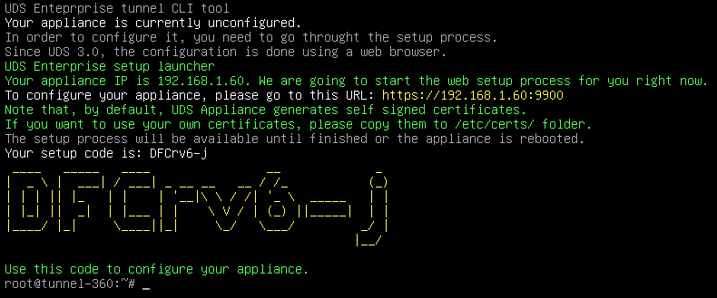

Этот "Код установки" будет запрошен во время базовой начальной настройки.

####### ПРИМЕЧАНИЕ: для доступа к веб-серверу брокера следует использовать не http-доступ, а начальную базовую конфигурацию приложения серверного программного обеспечения "uds setup" через https и порт 9900. {#note-http-access-should-not-be-used-to-access-the-brokers-web-server-but-the-initial-basic-configuration-application-of-the-server-software-uds-setup-via-https-and-port-9900. .unnumbered}


**Шаг 1.-** Выберите язык помощника по настройке:

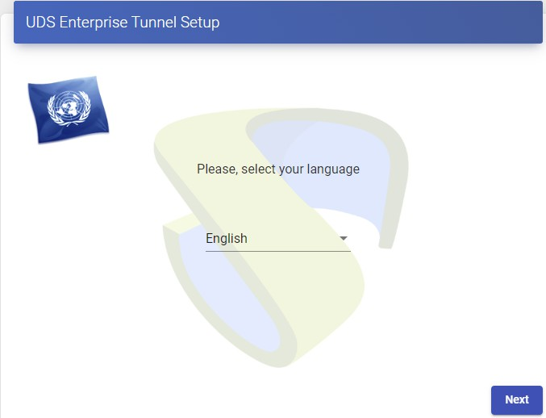

**Шаг 2.-** - Указываем имя сервера, домен (необязательно) и сетевые данные сервера

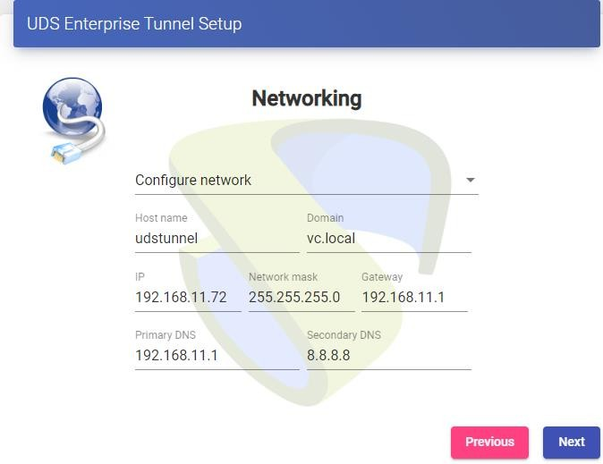

**ПРИМЕЧАНИЕ:** Если указанный IP-адрес отличается от того, который уже был настроен DHCP-сервером или с помощью ручной настройки, система автоматически перенаправит на новый адрес для продолжения работы мастера настройки.

**ПРИМЕЧАНИЕ:** Если все указанные данные верны и вы не хотите изменять какие-либо данные, вы можете использовать опцию _"_**Пропустить конфигурацию сети (оставить как есть)"**

Проверьте правильность указанных данных и принимайте:

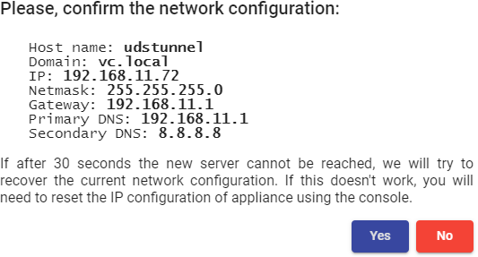

Дождитесь завершения настройки новых сетевых данных:


**Шаг 3.-** Настройте язык клавиатуры для сервера, часовой пояс и NTP-сервер (необязательно):


**Шаг 4.-** Настраиваем язык клавиатуры, который будет на сервере, часовой пояс и NTP-сервер (опционально):

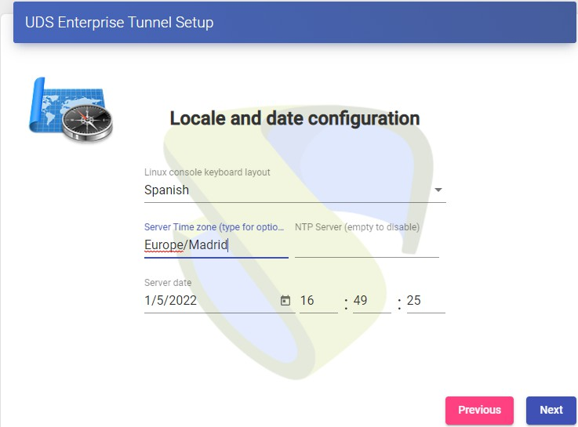

**Шаг 5.-** Соедините сервер Tunnel с UDS-сервером (брокером), указав его имя или IP-адрес, существующий аутентификатор и пользователя с правами администратора. Если на UDS-сервере установлен действительный сертификат, можно использовать "***HTTPS (Secure Connection)**_", в противном случае - "_**HTTP***".

####### ПРИМЕЧАНИЕ: Для того, чтобы наш туннель доверял сертификатам UDS Server, необходимо запустить команду "uds trust" в туннеле, описанном на следующей странице. {#note-for-our-tunnel-to-trust-uds-server-certificates-it-будет-необходимым-to-launch-the-uds-trust-command-in-the-tunnel-explained-on-the-next-page. .unnumbered}


**ПРИМЕЧАНИЕ:** Если у вас не настроен аутентификатор на UDS-сервере, вы можете использовать аутентификатор "Администрирование", к которому относится суперпользователь, указанный на шаге 6 мастера настройки UDS-сервера. УДС.

Важно иметь в виду, что если вы хотите использовать https соединение между этими двумя элементами, вы должны указать DNS-имя UDS-сервера (мы не можем использовать IP-адрес), а также у вас должны быть установлены действующие сертификаты на UDS-сервере.

Для того, чтобы UDS-туннель доверял самозаверяющему сертификату UDS-сервера и проверял соединение, мы должны использовать команду "uds trust"


Как только это будет сделано, нам нужно будет указать туннелю UDS имя нашего UDS-сервера "uds"

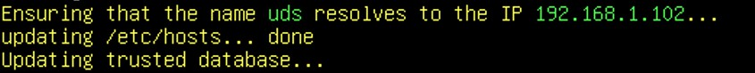

Вам нужно будет проверить, что в файле /etc/hosts появляется имя uds с правильным ip:


После этого вы можете продолжить процесс настройки

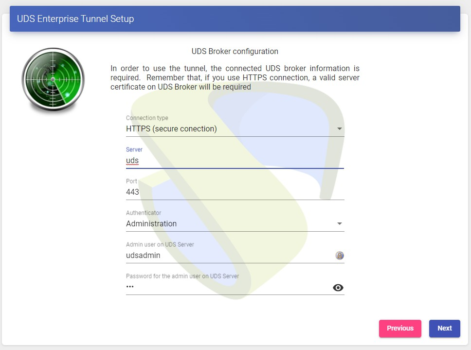

**Шаг 6.-** Настройте пароль локального пользователя root сервера Tunnel:

ПРИМЕЧАНИЕ: Для абсолютно безопасной установки рекомендуется использовать пароли длиной не менее 12 символов, прописные, строчные, цифры и специальные символы

**Шаг 7.-** Если у вас есть файлы сертификатов, вы укажете их. В противном случае вы можете установить их после завершения работы мастера через консоль.

В поле "Сертификат сервера" необходимо указать файл сертификата (.crt, .pem и т.д...), файл с ключом "Закрытый ключ" (.key, .pem и т.д...) и по желанию можно указать сертифицирующий объект "Файл цепочки" (.crt, .pem и т.д...).

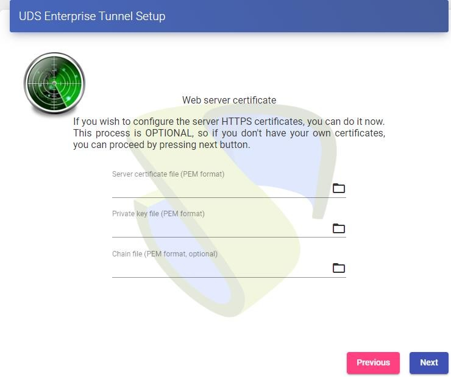

**ПРИМЕЧАНИЕ**: Для полностью безопасной установки и возможности подключения по протоколу HTTPS всегда рекомендуется использовать действительные сертификаты на сервере, в противном случае любой, кто хочет получить доступ к веб-порталу, будет уведомлен предупреждением об ошибке о том, что самоподписанные сертификаты UDS Server небезопасны.

**Шаг 8.-** Завершите настройку сервера Tunnel, нажав «Перезагрузить», чтобы сервер перезагрузился и применил все указанные настройки.

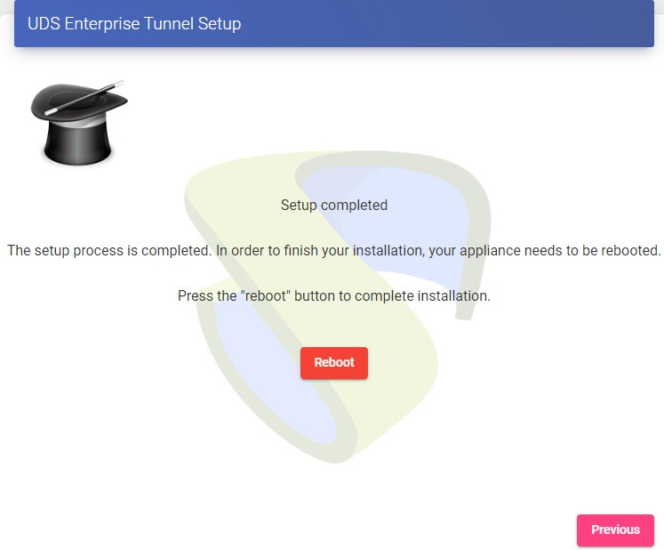

Вы можете закрыть страницу мастера настройки, и после перезапуска сервер UDS Tunnel будет полностью настроен.


Если вам нужно снова запустить мастер настройки для изменения каких-либо данных, вам нужно будет подтвердить себя на сервере (с пользователем root и паролем, установленными на шаге 4) и выполнить команду:

* **uds setup:** Запустите мастер настройки сервера

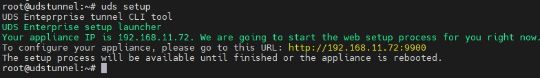

####### Это снова включит мастер установки. {#this-будет-повторно-включить-мастер-настройку..без номера}

Кроме того, с помощью команды ***uds*** вы можете внести другие изменения на сервере:

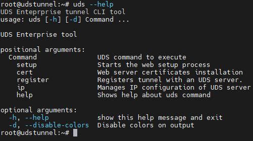

* **uds cert:** Позволит установить сертификаты на сервере:


* **uds register:** Это позволит зарегистрировать сервер Tunnel на конкретном UDS-сервере (брокере):


* **uds ip:** Позволит сверяться, изменять и сбрасывать IP-данные сервера:


* **uds ip get**: Показывает информацию об IP-адресах UDS-сервера.
* **uds ip set**: Назначение сетевых данных сервера вручную
* **uds ip reset**: Перезапуск сетевой информации устройства UDS
* **uds support:** Команды, связанные с действиями поддержки.


* **uds trust:** Команда, которая позволит нам доверять сертификату с удаленного сервера.

####### Действителен только для самозаверяющих сертификатов. {#only-действительные-для-самоподписанных-сертификатов..unnumbered}


**Безопасная процедура развертывания:**

В целом, рекомендуется внедрить основные и необходимые механизмы безопасности на любом сервере; Надежные пароли, резервные копии, решения для обеспечения безопасности, обновление систем и изменение конфигураций, включая пользователей и пароли, по умолчанию.

Кроме того, при включении веб-сервера Apache рекомендуется применять следующие механизмы:

* Удален баннер версии сервера
* Отключите список браузеров каталогов
* Запуск Apache с непривилегированной учетной записи
* Защита конфигурационного каталога и двоичных разрешений
* SSL/TLS
- Внедрить SSL-сертификат
- Оптимизация SSL/TLS
- Отключите слабые протоколы SSL/TLS
- Отключение слабых наборов шифров
- Установить сертификат цепи
- Защита Diffie-Hellman для TLS
- Ликвидация «утечки информации»
* Безопасность веб-приложений
- Отключите нежелательные методы HTTP
- Избегайте кликджекинговых атак, внедрения x-кадров
- Защита X-XSS
- Реализация безопасности модификаций WAF
* Обновление сервера Apache.

Мы рекомендуем вам отключить доступ по SSH к этому серверу, чтобы он был доступен только через консоль.

#### Актер UDS

UDS Actor — это программный компонент, который устанавливается в шаблонах операционной системы Windows или Linux (золотой образ) для использования для развертывания виртуальных рабочих столов, на серверах приложений RDS для представления сеансов виртуальных приложений пользователям и на статических машинах, где необходимо управлять пользовательскими сеансами.

Чтобы установить UDS Actor, необходимо предварительно загрузить с UDS Broker подходящий Actor для каждой платформы (Windows, Linux и vApps).

Для этого подключитесь к UDS Broker через веб-браузер и используя учетные данные пользователя с

**Разрешение администратора** на доступ к загрузкам:

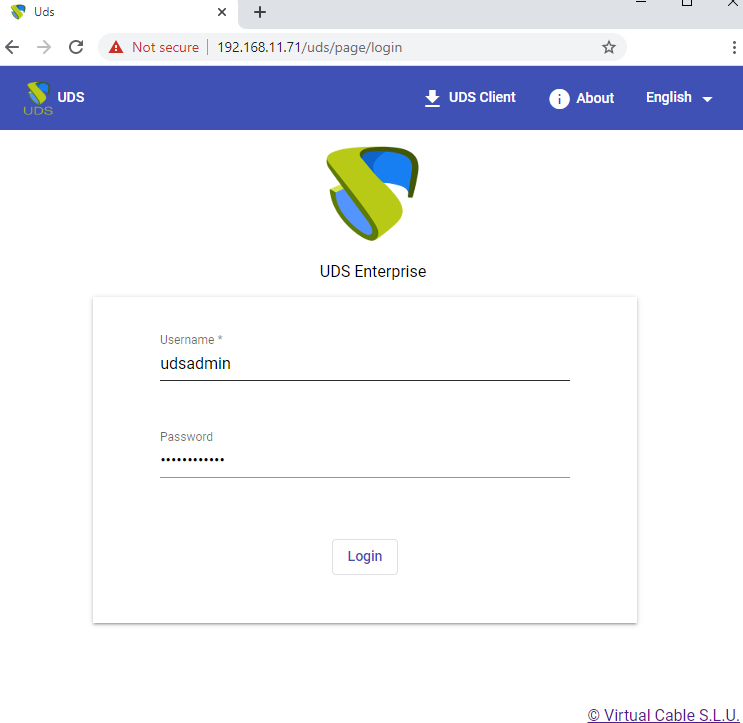

Выберите «Загрузки» в меню пользователя:

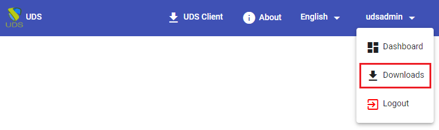

Вы выберете субъект, соответствующий операционной системе и службе, которая установлена в базовом шаблоне или сервере приложений, на котором будут развернуты службы рабочего стола:

...

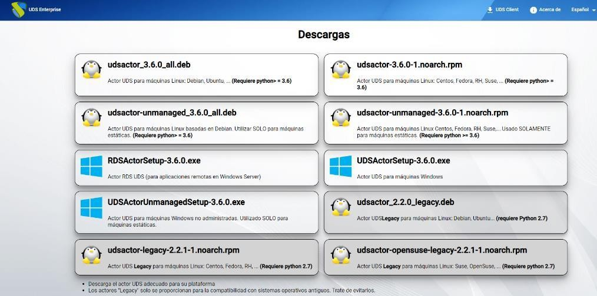

####### Безопасная процедура развертывания: {#safe-employment-procedure-2 .unnumbered}

Убедитесь, что сервер, с которого загружается субъект, является выбранным, проверив сертификат, если он установлен.

Все акторы подписаны своим программным обеспечением, убедитесь, что подпись соответствует актору. Включите проверку SSL сертификата сервера во время установки субъекта.

Включите все параметры безопасности, которые вы считаете необходимыми, на компьютере, на котором установлен субъект, они будут реплицированы на все ls публикации.

В дополнение к установке UDS Actor необходимо установить и включить протокол подключения, который будет использоваться для подключения к сгенерированным рабочим столам (например, включить удаленный рабочий стол, установить клиент PCoIP и т. д.).

Отключите все параметры общего доступа по протоколу, который вы не считаете строго необходимым для базового компьютера, на котором он устанавливается.

##### самостоятельно созданных виртуальных рабочих столов Windows

Для управления жизненным циклом виртуальных рабочих столов Windows, самостоятельно генерируемых OpenUDS, необходимо, чтобы на компьютере шаблона (золотом образе), на котором они будут базироваться, был установлен UDS Actor: ***UDSActorSetup-3.6.0.exe***

###### ПРИМЕЧАНИЕ: {#note-1 .unnumbered}

Перед установкой UDS Actor необходимо иметь IP-адрес или имя UDS-сервера, учетные данные пользователя с правами администратора в среде UDS и хотя бы один аутентификатор, зарегистрированный в системе.

После загрузки UDS Actor for Windows O.S. и переноса его на компьютер шаблона запустите его, чтобы продолжить установку.

Выберите язык инсталлятора


Укажите путь установки UDS Actor:

Нажмите на **"Установить"**, чтобы продолжить установку:

После завершения установки перейдите к настройке UDS Actor:

На вкладке UDS Server необходимо зарегистрировать субъект в экземпляре UDS, указав следующие параметры:

**SSL Validation:** Тип безопасности, с помощью которого будет осуществляться связь с UDS-сервером.

Рекомендуется получить максимально возможную безопасность, активировать проверку сертификата

**"Verify Certificate**" в противном случае будет большой риск для безопасности платформы.

**UDS-сервер:** Имя или IP-адрес UDS-сервера.

**Аутентификатор:** Аутентификатор, к которому принадлежит указанный пользователь-администратор для регистрации субъекта UDS.

Связь с сервером UDS должна быть успешной, чтобы различные аутентификаторы отображались. Хотя бы один из них должен быть зарегистрирован в администрировании UDS (аутентификатор "***Administration***" соответствует суперпользователю, созданному в мастере настройки UDS-сервера).

**Имя пользователя:** Имя пользователя с правами администратора в среде UDS (должно принадлежать ранее выбранному аутентификатору).

**Пароль:** Пароль пользователя-администратора.

**Процедура безопасного использования:** Пароли должны быть достаточной длины и включать прописные, строчные буквы, цифры и специальные символы.


**ПРИМЕЧАНИЕ**: Чтобы обеспечить платформе максимально возможную безопасность, необходимо выбрать опцию «Проверить сертификат», чтобы убедиться, что сертификат UDS Server действителен.

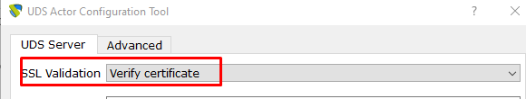

Во вкладке "***Advanced***" можно указать следующие расширенные параметры:

**Сценарий предварительного подключения:** запускается непосредственно перед тем, как разрешить пользователю подключиться к виртуальному рабочему столу. UDS автоматически передаст следующие параметры, которые можно использовать в скрипте: имя пользователя, протокол (rdp, nx, pcoip ...), IP (IP, который вы распознали на клиенте (SRC IP)), имя хоста (SRC Host).

**Runonce:** сценарий, который запускается только один раз и до того, как UDS Actor применит свои настройки.

После его выполнения (очень полезно, например, запускать sysprep для каждого сгенерированного виртуального рабочего стола). Он удаляется из конфигурации. Параметры могут передаваться непосредственно в него.

Выполняемый сценарий должен завершиться перезапуском виртуального рабочего стола. В противном случае рабочий стол никогда не применит параметры субъекта, предотвращая достижение состояния "***Valid***" в администрировании UDS.

Сценарий **Postconfig:**, который запускается, когда актор UDS завершает настройку. Параметры могут передаваться непосредственно в него.

Скрипт запускается только один раз, но в отличие от режима «Runonce» вам не придется перезапускать виртуальный рабочий стол. Этот сценарий полезен для добавления некоторых "собственных" элементов в конфигурацию, сделанную UDS Actor, таких как копирование файлов из локальной сети, выполнение конфигураций и т.д.

**Уровень журнала:** Типы журналов, отображаемые в файлах журналов субъекта UDS. Эти файлы журналов (udsactor.log) будут располагаться по путям: %temp% (путь к временным файлам пользователя) и C:WindowsTemp (путь к временным файлам ОС).


Una vez indicados todos los datos necesarios, pulsaremos sobre "***Register with UDS***":

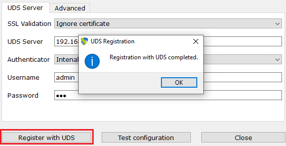

Вы также можете выполнить тест, нажав на "**Тестовая конфигурация**", чтобы в любое время убедиться в правильности подключения к UDS-серверу:


Очень важно иметь в виду, что в случае изменения каких-либо данных, всегда необходимо будет провести процесс регистрации после этого (нажав на кнопку «**Зарегистрироваться в UDS**»), если это действие не будет выполнено, изменения не будут применены.

После установки и настройки UDS Actor компьютер шаблонов (золотой образ) теперь можно отключить, и он будет доступен для использования UDS для самостоятельного создания виртуальных рабочих столов.

**ПРИМЕЧАНИЕ: В дополнение к установке UDS Actor необходимо включить протокол подключения, который будет использоваться для подключения к сгенерированным рабочим столам (например, включить удаленный рабочий стол, установить клиент PCoIP и т. д.). **

##### статических рабочих столов Windows

Для управления пользовательскими сессиями (вход и выход) машины, настроенной в рамках провайдера "***Static IP Machines Provider**_", необходимо, чтобы на ней был установлен UDS Actor: _**UDSActorUnmanagedSetup-3.6.0.exe***

Помимо управления сеансом пользователя, субъект определяет, подключен ли уже пользователь (например, при доступе к физическому компьютеру), и предотвращает подключение другого пользователя, запросившего доступ.

Если на этих компьютерах не установлен субъект UDS и они являются частью службы типа "***Static Multiple IP***", UDS не сможет управлять выходом пользователя из компьютера и, следовательно, не сможет освободить его, чтобы сделать доступным для другого пользователя.

**ПРИМЕЧАНИЕ:** Перед установкой UDS Actor необходимо иметь IP-адрес или имя UDS-сервера и ключ "**Service Token**", зарегистрированный в службе типа "**Static Multiple IP**" в "**Static IP Machines Provider**"

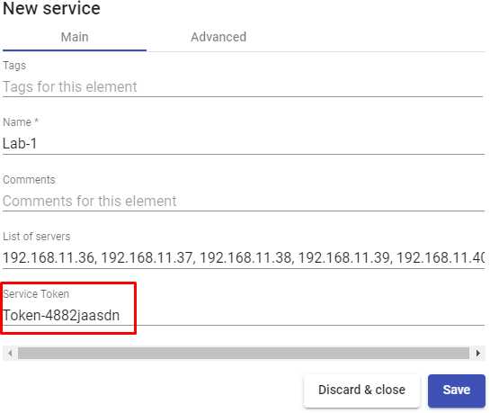

После загрузки UDS Actor for Windows OS. и переноса его на компьютер, к которому вы хотите подключить пользователей (физический или виртуальный), вы запустите его, чтобы продолжить установку.

Выберите язык инсталлятора:

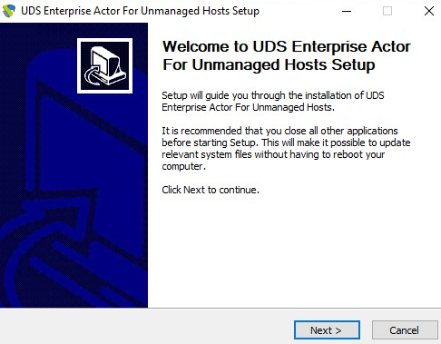

Укажите путь установки UDS Actor:

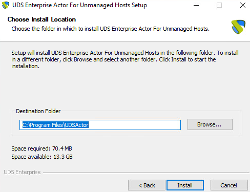

Нажмите на **"Установить"**, чтобы приступить к установке:

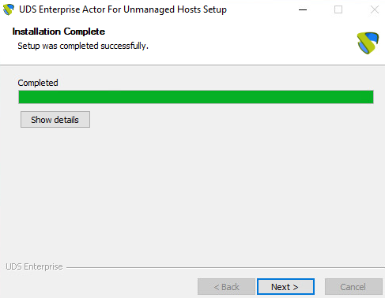

После завершения установки перейдите к настройке UDS Actor:


Перейдите к регистрации Актора на UDS-сервере, указав следующие параметры:

**SSL Validation:** Тип безопасности для связи с UDS-сервером.

Рекомендуется получить максимально возможную безопасность, активировать проверку сертификата

**"Verify Certificate**" в противном случае будет большой риск для безопасности платформы.

**UDS-сервер:** Имя или IP-адрес UDS-сервера.

**Маркер службы:** Код, созданный в администрировании UDS, в типе услуги "***Static Multiple IP**_" в рамках поставщика услуг "_**Static IP Machines Provider***".

**Уровень журнала:** Типы журналов, отображаемые в файлах журналов субъекта UDS. Эти файлы журналов (udsactor.log) будут располагаться по путям: %temp% (путь к временным файлам пользователя) и C:WindowsTemp (путь к временным файлам ОС).

**Restrict Net**: Добавляет возможность разграничения сетей для соединения с UDS.

Сеть, которую мы укажем, будет использоваться UDS для уведомления о доступе пользователя к машине. Необходимо для случаев, когда у нас более одной сетевой карты, в противном случае оставьте пустым


**ПРИМЕЧАНИЕ**: Чтобы обеспечить платформе максимально возможную безопасность, необходимо выбрать опцию «Проверить сертификат», чтобы убедиться, что сертификат UDS Server действителен.


Как только эти данные будут указаны, вы нажмете на "***Сохранить конфигурацию***":


После завершения установки и настройки UDS Actor компьютер будет доступен для назначения UDS и управления пользовательскими сеансами.

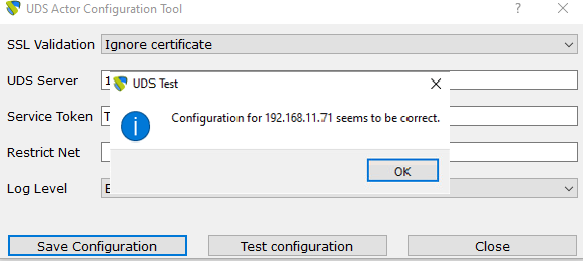

После завершения установки и настройки UDS Actor компьютер будет доступен для назначения UDS и управления пользовательскими сеансами.

**ПРИМЕЧАНИЕ:** В дополнение к установке UDS Actor, необходимо включить протокол подключения, который будет использоваться для подключения к сгенерированным рабочим столам (например, включить удаленную запись и т. д.).

##### Linux self-generated virtual desktops

Для управления жизненным циклом виртуальных рабочих столов Linux, самостоятельно сгенерированных OpenUDS, на машине шаблона (золотом образе), на которой они будут базироваться, должен быть установлен UDS Actor для различных дистрибутивов Linux:

* **Базовые дистрибутивы Debian: *udsactor_3.6.0_all.deb***
* **Дистрибутивы Red Hat и Suse: *udsactor-3.6.0-1.noarch.rpm***

**ПРИМЕЧАНИЕ:** Перед установкой UDS Actor необходимо иметь IP-адрес или имя UDS-сервера, учетные данные пользователя с правами администратора в среде UDS и по крайней мере один аутентификатор, зарегистрированный в системе

После того, как UDS Actor для выбранного дистрибутива Linux будет загружен и перенесен на компьютер шаблона, вы запустите его, чтобы продолжить установку.

Настоятельно рекомендуется выполнять выполнение Актора через командную консоль следующим образом:


Если вы получили ошибку из-за отсутствия зависимостей, вы перейдете к его установке:


После установки необходимых зависимостей запустите конфигурацию UDS Actor:

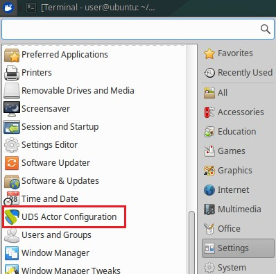

На вкладке ***UDS Server*** вы зарегистрируете Actor в экземпляре UDS, указав следующие параметры:

**Проверка SSL:** Тип безопасности для связи с сервером UDS.

Рекомендуется получить максимально возможную безопасность, активировать проверку сертификата

**"Verify Certificate**" в противном случае будет большой риск для безопасности платформы.

**UDS-сервер:** Имя или IP-адрес UDS-сервера.

**Аутентификатор:** Аутентификатор, к которому принадлежит указанный пользователь-администратор для регистрации субъекта UDS.

Связь с сервером UDS должна быть успешной, чтобы различные средства проверки подлинности отображались. По крайней мере, один из них должен быть зарегистрирован в администрировании UDS (аутентификатор "***Administration***" соответствует суперпользователю, созданному в мастере настройки UDS Server).

**Имя пользователя:** Имя пользователя с правами администратора в среде UDS (должно принадлежать ранее выбранному аутентификатору).

**Пароль:** Пароль пользователя-администратора.

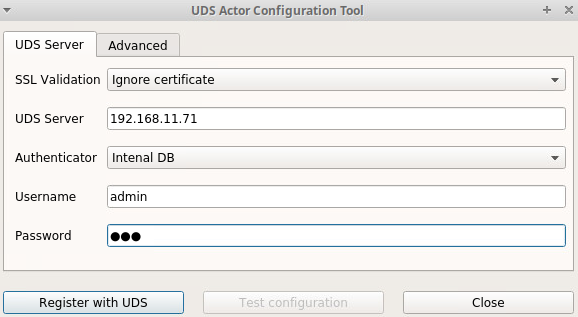

**ПРИМЕЧАНИЕ:** Чтобы обеспечить платформе максимально возможную безопасность, для проверки сертификата необходимо выбрать опцию «Проверить сертификат».


Во вкладке "***Advanced***" можно указать следующие расширенные параметры:

**Предварительное подключение:** Сценарий, выполняемый непосредственно перед тем, как разрешить пользователю подключиться к виртуальному рабочему столу.

UDS автоматически передаст следующие параметры, которые могут быть использованы в скрипте: имя пользователя, протокол (rdp, nx, pcoip...), IP (IP, который вы распознали на клиенте (SRC IP)), имя хоста (SRC Host).

**Runonce:** Сценарий, который выполняется только один раз и до того, как субъект UDS применит свои параметры. После выполнения он удаляется из конфигурации. Параметры могут передаваться непосредственно в него.

Выполняемый сценарий должен завершиться перезапуском виртуального рабочего стола. В противном случае рабочий стол никогда не применит параметры субъекта, не позволяя ему достичь состояния "***Valid***" в администрировании UDS

**Postconfig:** Сценарий, который выполняется, когда субъект UDS завершает настройку. Параметры могут передаваться непосредственно в него.

Скрипт запускается только один раз, но, в отличие от режима «Runonce», ему не нужно перезапускать виртуальный рабочий стол. Этот сценарий полезен для добавления какого-либо «собственного» элемента в конфигурацию, сделанную UDS Actor, например, для копирования файлов из локальной сети, выполнения конфигураций и т. д.

**Уровень журнала:** Типы журналов, отображаемые в файлах журналов субъекта UDS. Эти файлы журналов (udsactor.log) будут расположены по пути: /var/log/

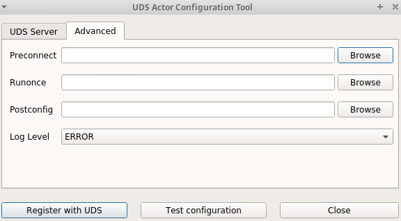

После того, как эти данные будут указаны, нажмите на кнопку «Зарегистрироваться в UDS»:


Вы также можете в любой момент выполнить тест, нажав на кнопку «Проверить конфигурацию», чтобы убедиться в правильности подключения к UDS-серверу:


Очень важно отметить, что если какие-либо данные будут изменены, то после этого всегда необходимо будет осуществить процесс регистрации (нажав на кнопку «Зарегистрироваться в UDS»), если это действие не будет выполнено, изменения не будут применены.

После установки и настройки UDS Actor компьютер шаблонов (золотой образ) теперь можно отключить, и он будет доступен для использования UDS для самостоятельного создания виртуальных рабочих столов.

**ПРИМЕЧАНИЕ**: В дополнение к установке UDS Actor, необходимо включить протокол подключения, который будет использоваться для подключения к сгенерированным рабочим столам (например, установить и включить XRDP, X2Go Server и т. д.).

Также необходимо будет убедиться, что заставка установлена, но не включена, в дополнение к тому, что на машине не включен «автоматический вход».

##### статических рабочих столов Linux

Для управления пользовательскими сессиями (вход и выход) машины, настроенной в рамках провайдера "***Static IP Machines Provider**_", необходимо, чтобы на ней был установлен UDS Actor: _**udsactor- unmanaged_3.6.0_all.deb***

Помимо управления сеансом пользователя, субъект определяет, подключен ли уже пользователь (например, при доступе к физическому компьютеру), и предотвращает подключение другого пользователя, запросившего доступ.

Если на этих компьютерах не установлен субъект UDS и они являются частью "***Static Multiple IP***", UDS не сможет управлять выходом пользователя из системы на компьютере и, следовательно, не сможет освободить его, чтобы сделать доступным для другого пользователя.

**ПРИМЕЧАНИЕ:** Перед установкой UDS Actor необходимо зарегистрировать IP-адрес или имя UDS-сервера и ключ "**Service Token**" в службе типа "**Static Multiple IP**" у поставщика услуг "**Static IP Machines Provider**".


После загрузки UDS Actor for Linux O.S. и переноса его на компьютер, к которому вы хотите подключить пользователей (физический или виртуальный), вы запустите его, чтобы продолжить установку.

Настоятельно рекомендуется выполнять выполнение Актора через командную консоль следующим образом:

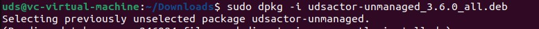

Если вы получили ошибку из-за отсутствия зависимостей, вы перейдете к ее установке:


После установки необходимых зависимостей вы запустите конфигурацию UDS Actor:


Перейдите к регистрации субъекта на UDS-сервере, указав следующие параметры:

**Проверка SSL:** Тип безопасности для связи с UDS-сервером

Рекомендуется получить максимально возможную безопасность, активировать проверку сертификата

**"Verify Certificate**" в противном случае будет большой риск для безопасности платформы.

**UDS-сервер:** Имя или IP-адрес UDS-сервера

**Маркер службы:** Код, созданный в администрировании UDS, в типе услуги "***Static Multiple IP**_" в рамках поставщика услуг "_**Static IP Machines Provider***".

**Уровень журнала:** Типы журналов, отображаемые в файлах журналов субъекта UDS. Эти файлы журналов (udsactor.log) будут расположены по пути: /var/log/

**Restrict Net**: Добавляет возможность разграничения сетей для соединения с UDS. Сеть, которую мы укажем, будет использоваться UDS для уведомления о доступе пользователя к машине.

Необходимо для случаев, когда у нас более одной сетевой карты, в противном случае оставьте пустым


**ПРИМЕЧАНИЕ**: Чтобы обеспечить платформе максимально возможную безопасность, для проверки сертификата необходимо выбрать опцию «Проверить сертификат».


После того, как эти данные будут указаны, нажмите на "***Сохранить конфигурацию***":

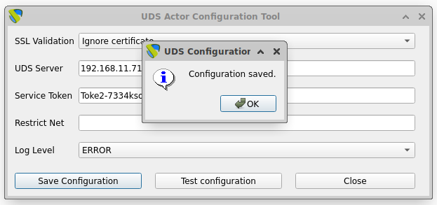

Необходимо будет запустить конфигурационный тест, чтобы проверить правильность указанных данных и наличие связи с UDS Server:


После завершения установки и настройки UDS Actor компьютер будет доступен для назначения UDS и для управления пользовательскими сеансами.

**ПРИМЕЧАНИЕ:** В дополнение к установке UDS Actor необходимо включить протокол подключения, который будет использоваться для подключения к сгенерированным рабочим столам (например, установить и включить XRDP).

##### виртуальных приложений Windows

Чтобы UDS могла публиковать сеансы приложений Windows и управлять их жизненным циклом, на серверах приложений Windows Server должен быть установлен субъект UDS: ***RDSActorSetup 3.6.0.exe***

###### ПРИМЕЧАНИЕ: {#note-2 .unnumbered}

Перед установкой UDS Actor необходимо иметь IP-адрес или имя UDS-сервера, учетные данные пользователя с правами администратора в среде UDS и по крайней мере один аутентификатор, зарегистрированный в системе.

После загрузки UDS Actor для серверов приложений Windows Server запустите его от имени администратора, чтобы продолжить установку.

Выберите язык инсталлятора:

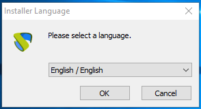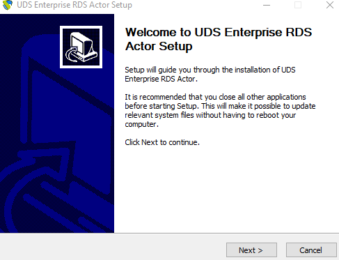

Укажите путь установки UDS Actor:


Нажмите на **"Установить"**, чтобы продолжить установку:

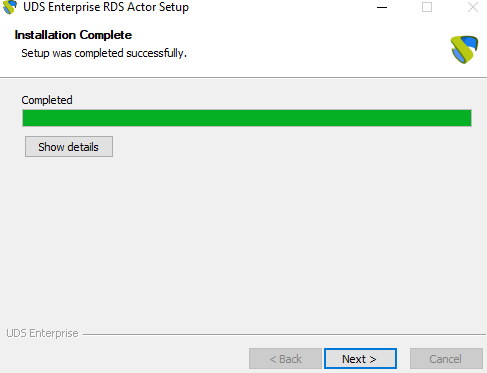

После завершения установки перейдите к настройке UDS Actor:

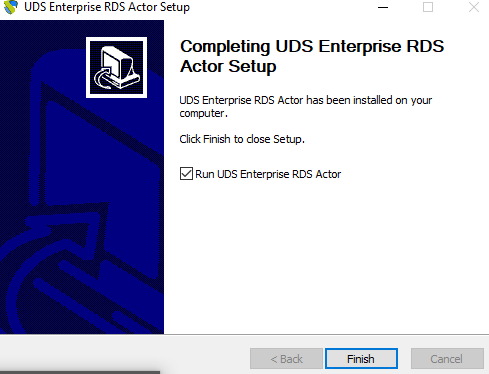

Зарегистрируйте Актор на UDS-сервере, указав следующие параметры:

**Проверка SSL:** Тип безопасности для связи с сервером UDS.

Рекомендуется получить максимально возможную безопасность, активировать проверку сертификата

**"Verify Certificate**" в противном случае будет большой риск для безопасности платформы.

**UDS-сервер:** Имя или IP-адрес UDS-сервера.

**Аутентификатор:** Аутентификатор, к которому принадлежит пользователь-администратор, указанный для регистрации субъекта UDS.

Необходимо, чтобы связь с UDS-сервером осуществлялась корректно, чтобы отображались различные аутентификаторы. В администрировании UDS должен быть зарегистрирован хотя бы один (аутентификатор "***Administration***" соответствует суперпользователю, созданному в мастере настройки UDS-сервера).

**Имя пользователя:** Имя пользователя с правами администратора в среде UDS (должно принадлежать выбранному выше аутентификатору).

**Пароль:** Пароль пользователя-администратора.

**Процедура безопасного использования:** Пароли должны быть достаточной длины и включать прописные, строчные буквы, цифры и специальные символы.

**Уровень журнала:** Типы журналов, отображаемые в файлах журналов субъекта UDS.


**ПРИМЕЧАНИЕ**: Чтобы обеспечить платформе максимально возможную безопасность, для проверки сертификата необходимо выбрать опцию «Проверить сертификат».


После того, как все необходимые данные были указаны, нажмите на «Зарегистрироваться в UDS»:


После того, как эти данные будут указаны, нажмите «Проверить параметры», чтобы убедиться в правильности указанных данных и наличии подключения к UDS-серверу.

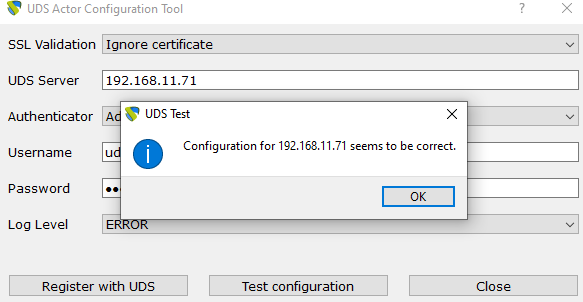

Очень важно отметить, что если какие-либо данные будут изменены, то после этого всегда необходимо будет осуществить процесс регистрации (нажав на кнопку «Зарегистрироваться в UDS»), если это действие не будет выполнено, изменения не будут применены.

После установки и настройки субъекта UDS для серверов RDS можно установить компонент сеанса удаленного рабочего стола (RDS) и интегрировать его с субъектом UDS, чтобы предоставить пользователям сеансы приложений.

Чтобы приступить к интеграции UDS со службами удаленных рабочих столов, вы можете обратиться к руководству «Установка и настройка Microsoft RDS с OpenUDS», доступному в [[documentation]{.underline}](https://www.udsenterprise.com/es/uds-enterprise/documentacion/), [[section]{.underline}](https://www.udsenterprise.com/es/uds-enterprise/documentacion/) веб-сайта OpenUDS.

#### UDS-клиент

Клиент UDS - это программный компонент, который устанавливается на клиентские компьютеры подключения, которые будут запускать службы UDS (виртуальные рабочие столы, сеансы приложений и т.д.). Для всех типов подключений, поддерживаемых UDS, этот компонент будет обязательным, за исключением подключения HTML5 (для которого требуется только веб-браузер)

Для выполнения установки UDS-клиента необходимо выполнить предварительную загрузку с UDS-сервера (брокера), выбрав соответствующий клиент для каждого типа ОС, с которого нам необходимо получить доступ к сервисам, предоставляемым UDS.

Чтобы выполнить загрузку, зайдите на портал входа в UDS и в верхнем меню выберите "***UDS Client***":

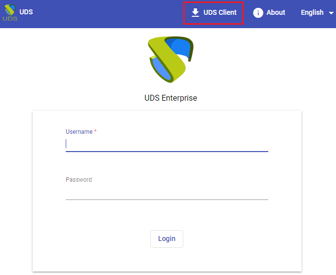

Клиенты UDS, доступные для скачивания, будут отображаться в браузере. Выберите клиент, соответствующий операционной системе, из которой необходимо получить доступ к различным службам, предоставляемым UDS:

* **Клиент Windows:** Клиент UDS для клиентов подключения к Windows OS.
* **Клиент Mac OS X:** Клиент UDS для клиентов подключения MacOS O.S.
* **Клиент Linux на основе Debian:** Клиент UDS для клиентов подключения к Linux O.S., основанным на Debian, таких как Ubuntu, xUbuntu и т.д.
* **Клиент Linux на основе RPM:** UDS-клиент для подключения клиентов с операционной системой Linux на базе Red Hat, Suse и т.д. как: CentOS, Fedora и т.д.
* **Двоичный образ приложения X86_64 Linux-клиент:** UDS-клиент для подключения клиентов к операционной системе Linux. Помимо клиента UDS, этот клиент включает в себя клиент FreeRDP версии 2.3 и клиент X2Go.
* **Двоичный образ приложения Клиент Raspberry Linux:** Портативный клиент UDS для подключения клиентов для устройств Raspberry Pi. Помимо UDS-клиента, этот клиент включает в себя версию FreeRDP

2.3 клиент и клиент X2Go.

**ПРИМЕЧАНИЕ**: Для запуска клиента appimage необходимо установить библиотеку libfuse2 (libfuse2 для Ubuntu 22 и соответствующую для остальных дистрибутивов).

* **Genenic.tar.gz Linux:** Исходные файлы клиента UDS для O.S Linux


##### Windows

Для подключения к службам UDS из клиентов подключения Windows OS у них должен быть установлен клиент UDS: ***UDSClientSetup-3.6.0.exe***

После загрузки UDS-клиента для Windows OS запустите его, чтобы продолжить установку. Выберите язык инсталлятора:


Укажите путь установки UDS-клиента:

Нажмите на "***Установить*"**, чтобы продолжить установку:

После завершения установки завершите работу мастера установки:

После завершения установки UDS-клиент выполнит выбранный протокол подключения (Transport) и подключится к запрошенной службе.

**ПРИМЕЧАНИЕ:** Если вы получаете доступ к службе с типом подключения HTML5, нет необходимости устанавливать UDS-клиент на клиентском компьютере подключения. Единственным требованием для этого подключения является наличие актуального веб-браузера.

##### MacOS

Для подключения к UDS-сервисам из клиентов подключения с ОС MacOS необходимо, чтобы у них был установлен UDS-клиент: ***UDSClient-3.6.0.pkg***

После того, как UDS-клиент для S.O. MacOS, мы запустим его, чтобы продолжить установку. Изначально появится предупреждение, которое не позволяет нам его выполнить:


Чтобы решить эту проблему, зайдите: меню Apple Системные настройки, нажмите Безопасность и конфиденциальность, Общие:

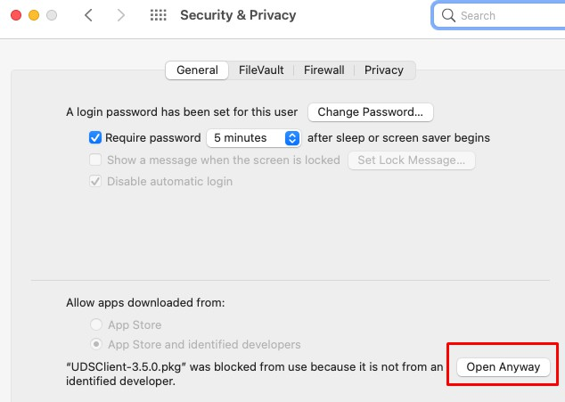

Нажмите на "**Open Anyway**", чтобы открыть UDS-клиент.


Приступаем к установке UDS Client:

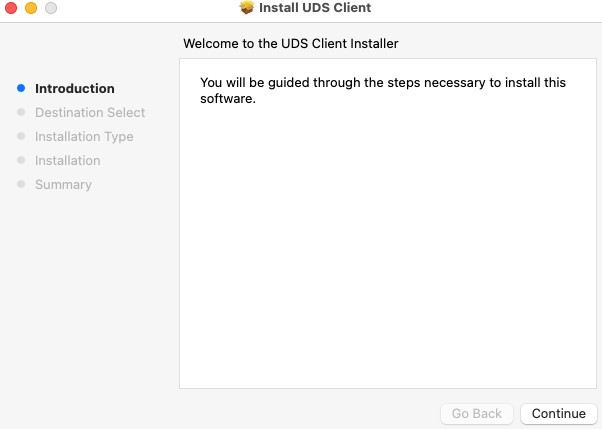

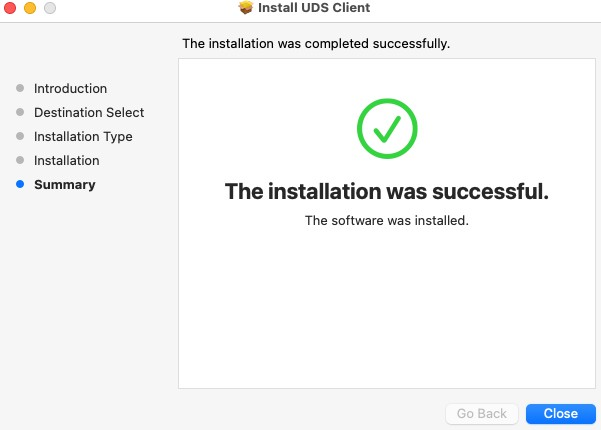

После завершения установки UDS-клиент запустит клиент протокола RDP (он должен быть предварительно установлен) для подключения к запрошенной службе.

**ПРИМЕЧАНИЕ:** Если вы получаете доступ к службе с типом подключения HTML5, нет необходимости устанавливать UDS-клиент на клиентском компьютере подключения. Единственным требованием для этого подключения является наличие актуального веб-браузера.

Клиент UDS может использовать клиенты RDP: FreeRDP или Microsoft Remote Desktop, для получения дополнительной информации о его установке и настройке вы можете обратиться к руководству: «Включение подключения RDP с устройств MacOS», доступному в [[разделе документации]{.underline}](https://www.udsenterprise.com/en/uds-enterprise/documentation/) веб-сайта OpenUDS.

##### Linux

Для подключения к службам UDS из клиентов подключения Linux O.S. у них должен быть установлен клиент UDS для различных дистрибутивов Linux:

* **Дистрибутивы на основе Debian: *udsclient3_3.6.0_all.deb***
* **Дистрибутивы Red Hat и Suse: *udsclient3-3.6.0-1.noarch.rpm***

После загрузки клиента UDS для выбранного дистрибутива Linux запустите его, чтобы продолжить установку.

Настоятельно рекомендуется выполнять выполнение Актора через командную консоль следующим образом:


Если вы получаете ошибку из-за отсутствия зависимостей, переходите к ее установке:

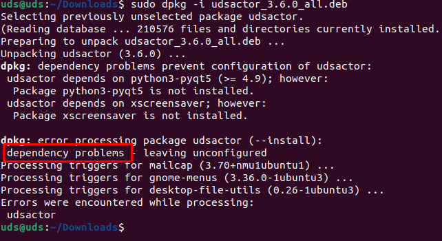

Si tenemos problemas de dependencias tendremos que lanzar el siguiente comando:


Как только необходимые зависимости будут установлены, установка завершится. UDS-клиент выполнит выбранный протокол подключения (Transport) и подключится к запрошенной службе.

**ПРИМЕЧАНИЕ:** Если вы получаете доступ к службе с типом подключения HTML5, нет необходимости устанавливать UDS-клиент на клиентском компьютере подключения. Единственным требованием для этого подключения является наличие актуального веб-браузера.

Если вам нужно удалить UDS-клиент, вы можете сделать это с помощью команды:

**dpkg -P udsclient3**


##### Linux AppImage

Для подключения к UDS-сервисам из клиентов связи с S.O. Linux необходимо, чтобы у них был установлен UDS-клиент, этот клиент в своей модальности "***Self-contained***", сгенерированной с помощью AppImage, позволит вам также иметь UDS-клиент: FreeRDP (версия 2.3), клиент X2Go и Python (3.8udsclient) без наличия этих элементов в качестве требования для выполнения его установки.

**ПРИМЕЧАНИЕ:** Этот клиент UDS AppImage может быть использован практически в любом дистрибутиве Linux (на основе Debian, Red Hat, Suse и т.д.).

**ПРИМЕЧАНИЕ**: Для запуска клиента appimage необходимо установить библиотеку libfuse2 (libfuse2 для Ubuntu 22 и соответствующую для остальных дистрибутивов).

После загрузки UDS AppImage Client: ***udsclient3-x86_64-3.6.0.tar.gz*** распакуйте его:


Выполнение скрипта с правами администратора ***installer.sh***


После завершения установки скрипта мы сможем подключаться к виртуальным рабочим столам и приложениям Windows по протоколу RDP (через клиент FreeRDP) и к виртуальным приложениям Linux через клиент X2Go.

**ПРИМЕЧАНИЕ:** Если вы обращаетесь к службе с типом подключения HTML5, нет необходимости устанавливать UDS-клиент на клиентском компьютере подключения. Единственным требованием для этого подключения является наличие актуального веб-браузера

После завершения выполнения скрипта мы можем удалить файлы, полученные в результате распаковки UDS AppImage

## УПРАВЛЕНИЕ OpenUDS

После установки компонентов платформы UDS система готова приступить к настройке. Введите IP-адрес или имя UDS-сервера (брокера) через http или https доступ.

При первом входе на панель администрирования UDS необходимо войти с помощью пользователя администратора и пароля, указанного в сценарии настройки виртуального устройства UDS Broker.

Как только вы получите доступ к панели администрирования, вы сможете изменить пароль и создать или выбрать новых пользователей для входа в панель администрирования.

В случае, если у вас уже есть пользователь с правами администратора в UDS-платформе, укажите пользователя, пароль и выберите аутентификатор, с помощью которого пользователь будет валидировать (только в случае наличия более одного аутентификатора).

Если к платформе UDS подключено более одного аутентификатора и вы хотите получить доступ к панели администрирования с пользователем-администратором и паролем, указанным в конфигурационном скрипте виртуального устройства UDS Broker, выбранный аутентификатор использоваться не будет, так как этот пользователь не будет проверен ни на один аутентификатор.

В меню пользователя выберите "***Dashboard"*** для входа в администрирование UDS:

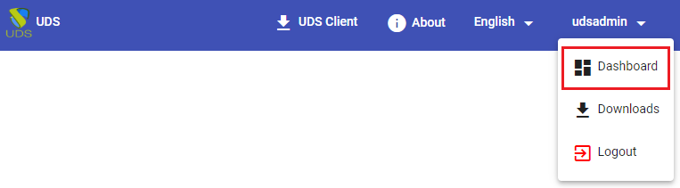

Оказавшись внутри администрирования UDS, выполняется первоначальная настройка компонентов, которые будут формировать "***Service Pool***". Это позволит развертывать и подключать различные сервисы, поддерживаемые UDS (виртуальные рабочие столы, сеансы виртуальных приложений и т. д.)


К настройке каждого "***Services Pool***" " нужно подходить как к сборке пазла:

* Каждый "***Services Pool**_" состоит из различных элементов или частей: "_**Базовые службы**_", "_**OS Managers**_", "_**Transports**_" y "_**Authenticators***"
* После того, как элементы первого "***Services Pool**_" будут настроены, начнется их создание, повторяя процесс со следующим "_**Services Pool***", если он есть
* Сумма уже настроенного пула "***Services Pool*** будет составлять тип развертывания рабочих столов и виртуальных приложений, управляемых платформой UDS

### Поставщики услуг

«***Поставщики услуг***» несут ответственность за предоставление услуг ИС.

Услуги, предлагаемые UDS, будут представлять собой виртуальные рабочие столы по требованию или приложения, предоставляемые платформой виртуализации, или постоянные физические/виртуальные рабочие столы, назначенные конкретным пользователям через назначение IP-адресов.

Для создания "***Service Pool**_" и публикации виртуальных рабочих столов и приложений необходимо создать хотя бы один "_**Service Providers**_", UDS поддерживает несколько "_**Service Providers***" " для одновременного запуска.

В настоящее время UDS поддерживает следующих "***Поставщиков услуг***":

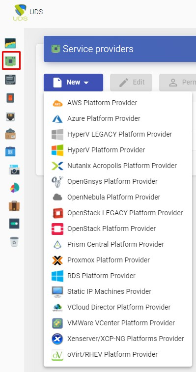

#### Платформа VDI с VMware vSphere

Развертывание самостоятельно генерируемых виртуальных рабочих столов UDS в инфраструктуре виртуализации VMware vSphere.

##### Зарегистрируйте поставщика услуг "VMware vCenter Platform Provider"

Нажмите «***Создать**_» и выберите «_**VMware vCenter Platform Provider***»:


В "***VMware vCenter Platform Provider***" минимальные параметры для настройки:

*Главный:

Имя поставщика услуг, IP-адрес сервера vCenter (поле "***Host***"), порт подключения Center, а также имя пользователя и пароль с правами администратора на vCenter.

*Продвинутый:

**Параллелизм создания**. Количество одновременных задач создания рабочего стола. **Параллелизм удаления**. Количество одновременных задач удаления рабочего стола. **Timeout.** "***Timeout***" " для подключения к vCenter.

**Линейка Mac**. Диапазон MAC-адресов, используемых UDS для создания виртуальных рабочих столов.

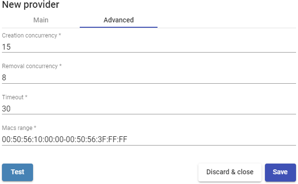

С помощью кнопки "***Test***" вы можете протестировать и убедиться в успешности подключения.

Сохраните конфигурацию, и у вас будет действительный "***Service Providers***" для начала регистрации базовых служб платформы VMware vSphere.


###### ПРИМЕЧАНИЕ: {#note-3 .unnumbered}

Если у нас есть несколько платформ VMware vSphere, управляемых разными серверами vCenter, мы можем зарегистрировать все необходимые нам "**Service Providers**" типа "**VMware vCenter Platform Provider**".

Для того, чтобы изменить какой-либо параметр в уже существующем "***Поставщики услуг**_" выберите его и нажмите на "_**Редактировать***".

С помощью кнопки «***Войти в режим обслуживания***» Вы можете приостановить все операции, выданные UDS Broker для данного поставщика услуг. Рекомендуется перевести вашего поставщика услуг в режим обслуживания на случай потери связи с ним или для остановки технического обслуживания.

После интеграции платформы VMware vSphere в UDS можно создавать различные типы базовых сервисов. Для этого дважды щелкните по созданному поставщику услуг и выберите "***Detail***" в меню провайдера:

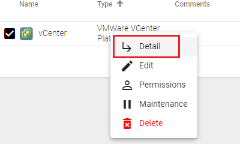

Вам будут доступны следующие виды базовых услуг:

###### ПРИМЕЧАНИЕ: {#note-4 .unnumbered}

Чтобы создать любую из базовых служб, поддерживаемых UDS, необходимо иметь по крайней мере одну сеть для подключения виртуальных машин, хранилище данных для хранения публикаций и рабочих столов, а также папку в представлении «Виртуальные машины и шаблоны». Если у вас нет ни одного из этих элементов, вы получите следующую ошибку:

##### Настройка службы на основе "На основе клона - Полная"

Этот тип службы создает в виртуальной инфраструктуре целые виртуальные рабочие столы, независимые от активной публикации.

Для создания базовых сервисов типа "***Clone based - Full**_" перейдите в "_**Service Providers**_", выберите вкладку "_**Services**_", нажмите на "_**New**_" и выберите "_**Clone based -- Full***".

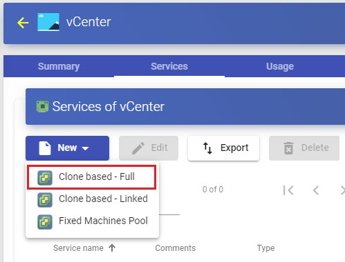

В "Clone based - Full" минимальные параметры, которые необходимо настроить, следующие:

*Главный:

**Имя:** Название службы.

**Центр обработки данных**: центр обработки данных среды VMware vSphere для размещения службы.

**Pub. Resource Pool**: пул ресурсов vCenter, в котором будут размещаться публикации и виртуальные рабочие столы (если пулы недоступны в инфраструктуре VMware, они будут созданы в корневом каталоге).

**Pub. Datastores**: Расположение, в котором будет храниться публикация сервиса. Вы можете выбрать одно, несколько или все доступные хранилища данных. В случае выбора нескольких, система всегда будет находить новые публикации в хранилище данных, в котором больше свободного места.

**Ошибка продолжения**: При активации система игнорирует все ошибки доступа к службе.

**Удалить найденные дубликаты**: Если эта опция активирована (значение по умолчанию), когда UDS находит виртуальный рабочий стол с тем же именем (и сгенерированным UDS), что и рабочий стол, который вы собираетесь создать, он удаляет его (рекомендуется использовать его, чтобы избежать существования «потерянных» виртуальных машин» в инвентаризации vCenter).

Попробуйте сначала выполнить мягкое завершение работы: При активации система попытается выполнить «мягкое» завершение работы в операционной системе виртуального рабочего стола.


*Машина:

**Пул ресурсов:** пул ресурсов vCenter, в котором находится шаблон виртуальной машины (Gold Image), который будет использоваться службой.

**Базовая машина:** Шаблон виртуальной машины (Gold Image), используемый системой UDS для развертывания виртуальных рабочих столов.

**Память**: Объем памяти в Мб, который будет назначен сгенерированным виртуальным полным клонам.

**Основная сеть**: Коммуникационная сеть субъекта UDS с сервером UDS. Он также определит сетевой интерфейс, который будет изменен в сгенерированных виртуальных рабочих столах.

**Pub. Network**: Сеть, к которой будут подключаться виртуальные рабочие столы.

**Папка клонов**: папка, в которой будут зарегистрированы новые виртуальные рабочие столы в представлении "Виртуальные машины и шаблоны" vCenter.

**Хранилища данных виртуальных машин**: расположение, в котором будут храниться созданные виртуальные рабочие столы. Можно выбрать одно, несколько или все хранилища данных. В случае выбора нескольких, система всегда будет находить новые виртуальные рабочие столы в хранилище данных, где больше свободного места.

**Имена компьютеров**: корневое имя всех виртуальных рабочих столов Full Clones, которые будут развернуты в этой службе. (например: Machine Names= Win10-full-).

**Длина имени**: Количество цифр счетчика, прикрепленного к корню имени рабочего стола (например, длина имени = 3. Окончательное имя сгенерированных рабочих столов будет таким: Win10-full-**000**, Win10-full-**001** ... Win10-full-**999**).


*Продвинутый:

**Зарезервированное пространство:** Если в хранилище данных меньше свободного места, чем указано в этом параметре (в ГБ), UDS не будет использовать его для размещения публикаций или виртуальных рабочих столов.

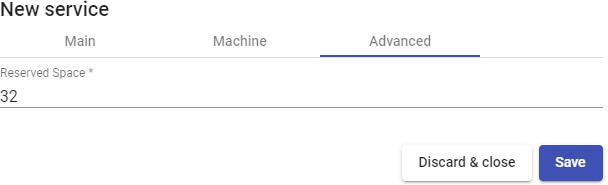

Сохраните конфигурацию, и вы получите действительный код "***Clone based - Full**_" на платформе VMware vCenter. Вы можете зарегистрировать все сервисы типа"_**Clone based - Full***, которые вам нужны.


После настройки полной среды UDS (службы, аутентификаторы, диспетчеры ОС и транспорты) и первого пула служб **** вы сможете наблюдать, как виртуальные рабочие столы на основе связанных клонов VMware развертываются на сервере vCenter.

Первой задачей, которую выполнит vCenter, будет создание базовой машины (эта машина будет создаваться каждый раз, когда вы публикуете службу), которая будет являться клоном шаблона, выбранного при регистрации службы, с размером жесткого диска и функциями, равными указанному шаблону.

После завершения процесса клонирования базовой машины (система UDS называет ее как: "UDS Publication _nombre_pool-número_publicación_") в vCenter автоматически создаются виртуальные рабочие столы (система называет их как: "UDS service

_Machine_Name+Name_Length_") на основе параметров кэша, настроенных в "***Service Pools***".

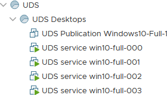

###### ПРИМЕЧАНИЕ: {#note-5 .ненумерованный}

Дисковое пространство, которое будут занимать виртуальные рабочие столы («полные клоны»), будет таким же, как и у шаблонной машины.

##### Настройка службы на основе "Clone based -- Linked"

Этот тип службы создает в виртуальной инфраструктуре виртуальные рабочие столы в режиме связанного клонирования в зависимости от активной публикации.

Для создания базовых сервисов типа "***Clone based -- Linked**_" перейдите в раздел "_**Service Providers**_", выберите вкладку "_**Services**_", нажмите на "_**New**_" и выберите "_**Clone based -Linked***".

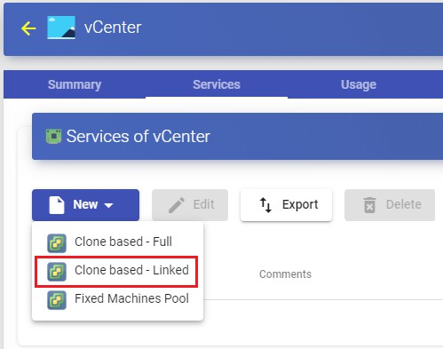

В "Clone based - Linked" минимальные параметры, которые необходимо настроить, следующие:

*Главный:

**Имя:** Название службы.

**Центр обработки данных**: центр обработки данных среды VMware vSphere для размещения службы.

**Pub. Resource Pool**: пул ресурсов vCenter, в котором будут размещены публикации и виртуальные рабочие столы (если пулы недоступны в инфраструктуре VMware, они будут созданы в корневом каталоге).

**Pub. Datastores**: Расположение, в котором будет храниться публикация сервиса. Вы можете выбрать одно, несколько или все доступные хранилища данных. В случае выбора нескольких, система всегда будет находить новые публикации в хранилище данных, в котором больше свободного места.

**Ошибка продолжения:** При активации система игнорирует все ошибки доступа к службе.

**Удалить найденные дубликаты**: Если эта опция активирована (значение по умолчанию), когда UDS находит виртуальный рабочий стол с тем же именем (и сгенерированным UDS), что и рабочий стол, который вы собираетесь создать, он удаляет его (рекомендуется использовать его, чтобы избежать существования «потерянных» виртуальных машин в инвентаризации vCenter).

**Сначала попробуйте SOFT Shutdown:** При активации система попытается выполнить «мягкое» завершение работы в операционной системе виртуального рабочего стола.

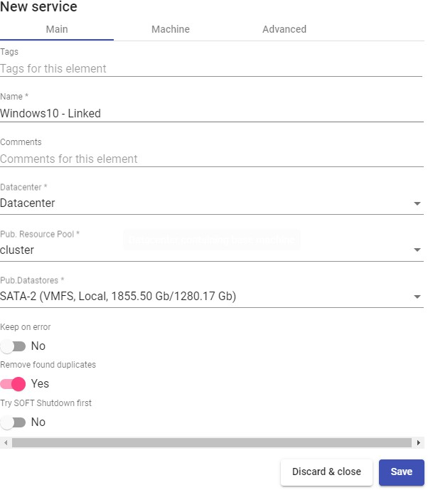

*Машина:

**Пул ресурсов:** пул ресурсов vCenter, в котором находится шаблон виртуальной машины (Gold Image), который будет использоваться службой.

**Базовая машина:** Шаблон виртуальной машины (Gold Image), используемый системой UDS для развертывания виртуальных рабочих столов.

**Память**: Объем памяти в Мб, который будет назначен виртуально сгенерированным полным клонам.

**Основная сеть**: Коммуникационная сеть субъекта UDS с сервером UDS.

**Pub. Network**: Сеть, в которой будут подключаться виртуальные рабочие столы.

**Папка клонов**: папка, в которой будут зарегистрированы новые виртуальные рабочие столы в представлении "Виртуальные машины и шаблоны" vCenter.

**Хранилища данных виртуальных машин**: расположение, в котором будут храниться созданные виртуальные рабочие столы. Можно выбрать одно, несколько или все хранилища данных. В случае выбора нескольких, система всегда будет находить новые виртуальные рабочие столы в хранилище данных, где больше свободного места.

**Имена компьютеров**: корневое имя всех виртуальных рабочих столов Linked Clones, которые будут развернуты в этой службе. (например: Имена компьютеров = Win10-)

**Длина имени:** Количество цифр счетчика, прикрепленного к корню имени рабочего стола (например: Длина имени = 3. Окончательное имя сгенерированных рабочих столов будет следующим:

Win10-**000**, Win10-**001** ... Win10-**999**)

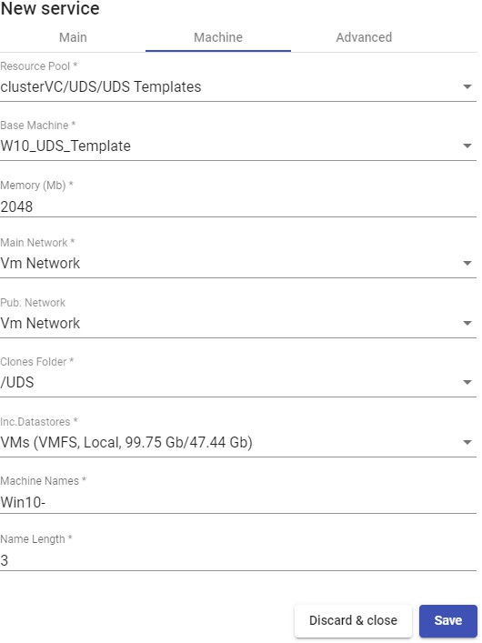

*Продвинутый:

**Зарезервированное пространство:** Если в хранилище данных меньше свободного места, чем указано в этом параметре (в ГБ), UDS не будет использовать его для размещения публикаций или виртуальных рабочих столов


При сохранении этой конфигурации у вас уже будет допустимое значение "***Clone based - Linked**_" на платформе VMware vCenter. Вы можете зарегистрировать все "_**Clone based - Linked***", которые вам нужны в платформе UDS.


После настройки полной среды UDS (службы, аутентификаторы, диспетчеры ОС и транспорты) и создания первого пула *** служб*** вы сможете наблюдать, как виртуальные рабочие столы на основе связанных клонов VMware развертываются на сервере vCenter.

Первая задача, которую выполнит vCenter, будет заключаться в создании базовой машины (эта машина будет создаваться каждый раз, когда вы делаете публикацию службы), которая будет являться клоном шаблона, выбранного при регистрации службы, с размером жесткого диска и функциями, равными указанному шаблону.

После завершения процесса клонирования базового компьютера (система UDS называет его как: "UDS Publication _nombre_pool-número_publicación_") виртуальные рабочие столы автоматически создаются в vCenter (система UDS называет их как: "UDS service

_Machine_Name+Name_Length_") на основе параметров кэша, настроенных в "***Service Pools***".

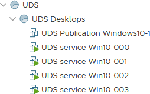

###### ПРИМЕЧАНИЕ: {#note-6 .unnumbered}

Дисковое пространство, занимаемое виртуальными дектопами ("Связанными клонами"), будет занято исключительно изменениями, внесенными пользователями на машинах после их первоначального подключения.

##### Настройка службы на основе «Фиксированного пула компьютеров»

Этот тип услуг позволит напрямую подключать пользователей к существующим виртуальным машинам в пуле среды VMware vSphere.

Для создания базовых сервисов типа "***Fixed Machines Pool**_" перейдите в раздел "_**Service Providers**_", выберите вкладку "_**Services**_", нажмите на "_**New**_" y и выберите "_**Fixed Machines Pool***".


В "Fixed Machines Pool" необходимо настроить следующие минимальные параметры:

*Главный:

**Имя:** Название службы.

**Маркер службы:** Если требуется, чтобы UDS распознал "***login**_" и "_**logout**_" пользователя, который обращается к службе этого типа (чтобы при "_**logout***" UDS автоматически освобождал компьютер и делал его доступным для другого пользователя), необходимо было заполнить это поле буквенно-цифровыми символами. Если поле оставлено пустым, UDS навсегда назначит компьютер пользователю (до тех пор, пока администратор вручную не освободит службу).

###### ПРИМЕЧАНИЕ: {#note-7 .unnumbered}

Если заполнено поле "**Service Token**", то на машинах, выбранных для подключения, необходимо будет установить UDS Actor "**UDSActorUnmanagedSetup-x.x.x.exe**" и в его конфигурации нужно указать те же символы в поле "**Service Token**".

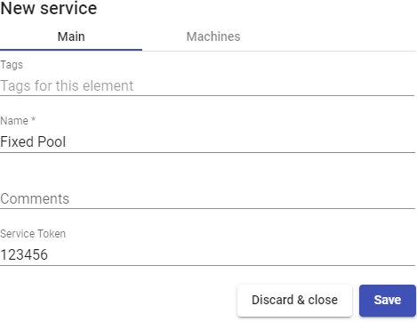

*Машина:

**Центр обработки данных:** Центр обработки данных среды vSphere, в котором размещены виртуальные машины, которыми мы хотим управлять и назначать пользователям.

**Пул ресурсов:** Пул ресурсов, в котором находятся виртуальные машины, которыми мы хотим управлять и назначать пользователям.

**Машины:** Виртуальные машины, существующие в указанном выше пуле ресурсов, которые будут управляться UDS и доступ к которым может быть предоставлен разным пользователям. Вы можете выборочно выбрать машины:

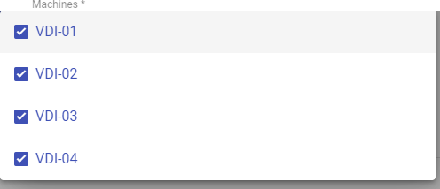

**Использовать моментальные снимки:** Если этот параметр включен, UDS будет создавать моментальный снимок на виртуальной машине перед подключением пользователя. После того, как его назначение будет удалено (путем автоматического определения выхода пользователя из системы или ручного удаления администратором), снимок будет восстановлен, так что компьютер будет находиться в том же состоянии, в котором он был до подключения пользователя. Если этот параметр не активирован, UDS не будет восстанавливать предыдущее состояние компьютера при удалении назначения пользователю.

###### ПРИМЕЧАНИЕ: {#note-8 .unnumbered}

Если опция "**Использовать снимки**" активирована и у виртуальной машины уже есть снимок, UDS не будет выполнять дополнительный снимок и восстановит существующий.

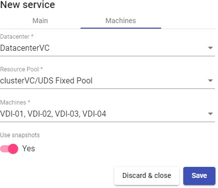

Сохранив конфигурацию, вы получите действительный "***Fixed Machines Pool***" на VMware

Платформа vCenter. Вы сможете зарегистрировать все необходимые вам услуги "***Fixed Machine Pool***"

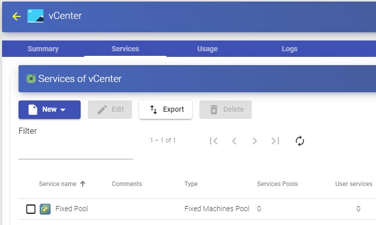

##### Сводка журналов использования Сервиса и ошибок

В разделе "***Поставщик услуг**_" у вас будет вкладка под названием "_**Использование**_", которая позволит вам быстро просмотреть подробную информацию и выполнить основные действия с услугами, отображаемыми в этом "_**Поставщик услуг***".

Чтобы получить доступ к этой информации об использовании услуг, зайдите в раздел «***Поставщики услуг**_» и выберите «_**Использование***»:


Увидите:

**Доступ:** Дата и время доступа к сервису.

**Владелец:** Пользователь и аутентификатор, назначенные сервису в формате user@authenticator. Если он пустой, это означает, что сервис не был назначен ни одному пользователю и доступен в кэше.

**Сервис:** Название базовой услуги, принадлежащей «Поставщику услуг», от которого была сгенерирована услуга.

**Пул:** Название "***Service Pools***", к которому принадлежит сервис.

**Unique ID:** Dirección MAC del servicio.

**IP:** IP-адрес сервиса.

**Понятное имя:** Название службы. В базовых службах "***Clone based -- Full**_" и "_**Clone base -- Linked***" это также будет DNS-имя виртуальной машины, самостоятельно сгенерированной UDS.

**Src Ip**: IP-адрес клиента, обращающегося к сервису.

**Src Host:** DNS-имя клиента соединения, который обращается к службе. Если вы не можете получить доступ к этому имени, будет указан ваш IP-адрес.

Также можно будет выбрать одну или несколько служб, чтобы приступить к их устранению (в базовой услуге типа "***Fixed Machine Pool***" вы устраните только назначение с пользователем).

На вкладке "***Журналы**_" будет показана информация о любой возможной проблеме, возникшей в "_**Поставщике услуг***":


#### VDI-платформа с Nutanix Acropolis

Развертывание и подключение к виртуальным рабочим столам в инфраструктуре виртуализации Nutanix AHV

##### Зарегистрируйте поставщика услуг "Nutanix Acropolis Platform Provider"

Нажмите на «***Новый**_» и выберите «_**Поставщик платформы Nutanix Acropolis***».


В "***Nutanix Acropolis Provider***" минимальные параметры для настройки:

*Главный:

Наименование поставщика услуг, IP-адрес или название веб-консоли для доступа к платформе AHV (поле "***Host***"), порт подключения, логин и пароль с правами администрирования.

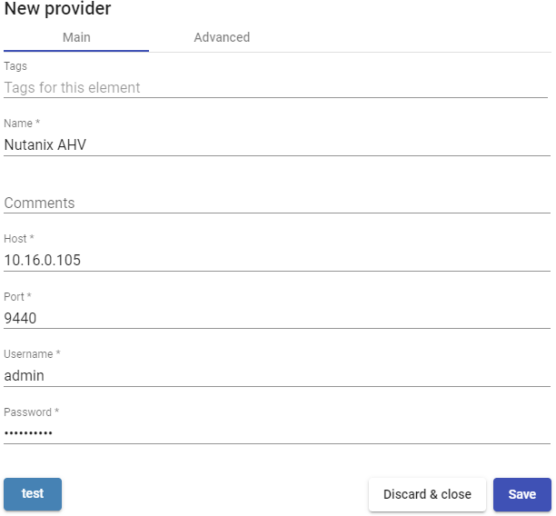

*Продвинутый:

**Параллелизм создания:** Количество одновременных задач создания рабочего стола. **Параллелизм удаления**: количество одновременных задач удаления рабочего стола. **Timeout:** "***Timeout*** для подключения к платформе AHV.

**Диапазон компьютеров Mac:** Диапазон MAC-адресов, используемых UDS для создания виртуальных рабочих столов.


С помощью кнопки "***Test***" вы можете проверить, что соединение выполнено правильно.

Сохраните конфигурацию, и у вас будет действительный "***Поставщики услуг***" для начала регистрации базовых услуг на платформе Nutanix AHV

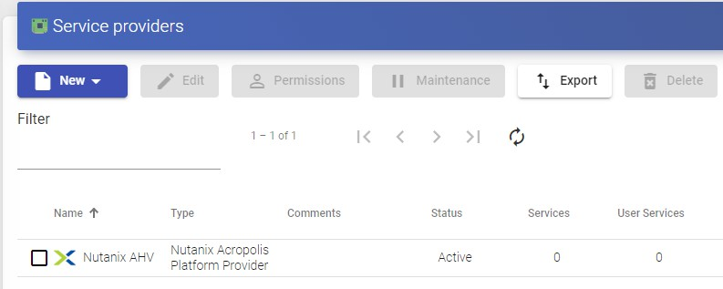

###### ПРИМЕЧАНИЕ: {#note-9 .unnumbered}

Если у Вас несколько платформ Nutanix AHV, Вы можете зарегистрировать всех необходимых Вам "**Поставщиков услуг**" типа "**Провайдер Nutanix Acropolis**".

Чтобы изменить какой-либо параметр в существующем "***Поставщики услуг**_", вы должны выбрать его и нажать на "_**Редактировать***".

С помощью кнопки "***Войти в режим обслуживания***" можно приостановить все операции, выполняемые UDS-сервером на сервис-провайдере. Рекомендуется переводить поставщика услуг в режим обслуживания в случаях, когда связь с этим поставщиком услуг была потеряна или планируется остановка обслуживания.

После интеграции платформы Nutanix AHV в UDS можно создавать базовые сервисы. Для этого дважды кликаем по созданному поставщику услуг, либо в меню провайдера выбираем "***Detail***":


##### Настроить услугу на базе «Nutanix Acropolis Service»

Этот тип службы создает в виртуальной инфраструктуре виртуальные рабочие столы, зависящие от активной публикации.

Чтобы создать базовые услуги типа "***Nutanix Acropolis Service**_" Перейдите в раздел "_**Поставщики услуг**_", выберите вкладку "_**Услуги**_", нажмите на "_**Новые**_" и выберите "_**Nutanix Acropolis Service***".


Минимальные параметры для настройки в этом типе сервиса:

*Главный:

**Имя:** Название службы.

**Имена компьютеров**: корень имен всех виртуальных рабочих столов, которые будут развернуты в этой службе. (например: Machine Names= Desk-ubun-).

**Длина имени:** Количество цифр счетчика, прикрепленного к корню рабочего стола

name (например: Длина имени= 3. Окончательное имя сгенерированных рабочих столов будет таким: Deskubun-**000**, Desk-ubun-**001**... Письменный стол-убун-**999**).

**Удалить найденные дубликаты**: Если эта опция активирована (значение по умолчанию), когда UDS найдет виртуальный рабочий стол с тем же именем (и сгенерированным UDS), что и рабочий стол, который вы собираетесь создать, он удалит его (рекомендуется использовать его, чтобы избежать существования «потерянных» виртуальных машин).

**Сначала попробуйте SOFT Shutdown:** При активации система попытается выполнить «мягкое» завершение работы в операционной системе виртуального рабочего стола.


*Машина:

**Базовая машина**: шаблонная виртуальная машина (Gold Image), используемая системой UDS для развертывания виртуальных рабочих столов.

**Память:** Объем памяти в Мб, выделяемый для создаваемых виртуальных рабочих столов.

**VCPUS:** Количество виртуальных ЦП, которые будут иметь сгенерированные рабочие столы (значение -1 будет использовать конфигурацию шаблона)

**Количество ядер на виртуальный ЦП:** Количество ядер на виртуальные ЦП, которые будут иметь сгенерированные настольные компьютеры (значение -1 будет использовать конфигурацию шаблона)

**Сеть**: Сеть, к которой будут подключаться виртуальные рабочие столы.


Сохраните конфигурацию, и у вас будет действительный "***Nutanix Acropolis Service**_" на платформе Nutanix. Вы можете зарегистрировать все необходимые вам "_**Nutanix Acropolis Service***" на платформе UDS.


После того, как вы настроили всю среду UDS (службы, аутентификаторы, менеджеры ОС и транспорты) и создали первый "***Service Pool***", вы сможете наблюдать в веб-консоли Nutanix AHV за тем, как выполняется развертывание рабочего стола.

Первой задачей, которая будет выполнена, будет создание публикации шаблона (эта машина будет генерироваться каждый раз, когда вы делаете публикацию услуги). Это будет клон шаблона, выбранного при регистрации сервиса, с размером диска и характеристиками, равными этому шаблону.

Как только процесс создания публикации будет завершен (система назовет его как: "UDSP _nombre_pool- número_publicación_"), рабочие столы будут автоматически созданы (

система называет их как: "UDSS-_number_publicatión Machine_Name+Name_Length_") в зависимости от параметров кэша, настроенных в "***Service Pools***".

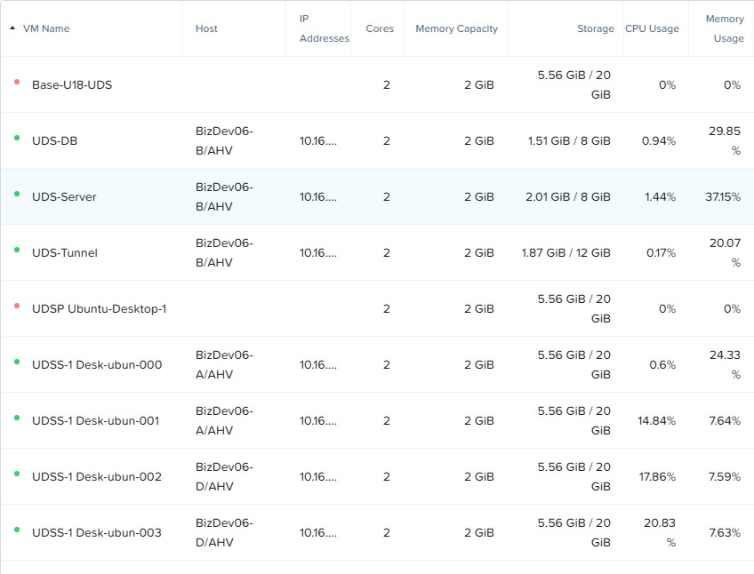

##### Сводка журналов использования службы и ошибок

В разделе "***Поставщик услуг**_" у вас будет вкладка под названием "_**Использование**_", которая позволит вам быстро просмотреть подробную информацию и выполнить основные действия с услугами, отображаемыми в этом "_**Поставщик услуг***".

Чтобы получить доступ к этой информации об использовании услуг, перейдите в раздел «***Поставщики услуг**_» и выберите вкладку «_**Использование***»:

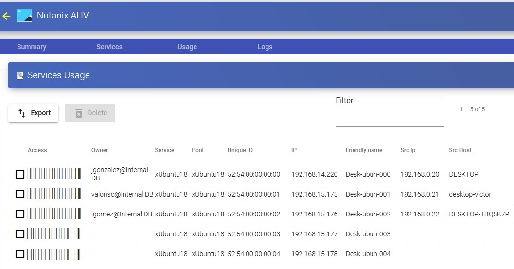

Увидите:

**Доступ:** Дата и время доступа к сервису.

**Владелец:** Пользователь и аутентификатор, назначенные сервису в формате user@authenticator. Если он пустой, это означает, что сервис не был назначен ни одному пользователю и доступен в кэше.

**Сервис:** Имя базовой службы, принадлежащей "***Поставщику услуг***", от которого была сгенерирована услуга.

**Пул:** Название "***Service Pools***", к которому принадлежит сервис.

**Уникальный идентификатор:** MAC-адрес сервиса.

**IP:** IP-адрес сервиса.

**Понятное имя:** Название службы. Это также будет DNS-имя самостоятельно созданной виртуальной машины UDS.

**Src Ip:** IP-адрес клиента, обращающегося к сервису.

.

**Src Host:** DNS-имя клиента соединения, который обращается к службе. Если вы не можете получить доступ к этому имени, будет указан IP-адрес.

Также можно будет выбрать одну или несколько услуг, чтобы приступить к их устранению.

На вкладке "***Журналы**_" будет показана информация о возможной проблеме, возникшей в "_**Поставщике услуг***":

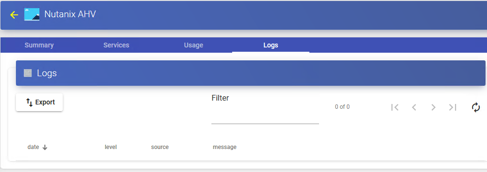

#### Платформа VDI с Citrix XenServer / XCP-ng

Развертывание и подключение к виртуальным рабочим столам в инфраструктуре виртуализации Citrix XenServer или XCP-ng.

##### Зарегистрируйте поставщика услуг "XenServer / XCP-NG Platform Provider"

Нажмите на "***New**_" и выберите "_**Xenserver / XCP-NG Platform Provider***".


В "***Xenserver / XCP-NG Platform Provider***" минимальные параметры для настройки:

*Главный:

Имя поставщика услуг, IP-адрес или имя сервера XenServer/XCP-ng. В случае, если вы хотите подключить кластер (Pool), введите Мастер-сервер "***Host field***"), логин и пароль с правами администрирования XenServer/XCP-ng.


*Продвинутый:

**Параллелизм создания:** Количество одновременных задач создания рабочего стола.

**Параллелизм удаления:** Количество одновременных задач удаления рабочего стола.

**Диапазон компьютеров Mac:** Диапазон MAC-адресов, используемых UDS для создания виртуальных рабочих столов.

**Проверка сертификата:** Проверка сертификата узла виртуализации.

**Резервный хост:** Резервный сервер, который будет использоваться, когда нет связи с основным сервером, указанным в поле "**Host**" вкладки "**Main**".


С помощью "***Test***" вы можете убедиться, что соединение выполнено правильно.

Сохраните конфигурацию, и у вас будет действительный "***Service Providers***" для начала регистрации базовых сервисов на платформе Citrix XenServer или XCP-ng.

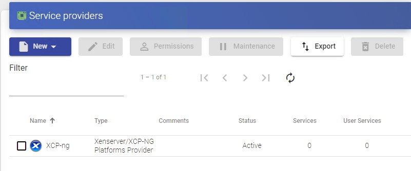

###### ПРИМЕЧАНИЕ: {#note-10 .unnumbered}

Если у вас есть несколько платформ Citrix XenServer или XCP-ng, вы можете зарегистрировать всех "**Поставщиков услуг**" типа "**Xenserver / XCP-NG Platform Provider**", которые вы

нуждаться.

Чтобы изменить какой-либо параметр в существующем "***Поставщики услуг***, вы должны выбрать его и нажать на "***Редактировать***".

С помощью кнопки "***Войти в режим обслуживания***" можно приостановить все операции, производимые UDS-сервером на сервис-провайдере. Рекомендуется переводить поставщика услуг в режим обслуживания в случаях, когда связь с этим поставщиком услуг была потеряна или запланировано техническое отключение

После интеграции платформы Citrix XenServer или XCP-ng в UDS можно создавать базовые сервисы. Для этого дважды кликните по созданному поставщику услуг или в меню провайдера выберите "***Детали***":

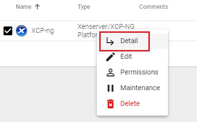

##### Настройка сервиса на основе "Xen Linked Clone"

Этот тип службы создает в виртуальной инфраструктуре виртуальные рабочие столы, зависящие от активной публикации.

Для создания базовых сервисов типа "***Xen Linked Clone**_" перейдите в "_**Service Providers**_", выберите вкладку "_**Services**_", нажмите на "_**New**_" и выберите "_**Xen Linked Clone***".

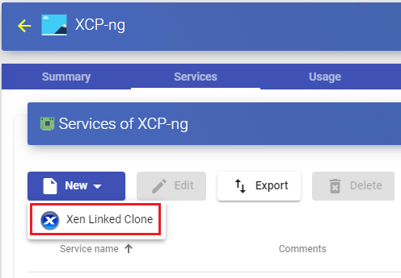

Минимальные параметры для настройки в этом типе сервиса:

*Главный:

**Имя:** Название службы.

**Storage SR**: Место, где будут храниться сгенерированные виртуальные рабочие столы и публикации. **Поддерживаются только общие хранилища (если вы подключаетесь к одному узлу и хотите использовать его локальное хранилище, вы можете вручную изменить его из консоли хоста и преобразовать в хранилище SR, чтобы использовать его с UDS)**

**Зарезервированное пространство**: Если в хранилище меньше свободного места, чем указано в этом параметре (в ГБ), UDS не будет использовать его для размещения публикаций или виртуальных рабочих столов.

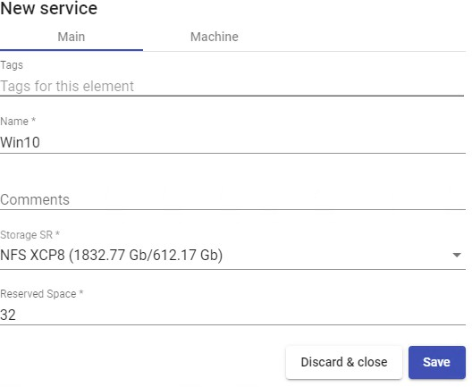

*Машина:

**Базовая машина**: шаблонная виртуальная машина (Gold Image), используемая системой UDS для развертывания виртуальных рабочих столов.

**Сеть**: Сеть, к которой будут подключены виртуальные рабочие столы.

**Память**: Объем памяти в Мб, который будет назначен сгенерированным виртуальным рабочим столам Linked Clones.

**Тень:** Множитель памяти.

**Имена компьютеров**: корень имени всех виртуальных рабочих столов Linked Clones, которые будут развернуты в этой службе. (например: Имена компьютеров = Win10-)

**Длина имени:** Количество цифр счетчика, прикрепленного к корню имени рабочего стола (например: Длина имени = 3. Окончательное имя сгенерированных рабочих столов будет следующим: Win10-**000**, Win10-**001**... Win10-**999**).


Сохраните конфигурацию, и у вас будет действительный " ***Xen Linked Clone*** " на платформе XenServer или XCP-ng. Вы можете зарегистрировать все услуги типа "***Xen Linked Clone***", которые вам нужны.

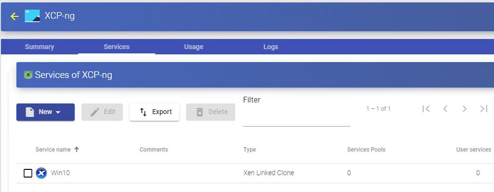

После того, как вы настроили всю среду UDS (службы, аутентификаторы, диспетчеры ОС и транспорты) и создали первый "***Service Pool***", вы сможете наблюдать в XenCenter или XCP-ng Center, как выполняются развертывания настольных компьютеров.

Первой задачей, которая будет выполнена, будет создание публикации шаблона (эта машина будет генерироваться каждый раз, когда мы делаем публикацию сервиса), который будет являться клоном шаблона, выбранного при регистрации сервиса, с размером диска и характеристиками, равными указанному шаблону.

После завершения процесса создания публикации (система назовет ее как: "UDS Pub _name_pool- númber_publication_") автоматически создаются рабочие столы (

система называет их как: "UDS service _Machine_Name-Name_Length_") на основе параметров кэша, настроенных в "***Service Pools***".


##### Сводка журналов использования Сервиса и ошибок

В разделе «***Поставщик услуг**_» у вас будет вкладка под названием «_**Использование***», которая позволит вам быстро просмотреть подробную информацию и выполнить основные действия с услугами, отображаемыми в этом «***Поставщике услуг***».

Чтобы получить доступ к этой информации об использовании услуг, вы заходите в раздел «***Поставщики услуг**_» и выбираете вкладку «_**Использование***»:


Увидите:

**Доступ:** Дата и время доступа к сервису.

**Владелец:** Пользователь и аутентификатор, назначенные сервису в формате user@authenticator. Если он пустой, это означает, что сервис не был назначен ни одному пользователю и доступен в кэше.

**Сервис:** Имя базовой службы, принадлежащей "***Поставщику услуг***", от которого была сгенерирована услуга.

**Пул:** Название "***Service Pools***", к которому принадлежит сервис.

**Уникальный идентификатор:** MAC-адрес сервиса.

**IP:** IP-адрес сервиса.

**Понятное имя:** Название службы. Это также будет DNS-имя самостоятельно созданной виртуальной машины UDS.

**Src Ip:** IP-адрес клиента, обращающегося к сервису.

**Src Host:** DNS-имя клиента соединения, который обращается к службе. Если вы не можете получить доступ к этому имени, будет указан IP-адрес.

Также можно будет выбрать одну или несколько услуг, чтобы приступить к их устранению.

На вкладке "***Журналы**_" будет показана информация о возможной проблеме, возникшей в "_**Поставщике услуг***":


#### Платформа VDI с oVirt / RHV

Развертывание и подключение к виртуальным рабочим столам в инфраструктуре oVirt или Red Hat Enterprise Virtualization (RHV).

##### Зарегистрируйте поставщика услуг "oVirt Platform Provider"

Нажмите «***Новый**_» и выберите «_**oVirt / RHV Platform Provider***».

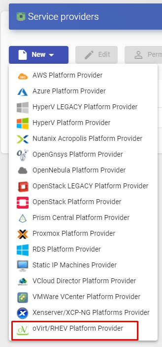

В "***oVirt / RHV Platform Provider***" необходимо настроить следующие минимальные параметры:

*Главный:

Имя поставщика услуг, IP-адрес сервера oVirt-engine или RHV-Manager (поле "***Host*** имя пользователя (в формате user@domain) и пароль с правами администратора на oVirt-engine или RHV-Manager.

*Продвинутый:

**Параллелизм создания:** Количество одновременных задач создания рабочего стола. **Параллелизм удаления:** Количество одновременных задач удаления рабочего стола. **Timeout:** "***Timeout***" для подключения к oVirt-engine или RHV-Manager.

**Диапазон компьютеров Mac:** Диапазон MAC-адресов, используемых UDS для создания виртуальных рабочих столов.

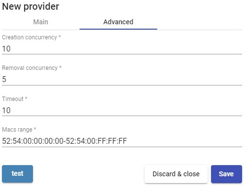

С помощью кнопки "***Test***" вы проверите, что соединение выполнено правильно.

Сохраните конфигурацию, и у вас будет действительный "***Service Providers***" для начала регистрации базовых сервисов на платформе oVirt или RHV.


###### ПРИМЕЧАНИЕ: {#note-11 .unnumbered}

Если у вас есть несколько платформ ovirt или RHV, вы сможете зарегистрировать всех «**Поставщиков услуг**» типа «**oVirt / RHV Platform Provider**», которые нам нужны.

Чтобы изменить какой-либо параметр в существующем "***Поставщики услуг**_", вы должны выбрать его и нажать на "_**Редактировать***".

С помощью кнопки "***Enter Maintenance Mode*** можно приостановить все операции, производимые UDS-сервером на сервис-провайдере. Рекомендуется переводить поставщика услуг в режим обслуживания в случаях, когда связь с этим поставщиком услуг была потеряна или запланировано техническое отключение

После интеграции платформы oVirt или RHV в UDS можно создавать базовые сервисы.

Для этого дважды кликните по созданному поставщику услуг или в меню провайдера выберите "***Детали***":


##### Настройка службы на основе "oVirt/RHV Linked Clone"

Этот тип службы создает в виртуальной инфраструктуре виртуальные рабочие столы, зависящие от активной публикации

Чтобы создать базовые сервисы типа "***oVirt/RHV Linked Clone**_", перейдите в "_**Service Providers**_", выберите вкладку "_**Services**_", нажмите на "_**New**_" и выберите "_**oVirt/RHV Linked Clone***".

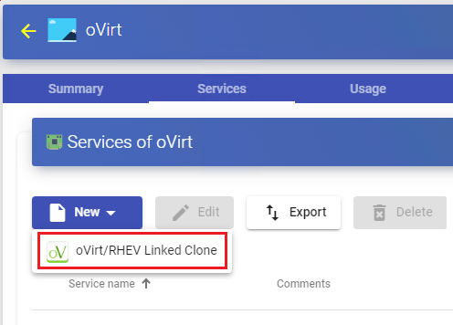

Минимальные параметры для настройки в этом типе сервиса:

*Главный:

**Имя:** Название службы.

**Кластер:** Кластер узлов Virt/RHV, в котором будут размещаться сгенерированные виртуальные рабочие столы.

**Домен хранилища данных**: Расположение, в котором будут храниться созданные виртуальные рабочие столы и публикации.

**Зарезервированное пространство**: Если в хранилище меньше свободного места, чем указано в этом параметре (в ГБ), UDS не будет использовать его для размещения публикаций или виртуальных рабочих столов.

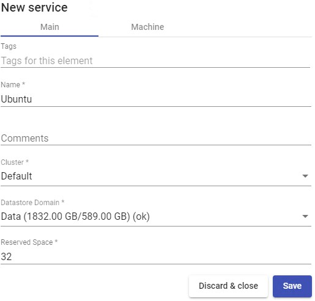

*Машина:

**Базовая машина** Шаблон виртуальной машины (Gold Image), используемый системой UDS для развертывания виртуальных рабочих столов.

**Память**: объем памяти в Мб, который будет назначен виртуальным рабочим столам Linked Clones.

**Гарантированная память**: Объем памяти, который будет гарантирован связанным клонам.

**USB:** Если этот флажок установлен, виртуальные рабочие столы будут поддерживать перенаправление USB.

**Дисплей:** Режим подключения от oVirt-Manager или RHV-Manager, который будет настроен сгенерированными виртуальными рабочими столами.

**Имена компьютеров**: Корневое имя всех связанных клонов, которые будут развернуты в этой службе (например, Machine Names= Desk-ubun-).

**Длина имени:** Количество цифр счетчика, прикрепленных к корневому имени рабочего стола

(например: Длина имени = 3, Окончательное имя сгенерированных рабочих столов будет таким: Deskubun-**000**, Desk- ubun-**001**... Письменный стол-убун-**999**).

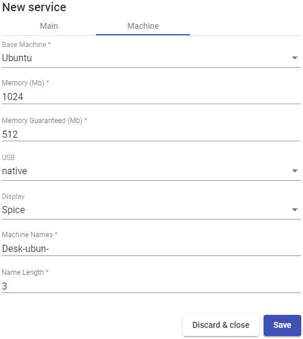

После сохранения этой конфигурации у вас уже будет действительный "***oVirt/RHV Linked Clone**_" на платформе oVirt или RHV. Вы можете зарегистрировать все "_**oVirt/RHV Linked Clone***", которые вам нужны.


После того, как вы настроили все окружение UDS (службы, аутентификаторы, менеджеры ОС и транспорты) и создали первый "***Service Pool***", вы сможете наблюдать в oVirt-engine или RHV-Manager, как происходит развертывание настольных компьютеров.

Первой задачей, которая будет выполнена, будет создание публикации шаблона (эта машина будет генерироваться каждый раз, когда вы делаете публикацию услуги). Это будет клон шаблона, выбранного при регистрации сервиса, с размером диска и характеристиками, равными этому шаблону.

После завершения процесса создания публикации (система назовет его как: "UDSP__name_pool-number_publication_") будут автоматически созданы рабочие столы (система назовет их как: "_Machine_Name-Name_Length_") на основе параметров кэша, настроенных в "***Service Pools***".


##### Сводка об использовании Сервиса и ошибках

В разделе "***Поставщик услуг**_" есть вкладка под названием "_**Использование**_", которая позволит вам быстро просмотреть подробную информацию и выполнить основные действия с услугами, отображаемыми в этом "_**Поставщик услуг***".

Чтобы получить доступ к этой информации об использовании услуг, перейдите в раздел «***Поставщики услуг**_» и выберите вкладку «_**Использование***»:

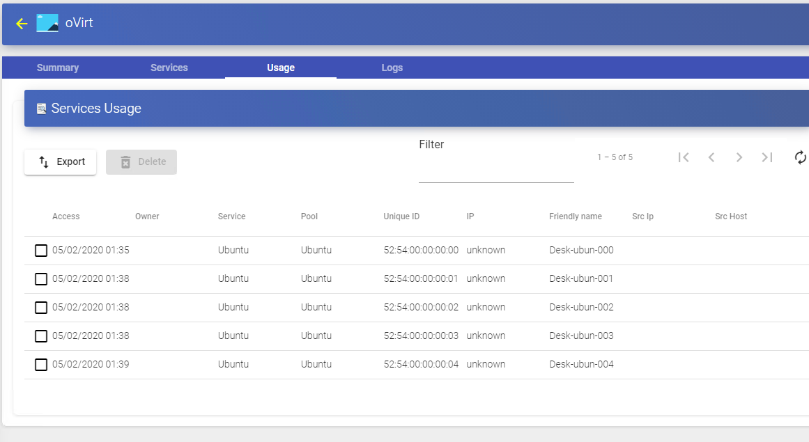

Увидите

**Доступ:** Дата и время доступа к сервису.

**Владелец:** Пользователь и аутентификатор, назначенные сервису в формате user@authenticator. Если он пустой, это означает, что сервис не был назначен ни одному пользователю и доступен в кэше

**Сервис:** Имя базовой службы, принадлежащей "***Поставщику услуг***", от которого была сгенерирована услуга.

**Пул:** Название "***Service Pools***", к которому принадлежит сервис.

**Уникальный идентификатор:** MAC-адрес сервиса.

**IP:** P адрес сервиса.

**Понятное имя:** Название службы. Это также будет DNS-имя самостоятельно созданной виртуальной машины UDS.

**Src Ip:** IP-адрес клиента, обращающегося к сервису.

.

**Src Host:** DNS-имя клиента соединения, который обращается к службе. Если вы не можете получить доступ к этому имени, будет указан IP-адрес.

Также можно будет выбрать одну или несколько услуг, чтобы приступить к их устранению.

На вкладке "***Журналы**_" отображается информация о возможной проблеме, возникшей в "_**Поставщике услуг***":

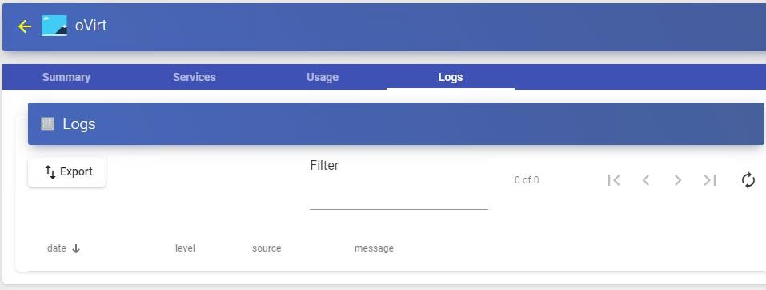

#### Платформа VDI с Microsoft Hyper-V

Развертывание виртуальных рабочих столов, самостоятельно сгенерированных UDS, в инфраструктуре виртуализации Microsoft Hyper-V.

Нажмите «***Новый**_» и выберите «_**Поставщик платформы HyperV***»:


В "***HyperV Platform Provider***" необходимо настроить по крайней мере следующие параметры:

*Главный:

Имя поставщика услуг, IP-адрес/имя автономного сервера Hyper-V или IP-адрес/имя

кластер Hyper-V (поле "***Host**_"). При интеграции кластера Hyper-V (кластер = "_**Yes**_") или автономного сервера (кластер = "_**No****"), необходимо использовать SSL-подключение. Имя пользователя

и пароль должны быть назначены с правами администрирования в кластере Hyper-V или на автономном сервере.


###### ПРИМЕЧАНИЕ: {#note-12 .unnumbered}

Если вы попытаетесь напрямую подключиться к серверу Hyper-V, входящему в состав кластера, система уведомит вас о том, что необходимо подключиться к кластеру, который им управляет.

Чтобы подключение прошло успешно, необходимо выполнить следующий сценарий из PowerShell на всех узлах Hyper-V (даже если они входят в кластер):

Invoke-Expression ((новый-объект System.Net.Webclient). DownloadString('https://images.udsenterprise.com/files/hyperv/EnableRemo ting.ps1'))

*Продвинутый:

Количество одновременных задач создания рабочего стола (поле "***Параллелизм создания**_"), количество одновременных задач удаления рабочего стола (поле "_**Параллелизм удаления***"), диапазон

MAC-адресов, используемых UDS для создания виртуальных рабочих столов, порт подключения (значение 0 будет использовать порт по умолчанию: 5985) и "***Timeout***" для подключения.

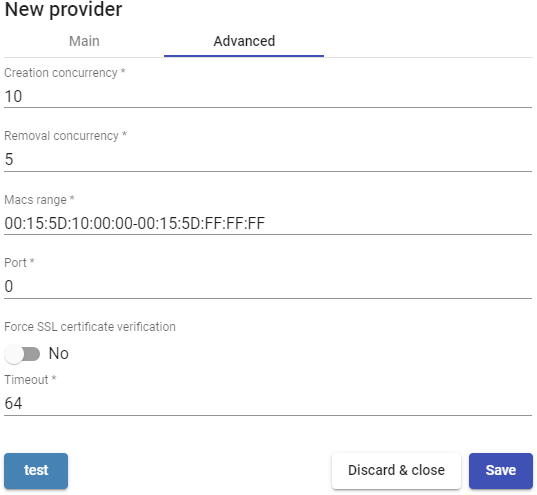

С помощью кнопки "***Test***" вы можете протестировать и убедиться в успешности подключения.

Сохраните конфигурацию, и у вас будет действительный "***Service Providers***" " для начала регистрации базовых служб для платформы Microsoft Hyper-V.

###### ПРИМЕЧАНИЕ: {#note-13 .ненумерованный}

Если у вас есть несколько платформ Microsoft Hyper-V (в кластере или автономной системе), вы можете зарегистрировать все необходимые вам "**Поставщики услуг**" типа "**Поставщик платформы HyperV**".

Чтобы изменить какой-либо параметр в существующем "***Поставщики услуг**_", выберите его и нажмите "_**Редактировать***".

С помощью кнопки "***Enter Maintenance Mode***" можно приостановить все операции, выполняемые UDS-сервером на сервис-провайдере. Рекомендуется переводить поставщика услуг в режим обслуживания в случаях, когда связь с этим поставщиком услуг была потеряна или планируется отключение технического обслуживания.

После интеграции платформы Microsoft Hyper-V в UDS базовые службы могут быть

созданный. Для этого дважды кликните по созданному поставщику услуг или выберите "***Detail***" в меню провайдера:


##### Настройка сервиса на основе "Hyper-V Linked Clone"

Этот тип службы создает в виртуальной инфраструктуре виртуальные рабочие столы, зависящие от активной публикации.

Чтобы создать базовые службы типа "***HyperV Linked Clone**_", перейдите в раздел "_**Поставщики услуг**_", выберите вкладку "_**Службы**_", щелкните "_**Новые**_" и выберите "_**HyperV Linked Clone***".

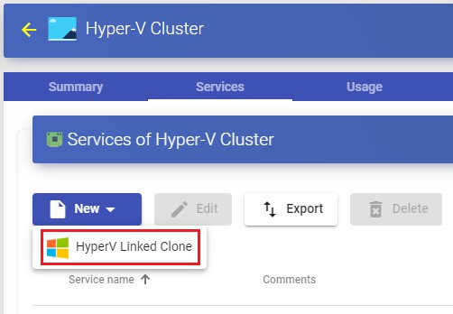

Минимальные параметры для настройки в этом типе сервиса:

*Главный:

**Имя:** Название службы.

**Datastores Drives**: Место, где будут храниться сгенерированные публикации и виртуальные рабочие столы (в этом хранилище будет создана папка под названием "***UDSData***", в которой будут храниться все диски сгенерированных машин).

**Зарезервированное пространство**: Если в хранилище меньше свободного места, чем указано в этом параметре (в ГБ), UDS не будет использовать его для размещения публикаций или виртуальных рабочих столов.


*Машина:

**Base Machine**: шаблон виртуальной машины (Gold Image), используемый системой UDS для развертывания виртуальных рабочих столов.

**Сеть**: Сеть для подключения виртуальных рабочих столов.

**Память**: объем памяти в Мб, который будет назначен виртуальным рабочим столам Linked Clones.

**Имена компьютеров**: корневое имя всех виртуальных рабочих столов Linked Clones, которые будут развернуты в этой службе. (например: Имена машин = xUbuntu-).

**Длина имени:** Количество цифр счетчика, прикрепленного к корневому имени рабочих столов (например: Длина имени = 3, окончательное имя сгенерированных рабочих столов будет следующим: xUbuntu-**000**, xUbuntu-**001**... xUbuntu-**999**).

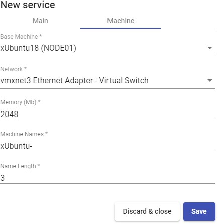

Сохраните конфигурацию, и у вас будет действительный "***HyperV Linked Clone**_" на платформе HyperV. Вы можете зарегистрировать все необходимые "_**HyperV Linked Clone***".


После настройки полной среды UDS (службы, средства проверки подлинности, диспетчеры ОС и транспорты) и создания первого пула служб **** можно наблюдать при администрировании кластера Hyper-V или автономного сервера Hyper-V за выполнением развертывания настольных компьютеров.

Первой задачей, которая будет выполнена, будет создание публикации шаблона (эта машина будет генерироваться каждый раз, когда мы публикуем сервис). Это будет клон шаблона, выбранного при регистрации сервиса, с размером диска и характеристиками, равными этому шаблону.

После завершения процесса создания публикации (система назовет его как: "UDS Publication _name_pool-númber_publication_") автоматически создаются виртуальные рабочие столы (система называет их как: "UDS_ _Machine_Name-Name_Length_") на основе параметров кэша, настроенных в "***Service Pools***".

##### Сводка журналов использования Сервиса и ошибок

В разделе "***Поставщик услуг**_" у вас будет вкладка под названием "_**Использование**_", которая позволит вам быстро просмотреть подробную информацию и выполнить основные действия с услугами, отображаемыми в этом "_**Поставщик услуг***".

Чтобы получить доступ к этой информации об использовании услуг, зайдите в раздел «***Поставщики услуг**_» и выберите «_**Использование***»:


Увидите:

**Доступ:** Дата и время доступа к сервису.

**Владелец:** Пользователь и аутентификатор, назначенные сервису в формате user@authenticator. Если он пустой, это означает, что сервис не был назначен ни одному пользователю и доступен в кэше.

**Сервис:** Имя базовой службы, принадлежащей "***Поставщику услуг***", от которого была сгенерирована услуга.

**Пул:** Название "***Service Pools***", к которому принадлежит сервис.

**Уникальный идентификатор:** MAC-адрес сервиса.

**IP:** IP-адрес сервиса.

**Понятное имя:** Название службы. Это также будет DNS-имя самостоятельно созданной виртуальной машины UDS.

**Src Ip**: IP-адрес клиента, обращающегося к сервису.

**Src Host:** DNS-имя клиента соединения, который обращается к службе. Если вы не можете получить доступ к этому имени, будет указан IP-адрес.

Также можно будет выбрать один или несколько сервисов, чтобы приступить к их устранению.

На вкладке "***Журналы**_" будет показана информация о возможной проблеме, возникшей в "_**Поставщике услуг***":


#### Платформа VDI с Microsoft Azure

Развертывание и подключение к виртуальным рабочим столам в инфраструктуре виртуализации Microsoft Azure.

##### Зарегистрируйте поставщика услуг "Поставщик платформы Azure"

Интеграция OpenUDS с платформой Azure требует выполнения ряда предварительных задач и требований в самой среде Azure. Рекомендуется обратиться к руководству "***VDI with OpenUDS and Microsoft Azure***", доступному по адресу [[sección de documentación]{.underline}](https://www.udsenterprise.com/en/uds-enterprise/documentacion/) веб-сайта OpenUDS.

Щелкните "***Создать**_" и выберите "_**Поставщик платформы Azure***".


В "***Azure Platform Provider***" минимальные параметры для настройки:

*Главный:

Имя службы, идентификатор клиента, идентификатор клиента, секрет клиента и идентификатор подписки.

###### ПРИМЕЧАНИЕ: {#note-14 .unnumbered}

Чтобы найти и сгенерировать все запрошенные данные, вы можете обратиться к руководству «VDI с OpenUDS и Microsoft Azure», доступному в разделе [[documentation](https://www.udsenterprise.com/en/uds-enterprise/documentacion/)]{.underline} веб-сайта OpenUDS.

*Продвинутый:

**Параллелизм создания:** Количество одновременных задач создания рабочего стола.

**Параллелизм удаления:** Количество одновременных задач удаления рабочего стола.

**Тайм-аут:** "***Тайм-аут***" для подключения к среде Microsoft Azure


С помощью кнопки "***Test***" вы проверите, что соединение прошло успешно.

Сохраните конфигурацию, и у вас будет действительный "***Service Provider***" для начала регистрации базовых служб на платформе Microsoft Azure.


###### ПРИМЕЧАНИЕ: {#note-15 .unnumbered}

Если у вас есть несколько платформ Microsoft Azure, вы можете зарегистрировать все необходимые вам "**Поставщики услуг**" типа "**Поставщик платформы Azure**".

Чтобы изменить какой-либо параметр в существующем "***Поставщике услуг**_", выберите его и нажмите "_**Редактировать***".

С помощью кнопки "***Enter Maintenance Mode***" можно приостановить все операции, выполняемые UDS-сервером на сервис-провайдере. Рекомендуется переводить поставщика услуг в режим обслуживания в случаях, когда связь с этим поставщиком услуг была потеряна или запланировано техническое отключение

После интеграции платформы Azure в UDS можно создавать базовые службы. Для этого дважды кликните по созданному поставщику услуг или выберите "***Detail***" в провайдере:

##### Настройка службы на основе "Службы клонирования Azure"

Этот тип службы создает в виртуальной инфраструктуре виртуальные рабочие столы, зависящие от активной публикации.

Чтобы создать доступ "Служба клонирования Azure**_" "_**Поставщик службы**_", выберите вкладку "_**Службы**_", щелкните "_**Создать**_" и выберите "_**Служба клонирования Azure***".

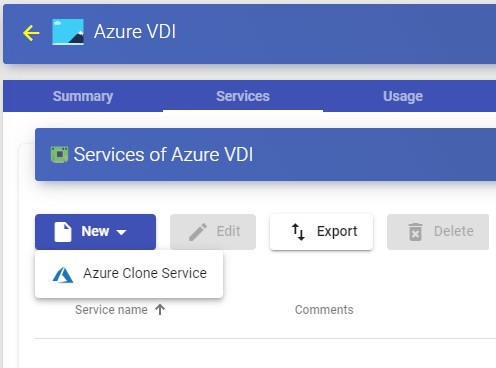

Минимальные параметры для настройки в этом типе сервиса:

*Главный:

**Имя:** Название услуги.

**Группа ресурсов:** Группа существующих ресурсов на платформе Azure, на которой будут развернуты виртуальные рабочие столы.

**Виртуальная машина:** Шаблон виртуальной машины (Gold Image), используемый системой для развертывания виртуальных рабочих столов.

**Размер компьютера:** Количество ресурсов, которые будут иметь виртуальные рабочие столы, автоматически развернутые с помощью UDS (в этом списке будут показаны все типы компьютеров, доступные в Azure.

Поэтому убедитесь, что выбранный тип поддерживается вашей подпиской Azure.

**Имена компьютеров:** Корень имени всех виртуальных рабочих столов, которые будут развернуты в этой службе. (например: Machine Names= desk-ubun-).

**Длина имени:** Количество цифр счетчика, прикрепленного к корню имени рабочего стола (например: Длина имени = 3. Окончательное имя сгенерированных рабочих столов будет таким: Desk-ubun-**000**, Desk-ubun-**001**... Письменный стол-убун-**999**).

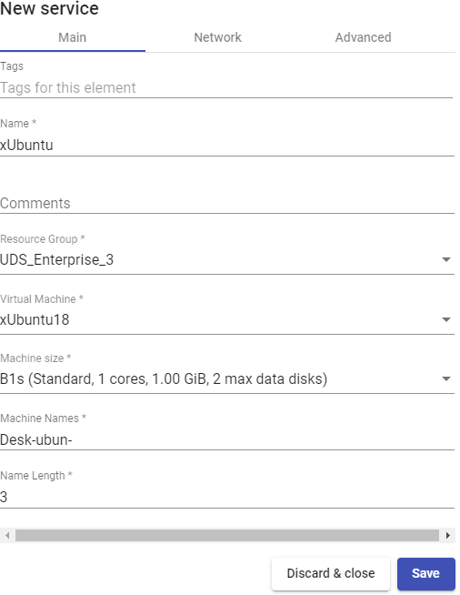

* Network:

**Сеть:** Существующая виртуальная сеть среды Azure, к которой будут подключены виртуальные рабочие столы (должно быть подключение к компоненту UDS Server).

**Подсеть**: существующая подсеть среды Azure, к которой будут подключены виртуальные рабочие столы.

**Группа безопасности:** Группа безопасности (при необходимости) для назначения новым виртуальным рабочим столам.

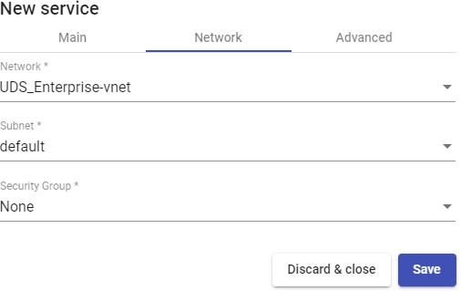

*Продвинутый:

**Политика кэширования:** Настройки кэша диска.

**Ускоренная сеть:** Позволяет использовать эту технологию (не может использоваться с большинством типов машин, только с: D/DSv3, E/ESv3, Fsv2 и Ms/Mms и ОС Linux).

**Ценовая категория:** Применен уровень избыточности.


Сохраните конфигурацию, и у вас будет действительный "***Azure Clone Service***" " на

Платформа Microsoft Azure. Вы сможете зарегистрировать все необходимые службы типа "***Azure Clone Service***".


Настроив полную среду UDS (службы, средства проверки подлинности, диспетчеры ОС и транспорты) и создав первый пул служб**_, вы сможете наблюдать в консоли Azure ("_**Виртуальные машины***"), как развертываются настольные компьютеры.

Первой задачей, которая будет выполнена, будет создание публикации шаблона (эта машина будет генерироваться каждый раз, когда вы публикуете сервис). Это будет клон шаблона, выбранного при регистрации сервиса, с размером диска и характеристиками, равными этому шаблону.

Как только процесс создания публикации завершен, рабочие столы автоматически

(система называет их как: "UDS __Machine_Name_Name_Length_") на основе параметров кэша, настроенных в "***Service Pools***".

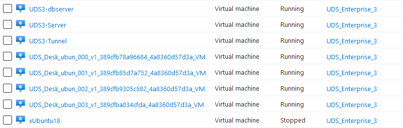

##### Резюме журналов использования службы и ошибок

В разделе "***Поставщик услуг**_" у вас будет вкладка под названием "_**Использование**_", которая позволит вам быстро просмотреть подробную информацию и выполнить основные действия с услугами, отображаемыми в этом "_**Поставщик услуг***".

Чтобы получить доступ к этой информации об использовании услуг, зайдите в раздел «***Поставщики услуг***» и выберите «***Использование***»:

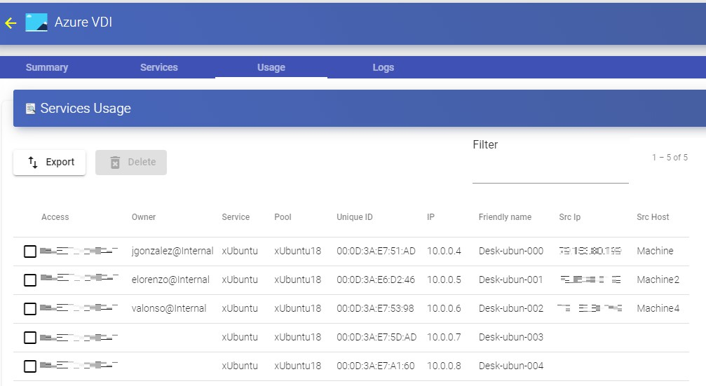

Увидите:

**Доступ:** Дата и время доступа к сервису.

**Владелец:** Пользователь и аутентификатор, назначенные сервису в формате user@authenticator. Если он пустой, это означает, что сервис не был назначен ни одному пользователю и доступен в кэше.

**Сервис:** Название базовой службы, принадлежащей "**Поставщику услуг**", от которого была сгенерирована услуга.

**Пул:** Название "***Service Pools***", к которому принадлежит сервис.

**Уникальный идентификатор:** MAC-адрес сервиса.

**IP:** IP-адрес сервиса.

**Понятное имя:** Название службы. Это также будет DNS-имя самостоятельно созданной виртуальной машины UDS.

**Src Ip:** IP-адрес клиента, обращающегося к сервису.

.

**Src Host:** DNS-имя клиента соединения, который обращается к службе. Если вы не можете получить доступ к этому имени, будет указан IP-адрес.

Также можно будет выбрать одну или несколько услуг, чтобы приступить к их устранению.

На вкладке "***Журналы**_" будет показана информация о возможной проблеме, возникшей в "_**Поставщике услуг***":

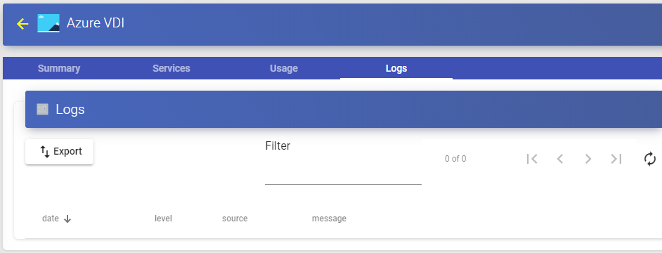

#### Plataforma VDI con Amazon AWS

Despliegue y conexión a escritorios virtuales en una infraestructura de virtualización Amazon AWS.

##### Alta de proveedor de servicios "AWS Platform Provider"

Интеграция OpenUDS с платформой AWS m требует выполнения ряда предварительных задач и требований в самой среде Azure. Рекомендуется обратиться к руководству "***VDI with OpenUDS and Amazon AWS***", доступному по адресу [[Documentation section](https://www.udsenterprise.com/en/uds-enterprise/documentacion/)]{.underline} на веб-сайте OpenUDS.

Нажмите «***New**_» и выберите «_**AWS Platform Provider***».


В "***AWS Platform Provider***" минимальные параметры для настройки:

*Главный:

Имя службы, идентификатор ключа доступа и секретный ключ доступа.

###### ПРИМЕЧАНИЕ: {#note-16 .unnumbered}

Чтобы найти и создать все запрошенные данные, вы можете обратиться к руководству «VDI с OpenUDS и Amazon AWS», доступному в разделе [[documentation](https://www.udsenterprise.com/es/uds-enterprise/documentacion/)]{.underline} на веб-сайте OpenUDS.

*Продвинутый:

**Параллелизм создания:** Количество одновременных задач создания рабочего стола.

**Параллелизм удаления:** Количество одновременных задач удаления рабочего стола.

**Тайм-аут:** "***Тайм-аут**_" для подключения к среде AWS. __Proxy:_* Прокси-сервер, используемый при подключении к среде AWS. **Регион по умолчанию:** Регион для использования в среде AWS.


С помощью кнопки "***Test***" вы проверите, что соединение прошло успешно.

Сохраните конфигурацию, и у вас будет действительный "***Service Provider***" для начала регистрации базовых сервисов на платформе Amazon AWS.

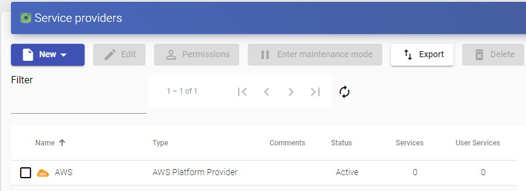

###### ПРИМЕЧАНИЕ: {#note-17 .unnumbered}

Если у вас есть платформы AWS, вы можете зарегистрировать всех необходимых вам «**Поставщиков услуг**» типа «**Поставщик платформы AWS**».

Чтобы изменить какой-либо параметр в существующем "***Поставщике услуг**_", выберите его и нажмите "_**Редактировать***".

С помощью кнопки "***Enter Maintenance Mode***" можно приостановить все операции, выполняемые UDS-сервером на сервис-провайдере. Рекомендуется переводить поставщика услуг в режим обслуживания в случаях, когда связь с этим поставщиком услуг была потеряна или планируется отключение технического обслуживания.

После интеграции платформы AWS в UDS можно создавать базовые сервисы. Для этого дважды кликните по созданному поставщику услуг или выберите "***Detail***" в провайдере:

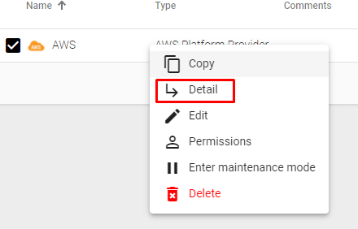

##### Настройка сервиса на основе «AWS Existing AMI Service»

Этот тип службы создает в виртуальной инфраструктуре виртуальные рабочие столы, зависящие от активной публикации.

Чтобы создать «***AWS Existing AMI Service**_», введите доступ «_**Service Provider**_», перейдите на вкладку «_**Services**_», нажмите «_**New**_» и выберите «_**AWS Existing AMI Service***».

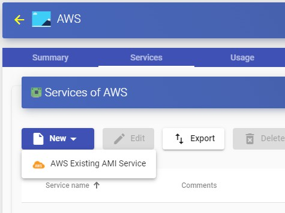

Минимальные параметры для настройки в этом типе сервиса:

*Главный:

**Имя:** Название услуги.

**Регион:** Регион среды AWS, в которой будут развернуты рабочие столы. Используемые образы AMI и пары ключей также должны быть размещены в этом регионе.

**AMI:** Шаблон (Gold Image), используемый системой для развертывания виртуальных рабочих столов.

**Тип инстанса:** Объем ресурсов, которые будут иметь виртуальные рабочие столы, автоматически развернутые UDS (в этом списке будут показаны все типы машин, доступных в AWS). Поэтому необходимо убедиться, что выбранный тип поддерживается нашим регионом AWS.

**Пара ключей:** Пара ключей, назначаемая сгенерированным виртуальным рабочим столам.

**Имена компьютеров:** Корень имени всех виртуальных рабочих столов, которые будут развернуты в этой службе. (например: Имена машин = Xubun-).

**Длина имени:** Количество цифр счетчика, прикрепленного к корню имени рабочего стола (например: Длина имени = 3. Окончательное имя сгенерированных рабочих столов будет таким: Desk-ubun-**000**, Desk-ubun-**001**... Письменный стол-убун-**999**).

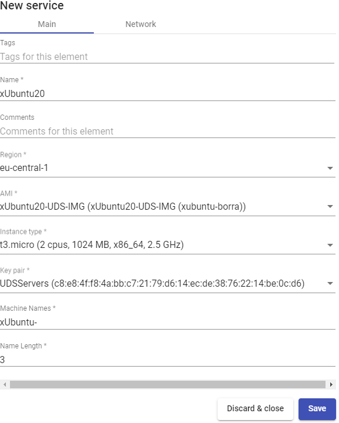

*Сеть:

**VPC:** Существующее VPC среды AWS, к которому будут подключены виртуальные рабочие столы (должно быть подключение к компонентам UDS Server и UDS Tunnel).

**Подсеть**: существующая подсеть среды AWS, к которой будут подключены виртуальные рабочие столы (должно быть подключение к компонентам UDS Server и UDS Tunnel).

**Группа безопасности:** Группа безопасности, которой назначаются новые виртуальные рабочие столы (эта группа безопасности должна иметь необходимые правила, чтобы сгенерированные рабочие столы взаимодействовали с различными элементами инфраструктуры).


Сохраните конфигурацию, и у вас будет действительный "***AWS Existing AMI Service***" на платформе AWS. Вы сможете зарегистрировать все необходимые вам сервисы типа "***AWS Existing AMI Service***".


После того, как вы настроили полную среду UDS (Services, Authenticators, OS Managers y Transports) и создали первый "***Service Pool***", вы сможете

Обратите внимание на EC2 консоли AWS («***Инстансы***»), как развертываются настольные компьютеры.

Первой задачей, которая будет выполнена, будет создание публикации шаблона (эта машина будет генерироваться каждый раз, когда вы публикуете сервис).

Как только процесс создания публикации завершен, рабочие столы автоматически

(система называет их как: "UDS__Machine_Name_Name_Length_") ) на основе параметров кэша, настроенных в "***Service Pools***".

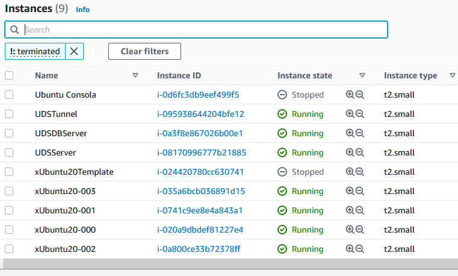

##### Сводка журналов использования Сервиса и ошибок

В разделе "***Поставщик услуг**_" у вас будет вкладка под названием "_**Использование**_", которая позволит вам быстро просмотреть подробную информацию и выполнить основные действия с услугами, отображаемыми в этом "_**Поставщик услуг***".

Чтобы получить доступ к этой информации об использовании услуг, зайдите в раздел «***Поставщики услуг***» и выберите «***Использование***»:


Увидите:

**Доступ:** Дата и время доступа к сервису.

**Владелец:** Пользователь и аутентификатор, назначенные сервису в формате user@authenticator. Если он пустой, это означает, что сервис не был назначен ни одному пользователю и доступен в кэше.

**Сервис:** Название базовой службы, принадлежащей "**Поставщику услуг**", от которого была сгенерирована услуга.

**Пул:** Название "***Service Pools***", к которому принадлежит сервис.

**Уникальный идентификатор:** MAC-адрес сервиса.

**IP:** IP-адрес сервиса.

**Понятное имя:** Название службы. Это также будет DNS-имя самостоятельно созданной виртуальной машины UDS.

**Src Ip:** IP-адрес клиента, обращающегося к сервису.

.

**Src Host:** DNS-имя клиента соединения, который обращается к службе. Если вы не можете получить доступ к этому имени, будет указан IP-адрес.

Также можно будет выбрать одну или несколько услуг, чтобы приступить к их устранению.

На вкладке "***Журналы**_" будет показана информация о возможной проблеме, возникшей в "_**Поставщике услуг***":


#### Платформа VDI с Proxmox

Развертывание и подключение к виртуальным рабочим столам в инфраструктуре Proxmox.

##### Зарегистрируйте поставщика услуг "Proxmox Platform Provider"

Нажмите на «***Новый**_» и выберите «_**Поставщик платформы Proxmox***».


В "***Proxmox Platform Provider***" минимальные параметры для настройки:

*Главный:

Имя поставщика услуг, IP или название сервера или кластера Proxmox (поле "***Host***"), порт подключения, имя пользователя (с user@authenticator форматом) и

пароль с правами администратора.

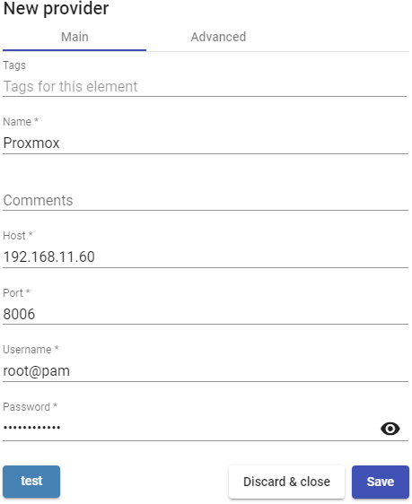

*Продвинутый:

**Параллелизм создания:** Количество параллельных задач создания рабочего стола. **Параллелизм удаления:** Количество одновременных задач удаления рабочего стола. **Timeout:** "***Timeout***" для подключения к Proxmox.

**Starting Vmid:** Идентификатор компьютера, с помощью которого UDS начнет генерацию компьютеров.


С помощью кнопки "***Test***" вы проверите, что соединение выполнено правильно.

Сохраните конфигурацию, и у вас будет действительный "***Service Providers***" для начала регистрации базовых сервисов на платформе Proxmox.

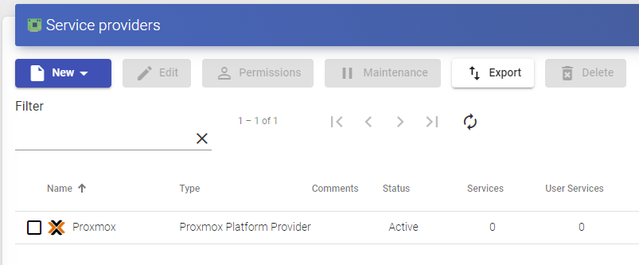

###### ПРИМЕЧАНИЕ: {#note-18 .unnumbered}

Если у вас есть несколько платформ Proxmox (как независимые серверы, так и кластеры), вы

можем зарегистрировать всех "**Поставщиков услуг**" типа "**Провайдер платформы Proxmox**", которые нам нужны.

Чтобы изменить какой-либо параметр в существующем "***Service Providers**_", вы должны выбрать его и нажать на "_**Редактировать***".

С помощью кнопки "***Войти в режим обслуживания***" вы можете приостановить все выполняемые операции

UDS-сервером на сервис-провайдере. Рекомендуется переводить поставщика услуг в режим обслуживания в случаях, когда связь с этим поставщиком услуг была потеряна или запланировано техническое отключение

После интеграции платформы Proxmox в UDS можно создавать базовые сервисы. Для этого дважды щелкните по созданному поставщику услуг или по меню провайдера и выберите "***Detail***":

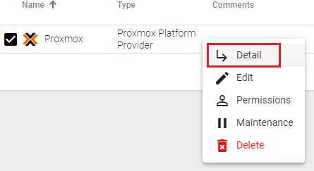

##### Настройте сервис на основе "Proxmox Linked Clone"

Этот тип службы создает в виртуальной инфраструктуре виртуальные рабочие столы, зависящие от активной публикации.

Чтобы создать базовые сервисы типа "***Proxmox Linked Clone**_", зайдите в "_**Service Providers**_", выберите "_**Services**_", нажмите на "_**New**_" и выберите "_**Proxmox Linked Clone***".


Минимальные параметры для настройки в этом типе сервиса:

*Главный:

**Имя:** Название службы.

**Pool:** Пул, который будет содержать компьютеры, созданные UDS.

**HA**: Позволяет разрешить сгенерированным машинам использовать "***HA Group***".

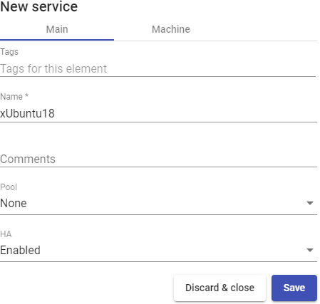

*Машина:

**Base Machine**: шаблон виртуальной машины (Gold Image), используемый системой UDS для развертывания виртуальных рабочих столов.

**Хранилище**: Расположение, в котором будут находиться созданные виртуальные рабочие столы и публикации

запасенный. **Хранилища, позволяющие создавать «Снимки». Для получения дополнительной информации посетите следующий URL-адрес: [[https://pve.proxmox.com/wiki/Storage]{.underline}](https://pve.proxmox.com/wiki/Storage)**.

**Память**: Объем памяти в Мб, выделяемый для сгенерированных виртуальных рабочих столов

**Имена компьютеров**: корень имен всех виртуальных рабочих столов, которые будут развернуты в этой службе. (например: Machine Names= desk-ubun-).

**Длина имени:** Количество цифр счетчика, прикрепленного к корню имени рабочего стола (например: Длина имени = 3. Окончательное имя сгенерированных рабочих столов будет таким: Desk-ubun-**000,** Desk-ubun-**001**... Письменный стол-убун-**999**).


Сохраните конфигурацию, и у вас будет действительный "***Proxmox Linked Clone***" на

Платформа Proxmox. Вы можете зарегистрировать все сервисы "***Proxmox Linked Clone***", которые вам нужны.


После того, как вы настроили полную среду UDS (службы, аутентификаторы, диспетчеры ОС и транспорты) и создали первый "***Service Pool***", вы можете наблюдать в среде Proxmox, как развертываются рабочие столы.

Первой задачей, которая будет выполнена, будет генерация публикации шаблона (Эта машина будет генерироваться каждый раз, когда вы публикуете услугу). Это будет клон шаблона, выбранного при регистрации сервиса, с размером диска и характеристиками, равными этому шаблону.

После завершения процесса создания публикации (система назовет его как: "UDSPublication - _name_pool-number_-_publication_") автоматически создаются рабочие столы (система назовет их как: "_Machine_Name-Name_Length_") на основе параметров кэша, настроенных в "***Service Pools***".


##### Сводка журналов использования Сервиса и ошибок

В разделе "***Поставщик услуг**_" у вас будет вкладка под названием "_**Использование**_", которая позволит вам быстро просмотреть подробную информацию и выполнить основные действия с услугами, отображаемыми в этом "_**Поставщик услуг***".

Чтобы получить доступ к этой информации об использовании услуг, перейдите в раздел «***Поставщики услуг**_» и выберите вкладку «_**Использование***»:

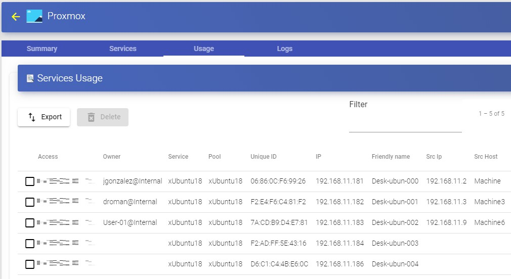

Увидите:

**Доступ:** Дата и время доступа к сервису.

**Владелец:** Пользователь и аутентификатор, назначенные сервису в формате user@authenticator. Если он пустой, это означает, что сервис не был назначен ни одному пользователю и доступен в кэше.

**Сервис:** Название базовой услуги, принадлежащей «Поставщику услуг», от которого была сгенерирована услуга.

**Пул:** Название "***Service Pools***", к которому принадлежит сервис.

**Уникальный идентификатор:** MAC-адрес сервиса.

**IP:** IP-адрес сервиса.

**Понятное имя:** Название службы. Это также будет DNS-имя самостоятельно созданной виртуальной машины UDS.

**Src Ip:** IP-адрес клиента, обращающегося к сервису.

.

**Src Host:** DNS-имя клиента соединения, который обращается к службе. Если вы не можете получить доступ к этому имени, будет указан IP-адрес.

Также можно будет выбрать одну или несколько услуг, чтобы приступить к их устранению.

На вкладке "***Журналы**_" будет показана информация о возможной проблеме, возникшей в "_**Поставщике услуг***":


#### Прямое подключение к постоянным устройствам

Этот тип "***Поставщик услуг***" позволяет назначать пользователей постоянным или статическим компьютерам, независимо от того, являются ли они физическими или виртуальными машинами.

У вас будет два вида услуг:

* "***Static Multiple IP***", позволит создать базовый сервис для подключения одного пользователя к компьютеру (IP-адресу). Вы можете указать один или несколько IP-адресов, чтобы система могла разрешить доступ пользователей к указанным IP-адресам.

Назначение будет производиться в порядке доступа, то есть первому пользователю, обратившемуся к данному сервису, будет назначен первый IP-адрес в списке, хотя также возможно выборочное присвоение (существующему пользователю в аутентификаторе на IP-адрес).

* "***Static Single IP***", который позволит создать базовый сервис для подключения нескольких пользователей к одному компьютеру. Если устройство разрешает несколько сеансов, каждый пользователь, получивший доступ, начнет новый сеанс.

###### ПРИМЕЧАНИЕ: {#note-19 .unnumbered}

Для того, чтобы пользователи могли успешно установить соединение, необходимо, чтобы

компьютеры, указанные по их IP-адресу (либо в "**Static Multiple IP**" или "**Static Single IP**"), ранее были включены и имеют протокол подключения, назначенный для

Доступ установлен и включен.

##### Зарегистрируйте поставщика услуг "Static IP Machines Provider"

Нажмите на "***New**_" и выберите "_**Static IP Machines Provider***".

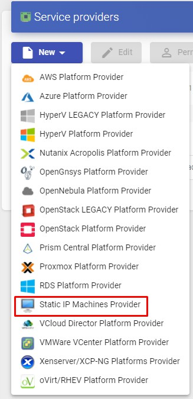

В "***Static IP Machines Provider***" минимальные параметры для настройки:

*Главный:

Описательное наименование поставщика услуг.


*Продвинутый:

**Расширенная конфигурация:** Вы можете указать опцию [wol] и включить "**Wake on LAN**" на физических машинах.

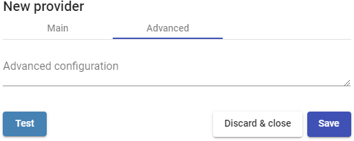

###### ПРИМЕЧАНИЕ: {#note-20 .unnumbered}

Если вы хотите использовать раздел «Расширенная конфигурация» для включения WoL на физических компьютерах, мы рекомендуем вам обратиться к руководству: «**Wake on LAN on physical machines with OpenUDS**», расположенному в разделе [[documentation]{.underline}](https://www.udsenterprise.com/en/uds-enterprise/documentacion/) с веб-сайта UDSEnteprise.

Save the configuration and you will have a valid "***Service Providers**_" to start registering basic services in a provider of the "_**Static IP Machines Provider***" type.

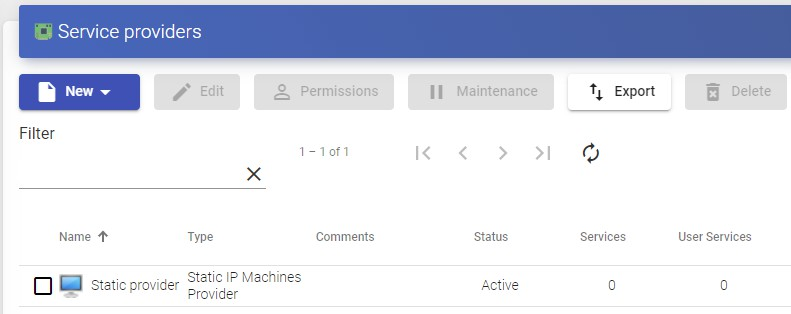

###### ПРИМЕЧАНИЕ: {#note-21 .ненумерованный}

Вы можете зарегистрировать все необходимые вам "**Поставщики услуг**" типа "**Поставщик машин со статическим IP-адресом**".

Чтобы изменить какой-либо параметр в существующем "***Поставщики услуг**_", выберите его и нажмите "_**Редактировать***".

С помощью кнопки "***Enter Maintenance Mode***" можно приостановить все операции, выполняемые UDS-сервером на сервис-провайдере.

После создания можно создавать базовые службы. Для этого дважды щелкните по поставщику услуг или выберите «***Детали***» в меню провайдера:

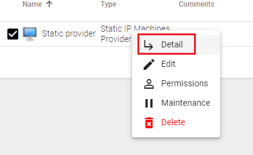

##### Настройте сервис на основе "Static Multiple IP"

Este tipo de servicio permitirá al acceso de usuarios a diferentes equipos (físicos o virtuales). La conexión siempre se realizará uno a uno, es decir, un usuario a un equipo.

Para crear servicios base de tipo "***Static Multiple IP**_" accedemos al "_**Service Providers**_", seleccionamos la pestaña "_**Services**_", pulsamos sobre "_**New**_" y seleccionamos "_**Static Multiple IP***".


Минимальные параметры для настройки в этом типе сервиса:

*Главный:

**Имя:** Название услуги.

**Список серверов:** IP-адреса компьютеров, к которым будут подключаться пользователи Введите различные IP-адреса через запятую и нажмите на кнопку "***Добавить***":

**Служебный токен**: Если в этом поле не указан токен (пустой), система не будет контролировать сеансы пользователей на компьютерах. Таким образом, когда компьютер назначается пользователю, это назначение будет сохраняться до тех пор, пока он не будет удален администратором вручную. При наличии токена сессии пользователей будут контролироваться.

Когда они выйдут из системы, они будут освобождены, чтобы снова стать доступными для доступа других пользователей.

если вы укажете токен, то он будет необходим для указанных компьютеров (с помощью

свой IP-адрес), чтобы установить субъект UDS, который управляет статическими компьютерами ("***UDSActorUnmanagedSetup-....***").

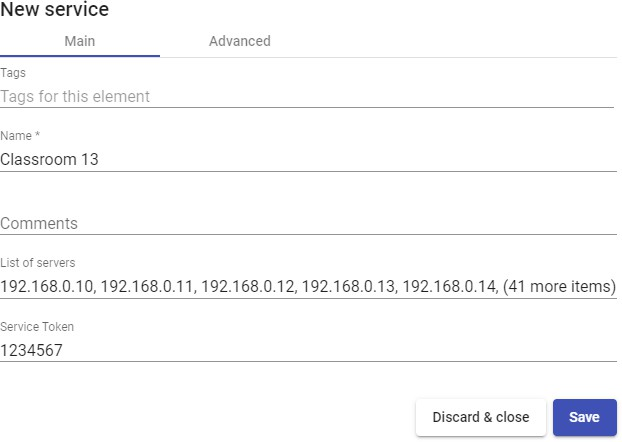

*Продвинутый:

**Пропустить время**: Если порт указан в поле "***Check Port***", а машина недоступна, вы можете указать время, которое предотвратит новую проверку этой машины. Если вы укажете 0, машины всегда будут проверяться. По умолчанию указано 15 (этот параметр указывается в минутах).

**Проверить порт**: Если вы укажете порт, то перед назначением службы пользователю система проверит доступность аппарата. В случае, если он недоступен через указанный порт, система назначает следующую доступную машину в списке. Если порт не указан, доступ к машинам не будет проверен и будет назначен независимо от их состояния.

**Максимальное количество рабочих мест на машину:** Если включен параметр "**Блокировать машину по внешнему доступу**", можно указать максимальное время, в течение которого UDS может считать оборудование пригодным к использованию, даже если был обнаружен доступ (извне UDS) пользователя.

**Блокировка компьютера по внешнему доступу:** Если эта функция включена и на компьютере установлен субъект UDS "unmanage", UDS запретит доступ к службе, если пользователь уже вошел в систему. Например, физический компьютер, к которому пользователь получил локальный доступ (не из UDS).


Сохраните конфигурацию и у вас будет валидный "***Static Multiple IP**_" Вы можете зарегистрировать все сервисы типа "_**Static Multiple IP***", которые вам нужны.

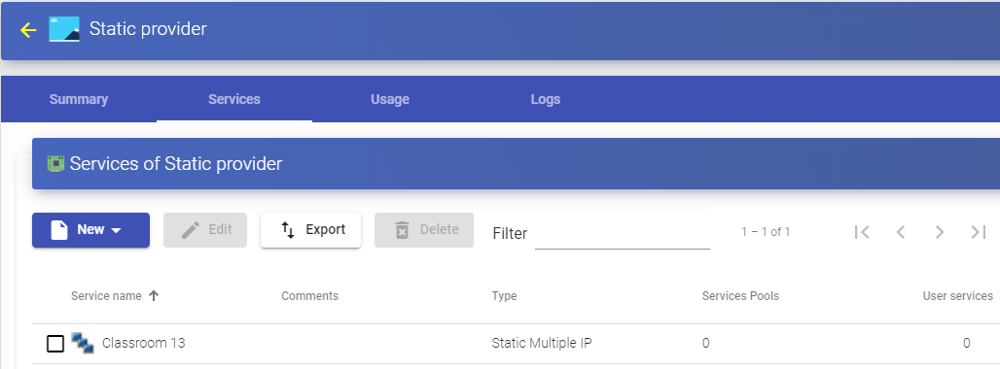

После того, как вы настроили полную среду UDS (службы, аутентификаторы и

Transports) и создан первый "***Service Pool***", пользователи будут получать доступ к IP-адресам различных компьютеров, зарегистрированных в службе.

Из "***Пула услуг***" также можно будет сделать выборочное назначение, указав, какое устройство назначено каждому пользователю.

##### Настройка службы на основе «Статического одного IP-адреса»

Этот тип услуг позволит разным пользователям получить доступ к одному и тому же компьютеру (физическому или виртуальному). Каждый пользователь начинает новый сеанс на компьютере, если он настроен для этой цели

Чтобы создать базовую услугу типа "***Static Single IP**_", зайдите в "_**Service Providers**_", выберите вкладку "_**Services**_", нажмите на "_**New**_" и выберите "_**Static Single IP***".

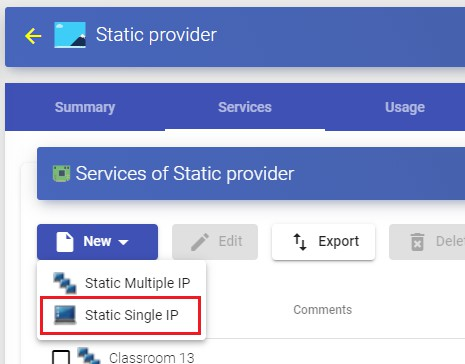

Минимальные параметры для настройки в этом типе сервиса:

**Имя:** Название услуги.

**IP-адрес компьютера:** IP-адрес компьютера, к которому будут подключаться пользователи. Компьютер должен разрешать доступ через различные пользовательские сеансы.

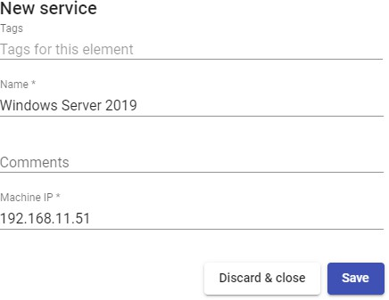

Сохраните конфигурацию и у вас будет действительный "***Static Single IP**_" Вы сможете зарегистрировать все сервисы типа "_**Static Single IP***", которые вам нужны.

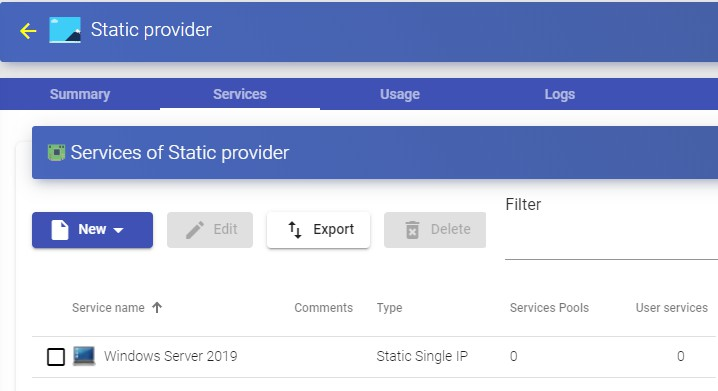

После того, как вы настроили полную среду UDS (службы, аутентификаторы и транспорты) и создали первый пул "*** служб***", пользователи получат доступ к IP-адресу указанного устройства, начав новый сеанс.

Сводка по использованию служб ##### и журналы ошибок

В разделе "***Поставщик услуг**_" у вас будет вкладка под названием "_**Использование**_", которая позволит вам быстро просмотреть подробную информацию и выполнить основные действия с услугами, отображаемыми в этом "_**Поставщик услуг***".

Чтобы получить доступ к этой информации об использовании услуг, перейдите в раздел «***Поставщики услуг**_» и выберите вкладку «_**Использование***»:

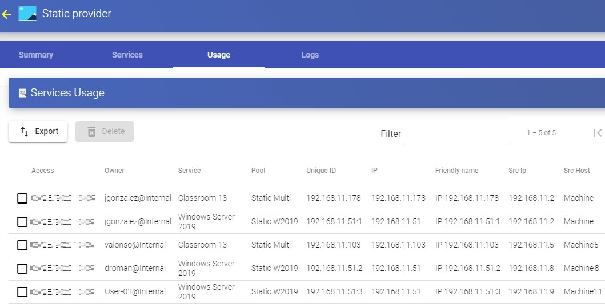

Увидите:

**Доступ:** Дата и время доступа к сервису.

**Владелец:** Пользователь и аутентификатор, назначенные сервису в формате user@authenticator.

**Сервис:** Имя базовой службы, принадлежащей "***Поставщику услуг***, от которого была сгенерирована услуга.

**Пул:** Название "***Service Pools***", к которому принадлежит сервис.

**Уникальный идентификатор:** MAC-адрес сервиса.

**IP:** IP-адрес сервиса

**Понятное имя:** Название службы. Это также будет DNS-имя самостоятельно созданной виртуальной машины UDS.

**Src Ip:** IP-адрес клиента, обращающегося к сервису.

**Src Host:** DNS-имя клиента соединения, который обращается к службе. Если вы не можете получить доступ к этому имени, будет указан IP-адрес.

Также можно будет выбрать одну или несколько услуг, чтобы приступить к их устранению.

На вкладке "***Журналы**_" будет показана информация о возможной проблеме, возникшей в "_**Поставщике услуг***":


#### Поставщик платформы RDS

Этот тип "***Поставщик услуг***" позволяет развертывать и подключаться к сеансам виртуальных приложений через службы удаленных рабочих столов Майкрософт (RDS)

С помощью этого поставщика пользователи, выполняющие проверку подлинности в системе аутентификации, отличной от Active Directory, также смогут получить доступ к сеансам приложений. Необходимо использовать сопоставление пользователей, которые могут быть ранее созданы в AD (выделенном для среды VDI) или что UDS автоматически создает этих пользователей на существующем сервере AD.

##### Зарегистрируйте поставщика услуг «Поставщик платформы RDS»

Нажмите на "***New**_" и выберите "_**RDS Platform Provider***":


В "***RDS Platform Provider***" минимальные параметры, которые необходимо настроить, следующие:

*Главный:

**Имя:** Название службы.

**Список серверов**: список серверов приложений Microsoft RDS, доступных для публикации приложений. В случае указания более одного сервера, соединения пользователей будут распределены между различными серверами.

Введите различные IP-адреса через запятую и нажмите «***Добавить***»:


**Проверка сервера:** Проверяет, доступен ли сервер приложений RDS каждый раз при поступлении запроса от пользователя. В случае невозможности подключения к первому серверу в списке, UDS будет искать следующий доступный сервер для предоставления услуги.


###### ПРИМЕЧАНИЕ: {#note-22 .ненумерованный}

Активируйте "**User mapping**" только в том случае, если вам нужно указать универсальных пользователей домена AD.

**Сопоставление пользователей:** "***Да**_" означает, что для доступа к приложениям будут использоваться конкретные пользователи (указанные в разделе "Пользователи"). "_**Нет***" будет использовать пользователя портала входа в UDS для доступа к приложениям (в этом случае это должен быть пользователь AD).

**Пользователи:** Применимо только в том случае, если для параметра "***Сопоставление пользователей**_" установлено значение "_**Да***". принадлежность

в Active Directory, которая сможет входить на серверы приложений RDS и будет использоваться UDS только для выполнения сеанса приложения.

**Пароль пользователя:** Пароль всех пользователей, указанных в предыдущем разделе. Все пользователи сопоставления должны иметь один и тот же пароль.

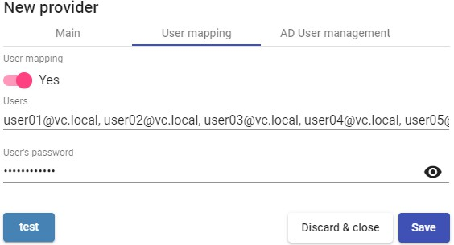

* Управление пользователями AD:

###### ПРИМЕЧАНИЕ: {#note-23 .ненумерованный}

Включите параметр "**Автоматическое создание пользователей в AD**" только в том случае, если вам нужно указать пользователей из домена AD. Эти пользователи будут автоматически созданы UDS.

**Автоматическое создание пользователей в AD:** "***Yes**_" Указывает, что для доступа к приложениям будут использоваться определенные пользователи, автоматически созданные UDS в AD. "_**Нет***" будет использовать пользователя портала входа в UDS для доступа к приложениям (в этом случае это должен быть пользователь AD).

**AD Server:** IP-адрес или имя сервера Active Directory, на котором будут созданы новые пользователи (на сервере должно быть включено подключение через LDAPS).

**Порт:** Порт, используемый в соединении.

**Подразделение сервера AD для созданных пользователей:** Организационное подразделение, в котором будут созданы новые пользователи

**Имя пользователя:** Пользователь домена с правами на создание и удаление пользователей. В формате: [_user@domain.xxx_](mailto:user@domain.xxx)

**Пароль:** Пароль указанного пользователя

**Префикс для созданных пользователей:** Префикс, который будет добавлен к имени пользователя, созданного в AD. Окончательное имя созданного пользователя будет таким: _prefix_+_prefix_user_.

**AD Domain:** Имя домена, в котором будут зарегистрированы новые пользователи. Если он не указан, то будет использован домен поля: "***Username***".

**AD Group:** Имя группы (должна существовать), в которую UDS будет добавлять новых созданных пользователей.

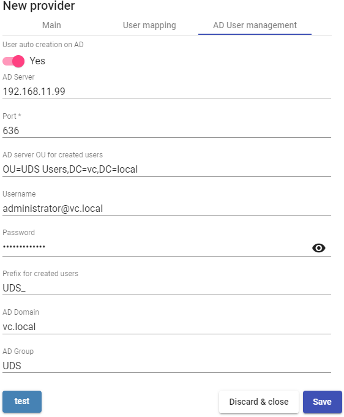

###### ПРИМЕЧАНИЕ: {#note-24 .unnumbered}

Для сопоставления пользователей можно активировать только один из двух методов: "Сопоставление пользователей" или "Автоматическое создание пользователей в AD".

С помощью кнопки "***Test***" вы проверите, что подключение прошло успешно.

Сохраните конфигурацию, и у вас будет действительный "***Service Providers***" для начала регистрации сеансов виртуальных приложений.


###### ПРИМЕЧАНИЕ: {#note-25 .unnumbered}

Если вам нужно создать новые серверы приложений, вы можете зарегистрировать все необходимые вам "**Поставщики услуг**" типа "**Поставщик платформы RDS**".

Чтобы изменить какой-либо параметр в существующем "***Поставщики услуг**_", вы должны выбрать его и нажать на "_**Редактировать***".

С помощью кнопки "***Enter Maintenance Mode***" можно приостановить все операции, выполняемые UDS-сервером на сервис-провайдере. Рекомендуется переводить поставщика услуг в режим обслуживания в случаях, когда связь с этим поставщиком услуг была потеряна или планируется отключение технического обслуживания.

После интеграции серверов приложений в UDS можно создавать базовые службы. Для этого дважды кликните по созданному поставщику услуг или по меню провайдера и выберите "***Детали***":

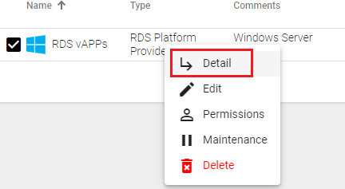

##### Настройка службы на основе "RDS Platform RemoteAPP"

После интеграции серверов приложений в UDS и установки соответствующего субъекта UDS необходимо создать базовые службы типа "***RDS Platform RemoteAPP***".

Там вы укажете приложение, которое нужно виртуализировать.

Для создания базовых сервисов типа "***RDS Platform RemoteAPP**_" доступа "_**Service Providers**_" выберите вкладку "_**Services**_", нажмите на "_**New**_" и выберите "_**RDS Platform RemoteAPP***".

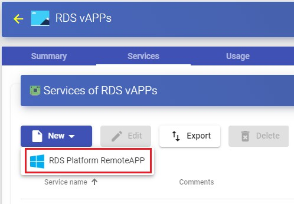

Минимальные параметры для настройки в этом типе сервиса:

*Главный:

**Имя:** Название услуги.

**Путь к приложению**: Путь выполнения виртуализированного приложения, размещенного на серверах RDS.

**Параметры приложения:** Параметры могут быть переданы любому приложению в этом поле для настройки выполнения приложения.

**Начальный путь**: Путь, по которому будет выполняться приложение.

**Max. Allowed services**: Максимальное количество сеансов приложения (0 = неограниченно).


*Продвинутый:

**Ожидание порожденных процессов:** Ожидает, пока все процессы, производные от приложения, не будут завершены, прежде чем считать приложение отключенным.


Сохраните конфигурацию, и у вас будет действительный "***RDS Platform RemoteAPP**_" и вы сможете зарегистрировать все "_**RDS Platform RemoteAPP***", которые вам нужны, на платформе UDS.


После того, как вы настроили полную среду UDS (службы, аутентификаторы, диспетчеры ОС и транспорты) и создали первый пул служб ****, вы сможете предоставить пользователям доступ к виртуальным сеансам приложений.

###### ПРИМЕЧАНИЕ: {#note-26 .ненумерованный}

Для подключения и предоставления приложений UDS требуется один или несколько внешних серверов RDS Windows Server 2012/2016/2019/2022. Для правильной работы сервер приложений должен быть правильно настроен и интегрирован с субъектом UDS.

Сведения о настройке и интеграции RDS с UDS см. в следующем документе: **Виртуализация приложений Windows с помощью OpenUDS 3.6** доступна в разделе документации веб-сайта OpenUDS [**www.udsenterprise.com**](http://www.udsenterprise.com/).

Сводка по использованию служб ##### и журналы ошибок

В разделе "***Поставщик услуг**_" у вас будет вкладка под названием "_**Использование**_", которая позволит вам быстро просмотреть подробную информацию и выполнить основные действия с услугами, отображаемыми в этом "_**Поставщик услуг***".

Чтобы получить доступ к этой информации об использовании услуг, зайдите в раздел «***Поставщики услуг**_» и выберите «_**Использование***»:

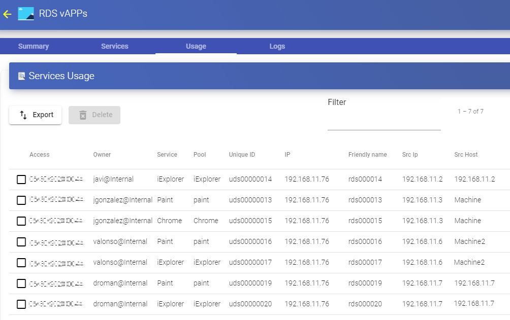

Увидите:

**Доступ:** Дата и время доступа к сервису.

**Владелец:** Пользователь и аутентификатор, назначенные сервису в формате user@authenticator. Если он пустой, это означает, что сервис не был назначен ни одному пользователю и доступен в кэше.

**Сервис:** Имя базовой услуги, принадлежащей "***Поставщику услуг***", от которого была сгенерирована услуга

**Пул:** Название "***Service Pools***", к которому принадлежит сервис.

**Уникальный идентификатор:** Идентификатор сервиса.

**IP:** IP-адрес сервиса.

**Понятное имя:** Название службы. Это также будет DNS-имя самостоятельно созданной виртуальной машины UDS.

**Src Ip:** IP-адрес клиента, обращающегося к сервису.

**Src Host:** DNS-имя клиента соединения, который обращается к службе. Если вы не можете получить доступ к этому имени, будет указан IP-адрес.

Также можно будет выбрать одну или несколько услуг, чтобы приступить к их устранению.

На вкладке "***Журналы**_" будет показана информация о возможной проблеме, возникшей в "_**Поставщике услуг***":


### Аутентификаторы

"***Authenticator***" является важным компонентом платформы UDS. Он проверяет пользователей на портале входа и предоставляет пользователям и группам пользователей разрешения на подключение к различным виртуальным рабочим столам и службам приложений.

"***Authenticator**_" не является необходимым компонентом для создания "_**Service Pool***", но если хотя бы один из них не назначен, то не будет пользователей, которые могут устанавливать соединения

с сервисами в платформе UDS.

Вы можете выбрать один из множества типов "***Authenticators,***" как внешних (Active Directory, eDirectory, OpenLDAP и т.д.), так и внутренних (внутренняя база данных и IP-аутентификация).

В настоящее время UDS поддерживает следующие "***Authenticators***":

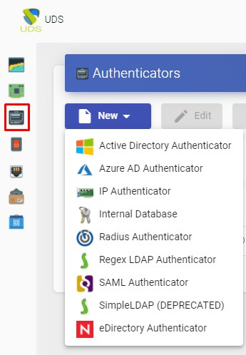

###### ПРИМЕЧАНИЕ: {#note-27 .unnumbered}

Вы сможете зарегистрировать все аутентификаторы, одного типа или разные, которые вы

нуждаться. Если у вас есть несколько аутентификаторов и они находятся в видимом состоянии, на портале входа в систему будет включено раскрывающееся меню, позволяющее выбрать, на каком из них система должна проверить пользователя.

#### Active Directory

Этот внешний аутентификатор предоставляет доступ к виртуальным рабочим столам и приложениям пользователям и группам пользователей, принадлежащих к Active Directory.

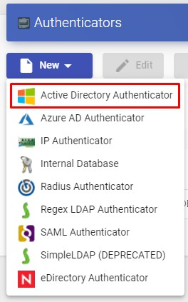

В "***Active Directory Authenticator***" необходимо настроить следующие минимальные параметры:

*Главный:

**Имя:** Имя аутентификатора.

**Приоритет:** Приоритет, который будет иметь этот аутентификатор. Если аутентификаторов несколько, то чем ниже его приоритет, тем выше он будет отображаться в списке аутентификаторов, доступных на портале входа в UDS. Это поле поддерживает отрицательные значения.

**Метка:** Включает прямую проверку в аутентификаторе. Это позволяет проверить пользователя на портале входа с помощью указанного средства проверки подлинности, даже если в среде UDS имеется больше средств проверки подлинности. Для этого вам нужно будет получить доступ к порталу входа в UDS в следующем формате: ***UDSServer/uds/page/login/label*** l (например: https://UDSServer/uds/page/login/AD).

**Host:** IP-адрес или имя сервера Active Directory (мы можем напрямую указать имя домена AD, например: vc.local).

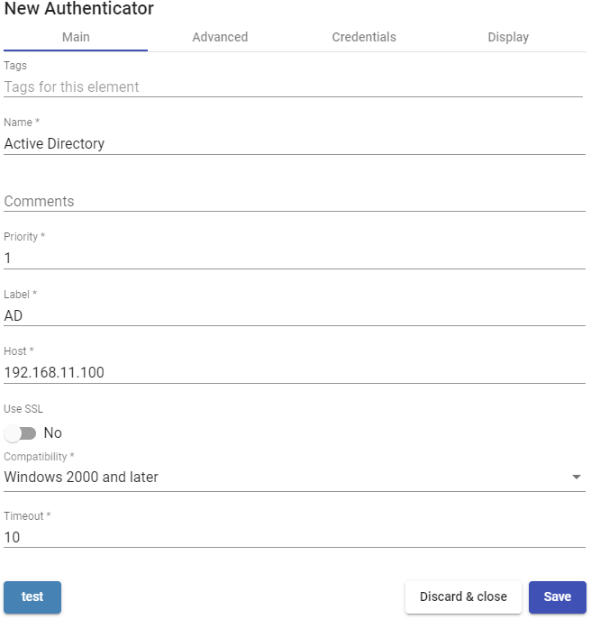**Использовать SSL:** Если эта опция включена, SSL-соединение будет использоваться против аутентификатора. **Совместимость:** Выберите уровень совместимости аутентификатора Active Directory. **Timeout:** "***Timeout***" для подключения к аутентификатору.

*Верительные грамоты:

**Пользователь:** Пользователь с правами чтения на аутентификаторе в формате: ***usuario@dominio***

**Пароль:** Пароль пользователя.

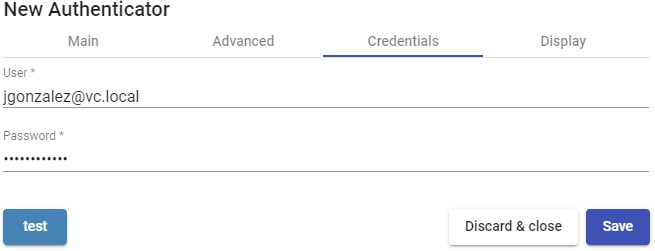

*Продвинутый:

**Overrride Base:** Это поле позволяет использовать базу поиска, отличную от используемой

по умолчанию (поисковая база по умолчанию извлекается из пользователя, указанного в поле "***Пользователь**_" раздела "_**Учетные данные***"). Заполняйте это поле только в том случае, если вам нужно указать

Конкретная база поиска пользователей (например: dc=vdi2, dc=local).

**Домен по умолчанию:** Домен, который будет добавлен к имени пользователя для входа.

**Резервный сервер:** сервер AD, который будет использоваться, если основной сервер, указанный в поле "***Host**_" в поле "_**Main***", недоступен.


*Дисплей:

**Видимость:** Если этот параметр отключен, аутентификатор не будет отображаться как доступный на странице входа в UDS.


С помощью кнопки "***Test***" вы убедитесь, что подключение к аутентификатору прошло успешно.

#### Azure AD

Этот внешний аутентификатор позволяет пользователям и группам пользователей, принадлежащих Azure Active Directory, получать доступ к виртуальным рабочим столам и приложениям.


В "***Azure AD Authenticator***" минимальные параметры для настройки:

*Главный:

**Имя:** Имя аутентификатора.

**Приоритет:** Приоритет, который будет иметь этот аутентификатор. Чем ниже этот приоритет, тем выше он будет отображаться в списке аутентификаторов, доступных в окне доступа пользователей. Это поле допускает отрицательные значения.

**Метка:** Включает прямую проверку подлинности в этом аутентификаторе. Это позволяет пользователю входить в систему с помощью указанного аутентификатора, даже если в среде UDS имеется больше аутентификаторов. Для этого

Вам нужно будет получить доступ к экрану «входа» UDS в следующем формате:

UDSServer/uds/page/login/label*** (например: https://UDSServer/uds/page/login/azure).

**Идентификатор клиента:** Это значение можно получить из службы Azure Active Directory, "Свойства", "Идентификатор каталога".

**Идентификатор клиента:** Для получения этого значения необходимо получить доступ к ранее созданному "Application registration" и скопировать значение "Application ID".

**Секрет клиента:** Это поле автоматически заполняется UDS после сохранения аутентификатора, и его содержимое нужно будет скопировать в сервис "***App registrations**_") и получить доступ к "_**settings***".


*Продвинутый:

**Обратный вызов:** Это поле автоматически заполняется UDS после сохранения средства проверки подлинности и его содержимого необходимо скопировать в "***App Registrations***", созданный в среде Azure.

**Прокси:** Прокси-сервер, который будет использоваться в соединении с аутентификатором

**Включить интеграцию School Data Sync:** Если этот флажок установлен, это позволит интегрироваться со средством "***School Data Sync Integration**_", которое должно быть подключено к средству проверки подлинности "_**Azure AD***".


*Дисплей:

**Видимость:** Если этот параметр отключен, аутентификатор не будет отображаться как доступный на странице входа в UDS.

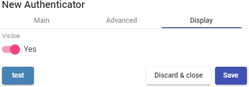

###### ПРИМЕЧАНИЕ: {#note-28 .ненумерованный}

Интеграция OpenUDS с средством проверки подлинности Azure Active Directory требует выполнения ряда предварительных задач и требований в среде Azure

Поэтому рекомендуется обратиться к руководству "VDI with UDS Enterprise y Microsoft Azure", доступному по адресу [[documentation]{.underline}](https://www.udsenterprise.com/en/uds-enterprise/documentacion/) веб-сайта OpenUDS.

С помощью кнопки "***Test***" вы проверите, что соединение прошло успешно.

#### IP

Этот внутренний аутентификатор обеспечивает прямой доступ к клиентам подключения (Single Sign-On) через их IP-адрес, к рабочим столам и виртуальным приложениям.

IP-адреса работают как пользователи других аутентификаторов, что позволяет напрямую

проверка клиентов подключения на портале входа в UDS. Группы пользователей в "***IP Authenticator***" могут быть от определенных диапазонов сети до полных подсетей или определенных IP-адресов


В "***IP Authenticator***" минимальные параметры, которые необходимо настроить, следующие:

*Главный:

**Имя:** Имя аутентификатора.

**Приоритет:** Приоритет этого аутентификатора. Чем ниже этот приоритет, тем выше он будет отображаться в списке аутентификаторов, доступных в окне доступа пользователя. Это поле допускает отрицательные значения.

**Метка:** Включает прямую проверку в аутентификаторе. Это позволяет валидировать его в URL-адресе страницы входа, не проходя через весь интерфейс дашборда, используя следующий формат: ***UDSServer/uds/page/login/label*** (например: https://UDSServer/uds/page/login/IP).

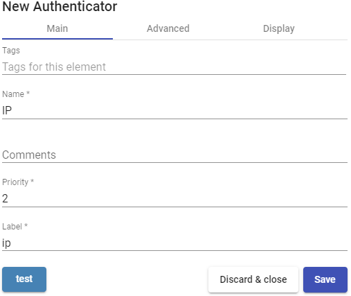

*Продвинутый:

**Видно только из этих сетей:** Позволяет фильтровать сети, из которых будет виден аутентификатор.

**Принять прокси:** Эта опция необходима при наличии предыдущего компонента доступа к UDS-серверу, например, балансировщика нагрузки.

UDS автоматически определяет IP-адрес клиента подключения. В средах, где настроены подсистемы балансировки нагрузки, это обнаружение не будет успешным, так как IP-адрес соответствует обнаруженным балансировщикам. При включении этой опции будет получено правильное определение IP-адреса.


*Дисплей:

**Видимость:** Если этот параметр отключен, аутентификатор не будет отображаться как доступный на странице входа в UDS.


#### Внутренняя база данных

В средах, где внешний аутентификатор недоступен, можно использовать "***Внутренняя база данных***". Проверки подлинности. Этот аутентификатор позволяет вручную создавать пользователей и группы для доступа к различным службам рабочего стола и виртуальным приложениям

предоставляется платформой UDS.

Все данные о пользователях и группах хранятся в Базе данных, к которой подключен UDS-сервер.


В "***Internal Database***" минимальные параметры, которые необходимо настроить:

*Главный:

**Имя:** Имя аутентификатора.

**Приоритет:** Приоритет, который будет иметь этот аутентификатор. Чем ниже этот приоритет, тем выше он будет отображаться в списке аутентификаторов, доступных в окне доступа пользователя. Это поле допускает отрицательные значения.

**Метка:** Включает прямую проверку подлинности в этом аутентификаторе. Это позволяет пользователю выполнять проверку с помощью указанного аутентификатора, хотя в среде UDS больше аутентификаторов. Для этого вам нужно будет получить доступ к экрану "входа" UDS в следующем формате: ***UDSServer/uds/page/login/label*** (например: https://UDSServer/uds/page/login/int1).

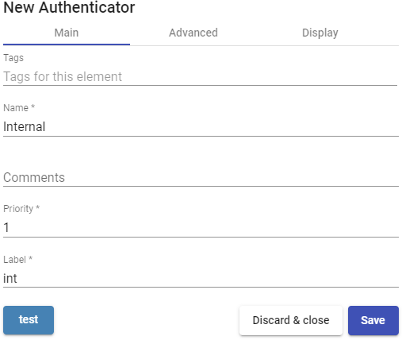

*Продвинутый:

**Разные пользователи для каждого хоста:** Эта опция позволяет подключаться к виртуальным рабочим столам с помощью одного пользователя подключения, добавляя root к имени существующего пользователя во время подключения к виртуальному рабочему столу. Этот корень представляет собой IP-адрес клиента подключения или его DNS-имя.

Вновь созданное имя пользователя имеет следующую структуру:

######## IP-адрес клиента -generic _cenection user {#ip-of-the-client--generic-_cenection-user .unnumbered}

**Обратный DNS:** Он ведет себя точно так же, как и опция "***Разные пользователи для каждого хоста***", но корень, добавленный к пользователю, является DNS-именем клиента подключения. A

Требуется правильное разрешение DNS. В противном случае будет использоваться IP-адрес. Созданный новый пользователь имеет следующую структуру:

######## Generic_user-connection_client_name {#generic_user-connection_client_name .unnumbered}

**Принять прокси:** Эта опция должна быть включена, если перед доступом к UDS-серверу есть компонент, например балансировщик нагрузки.

По умолчанию UDS автоматически определяет IP-адрес клиента подключения. В средах, где настроены балансировщики нагрузки или другие подобные элементы, это обнаружение выполняется некорректно, так как обнаруженный IP-адрес соответствует этим балансировщикам. Включив эту опцию, вы получите правильное определение IP-адреса.

В средах, где используется опция "***Разные пользователи для каждого хоста***" и есть балансировщики нагрузки, необходимо включить эту опцию.

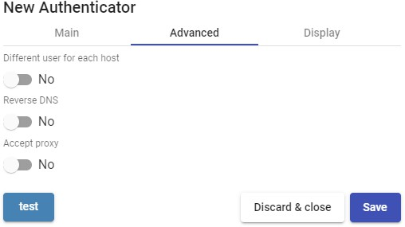

*Дисплей:

**Видимость:** Если этот параметр отключен, аутентификатор не будет отображаться как доступный на странице входа в UDS.


#### Радиусный аутентификатор

Этот внешний аутентификатор позволяет предоставлять доступ к виртуальным рабочим столам и приложениям пользователям и группам пользователей, входящим в аутентификатор на основе RADIUS.

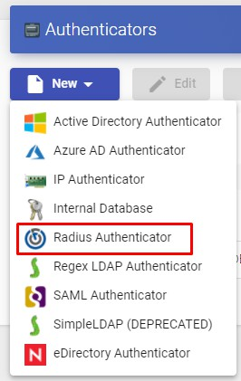

В "***Radius Authenticator***" необходимо настроить следующие минимальные параметры:

*Главный:

**Имя:** Имя аутентификатора.

**Приоритет:** Приоритет, который будет иметь этот аутентификатор. Если аутентификаторов несколько, то чем ниже их приоритет, тем выше они будут отображаться в списке доступных аутентификаторов на портале входа в UDS. Это поле допускает отрицательные значения.

**Метка:** Включает прямую проверку подлинности в этом аутентификаторе. Это позволяет пользователю выполнять проверку с помощью указанного аутентификатора, хотя в среде UDS больше аутентификаторов. Для этого

Вам нужно будет получить доступ к экрану входа в UDS в следующем формате:

UDSServer/uds/page/login/label*** (например: https://UDSServer/uds/page/login/Radi).

**Хост:** IP-адрес или имя RADIUS-сервера.

**Порт:** Порт связи с сервером RADIUS.

**Секрет:** Строка проверки для сервера RADIUS (определена на самом сервере RADIUS).


*Продвинутый:

**Идентификация NAS:** Идентифицирует UDS на сервере RADIUS, позволяя при необходимости выполнить фильтрацию.

**Префикс приложения для атрибутов класса:** Позволяет фильтровать, какие группы мы получаем из атрибута "class" сервера RADIUS.

**Глобальная группа:** Позволяет принудительно присвоить всем пользователям принадлежность к группе. Это позволяет RADIUS-серверу (который по-прежнему является «простым» аутентификатором), не содержащему групп, назначать ВСЕХ пользователей в группу (даже если он также содержит группы).


###### ПРИМЕЧАНИЕ: {#note-29 .unnumbered}

По умолчанию UDS извлекает из атрибута Radius "Class" элементы, имеющие вид "group=..."

Если мы определим в "Префиксе приложения для атрибутов класса", например, "lab", UDS будет искать только атрибуты "class" в форме "labgroup=..."

*Дисплей:

**Видимость:** Если этот параметр отключен, аутентификатор не будет отображаться как доступный на странице входа в UDS.


С помощью кнопки "***Test***" вы можете проверить успешность подключения.

#### Регулярные выражения LDAP

Этот аутентификатор позволяет пользователям и группам пользователей, принадлежащих практически к любому аутентификатору на основе LDAP, получать доступ к виртуальным рабочим столам и приложениям.


В "***Regex LDAP Authenticator***" минимальные параметры для настройки:

*Главный:

**Имя:** Имя аутентификатора.

**Приоритет:** Приоритет, который будет иметь этот аутентификатор. Чем ниже этот приоритет, тем выше он будет отображаться в списке аутентификаторов, доступных в окне доступа пользователей. Это поле допускает отрицательные значения.

**Метка:** Включает прямую проверку подлинности в этом аутентификаторе. Это позволяет пользователю выполнять проверку в окне входа с помощью указанного аутентификатора, даже если в среде UDS есть больше аутентификаторов. Для этого нам нужно будет получить доступ к экрану входа в UDS в следующем формате: ***UDSServer/uds/page/login/label*** (например: https://UDSServer/uds/page/login/LDAP).

**Хост:** IP-адрес или имя LDAP-сервера.

**Использовать SSL:** Если включено, SSL-соединение будет использоваться против аутентификатора.

**Timeout:** "***Timeout***" для подключения к аутентификатору.

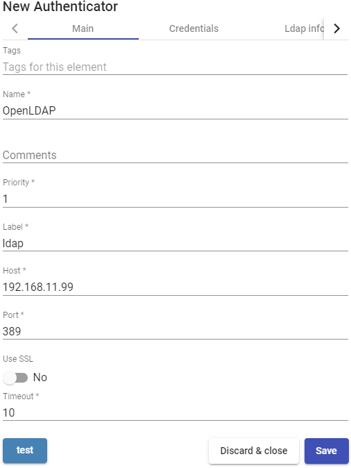

*Верительные грамоты:

**Пользователь:** Пользователь с правами на чтение аутентификатора. Формат: ***uid=...,ou=....,dc=...,dc=...***

**Пароль:** Пароль пользователя.


* Информация о Ldap:

**Base:** Каталог поиска, в котором система будет находить группы и пользователей для проверки в системе.

**User class:** Общий класс, который должен быть у всех пользователей.

**User Id Attr:** LDAP-атрибут, определяющий имя пользователя для входа на портал доступа UDS.

**User Name Attr:** Атрибут LDAP, определяющий имя пользователя для входа в UDS

Портал доступа. Он также позволяет использовать регулярные выражения для извлечения или составления определенных значений.

**Имя группы Attr:** Атрибут LDAP, определяющий членство пользователя в группе. Для определения различных атрибутов группы (по одному в каждой строке) могут быть указаны различные атрибуты. Он также позволяет использовать регулярные выражения для извлечения или составления определенных значений.


*Продвинутый:

**Alt. class:** Вы можете указать больше типов объектов для поиска пользователей и групп пользователей.


*Дисплей:

**Видимость:** Если этот параметр отключен, аутентификатор не будет отображаться как доступный на странице входа в UDS.

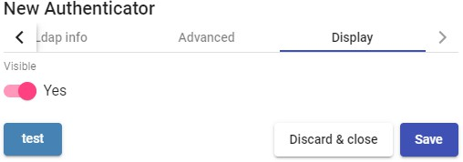

С помощью кнопки "***Test***" вы можете проверить успешность подключения.

#### САМЛ

Этот внешний аутентификатор позволяет пользователям и группам пользователей, принадлежащих поставщику удостоверений с поддержкой SAML 2.0, получать доступ к виртуальным рабочим столам и приложениям.

SAML используется для обмена данными аутентификации и авторизации между доменами безопасности, то есть между поставщиком удостоверений (поставщиком утверждений) и поставщиком услуг (потребителем утверждений).

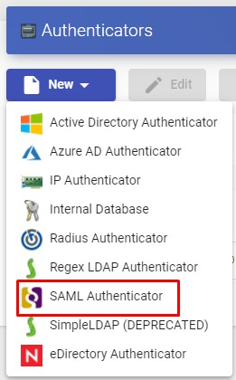

В "***SAML Authenticator***" необходимо настроить следующие минимальные параметры:

*Главный:

**Имя:** Имя аутентификатора (не может содержать пробелы).

**Приоритет:** Приоритет, который будет иметь этот аутентификатор. Чем ниже этот приоритет, тем выше он будет отображаться в списке аутентификаторов, доступных в окне доступа пользователей. Это поле допускает отрицательные значения.

**Метка:** Включает прямую проверку подлинности в этом аутентификаторе. Он позволяет пользователю выполнять проверку в окне входа в систему с помощью указанного аутентификатора, хотя в среде UDS больше аутентификаторов. Для этого вам нужно будет получить доступ к экрану входа в UDS в следующем формате: ***UDSServer/uds/page/login/label*** (например: https://UDSServer/uds/page/login/SAML).

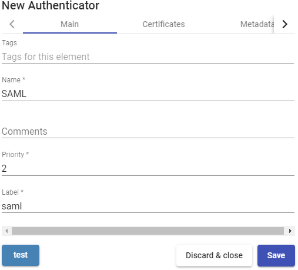

*Сертификаты:

**Закрытый ключ:** Закрытый ключ RSA, который используется для подписей и шифрования.

**Сертификат:** Открытый ключ, который используется в SSL-сессиях.


*Метаданные:

**Метаданные IDP:** Вы можете указать URL-адрес или файл в формате XML.

**Идентификатор сущности:** Это поле изначально должно быть пустым. URL-адрес будет автоматически сгенерирован при сохранении аутентификатора. URL-адрес, сгенерированный в этом поле, обычно необходимо использовать для регистрации UDS в качестве поставщика услуг (SP) на сервере SAML.


*Атрибуты:

**User name attrs:** Атрибут, определяющий имя пользователя для входа в порт доступа UDS.

**Атрибут имени группы:** Атрибут, определяющий членство пользователя в группе. Для определения различных атрибутов группы (по одному в каждой строке) могут быть указаны различные атрибуты, а также это позволяет использовать регулярные выражения для извлечения или составления определенных значений.

**Real name attrs:** Атрибут, определяющий информацию об имени пользователя. Это не влияет на портал входа в UDS.


*Дисплей:

**Видимость:** Если отключено, аутентификатор не будет отображаться как доступный на странице входа в UDS

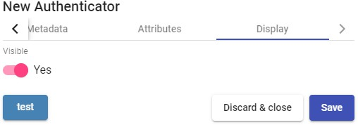

#### eDirectory

Этот внешний аутентификатор позволяет пользователям и группам пользователей, принадлежащих к сети Novell, получать доступ к виртуальным рабочим столам и приложениям.


В "**eDirectory Authenticator**" необходимо настроить следующие минимальные параметры:

*Главный:

**Имя:** Имя аутентификатора.

**Приоритет:** Приоритет, который будет иметь этот аутентификатор. Чем ниже этот приоритет, тем выше он будет отображаться в списке аутентификаторов, доступных в окне доступа пользователя. Это поле допускает отрицательные значения.

**Метка:** Включает прямую проверку подлинности в этом аутентификаторе. Это позволяет пользователю выполнять проверку с помощью указанного аутентификатора, хотя в среде UDS больше аутентификаторов. Для этого

Вам нужно будет получить доступ к экрану входа в UDS в следующем формате:

UDSServer/uds/page/login/label*** (например: https://UDSServer/uds/page/login/ED).

**Host: I**P адрес или имя сервера eDirectory.

**Использовать SSL:** Если включено, SSL-соединение будет использоваться для аутентификатора r.

**Тайм-аут:** "***Тайм-аут***" или соединение с аутентификатором.

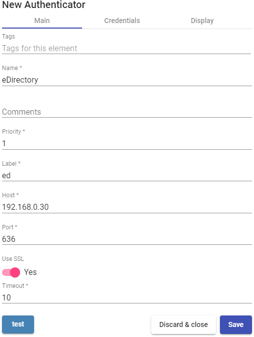

*Верительные грамоты:

**Пользователь:** Пользователь с правами чтения на аутентификаторе в формате:***CN=пользователь, O=домен.***

**Пароль:** Пароль пользователя.


*Дисплей:

**Видимость:** Если отключено, аутентификатор не будет отображаться как доступный на странице входа в UDS

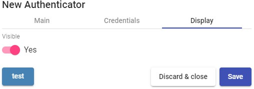

Нажав на кнопку «***Тест***», вы можете проверить, правильно ли было выполнено подключение.

### Многофакторность

Многофакторная проверка подлинности (MFA) добавляет уровень защиты к процессу входа.

При доступе к учетной записи или приложению пользователи должны пройти дополнительную проверку личности. UDS изначально поддерживает несколько систем многофакторной аутентификации:

* Многофакторная электронная почта
* Испытание Radius OTP
* SMS по HTTP
* MFA на основе TOTP

Кроме того, он поддерживает другие многофакторные проверки подлинности, интегрированные в сам модуль проверки подлинности, так что при включении средства проверки подлинности в UDS Enterprise он включается автоматически.

В OpenUDS вы можете выполнять двойную аутентификацию пользователей нативно, используя различные методы, описанные ниже.

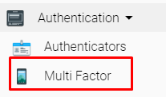

Конфигурация "**Multifactor**" не является необходимым компонентом для создания **"Пула служб**"


####### Безопасная процедура развертывания: {#safe-employment-procedure-3 .unnumbered}

Рекомендуется использовать любую систему, хотя бы одну, многофакторной аутентификации.

#### Многофакторная электронная почта

С помощью этого метода пользователь сначала аутентифицируется со своим именем пользователя и паролем, а затем будет перенаправлен ко второму процессу аутентификации, где он получит электронное письмо с необходимым кодом для окончательной аутентификации на своей платформе OpenUDS.

В "***Многофакторном письме"*** Минимальные параметры для настройки:

*Главный:

**Имя:** Название, на котором будет указан товар.

**Кэширование устройства:** Время в часах для кэширования устройства, чтобы MFA больше не требовалась.

**Срок действия кода MFA:** Время в минутах для разрешения использования кода MFA.

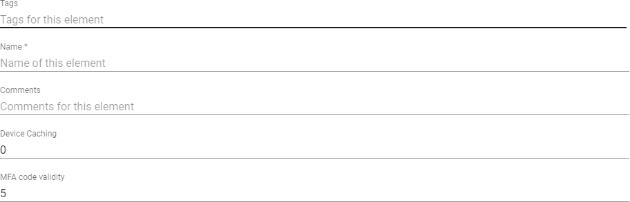

* SMTP-сервер:

**SMTP Host:** Имя хоста или IP-адрес SMTP-сервера.

**Безопасность:** Используемый протокол безопасности.

**Имя пользователя:** Время в минутах для разрешения использования кода MFA.

**Пароль**: Пароль пользователя с доступом к SMTP-серверу

**Процедура безопасного использования:** Пароли должны быть достаточной длины и включать прописные, строчные буквы, цифры и специальные символы.

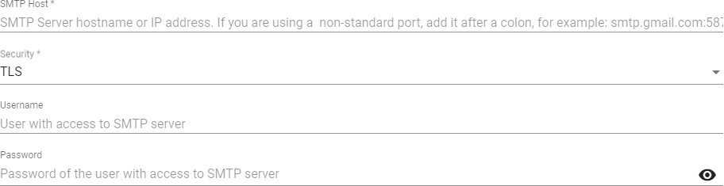

* Конфигурация:

**Тема: Тема** электронного письма, которое будет отправлено пользователям.

**From Email:** Адрес электронной почты, который будет использоваться в качестве отправителя.

####### Политика для пользователей без поддержки MFA: политика, используемая с пользователями, для которых не настроена MFA. {#policy-for-users-without-MFA-support-policy-to-be-be-be-use-with-tyou-mfa-configured..unnumbered}

**Текст письма**: Текст, который будет отображаться в отправленном письме.

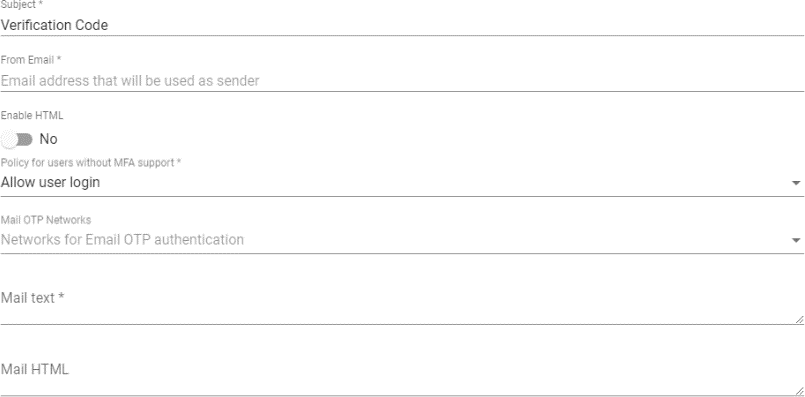

#### Испытание Radius OTP

С помощью этого метода пользователь сначала аутентифицируется со своим именем пользователя и паролем, а затем будет перенаправлен ко второму процессу аутентификации, где он должен ввести соответствующий код, предоставленный его сервером radius, чтобы окончательно аутентифицироваться на своей платформе OpenUDS.

С помощью этого метода пользователь сначала аутентифицируется со своим именем пользователя и паролем, а затем будет перенаправлен ко второму процессу аутентификации, где он должен ввести соответствующий код, предоставленный его сервером radius, чтобы окончательно аутентифицироваться на своей платформе OpenUDS.

o Главная:

**Name**: Имя, которое будет указано элементу.

**Host**: Имя хоста или IP-адрес Radius-сервера

**Порт**: Радиусный порт аутентификации.

**Секрет: "**Секрет" клиента Radius.

**Идентификатор NAS**: идентификатор NAS для сервера Radius.

**Кэширование устройства:** Время в часах для кэширования устройства, чтобы MFA больше не требовалась.

**Срок действия кода MFA:** Время в минутах для использования кода MFA.

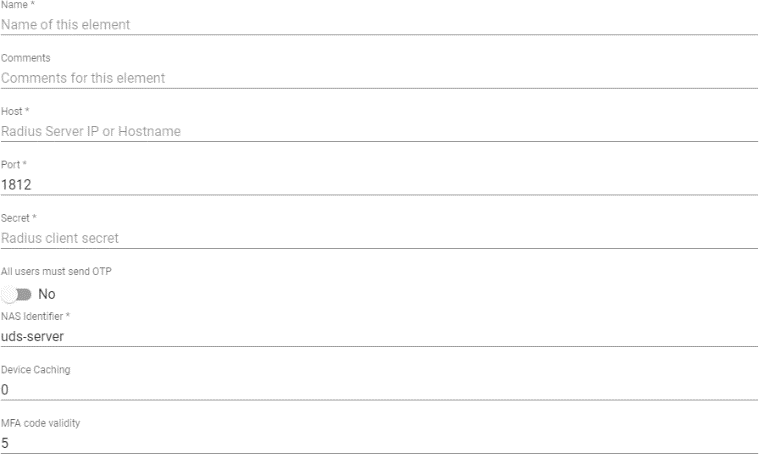

o Конфигурация:

**Действие при ошибке связи Radius OTP**: Действие, выполняемое сервером Radius в случае ошибки.

####### Radius OTP Networks: Сети для аутентификации Radius OTP {#radius-otp-networks-networks-for-radius-otp-authentication .unnumbered}

**Пользователи без определенного одноразового пароля на сервере**: политика, которая будет использоваться с теми пользователями, для которых не настроена MFA.

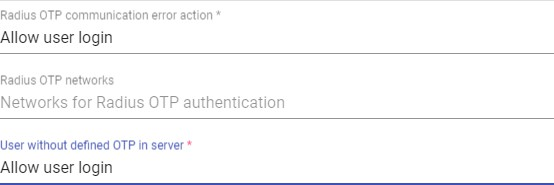

#### SMS по HTTP

С помощью этого метода пользователь сначала аутентифицируется со своим именем пользователя и паролем, а затем будет перенаправлен ко второму процессу аутентификации, где он получит SMS с необходимым кодом для окончательной аутентификации на своей платформе OpenUDS.

В "***SMS Via HTTP***" Минимальные параметры для настройки: o Main:

**Имя:** Название, на котором будет указан товар.

**Кэширование устройства:** Время в часах для кэширования устройства, чтобы MFA больше не требовалась.

**Срок действия кода MFA:** Время в минутах для разрешения использования кода MFA.


* HTTP-сервер:

Шаблон URL-адреса для отправки SMS***: шаблон URL-адреса для отправки SMS. Он может содержать следующие переменные:

* {code} - код для отправки
* {phone/+phone} - номер телефона
* {username} - имя пользователя
* {justUsername} - имя пользователя без @.

**Способ отправки SMS**: Метод, который будет использоваться для отправки SMS.

**SMS Enccoding**: Шифрование, используемое для отправки SMS.

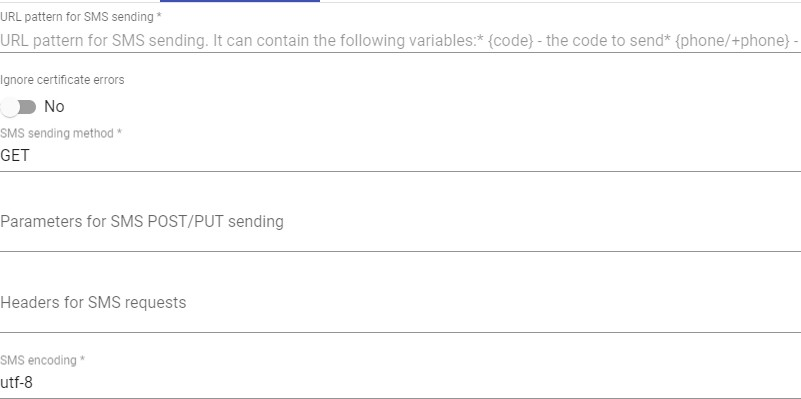

* Аутентификация по протоколу HTTP:

**Метод аутентификации SMS**: метод аутентификации по SMS

**SMS-аутентификация пользователя или токен**: пользователь или токен для SMS-аутентификации

**SMS-аутентификация paswword**: Пароль для SMS-аутентификации


* Конфигурация:

**Действие с ошибкой SMS-ответа:** Действие, которое должно быть предпринято сервером в случае ошибки.

**Пользователь без политики MFA**: действие, выполняемое с пользователями без настроенной политики MFA.


#### MFA на основе TOTP

С помощью этого метода пользователь сначала аутентифицируется со своим именем пользователя и паролем, а затем будет перенаправлен ко второму процессу аутентификации, где он должен ввести код TOTP, генерируемый время от времени в нашем приложении, таком как **Google authenticator**, **Microsoft** и т. д., чтобы иметь возможность окончательно аутентифицироваться на вашей платформе UDS Enterprise.

С помощью этого метода пользователь сначала пройдет аутентификацию со своим именем пользователя и паролем, а затем будет перенаправлен ко второму процессу аутентификации, где он должен ввести код TOTP, генерируемый время от времени в нашем приложении, такой как **Google authenticator**, **Microsoft** и т. д., чтобы иметь возможность окончательно пройти аутентификацию на вашей платформе UDS Enterprise.

o Главная:

**Имя**: Имя, которое будет указано для элемента.

**Эмитент**: Эмитент одноразового пароля, после создания он не может быть изменен

**Кэширование устройства**: время в часах для кэширования устройства, чтобы MFA больше не требовалась.

**Срок действия кода MFA**: время в минутах для разрешения использования кода MFA.


o Конфигурация:

**Valid Window**: Количество кодов, которые будут действительны до и после текущего.

**TOTP сети**: Пользователь, добавленный в эти сети, не будет запрашивать одноразовый пароль.


### Настройка пользователей, групп и пользовательских метегтупов

После настройки средства проверки подлинности или средств проверки подлинности необходимо настроить группы пользователей, содержащие пользователей, которым должен быть предоставлен доступ к службам рабочего стола. Также есть возможность создавать метагруппы, которые будут использоваться для объединения нескольких групп.

Чтобы добавить группы или метагруппы в аутентификатор, выделите его и дважды щелкните по нему, или выберите "***Detail***" в меню провайдера:


Оказавшись внутри аутентификатора, выберите вкладку "***Группы**_" и в поле "_**Новые**_" выберите "_**Группа***":


Вы укажете название группы через поле "***Группа**_", с ее статусом (включено или отключено) Кроме того, вы можете напрямую назначить ее одному или нескольким "_**Пулам служб***".

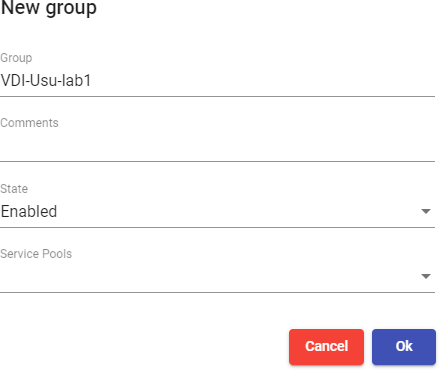

В некоторых аутентификаторах, таких как "***Active Directory***", будет выполнен автоматический поиск:


В других, таких как "***Regex LDAP**_", "_**SAML**_", "_**eDirectory***"... Указывать его нужно будет вручную.

###### ПРИМЕЧАНИЕ: {#note-30 .ненумерованный}

Для аутентификаторов внутреннего типа, таких как «Внутренняя база данных» и «IP-аутентификатор», необходимо будет создавать группы вручную, так как они не подключаются ни к какой внешней системе аутентификации.

Доступ к порталу входа в UDS будет предоставлен всем пользователям, входящим в группу (определенного аутентификатора).

Чтобы создать метагруппу (группу, состоящую из нескольких групп), выберите вкладку "***Группы**_" и выберите "_**Метагруппа**_" в "__New_*"


В поле "***Название метагруппы**_" вы укажете название метагруппы, ее статус (Включена или отключена), режим работы через поле "_**Режим сопоставления***", а также выберете группы, которые войдут в состав метагруппы.


На вкладке "***Пользователи***" аутентификатора пользователи будут добавлены автоматически при их проверке на портале входа в UDS при условии, что эти пользователи принадлежат к существующим группам в аутентификаторе:

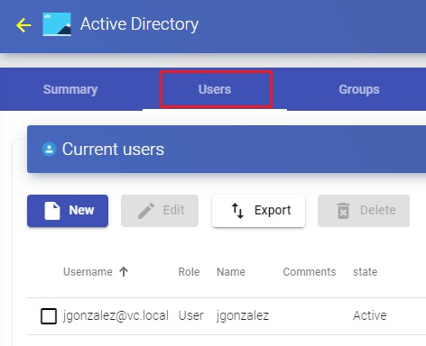

Если вам нужно зарегистрировать пользователей вручную, чтобы назначить специальные разрешения перед их первым подключением, вы нажмете на «***Новый**_» и выберете пользователя, его статус (включен или отключен) и уровень доступа (поле «_**Роль***»). В случае неиспользования

автора "***Internal Database**_", поле "_**Groups***" будет оставлено пустым, так как система должна автоматически добавить пользователя в его группу членства (после сохранения пользователя вы можете отредактировать его и проверить, правильно ли он был назначен группе).

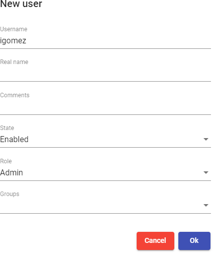

###### ПРИМЕЧАНИЕ: {#note-31 .unnumbered}

Пользователи аутентификатора «Внутренняя база данных» всегда должны создаваться вручную.

Поле доступа "**Admin**" " делает пользователя администратором среды. " **Сотрудник**" предоставляет доступ к загрузкам UDS Actor и администрированию UDS в ограниченном

в соответствии с назначенными разрешениями. "**Пользователь**" разрешает доступ только к окну служб UDS (последнее используется по умолчанию)

После того, как пользователь был добавлен, вы можете изменить его с помощью раздела "***Редактировать***".

Чтобы удалить пользователя, группу или метагруппу, выделите его и нажмите на кнопку «***Удалить***». пуговица. Если у вас в системе зарегистрированы пользователи, принадлежащие к группе, и она удалена, то пользователи останутся без назначенной группы и не смогут быть проверены в системе.

#### Создание групп и пользователей "Внутренняя база данных"

В аутентификаторе типа "***Internal Database**_" необходимо вручную создать группы пользователей, которые будут назначены "_**Service Pool***".

Войдите в ранее созданный аутентификатор "***Внутренняя база данных**_" и на вкладке "_**Группы**_" нажмите на "_**Новый - Группа***".

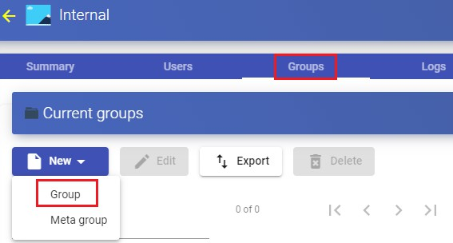

Вы указываете имя новой группы, ее статус (включена или отключена), а также можете назначить ее непосредственно одному или нескольким "*** пулам служб***".

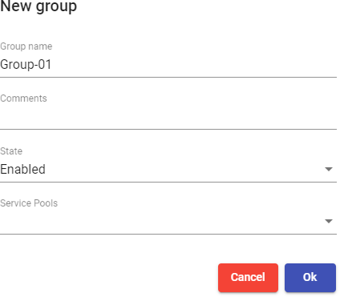

Выполните ту же процедуру, если вам нужно создать метагруппу.

После создания группы или групп пользователей зарегистрируйте пользователей и назначьте их одной или нескольким группам.

Войдите в ранее созданный аутентификатор "***Внутренняя база данных**_" и на вкладке "_**Пользователи**_" нажмите на "_**Новый***".

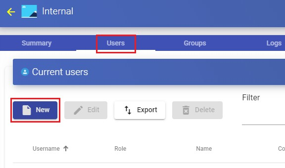

Введите имя нового пользователя, его статус (включен или отключен), уровень доступа (поле "***Роль**_") и пароль. В поле "_**Группы***" укажите, какие группы он будет

Принадлежать (можно выбрать одну или несколько из существующих групп).


#### Создание групп и пользователей "IP Authenticator"

В "***IP Authenticator***" необходимо вручную создать группы пользователей. В данном случае группа будет представлять собой диапазон IP-адресов, полную подсеть или один IP-адрес. В каждом случае вы будете использовать следующий формат:

* Уникальный IP: xxx.xxx.xxx.xxx (например:192.168.11.33)
* Полная подсеть: xxx.xxx.xxx.xxx/xx (например: 192.168.11.0/24)
* Диапазон IP-адресов: xxx.xxx.xxx.xxx-xxx.xxx.xxx.xxx (например: 192.168.11.1- 192.168.11.155)

Войдите в ранее созданный аутентификатор "***IP Authenticator***" и на вкладке "***Groups**_" нажмите на "_**New- Group***".

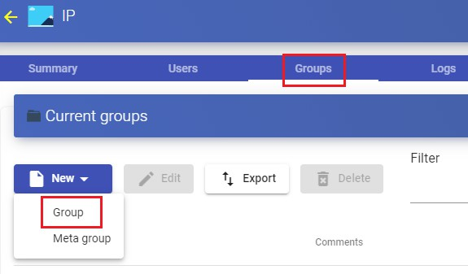

Введите диапазон IP-адресов, полную подсеть или IP-адреса, разделенные запятыми (поле ***Диапазон IP-адресов***") и их статус (включено или отключено). Вы также можете назначить его непосредственно

один или несколько "***Пулов услуг***".


Когда пользователь выбирает этот аутентификатор на портале входа в UDS (то есть аутентификатор по умолчанию), система проверяет IP-адрес его клиента подключения. Если этот адрес находится в диапазоне, указанном в группе (поле "***IP Range***"), пользователь будет автоматически проверен.

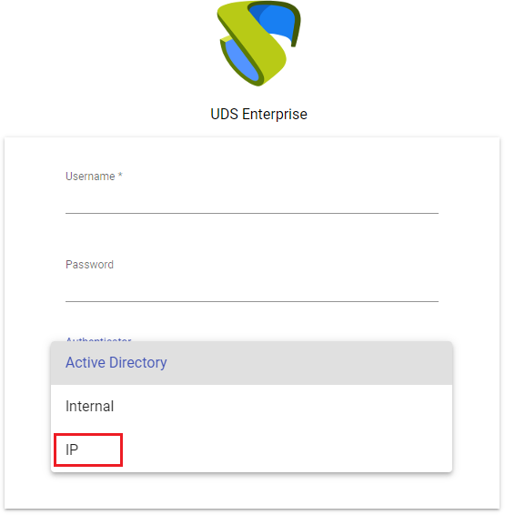

После того, как пользователь будет подтвержден на портале входа в UDS, его IP-адрес будет автоматически зарегистрирован во вкладке «Пользователи».


Если вам нужно изменить его статус (включено или отключено) или уровень доступа (поле ***Роль***"), выберите его и нажмите на кнопку "Редактировать".


OpenUDS 3.6 Установка, администрирование и руководство пользователя

страницаPág286ina of286436 436

# OpenUDS 3.6 Руководство по установке, администрированию и пользователю {#uds-enterprise-3.6-installation-administration-and-user-guide-1 .unnumbered}

### Менеджеры ОС

"***OS Manager***" запускает ранее настроенный тип службы.

Субъект UDS, размещенный на виртуальном рабочем столе или сервере приложений, отвечает за взаимодействие между операционной системой и сервером UDS на основе конфигураций или

Выбран тип "***OS Manager***".

Вы можете зарегистрировать столько "***OS Managers***", сколько вам нужно в платформе UDS Enterprise. Вы можете выбрать различные типы в зависимости от потребностей развертываемых служб.


###### ПРИМЕЧАНИЕ: {#note-32 .unnumbered}

Для любого типа службы, развернутой в UDS, потребуется "**OS Manager**", за исключением случаев, когда вы используете "**Static IP Machines Provider**".

#### Линукс

"***Linux OS Manager***" используется для виртуальных рабочих столов на базе систем Linux. Он выполняет задачи переименования и управления сеансами виртуальных рабочих столов.

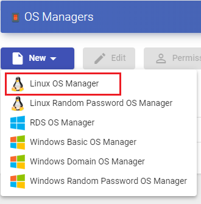

В "***Linux OS Manager***" минимальные параметры, которые необходимо настроить, следующие:

*Главный:

**Имя:** Имя "***OS Manager***".

**Действие выхода:** Вы укажете действие, которое UDS будет выполнять на виртуальном рабочем столе при закрытии пользовательского сеанса:

* **Сохранить назначенную службу (Semi persistent virtual desktop):** Когда пользователь выходит из виртуального рабочего стола, система не предпринимает никаких действий. Когда

При повторном подключении вам будет назначен тот же рабочий стол, что и ранее

работал с. Если будет произведена новая публикация "***Service Pool***", то при выходе пользователя из системы его виртуальный рабочий стол будет удален, и он подключится к новому, сгенерированному в новой версии.

* **Удалить службу (временная виртуальная машина):** Когда пользователь выходит из системы, система уничтожает рабочий стол. Если этот же пользователь снова запросит виртуальную машину в системе, система предоставит новый виртуальный рабочий стол.
* **Сохранение назначенного сервиса даже при новой публикации (постоянный виртуальный рабочий стол):** Когда пользователь выходит из виртуального рабочего стола, система не принимает

любое действие. При повторном подключении ему будет назначен тот же рабочий стол, с которым он ранее работал. Если будет сделана новая публикация "***Service Pool***", то при выходе пользователя из системы его виртуальный рабочий стол останется назначенным и будет удален только после того, как администратор укажет на это.

**Максимальное время простоя:** Максимальное время бездействия (в секундах) на виртуальном рабочем столе. По истечении этого времени бездействия субъект UDS автоматически закроет сеанс. Отрицательные значения и менее 300 секунд отключают эту опцию.


*Продвинутый:

**Выход из календаря:** Позволяет выбрать поведение, которое система будет вести с сеансом пользователя при достижении даты окончания календаря. Если это "***Да**_", Когда дата окончания календаря, назначенного услуге, будет выполнена, система отключит пользователя от указанной услуги, если он "_**Нет***", система не выведет пользователя из системы, но если пользователь выйдет из системы или даже прервет соединение, он не сможет войти снова.

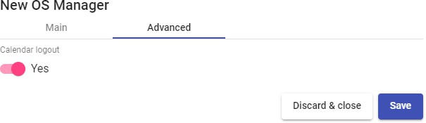

#### Случайный пароль Linux

"***Linux Random Password OS Manager***" используется для виртуальных рабочих столов на базе систем Linux, требующих более высокого уровня безопасности доступа пользователей. Он выполняет задачи по переименованию, управлению сеансом и смене пароля существующего локального пользователя на виртуальных рабочих столах.


Благодаря его использованию существующему локальному пользователю назначается случайный пароль во время настройки каждого нового развернутого виртуального рабочего стола, что обеспечивает более высокий уровень безопасности доступа.

В "***Linux Random Password OS Manager***" необходимо настроить следующие минимальные параметры:

*Главный:

**Имя:** Имя "***OS Manager***".

**Учетная запись:** Имя существующего локального пользователя на виртуальном рабочем столе, на которого UDS изменит пароль на самостоятельно сгенерированный случайный.

**Действие выхода:** Здесь вы можете указать действие, которое UDS будет выполнять на виртуальном рабочем столе при закрытии пользовательского сеанса:

* **Сохранить назначенную службу (полупостоянный виртуальный рабочий стол):** Когда пользователь выходит из виртуального рабочего стола, система не предпринимает никаких действий. При повторном подключении ему будет назначен тот же рабочий стол, что и у вас ранее

работал с. Если будет произведена новая публикация "***Service Pool***", то при выходе пользователя из системы, его виртуальный рабочий стол будет удален, и он подключится к новому, сгенерированному в новой версии.

* **Удалить службу (временная виртуальная машина):** Когда пользователь выходит из системы, система уничтожает рабочий стол. Если этот же пользователь снова запросит виртуальную машину в системе, система предоставит новый виртуальный рабочий стол.
* **Сохраняйте назначенную службу даже при новой публикации (постоянный виртуальный рабочий стол):** Когда пользователь выходит из виртуального рабочего стола, система не предпринимает никаких действий. При повторном подключении ему будет назначен тот же рабочий стол, с которым он ранее работал. Если будет сделана новая публикация "***Service Pool***", то при выходе пользователя из системы его виртуальный рабочий стол останется назначенным и будет удален только после того, как администратор укажет на это.

**Максимальное время простоя:** Максимальное время бездействия (в секундах) на виртуальном рабочем столе. По истечении этого времени бездействия субъект UDS автоматически закроет сеанс. Отрицательные значения и менее 300 секунд отключают эту опцию.


*Продвинутый:

**Выход из календаря:** Позволяет выбрать поведение, которое система будет вести с сеансом пользователя при достижении даты окончания календаря. Если установлено значение "**Да**", то при выполнении даты окончания календаря, назначенного услуге, система отключит пользователя от указанной услуги, если установлено значение "**Нет**", система не отключит пользователя, но если она будет отключена, она выйдет из системы или даже связь будет прервана, Вы больше не сможете повторно подключиться.


#### РДС

"***RDS OS Manager**_" используется для настройки "_**Service Pool***", который предоставляет пользователям виртуальное приложение.


В "***RDS OS Manager***" необходимо настроить следующие минимальные параметры:

**Имя:** Имя "***OS Manager***".

**Максимальное время сеанса:** Максимальное время, в течение которого сеанс пользователя приложения будет оставаться зарегистрированным на вкладке назначенных служб "***Пул услуг***", выраженное в часах (0 = неограниченно). Сессия приложения пользователя ни в коем случае не будет прервана.


#### Базовая Windows

"***Windows Basic OS Manager***" используется для виртуальных рабочих столов на базе систем Windows, которые не являются частью домена AD. Он выполняет задачи переименования и управления сеансами виртуальных рабочих столов.


В "***Windows Basic OS Manager***" необходимо настроить следующие минимальные параметры:

*Главный:

**Имя:** Имя "***OS Manager***".

**Действие выхода:** Здесь вы можете указать действие, которое UDS будет выполнять на виртуальном рабочем столе при закрытии пользовательского сеанса:

* **Сохранить назначенную службу (полупостоянный виртуальный рабочий стол):** Когда пользователь выходит из виртуального рабочего стола, система не предпринимает никаких действий. При повторном подключении ему будет назначен тот же рабочий стол, что и ранее

работал с. Если будет произведена новая публикация "***Service Pool***", то при выходе пользователя из системы, его виртуальный рабочий стол будет удален, и он подключится к новому, сгенерированному в новой версии.

* **Удалить службу (временная виртуальная машина):** Когда пользователь выходит из системы, система уничтожает рабочий стол. Если этот же пользователь снова запросит виртуальную машину в системе, система предоставит новый виртуальный рабочий стол.
* **Сохраняйте назначенную службу даже при новой публикации (постоянный виртуальный рабочий стол):** Когда пользователь выходит из виртуального рабочего стола, система не предпринимает никаких действий. При повторном подключении ему будет назначен тот же рабочий стол, с которым он ранее работал. Если будет сделана новая публикация "***Service Pool***", то при выходе пользователя из системы его виртуальный рабочий стол останется назначенным и будет удален только после того, как администратор укажет на это.

**Максимальное время простоя:** Максимальное время бездействия (в секундах) на виртуальном рабочем столе. По истечении этого времени бездействия субъект UDS автоматически закроет сеанс. Отрицательные значения и менее 300 секунд отключают эту опцию.

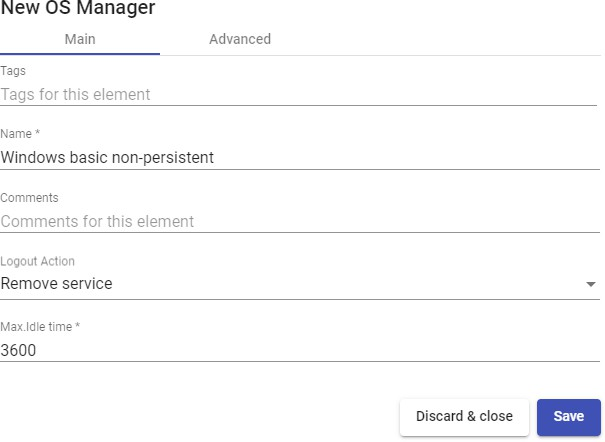

*Продвинутый:

**Выход из календаря:** Позволяет выбрать поведение, которое система будет вести с сеансом пользователя при достижении даты окончания календаря. Если установлено значение «Да», то при выполнении даты окончания календаря, назначенного услуге, система отключит пользователя от указанной услуги, если установлено значение «Нет», система не отключит пользователя, но если он будет отключен, она выйдет из системы или даже связь будет прервана, Вы больше не сможете повторно подключиться.


#### Домен Windows

"***Windows Domain OS Manager***" используется для виртуальных рабочих столов на базе систем Windows, которые являются частью домена AD. Он выполняет переименование, регистрацию домена AD и управление сеансами на виртуальных рабочих столах.


В "***Windows Domain OS Manager***" необходимо настроить следующие минимальные параметры:

*Главный:

**Имя:** Имя "***OS Manager***".

**Домен:** Имя домена Active Directory, к которому будут присоединены виртуальные рабочие столы. Требуется использовать формат FQDN (например: vc.local), NetBIO не поддерживается.

**Учетная запись:** Имя пользователя с правами на добавление машин в домен.

**Пароль:** Пароль пользователя в поле "***Аккаунт***".

**OU:** Организационное подразделение, в котором будут зарегистрированы виртуальные рабочие столы (если не указано, рабочие столы будут зарегистрированы в подразделении по умолчанию "***Компьютеры***Формат поддерживаемого подразделения:

OU=name_OU_last_level,... OU=name_OU_first_level,DC=name_domain,DC=extenstion_domain

Чтобы избежать ошибок при введении формата, рекомендуется сверяться с полем "***differentedName***" о свойствах атрибута OU.

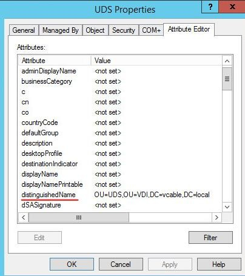

**Действие выхода:** Здесь вы можете указать действие, которое UDS будет выполнять на виртуальном рабочем столе при закрытии пользовательского сеанса:

* **Сохранить назначенную службу (полупостоянный виртуальный рабочий стол):** Когда пользователь выходит из виртуального рабочего стола, система не предпринимает никаких действий. При повторном подключении ему будет назначен тот же рабочий стол, что и ранее

работал с. Если будет произведена новая публикация "***Service Pool***", то при выходе пользователя из системы, его виртуальный рабочий стол будет удален, и он подключится к новому, сгенерированному в новой версии.

* **Удалить службу (временная виртуальная машина):** Когда пользователь выходит из системы, система уничтожает рабочий стол. Если этот же пользователь снова запросит виртуальную машину в системе, система предоставит новый виртуальный рабочий стол.
* **Сохраняйте назначенную службу даже при новой публикации (постоянный виртуальный рабочий стол):** Когда пользователь выходит из виртуального рабочего стола, система не предпринимает никаких действий. При повторном подключении ему будет назначен тот же рабочий стол, с которым он ранее работал. Если будет сделана новая публикация "***Service Pool***", то при выходе пользователя из системы его виртуальный рабочий стол останется назначенным и будет удален только после того, как администратор укажет на это.

**Максимальное время простоя:** Максимальное время бездействия (в секундах) на виртуальном рабочем столе. По истечении этого времени бездействия субъект UDS автоматически закроет сеанс. Отрицательные значения и менее 300 секунд отключают эту опцию.

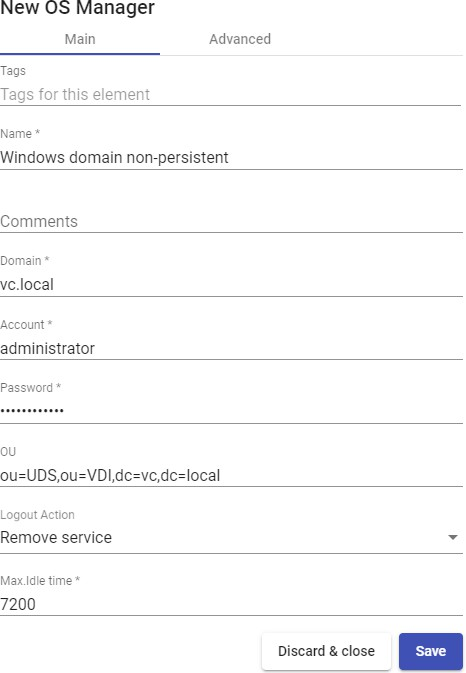

*Продвинутый:

Группа компьютеров: указывает, к какой группе компьютеров AD будут добавлены виртуальные рабочие столы, созданные UDS.

Очистка компьютера: если этот параметр включен, UDS будет удалять записи виртуальных рабочих столов в указанном подразделении после удаления рабочего стола. Необходимо, чтобы пользователь, указанный в поле «***Учетная запись***», имел права на совершение указанного действия в указанном подразделении.

Подсказка сервера: В случае, если серверов AD несколько, будет дано указание, какой из них предпочтительнее использовать.

**Использовать SSL:** Если этот параметр включен, SSL-соединение будет использоваться для сервера AD.

**Выход из календаря:** Позволяет выбрать поведение, которое система будет вести с сеансом пользователя при достижении даты окончания календаря. Если установлено значение "***Да**_", то при выполнении даты окончания календаря, назначенного услуге, система отключит пользователя от указанной услуги, если "_**Нет***", система не выведет пользователя из системы, но если пользователь выйдет, выйдет из системы или даже прервет соединение, он больше не сможет войти снова.


#### Случайный пароль Windows

"***Windows Random Password OS Manager***" используется для виртуальных рабочих столов на базе систем Windows, требующих более высокого уровня безопасности при доступе пользователей. Он выполняет задачи по переименованию, управлению сеансом и смене пароля существующего локального пользователя на виртуальных рабочих столах.

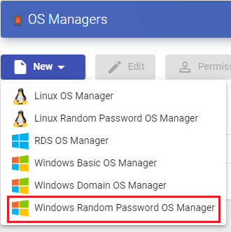

При его использовании существующему локальному пользователю назначается случайный пароль при настройке каждого нового развернутого виртуального рабочего стола, что обеспечивает более высокий уровень безопасности доступа.

В "***Windows Random Password OS Manager***" минимальные параметры, которые необходимо настроить, следующие:

*Главный:

**Имя:** Имя "***OS Manager***".

**Учетная запись:** Имя существующего локального пользователя на виртуальном рабочем столе, для которого UDS изменит пароль на самостоятельно сгенерированный случайный.

**Пароль:** Пароль пользователя в поле "***Аккаунт***".

**Действие выхода:** Здесь вы можете указать действие, которое UDS будет выполнять на виртуальном рабочем столе при закрытии пользовательского сеанса:

* **Сохранить назначенную службу (полупостоянный виртуальный рабочий стол):** Когда пользователь выходит из виртуального рабочего стола, система не предпринимает никаких действий. Когда

При повторном подключении ему будет назначен тот же рабочий стол, что и ранее

работал с. Если будет произведена новая публикация "***Service Pool***", то при выходе пользователя из системы его виртуальный рабочий стол будет удален и он подключится к новому, сгенерированному в новой версии

* **Удалить службу (временная виртуальная машина):** Когда пользователь выходит из системы, система уничтожает рабочий стол. Если этот же пользователь снова запросит виртуальную машину в системе, система предоставит новый виртуальный рабочий стол.
* **Сохраняйте назначенную службу даже при новой публикации ((постоянный виртуальный рабочий стол):** Когда пользователь выходит из виртуального рабочего стола, система не предпринимает никаких действий. При повторном подключении ему будет назначен тот же рабочий стол, с которым он ранее работал. Если будет сделана новая публикация "***Service Pool***", то при выходе пользователя из системы его виртуальный рабочий стол останется назначенным и будет удален только тогда, когда администратор укажет на это

**Максимальное время простоя:** Максимальное время бездействия (в секундах) на виртуальном рабочем столе. По истечении этого времени бездействия субъект UDS автоматически закроет сеанс. Отрицательные значения и менее 300 секунд отключают эту опцию.


*Продвинутый:

**Выход из календаря:** Позволяет выбрать поведение, которое система будет вести с сеансом пользователя при достижении даты окончания календаря. Если установлено значение "**Да**", то при выполнении даты окончания календаря, назначенного услуге, система отключит пользователя от указанной услуги, если установлено значение "**Нет**", система не отключит пользователя, но если она будет отключена, она выйдет из системы или даже связь будет прервана, Вы больше не сможете повторно подключиться.


### Транспорты

Для подключения к виртуальным рабочим столам и приложениям необходимо создать "***Transports***". Это приложения, которые будут выполняться на клиенте соединения и будут находиться в

плата за предоставление доступа к реализованному сервису.

В зависимости от типа настраиваемого виртуального рабочего стола, расположения и устройства, используемого для подключения к виртуальным рабочим столам, необходимо создать различные типы транспортов.

Для корректной работы транспорта на клиенте подключения и сервере рабочего стола или приложения должен быть установлен протокол подключения (клиент - сервер), используемый в транспорте.

Чтобы получить доступ к разделу "***Transports**_", перейдите в раздел "_**Conectivity**_" и выберите "_**Transports***". В настоящее время доступны:

*Прямой:


*Туннелю:


"***Transports**_", обозначенный как "_**direct***", будет использоваться для доступа пользователей к виртуальным рабочим столам и приложениям из внутренней локальной сети, VPN, расширения локальной сети и т.д.....

"***Transports**_", обозначенный как "_**Tunneled**_", будет использоваться для доступа пользователей к виртуальным рабочим столам и приложениям из глобальной сети. Эти "_**Transports***" будут поддерживаться сервером UDS Tunnel для установления соединения.

"***Транспорт***" может быть использован для доступа пользователей к виртуальным рабочим столам всех типов

доступа (LAN, WAN и т.д...). Этот "***Transport***" использует сервер UDS Tunnel для подключения к виртуальному рабочему столу.

###### ПРИМЕЧАНИЕ: {#note-33 .ненумерованный}

Если вам нужен доступ из сети, которая не является вашей локальной сетью, вам придется использовать туннелированные транспорты, которые должны иметь публичный IP-адрес сервера UDS-Tunnel. Сервер Tunnel будет использовать два порта в зависимости от предоставляемой службы. Когда это подключение через HTML5, вы будете использовать порт 10443, а когда это любое туннельное соединение (RDP, RDS, X2Go и т.д.), будет использоваться порт 443.

#### NICE DCV (прямой)

Транспорт "***NICE DCV***" (прямой) позволяет пользователям получать доступ к рабочим столам Windows, Linux по протоколу NICE DCV. Как на клиентах, так и на настольных компьютерах должно быть установлено и включено программное обеспечение NICE DCV.


В transsnport "***NICE DCV***" минимальными параметрами для настройки являются:

*Главный:

**Имя:** Название транспорта.

**Приоритет:** Приоритет, который будет иметь транспорт. Чем ниже этот приоритет, тем выше он будет отображаться в списке доступных транспортов для службы. Транспорт с самым низким приоритетом будет использоваться по умолчанию при нажатии на изображение сервиса

**Порт:** Прослушивание NICE DCV

**Доступ к сетям:** Разрешает или запрещает доступ пользователя к сервису в зависимости от сети, из которой он получает доступ, и сети, указанной в поле "***Сети***".

**Сети:** Диапазоны сети, подсети или IP-адреса, указанные в поле "***Сети**_" поля "_**Connectivity**_". Оно используется вместе с полем "_**Доступ к сети***" для разрешения или отключения доступа пользователя к сервису в зависимости от его сетевого расположения.

**Разрешенные устройства:** Разрешает доступ к сервису только с выбранных устройств. Если ничего не выбрано, фильтрация не выполняется.

**Пулы служб:** Позволяет назначить этот транспорт непосредственно одному или нескольким ранее созданным "***пулам служб***".

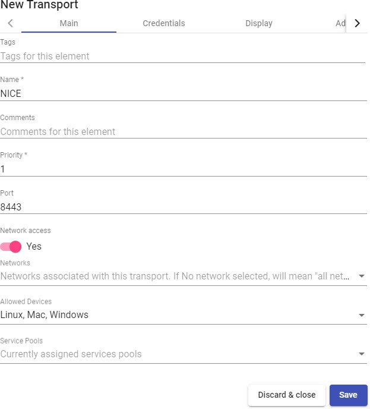

*Верительные грамоты:

**Пустые creds:** Если установлено значение "***Yes**_", то при подключении к службе будут запрашиваться учетные данные для доступа к виртуальному рабочему столу. Если установлено значение "_**Нет***", учетные данные, введенные на портале входа в UDS, будут перенаправлены.

**Имя пользователя:** Имя пользователя, которое будет использоваться для входа на рабочий стол (пользователь должен существовать на рабочем столе). Если это поле пустое, будет предпринята попытка использовать имя пользователя входа на портал UDS, если поле "***Empty creds**_" установлено в "_**No**_", или будет запрошено учетные данные для их указания вручную, если установлено значение "_**Yes***".

Пароль: Пароль пользователя в поле "***Имя пользователя***".

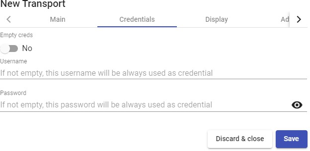

*Дисплей:

**Полноэкранный режим:** Указывает, если подключение к сервису осуществляется в полноэкранном режиме.

**Несколько мониторов:** Указывает, будет ли использоваться несколько мониторов в соединении со службой.


*Продвинутый:

**Метка:** Позволяет группировать транспорты, которые будут показаны через имя метки в мета-пуле. Используя эти метки, мы можем указать, что метапул имеет несколько транспортов.

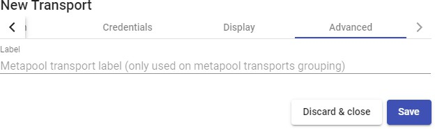

#### Протокол NoMachine (прямой)

Un transporte "***NoMachine Protocol***" позволяет пользователям получать доступ к рабочим столам Windows, Linux и MacOS по протоколу NoMachine (как для клиентов, так и для настольных компьютеров должно быть установлено программное обеспечение NoMachine).


В транспортном "***NoMachine Protocol***" минимальные параметры для настройки:

*Главный:

**Имя:** Название транспорта.

**Приоритет:** Приоритет, который будет иметь транспорт. Чем ниже этот приоритет, тем выше он будет отображаться в списке доступных транспортов для службы. Транспорт с самым низким приоритетом будет использоваться по умолчанию при нажатии на изображение сервиса.

**Порт прослушивания:** Порт прослушивания программного обеспечения NX.

**Доступ к сетям:** Разрешает или запрещает доступ пользователя к сервису в зависимости от сети, из которой он получает доступ, и сети, указанной в поле "***Сети***".

**Сети:** Диапазоны сетей, подсети или IP-адреса, указанные в разделе "***Сети**_" раздела "_**Подключение**_". Оно используется вместе с полем "_**Доступ к сети***" для разрешения или отключения доступа пользователя к сервису в зависимости от его сетевого расположения.

**Разрешенные устройства:** Разрешает доступ к сервису только с выбранных устройств. Если ничего не выбрано, фильтрация не выполняется.

**Пулы служб:** Позволяет назначить этот транспорт непосредственно одному или нескольким ранее созданным "***пулам служб***".


*Параметры:

**Использовать UDP-трафик для мультимедиа:** Позволяет указать, будет ли использоваться протокол UDP в мультимедийном трафике.

**Размер окна:** Указывает размер окна при подключении к службе.


*Верительные грамоты:

**Пустые creds:** Если установлено значение "***Yes**_", то при подключении к службе будут запрашиваться учетные данные для доступа к виртуальному рабочему столу. Если установлено значение "_**Нет***", учетные данные, введенные на портале входа в UDS, будут перенаправлены.

**Имя пользователя:** Имя пользователя, которое будет использоваться для входа на рабочий стол (пользователь должен существовать на рабочем столе). Если это поле пустое, будет предпринята попытка использовать имя пользователя входа на портал UDS, если поле "***Empty creds**_" установлено в "_**No**_", или будет запрошено учетные данные для их указания вручную, если установлено значение "_**Yes***".

**Пароль:** Пароль пользователя в поле "***Имя пользователя*** ".

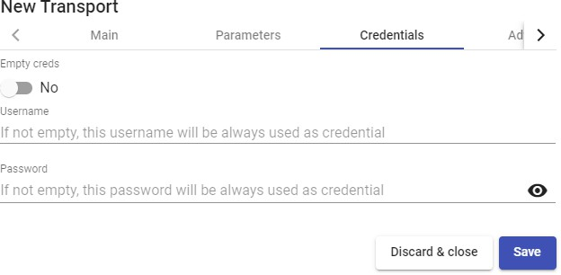

*Продвинутый:

**Метка:** Позволяет группировать транспорты, которые будут показаны через имя метки в мета-пуле. Используя эти метки, мы можем указать, что метапул имеет несколько транспортов.


#### RDP (прямой)

***"RDP"*** (прямой) транспорт позволяет пользователям получать доступ к виртуальным рабочим столам Windows/Linux с помощью протокола удаленного рабочего стола (RDP). Как на клиентах подключения, так и на виртуальных рабочих столах должен быть установлен и включен RDP (для виртуальных рабочих столов Linux необходимо использовать XRDP).


В транспорте A ***"RDP"*** (прямой) минимальные параметры для настройки:

*Главный:

**Имя:** Название транспорта.

**Приоритет:** Приоритет, который будет иметь транспорт. Чем ниже этот приоритет, тем выше он будет отображаться в списке доступных транспортов для службы. Транспорт с самым низким приоритетом будет использоваться по умолчанию при нажатии на изображение сервиса.

**Доступ к сетям:** Разрешает или запрещает доступ пользователя к сервису в зависимости от сети, из которой он получает доступ, и сети, указанной в поле «***Сети***».

**Сети:** Диапазоны сетей, подсети или IP-адреса, указанные в разделе "***Сети**_" раздела "_**Подключение**_". Оно используется вместе с полем "_**Доступ к сети***" для разрешения или отключения доступа пользователя к сервису в зависимости от его сетевого расположения.

**Разрешенные устройства:** Разрешает доступ к сервису только с выбранных устройств. Если ни один из них не выбран, фильтрация не выполняется.

**Пулы служб:** Позволяет назначить этот транспорт непосредственно одному или нескольким ранее созданным "*** пулам служб"***.


*Верительные грамоты:

**Пустые creds:** Если установлено значение "***Yes**_", то при подключении к сервису он запросит учетные данные для доступа к виртуальному рабочему столу. Если установлено значение "_**Нет***", учетные данные, введенные на портале входа в UDS, будут перенаправлены.

**Имя пользователя:** Имя пользователя, которое будет использоваться для входа на рабочий стол (пользователь должен существовать на рабочем столе). Если это поле пустое, будет предпринята попытка использовать имя пользователя входа на портал UDS, если поле "***Empty creds**_" установлено в "_**No**_", или будет запрошено учетные данные для их указания вручную, если установлено значение "_**Yes***".

**Пароль:** Пароль пользователя в поле "***Имя пользователя***".

**Без домена:** Указывает, перенаправляется ли доменное имя вместе с пользователем.

**Домен:** Имя домена, который будет отправлен с учетными данными пользователя.


*Параметры:

**Разрешить смарт-карты:** Включает перенаправление смарт-карт.

**Разрешить принтеры:** Включает перенаправление принтера.

**Политика локальных дисков:** Включает перенаправление дисков:

* **Не разрешать:** Диск не перенаправляется.
* **Разрешить PnP-диски:** Во время активного сеанса перенаправляются только подключенные диски.
* **Разрешить любой диск:** Все диски перенаправляются.

**Force drives:** Принудительное перенаправление определенных дисков. Можно указать несколько через запятую. (Пример: F:,G: ).

**Разрешить последовательные порты:** Включить перенаправление последовательных портов.

**Включить буфер обмена:** Если он активирован, он позволит копировать/вставлять между клиентом подключения и рабочим столом

**Включить звук:** Если активировано, это позволит перенаправить звук с рабочего стола на клиент подключения.

**Включить веб-камеру:** Если эта опция включена, это позволит перенаправлять веб-камеры между клиентом подключения и рабочим столом.

**Поддержка Credssp:** Если он активирован, он будет использовать "Credential Security Support Provider".

**Порт RDP:** Порт подключения к серверу RDP

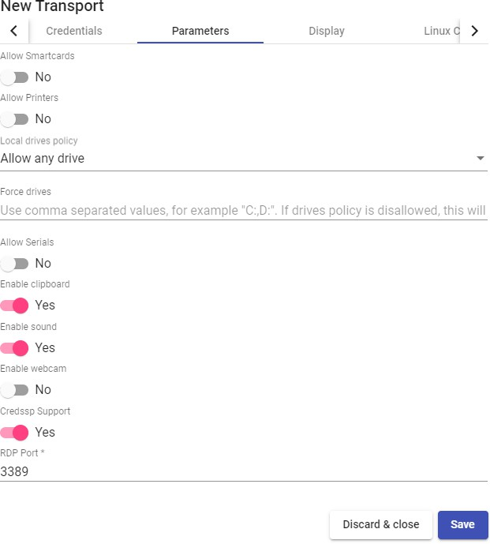

*Дисплей

**Размер экрана:** Определяет размер окна рабочего стола.

**Глубина цвета:** Указывает глубину цвета. **Обои/тема:** Отображает фон рабочего стола. **Несколько мониторов:** Позволяет использовать несколько мониторов. **Разрешить стол. Comp.:** включает "Композицию рабочего стола". **Сглаживание шрифта:** Активирует сглаживание шрифта.

**Панель подключения:** Позволяет включить или выключить панель подключения.

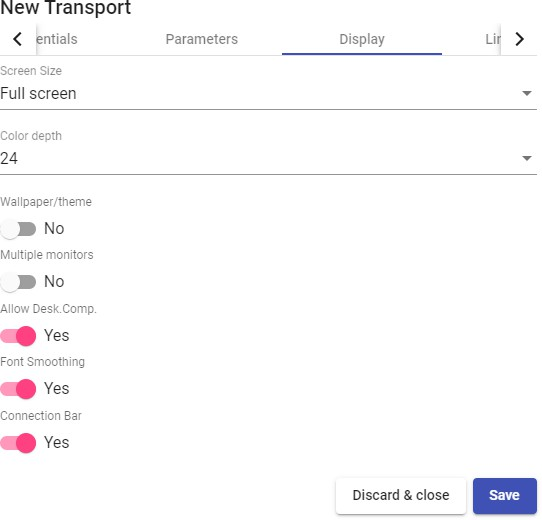

* Клиент Linux (применимо только к клиентам подключения Linux): **Синхронизация мультимедиа:** Включает параметр мультимедиа на клиенте FreeRDP. **Использовать Alsa:** Позволяет использовать аудио через Alsa.

**Строка принтера:** Пример: "Zebra","ZDesigner TM400 200 dpi (ZPL)"

_("Zebra" — это имя локального принтера, «ZDesigner TM400 200 dpi (ZPL)» — точное имя драйвера принтера в Windows)._

**Строка смарт-карты:** Пример: "Gemalto PC Twin Reader 00 00" ("Gemalto PC Twin Reader 00 00" _is имя смарт-карты)._

**Пользовательские параметры:** Может быть указан любой параметр, поддерживаемый клиентом FreeRDP (если указано несколько, они должны быть разделены пробелами). Они будут применены при подключении к виртуальному рабочему столу.


###### ПРИМЕЧАНИЕ: {#note-34 .unnumbered}

В качестве примера в захвате указаны некоторые важные параметры: /gfx:rfx значительно улучшает качество видео и аудио, /drive:media,/media позволяет перенаправлять локальные диски, подключенные к клиенту подключения, /smartcard позволяет перенаправлять смарт-карту...

* Mac OS X (применимо только к клиентам подключения MacOS):

**Разрешить клиент Microsoft Rdp:** Позволяет использовать клиент Microsoft RDP вместо клиента FreeRDP. Чтобы использовать его, он должен быть включен, а клиент FreeRDP не должен быть установлен на клиентском компьютере с подключением MacOS.

**Пользовательские параметры:** Может быть указан любой параметр, поддерживаемый клиентом FreeRDP (если указано несколько, они должны быть разделены пробелами). Они будут применены при подключении к рабочему столу.


*Продвинутый:

**Метка:** Позволяет группировать транспорты, которые будут показаны через имя метки в мета-пуле. Используя эти метки, мы можем указать, что метапул имеет несколько транспортов.


#### RDS для vApps (прямой)

"***RDS for vAPPs***" позволяет пользователям получать доступ к виртуальным приложениям Windows с помощью RemoteAPP. Клиентами подключения могут быть Windows или Linux

Клиент подключения к Windows должен иметь RemoteAPP для открытия виртуальных приложений. Клиент подключения Linux должен иметь пакет freerdp2 для открытия виртуальных приложений.


В транспорте "***RDS для vAPPs***" (прямом) минимальные параметры для настройки:

*Главный:

**Имя:** Название транспорта.

**Приоритет:** Приоритет, который будет иметь транспорт. Чем ниже этот приоритет, тем выше он будет отображаться в списке доступных транспортов для службы. Транспорт с самым низким приоритетом будет использоваться по умолчанию при нажатии на изображение сервиса.

**Доступ к сетям:** Разрешает или запрещает доступ пользователя к сервису в зависимости от сети, из которой он получает доступ, и сети, указанной в поле «***Сети***».

**Сети:** Диапазоны сети, подсети или IP-адреса, указанные в разделе "***Сети**_" "_**Подключение**_". Оно используется вместе с полем "_**Доступ к сети***" для разрешения или отключения доступа пользователя к сервису в зависимости от его сетевого расположения.

**Разрешенные устройства:** Разрешает доступ к сервису только с выбранных устройств. Если ни один из них не выбран, фильтрация не выполняется.

**Пулы служб:** Позволяет назначить этот транспорт непосредственно одному или нескольким ранее созданным "*** пулам служб***".


*Верительные грамоты:

**Пустые creds:** Если установлено значение "***Yes**_", то при подключении к сервису у него будут запрошены учетные данные для доступа к виртуальному приложению. Если установлено значение "_**Нет***", учетные данные, введенные на портале входа в UDS, будут перенаправлены.

**Без домена:** Указывает, перенаправляется ли доменное имя вместе с пользователем.

**Домен:** Имя домена, который будет отправлен с учетными данными пользователя.


*Параметры:

**Разрешить смарт-карты:** Включает перенаправление смарт-карт.

**Разрешить принтеры:** Включает перенаправление принтера.

**Политика локальных дисков:** Включает перенаправление дисков:

* **Не разрешать:** Диск не перенаправляется.
* **Разрешить PnP-диски:** Во время активного сеанса перенаправляются только подключенные диски.
* **Разрешить любой диск:** Все диски перенаправляются.

**Force drives:** Принудительное перенаправление определенных дисков. Можно ввести несколько через запятую. (Пример: F:, G:).

**Разрешить последовательные порты:** Включает перенаправление последовательных портов.

**Включить буфер обмена: I**если он активирован, он позволит копировать/вставлять между клиентом соединения и виртуальным приложением l.

**Поддержка Credssp: I**f включен, он будет использовать "Credential Security Support Provider".

**Включить звук:** Если эта опция активирована, она позволит перенаправлять звук из виртуального приложения на клиент подключения.

**Включить веб-камеру:** Если эта опция активирована, она позволит перенаправлять веб-камеры между клиентом подключения и виртуальным приложением.

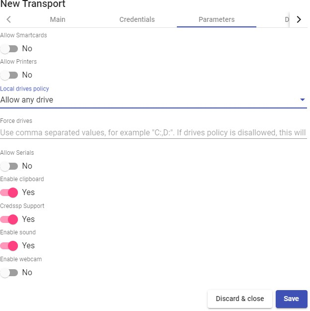

*Дисплей:

**Глубина цвета:** Указывает глубину цвета.

**Состояние Windows:** Указывает оконный режим, в котором будет запускаться приложение.

**Сглаживание шрифта:** Включить сглаживание шрифта.


* Клиент Linux:

**Выполнение как оболочка:** Запуск приложения в режиме сеанса, обеспечивающий лучшую визуализацию.

**Синхронизация мультимедиа:** Включает параметр мультимедиа в FreeRDP.

**Использовать Alsa:** Позволяет использовать аудио через Alsa.

**Строка принтера:** Пример: "Zebra","ZDesigner TM400 200 dpi (ZPL)"

_("Zebra" — это имя локального принтера, «ZDesigner TM400 200 dpi (ZPL)» — точное имя драйвера принтера в Windows)._

**Строка смарт-карты:** Пример: "Gemalto PC Twin Reader 00 00" ("Gemalto PC Twin Reader 00 00" _is имя смарт-карты)._

**Пользовательские параметры:** Вы можете указать любой параметр, поддерживаемый клиентом FreeRDP. Они будут применены при установлении соединения с виртуальным приложением.


###### ПРИМЕЧАНИЕ: {#note-35 .ненумерованный}

На скриншоте в качестве примера указаны некоторые важные параметры:/t:"name_aplicacton" позволяет принудительно указать заголовок окна (если не указано, то это будет имя пула сервисов),

/dynamic-resolution +toggle-fullscreen позволяет развернуть окно приложения...

*Продвинутый:

**RDP Port:** Порт подключения к RDP-серверу.

**Метка:** Позволяет группировать транспорты, которые будут показаны через имя метки в мета-пуле. Используя эти метки, мы можем указать, что метапул имеет несколько транспортов.

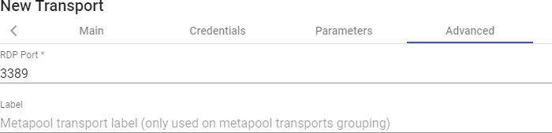

#### SPICE (прямой)

"***SPICE***" (прямой) позволяет пользователям получать доступ к виртуальным рабочим столам Windows/Linux

с помощью "***SPICE**_". протокол. Клиенты подключения должны иметь клиент "_**SPICE***" (Virt-Manager).

Транспорт "***SPICE***" можно использовать только с поставщиками услуг, такими как oVirt/Red Hat Enterprise Virtualization (RHV) и OpenNebula.


В транспорте "***SPICE***" (прямом) минимальные параметры для настройки:

*Главный:

**Имя:** Название транспорта.

**Приоритет:** Приоритет, который будет иметь транспорт. Чем ниже этот приоритет, тем выше он будет отображаться в списке доступных транспортов для службы. Транспорт с самым низким приоритетом будет использоваться по умолчанию при нажатии на изображение сервиса.

**Сертификат:** Сертификат, сгенерированный в ovirt-engine/RHV-manager или в OpenNebula. Требуется подключение к виртуальным рабочим столам (обычно размещенным по адресу **/etc/pki/ovirt-engine/certs/ca.cer** ).

**Доступ к сетям:** Разрешает или запрещает доступ пользователя к сервису в зависимости от сети, из которой осуществляется доступ, и сети, указанной в поле «***Сети***».

**Сети:** Диапазоны сетей, подсети или IP-адреса, указанные в разделе "***Сети**_" раздела "_**Подключение**_". Оно используется вместе с полем "_**Доступ к сети***" для разрешения или отключения доступа пользователя к сервису в зависимости от его сетевого расположения.

**Разрешенные устройства:** Разрешает доступ к сервису только с выбранных устройств. Если ни один из них не выбран, фильтрация не выполняется.

**Пулы служб:** Позволяет назначить этот транспорт непосредственно одному или нескольким ранее созданным "**пулам служб**".


*Продвинутый:

**Полноэкранный режим:** Включает полноэкранный режим на виртуальном рабочем столе.

**Перенаправление смарт-карт:** Включает перенаправление смарт-карт на виртуальном рабочем столе.

**Включить USB:** Разрешает перенаправление устройств, подключенных к USB-порту.

**Новый автоматический общий доступ к USB:** Позволяет перенаправлять устройства PnP, подключенные к USB-порту.

**Метка:** Позволяет группировать транспорты, которые будут показаны через имя метки в мета-пуле. Используя эти метки, мы можем указать, что метапул имеет несколько транспортов.

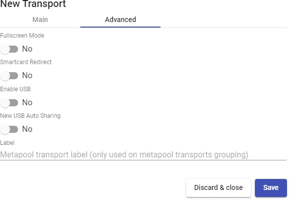

#### URL Launcher (прямой)

"***URL Launcher***" (прямой) позволяет пользователям получить доступ к определенному URL-адресу, который будет выполняться в браузере (по умолчанию) их клиентского компьютера.


В транспорте "***URL Launcher***" (direct) минимальные параметры для настройки:

*Главный:

**Имя:** Название транспорта.

**Приоритет:** Приоритет, который будет иметь транспорт. Чем ниже этот приоритет, тем выше он будет отображаться в списке доступных транспортов для службы. Транспорт с самым низким приоритетом будет использоваться по умолчанию при нажатии на изображение сервиса

**URL-шаблон:** URL-адрес, который будет запускать браузер при доступе к сервису. _IP_ можно использовать для отправки IP-адреса, указанного в поле "**Machine IP**" базовой службы типа "**Static Single IP**", или вы также можете использовать _USER_ для отправки имени пользователя, запустившего службу.

**Доступ к сетям:** Разрешает или запрещает доступ пользователя к сервису в зависимости от сети, из которой осуществляется доступ, и сети, указанной в поле «***Сети***».

**Сети:** Диапазоны сети, подсети или IP-адреса, указанные в поле "***Сети**_" раздела "_**Подключение**_". Оно используется вместе с полем «__Network Access_*», чтобы разрешить или запретить доступ пользователя к сервису в зависимости от его сетевого расположения.

**Разрешенные устройства:** Разрешает доступ к сервису только с выбранных устройств. Если ни один из них не выбран, фильтрация не выполняется.

**Пулы служб:** Позволяет назначить этот транспорт непосредственно одному или нескольким ранее созданным "**пулам служб**".

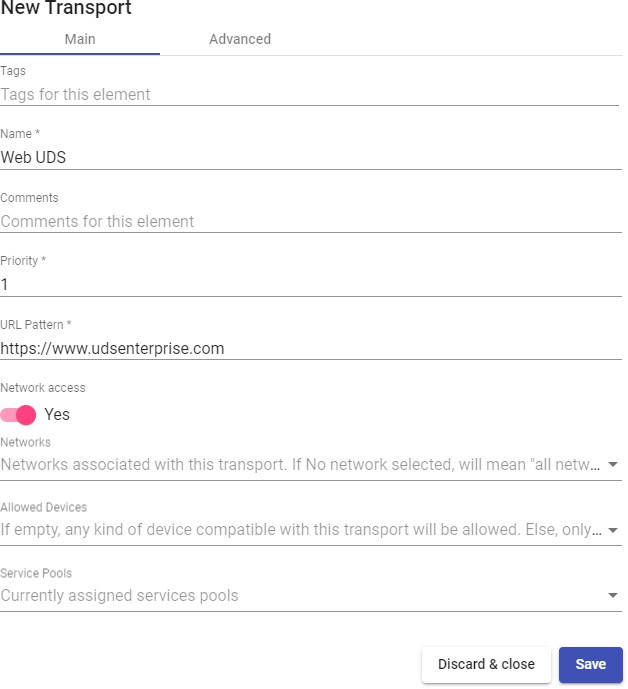

*Продвинутый:

**Force new HTML Window:** Если включено, URL-адрес, указанный в поле "**URL Pattern"**, будет запускаться в новой вкладке браузера.

**Метка:** Позволяет группировать транспорты, которые будут показаны через имя метки в мета-пуле. Используя эти метки, мы можем указать, что метапул имеет несколько транспортов.

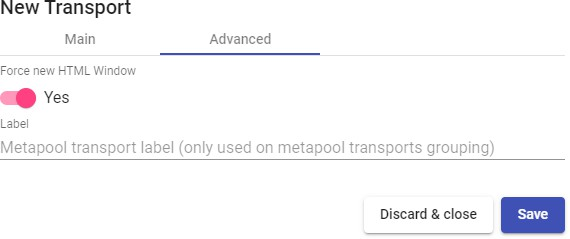

###### ПРИМЕЧАНИЕ: {#note-36 .ненумерованный}

Чтобы опубликовать пул сервисов и связать этот транспорт, рекомендуется использовать тип поставщика услуг "**Static IP Machine Provider**" с базовой службой типа "**Static Single IP**".

#### X2Go (прямой)

"***X2Go**_" tansport (прямой) позволяет пользователям получать доступ к виртуальным рабочим столам Linux с помощью "_**X2Go***".

Как на клиентах подключения (клиент), так и на виртуальных рабочих столах (сервере) должен быть установлен и включен "***X2Go***".

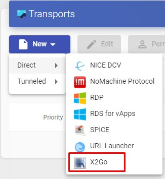

В транспорте "***X2Go***" (прямом) минимальные параметры для настройки:

*Главный:

**Имя:** Название транспорта.

**Приоритет:** Приоритет, который будет иметь транспорт. Чем ниже этот приоритет, тем выше он будет отображаться в списке доступных транспортов для службы. Транспорт с самым низким приоритетом будет использоваться по умолчанию при нажатии на изображение сервиса.

**Доступ к сетям:** Разрешает или запрещает доступ пользователя к сервису в зависимости от сети, из которой осуществляется доступ, и сети, указанной в разделе «***Сети***».

**Сети:** Диапазоны сети, подсети или IP-адреса, указанные в поле "***Сети**_" раздела "_**Подключение**_". секция. Оно используется вместе с полем "_**Доступ к сети***" для разрешения или отключения доступа пользователя к сервису в зависимости от его сетевого расположения.

**Разрешенные устройства:** Разрешает доступ к сервису только с выбранных устройств. Если ни один из них не выбран, фильтрация не выполняется.

**Пулы служб:** Позволяет назначить этот транспорт непосредственно одному или нескольким ранее созданным "***пулам служб***".


*Верительные грамоты:

**Имя пользователя:** Имя пользователя, которое будет использоваться для входа на виртуальный рабочий стол.


*Параметры:

**Размер экрана:** Разрешение окна подключения.

**Рабочий стол:** Выбор менеджера рабочего стола (xfce, Mate, Gnome и т.д.) или виртуализация приложений Linux (UDS vAPP)

**vAPP:** Путь выполнения виртуализируемого приложения (применяется только в том случае, если выбран параметр "***Desktop"*** "***UDS vAPP***").

**Включить звук:** Включает звук в соединении. **Перенаправление домашней папки:** Перенаправляет /home пользователя. **Скорость:** Оптимизация соединения.

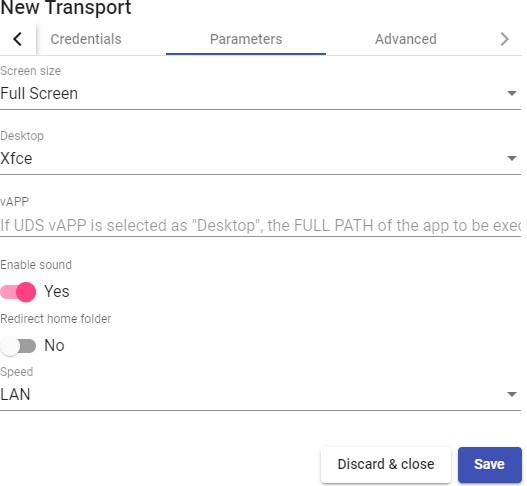

*Продвинутый:

**Звук:** Выбор типа звукового сервера.

**Клавиатура:** Язык клавиатуры.

**Pack:** Метод, используемый для сжатия изображений.

**Качество:** Качество изображения (0-9).

**Метка:** Позволяет группировать транспорты, которые будут показаны через имя метки в мета-пуле. Используя эти теги, мы можем указать, что метапул имеет несколько транспортов.


#### HTML5 RDP (туннельный)

Транспорт "***HTML5 RDP***" обеспечивает доступ к виртуальным рабочим столам Windows и Linux по протоколу RDP через веб-браузер, поддерживающий HTML5 (для рабочих столов Linux на компьютерах должен быть установлен пакет XRDP). Для рабочих столов Windows должен быть включен RDP-доступ)).

Этот транспорт использует сервер туннеля UDS для подключения к виртуальным рабочим столам. Его необходимо предварительно настроить для корректной работы.


В транспорте "***HTML5 RDP***" минимальные параметры для настройки:

*Главный:

**Имя:** Название транспорта.

**Приоритет:** Приоритет, который будет иметь транспорт. Чем ниже этот приоритет, тем выше он будет отображаться в списке доступных транспортов для службы. Транспорт с наименьшим приоритетом будет использоваться по умолчанию при нажатии на изображение сервиса.

**Доступ к сетям:** Разрешает или запрещает доступ пользователя к сервису в зависимости от сети, из которой осуществляется доступ, и сети, указанной в поле «***Сети***».

**Сети:** Диапазоны сети, подсети или IP-адреса, указанные в поле "***Сети**_" раздела "_**Подключение**_". секция. Оно используется вместе с полем "_**Доступ к сети***" для разрешения или отключения доступа пользователя к сервису в зависимости от его сетевого расположения.

**Разрешенные устройства:** Разрешает доступ к сервису только с выбранных устройств. Если ни один из них не выбран, фильтрация не выполняется.

**Пулы служб:** Позволяет назначить этот транспорт непосредственно одному или нескольким ранее созданным "**пулам служб**".


*Туннель:

**Сервер туннеля:** IP-адрес или имя с портом подключения сервера туннеля UDS. Если доступ к рабочему столу осуществляется из глобальной сети, необходимо ввести общедоступный IP-адрес или имя сервера туннеля UDS. Формат:

Источник: https://_IP_Tunnel_:10443

**Использовать туннель Glyptodon Enterprise:** Позволяет использовать туннель сервера Glyptodon Enterprise для соединений HTML5

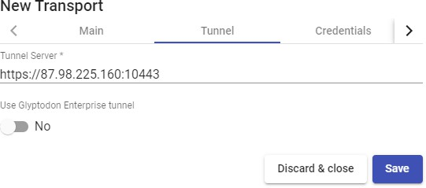

*Верительные грамоты:

**Пустые creds:** Если установлено значение "***Yes**_", то при подключении к службе она запросит учетные данные для доступа к виртуальному рабочему столу. Если установлено значение "_**Нет***, учетные данные, введенные на портале входа в UDS, будут перенаправлены.

**Имя пользователя:** Имя пользователя, которое будет использоваться для входа на рабочий стол (пользователь должен существовать в

рабочего стола). Если это поле пустое, он попытается использовать пользователя входа на портал UDS, если поле "***Empty creds**_" равно "_**No**_", или запросит учетные данные, чтобы указать их вручную, если это "_**Yes***".

**Пароль:** Пароль пользователя в поле "***Имя пользователя***".

**Без домена:** Указывает, перенаправляется ли доменное имя вместе с пользователем.

**Домен:** Доменное имя, которое будет отправлено вместе с учетными данными пользователя.


*Параметры:

**Показать обои:** Показать обои.

**Разрешить Desk.Comp.:** включает "**Desktop Composition**".

**Сглаживание шрифта:** Активирует сглаживание шрифта (улучшает отображение).

**Включить звук:** Включает перенаправление звука (динамика) на виртуальном рабочем столе.

**Включить микрофон:** Включить перенаправление звука (микрофон) на рабочем столе.

**Включить печать:** Включает печать на виртуальном рабочем столе. Принтер будет автоматически включен для печати документов в формате pdf и загрузки их в клиент подключения.

**Общий доступ к файлам:** Позволяет временному репозиторию (расположенному на сервере туннеля UDS) загружать или скачивать файлы между виртуальным рабочим столом и клиентом подключения.

**Буфер обмена:** Позволяет копировать и вставлять текст между клиентом подключения и рабочим столом.

**Раскладка:** Язык клавиатуры, который будет включен на рабочем столе.


*Продвинутый:

**Срок действия билета**: Указывает срок действия (в секундах) тикета, созданного UDS в клиенте подключения для подключения HTML5.

**Принудительно создать новое HTML-окно** Принудительно переводить каждое соединение, которое запускается, в новое окно.

**Безопасность**: Указывает уровень безопасности соединения. Если вы хотите использовать NLA, необходимо перенаправить действительные учетные данные (вы не сможете запросить учетные данные у пользователя, включив опцию "***Empty creds***"). Если вы хотите использовать безопасность RDP с операционной системой Windows, необходимо будет отключить NLA на рабочем столе, как на уровне конфигурации удаленного рабочего стола, так и на уровне реестра:

[[https://www.udsenterprise.com/es/wiki/Troubleshooting/Windows/Windows10-HTML5/]{.underline}](https://www.udsenterprise.com/es/wiki/Troubleshooting/Windows/Windows10-HTML5/)

Рекомендуется использовать опцию «***Любая***», которая обеспечивает большую гибкость.

**Порт RDP:** Порт подключения к серверу RDP

**Путь контекста Glyptodon Enterprise:** В случае использования туннеля Glyptodon Enterprise и его не было в маршруте по умолчанию, мы должны указать новый маршрут.

**Метка:** Позволяет группировать транспорты, которые будут показаны через имя метки в мета-пуле. Используя эти метки, мы можем указать, что метапул имеет несколько транспортов.


#### HTML5 RDP для vApps (туннельный)

Транспорт "***HTML5 RDP for vAPPs***" " обеспечивает доступ к виртуальным приложениям Windows через RemoteApp через веб-браузер, поддерживающий HTML5. Клиент подключения может иметь любую операционную систему, включающую браузер с поддержкой HTML5.

Этот транспорт использует сервер туннеля UDS для установления соединения. Его необходимо предварительно настроить для корректной работы.


В транспорте "***HTML5 RDP***" минимальные параметры для настройки:

*Главный:

**Имя:** Название транспорта.

**Приоритет:** Приоритет, который будет иметь транспорт. Чем ниже этот приоритет, тем выше он будет отображаться в списке доступных транспортов для службы. Транспорт с наименьшим приоритетом будет использоваться по умолчанию при нажатии на изображение сервиса.

**Доступ к сетям:** Разрешает или запрещает доступ пользователя к сервису в зависимости от сети, из которой осуществляется доступ, и сети, указанной в разделе «***Сети***».

**Сети:** Диапазоны сети, подсети или IP-адреса, указанные в поле "***Сети**_" раздела "_**Подключение**_". секция. Он используется вместе с полем "_**Доступ к сети***" для разрешения или отключения доступа пользователя к сервису в зависимости от его сетевого местоположения

**Разрешенные устройства:** Разрешает доступ к сервису только с выбранных устройств. Если ни один из них не выбран, фильтрация не выполняется.

**Пулы служб:** Позволяет назначить этот транспорт непосредственно одному или нескольким ранее созданным "*** пулам служб***".

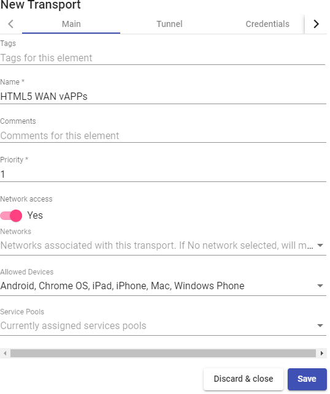

*Туннель:

**Сервер туннеля:** IP-адрес или имя с портом подключения сервера туннеля UDS. Если доступ к рабочему столу осуществляется из глобальной сети, необходимо ввести общедоступный IP-адрес или имя сервера туннеля UDS. Формат:

Источник: https://_IP_Tunnel_:10443

**Использовать туннель Glyptodon Enterprise:** Позволяет использовать туннель сервера Glyptodon Enterprise для соединений HTML5.


*Верительные грамоты:

**Пустые creds:** Если установлено значение "***Yes**_", то при подключении к сервису он запросит учетные данные. Если установлено значение "_**Нет**_", учетные данные, введенные на портале входа в UDS, или указанные в "_**mapping users***", будут перенаправлены.

**Без домена:** Указывает, перенаправляется ли доменное имя вместе с пользователем.

**Домен:** Имя домена, который будет отправлен с учетными данными пользователя (обычно нет необходимости указывать домен, так как он уже определен вместе с именем пользователя).


*Параметры:

**Показать обои:** Показывает обои.

**Разрешить Desk.Comp.:** включает "***Desktop Composition***".

**Сглаживание шрифта:** Активирует сглаживание шрифта (улучшает отображение).

**Включить звук:** Включает перенаправление звука (динамика) в виртуальном приложении.

**Включить микрофон:** Включить перенаправление звука (Микрофон) в приложении.

**Включить печать:** Включает печать в виртуальном приложении. Принтер будет автоматически включен для печати документов в формате pdf и загрузки их в клиент подключения.

**Общий доступ к файлам:** Включает временный репозиторий (расположенный в туннеле UDS

server) для загрузки или скачивания файлов между виртуальным приложением и подключенным клиентским компьютером.

**Буфер обмена:** Позволяет копировать и вставлять текст между клиентом подключения и приложением.

**Раскладка:** Язык клавиатуры, который должен быть включен в приложении.


*Продвинутый:

**RDP Port**: Порт подключения к RDP-серверу

**Срок действия билета**: Указывает срок действия (в секундах) тикета, сгенерированного UDS в клиенте подключения.

**Force new HTML Window** Принудительно переводить каждое новое соединение в новое окно.

**Безопасность**Указывает уровень безопасности соединения. Если вы хотите использовать NLA, необходимо перенаправить действительные учетные данные (вы не сможете запросить учетные данные у пользователя, включив опцию "***Empty creds***").

Рекомендуется использовать опцию «***Любая***», которая обеспечивает большую гибкость.

**Путь контекста Glyptodon Enterprise:** В случае использования туннеля Glyptodon Enterprise и его не было в маршруте по умолчанию, мы должны указать новый маршрут.

**Метка:** Позволяет группировать транспорты, которые будут показаны через имя метки в мета-пуле. Используя эти метки, мы можем указать, что метапул имеет несколько транспортов.


#### NICE DCV (туннельный)

Транспортный "***NICE DCV***" (туннельный) позволяет пользователям получать доступ к рабочим столам Windows и Linux, расположенным в глобальной сети, используя протокол NICE DCV. Как на клиентах, так и на настольных компьютерах должно быть установлено и включено программное обеспечение NICE DCV.

Этот транспорт использует сервер UDS Tunnel для установления соединения с рабочими столами, который должен быть предварительно настроен для его корректной работы.


В туннельном транспорте "***NICE DCV***" минимальные параметры для настройки:

*Главный:

**Имя:** Название транспорта.

**Приоритет:** Приоритет, который будет иметь транспорт. Чем ниже этот приоритет, тем выше он будет отображаться в списке доступных транспортов для службы. Транспорт с наименьшим приоритетом будет использоваться по умолчанию при нажатии на изображение сервиса.

**Порт:** Порт прослушивания NICE DCV

**Доступ к сетям:** Разрешает или запрещает доступ пользователя к сервису в зависимости от сети, из которой осуществляется доступ, и сети, указанной в поле «***Сети***».

**Сети:** Диапазоны сети, подсети или IP-адреса, указанные в поле "***Сети**_" section.it "_**Connectivity**_", используются вместе с полем "_**Доступ к сети***" для разрешения или отключения доступа пользователя к сервису в зависимости от его сетевого местоположения.

**Разрешенные устройства:** Разрешает доступ к сервису только с выбранных устройств. Если ни один из них не выбран, фильтрация не выполняется.

**Пулы служб:** Позволяет назначить этот транспорт непосредственно одному или нескольким ранее созданным "*** пулам служб***".


*Туннель:

**Сервер туннеля:** IP-адрес или имя с портом подключения сервера туннеля UDS. Если доступ к рабочему столу осуществляется из глобальной сети, необходимо ввести общедоступный IP-адрес или имя сервера туннеля UDS. Формат:

_IP_Tunnel_:443

**Время ожидания туннеля:** Срок действия билета сервера UDS Tunnel для подключения.

**Принудительная проверка SSL-сертификата:** Включает проверку сертификата. На сервере UDS Tunnel должен быть установлен действительный сертификат.


*Верительные грамоты:

**Пустые creds:** Если установлено значение "***Yes***", то при подключении к сервису он будет

Запросите учетные данные. Если установлено значение "***Нет***", учетные данные, введенные на портале входа в UDS, будут перенаправлены.

**Имя пользователя:** Имя пользователя, которое будет использоваться для входа на рабочий стол (пользователь должен существовать на рабочем столе). Если это поле пустое, будет предпринята попытка использовать логин пользователя портала UDS, если поле "***Empty creds**_" находится в "_**No**_", или будет запрошено учетные данные, чтобы указать их вручную, если это "_**Yes***".

**Пароль:** Пароль пользователя поля "***Имя пользователя***".


*Дисплей:

**Полноэкранный режим:** Указывает, если подключение к сервису осуществляется в полноэкранном режиме.

**Несколько мониторов:** Указывает, будет ли использоваться несколько мониторов в соединении со службой.

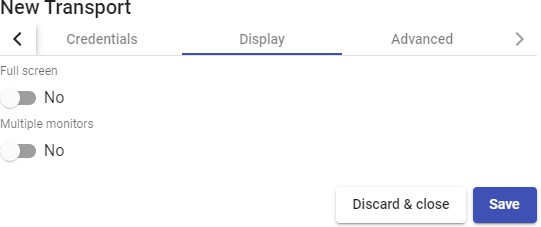

*Продвинутый:

**Метка:** Позволяет группировать транспорты, которые будут показаны через имя метки в мета-пуле. Используя эти метки, мы можем указать, что метапул имеет несколько транспортов.


#### Протокол NoMachine (туннельный)

"***NoMachine Protocol***" (туннельный) позволяет пользователям, находящимся в глобальной сети, получать доступ к рабочим столам Windows, Linux и MacOS с помощью протокола NoMachine (как для клиентов подключения, так и для настольных компьютеров требуется установка программного обеспечения NoMachine).

Этот транспорт использует сервер UDS Tunnel для установления соединения с рабочими столами, который должен быть предварительно настроен для его корректной работы.


В транспортном "***NoMachine Protocol***" (туннельном) минимальные параметры для настройки:

*Главный:

**Имя:** Название транспорта.

**Приоритет:** Приоритет, который будет иметь транспорт. Чем ниже этот приоритет, тем выше он будет отображаться в списке доступных транспортов для службы. Транспорт с наименьшим приоритетом будет использоваться по умолчанию при нажатии на изображение сервиса.

**Порт прослушивания:** Порт прослушивания программного обеспечения NoMachine.

**Доступ к сетям:** Разрешает или запрещает доступ пользователя к сервису в зависимости от сети, из которой осуществляется доступ, и сети, указанной в поле «***Сети***».

**Сети:** Диапазоны сетей, подсети или IP-адреса, указанные в разделе "***Сети**_" раздела "_**Подключение**_". Оно используется вместе с полем "_**Доступ к сети***" для разрешения или отключения доступа пользователя к сервису в зависимости от его сетевого расположения.

**Разрешенные устройства:** Разрешает доступ к сервису только с выбранных устройств. Если ни один из них не выбран, фильтрация не выполняется.

**Пулы служб:** Позволяет назначить этот транспорт непосредственно одному или нескольким ранее созданным "*** пулам служб***".

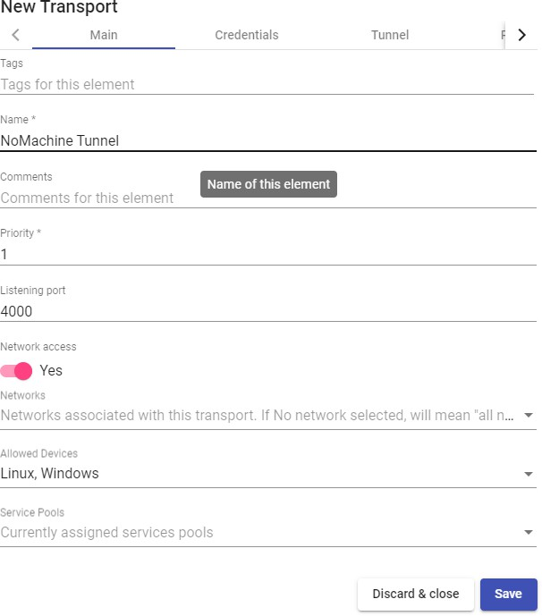

*Верительные грамоты:

**Пустые creds:** Если установлено значение "***Yes**_", то при подключении к службе она запросит учетные данные для доступа к виртуальному рабочему столу. Если установлено значение "_**Нет***", учетные данные, введенные на портале входа в UDS, будут перенаправлены.

**Имя пользователя:** Имя пользователя, которое будет использоваться для входа на рабочий стол (пользователь должен существовать на рабочем столе). Если это поле пустое, будет предпринята попытка использовать имя пользователя входа на портал UDS, если поле "***Empty creds**_" установлено в "_**No**_", или будет запрошено учетные данные для их указания вручную, если установлено значение "_**Yes***".

**Пароль:** Пароль пользователя в поле "***Имя пользователя***".

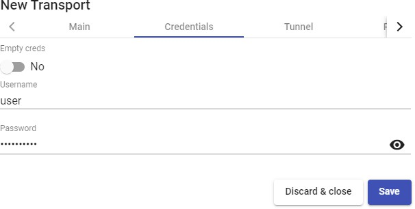

*Туннель:

**Сервер туннеля:** IP-адрес или имя с портом подключения сервера туннеля UDS. Если доступ к рабочему столу осуществляется из глобальной сети, необходимо ввести общедоступный IP-адрес или имя сервера туннеля UDS. Формат:

_IP_Tunnel_:443

**Время ожидания туннеля:** Срок действия билета сервера UDS Tunnel для подключения.

**Принудительная проверка SSL-сертификата:** Включает проверку сертификата. На сервере UDS Tunnel должен быть установлен действительный сертификат.


*Параметры:

**Размер окна:** Указывает размер окна при подключении к службе.


*Продвинутый:

**Метка:** Позволяет группировать транспорты, которые будут показаны через имя метки в мета-пуле. Используя эти метки, мы можем указать, что метапул имеет несколько транспортов.


#### Облачный доступ к PCoIP (туннельный)

Транспорт "***PCoIP Cloud Access***" позволяет пользователям, находящимся в глобальной сети, получать доступ к виртуальным рабочим столам Windows/Linux по протоколу Teradici PCoIP. Как на виртуальных рабочих столах, так и на клиентах подключения должны быть установлены и включены сервер и клиент PCoIP соответственно.

Кроме того, необходимо будет предварительно установить и настроить остальные элементы, составляющие пакет PCoIP Cloud Access (сервер лицензий, диспетчер подключений и шлюз безопасности).

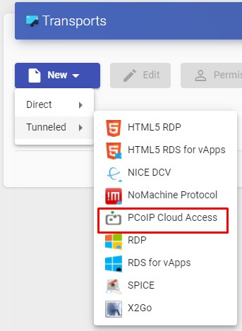

В "***PCoIP Transport (tunneled)***" минимальные параметры для настройки:

*Главный:

**Имя:** Nombre del transporte.

**Приоритет:** Приоритет, который будет иметь транспорт. Чем ниже этот приоритет, тем выше он будет отображаться в списке доступных транспортов для службы. Транспорт с наименьшим приоритетом будет использоваться по умолчанию при нажатии на изображение сервиса.

**Доступ к сетям:** Разрешает или запрещает доступ пользователя к сервису в зависимости от сети, из которой осуществляется доступ, и сети, указанной в поле «***Сети***».

**Сети:** Диапазоны сети, подсети или IP-адреса, указанные в поле "***Сети**_" поля "_**Connectivity**_". Оно используется вместе с полем "_**Доступ к сети***" для разрешения или отключения доступа пользователя к сервису в зависимости от его сетевого расположения.

**Разрешенные устройства:** Разрешает доступ к сервису только с выбранных устройств. Если ничего не выбрано, фильтрация не выполняется.

**Пулы служб:** Позволяет назначить этот транспорт непосредственно одному или нескольким ранее созданным "*** пулам служб***".

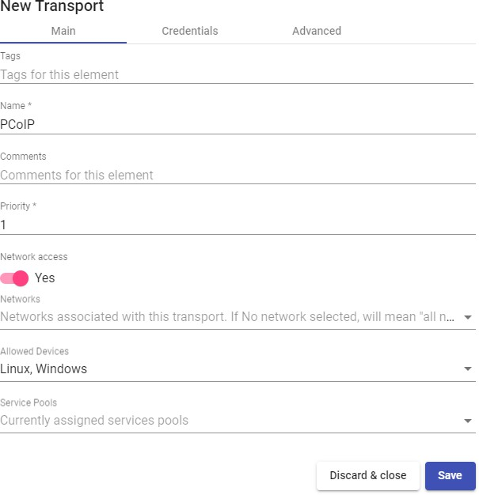

*Верительные грамоты:

**Имя пользователя:** Имя пользователя, которое будет использоваться для входа на рабочий стол. Если это поле пустое, то при подключении будет запрошено имя пользователя

**Пароль:** Пароль пользователя в поле "***Имя пользователя***".

**Домен:** Доменное имя, которое будет отправлено с учетными данными пользователя.

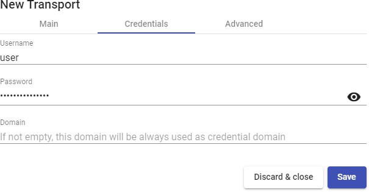

*Продвинутый:

**Метка:** Позволяет группировать транспорты, которые будут показаны через имя метки в мета-пуле. Используя эти метки, мы можем указать, что метапул имеет несколько транспортов.

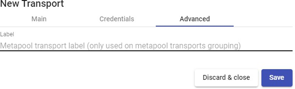

#### RDP (туннелированный)

Транспорт "***RDP (туннельный)**_" позволяет пользователям, находящимся в глобальной сети, получать доступ к виртуальным рабочим столам Windows/Linux с помощью протокола удаленного рабочего стола (RDP). Как на клиентах подключения, так и на виртуальных рабочих столах должен быть установлен и включен протокол RDP (если используются клиенты подключения с ОС Linux, потребуется клиент "_**FreeRDP***" и если

подключение осуществляется к виртуальным рабочим столам Linux (необходимо установить и настроить "***XRDP***").

Этот транспорт использует сервер туннеля UDS для подключения к виртуальным рабочим столам. Его необходимо предварительно настроить для корректной работы.

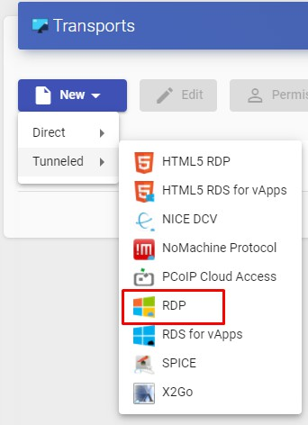

В транспорте "***RDP (туннелированный)***" минимальные параметры для настройки:

*Главный:

**Имя:** Название транспорта.

**Приоритет:** Приоритет, который будет иметь транспорт. Чем ниже этот приоритет, тем выше он будет отображаться в списке доступных транспортов для службы. Транспорт с наименьшим приоритетом будет использоваться по умолчанию при нажатии на изображение сервиса.

**Доступ к сетям:** Разрешает или запрещает доступ пользователя к сервису в зависимости от сети, из которой осуществляется доступ, и сети, указанной в поле «***Сети***».

**Сети:** Диапазоны сети, подсети или IP-адреса, указанные в поле "***Сети**_" поля "_**Connectivity**_". Оно используется вместе с полем "_**Доступ к сети***" для разрешения или отключения доступа пользователя к сервису в зависимости от его сетевого расположения.

**Разрешенные устройства:** Разрешает доступ к сервису только с выбранных устройств. Если ни один из них не выбран, фильтрация не выполняется.

**Пулы служб:** Позволяет назначить этот транспорт непосредственно одному или нескольким ранее созданным "*** пулам служб***".


*Туннель:

**Сервер туннеля:** IP-адрес или имя с портом подключения сервера туннеля UDS. Если доступ к рабочему столу осуществляется из глобальной сети, необходимо ввести общедоступный IP-адрес или имя сервера туннеля UDS. Формато:

_IP_Tunnel_:443

**Время ожидания туннеля:** Срок действия билета сервера UDS Tunnel для соединения.

**Принудительная проверка SSL-сертификата:** Включает проверку сертификата. На сервере UDS Tunnel должен быть установлен действительный сертификат.


*Верительные грамоты:

**Пустые creds:** Если установлено значение "***Yes**_", то при подключении к службе она запросит учетные данные для доступа к виртуальному рабочему столу. Если установлено значение "_**Нет***", учетные данные, введенные на портале входа в UDS, будут перенаправлены.

**Имя пользователя:** Имя пользователя, которое будет использоваться для входа на рабочий стол (пользователь должен существовать на

рабочего стола). Если это поле пустое, он попытается использовать пользователя входа на портал UDS, если поле "***Empty creds**_" равно "_**No**_", или запросит учетные данные, чтобы указать их вручную, если это "_**Yes***".

**Пароль:** Пароль пользователя в поле "***Имя пользователя***".

**Без домена: Я указываю, перенаправляется ли доменное имя вместе с пользователем.

**Домен:** Имя домена, который будет отправлен с учетными данными пользователя.

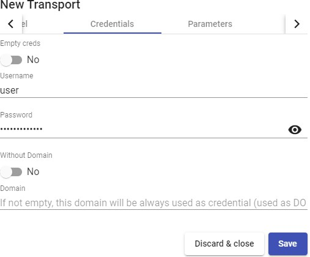

*Параметры:

**Разрешить смарт-карты:** Включает перенаправление смарт-карт.

**Разрешить принтеры:** Включает перенаправление принтера.

**Политика локальных дисков:** Включает перенаправление дисков:

* **Не разрешать:** Диск не перенаправляется.
* **Разрешить PnP-диски:** Во время активного сеанса перенаправляются только подключенные диски.
* **Разрешить любой диск:** Все диски перенаправляются.

**Force drives:** Принудительное перенаправление определенных дисков. Можно ввести несколько через запятую. (Пример: F:,G: ).

**Разрешить последовательные порты:** Включает перенаправление последовательных портов.

**Включить буфер обмена:** Если он активирован, он позволит копировать/вставлять данные между клиентом подключения и рабочим столом.

**Включить звук:** Если активировано, это позволит перенаправить звук с рабочего стола на клиент подключения.

**Включить веб-камеру:** Если она активирована, она позволит перенаправлять веб-камеры между клиентом подключения и пишущим устройством.

**Поддержка Credssp:** Если эта функция включена, будет использоваться "Credential Security Support Provider".

**Порт RDP:** Порт подключения к серверу RDP


*Дисплей:

**Размер экрана:** Указывает размер окна рабочего стола.

**Глубина цвета:** Указывает глубину цвета. **Обои/тема:** Отображает фон рабочего стола. **Несколько мониторов:** Позволяет использовать несколько мониторов. **Разрешить стол. Comp.:** включает "Композицию рабочего стола". **Сглаживание шрифта:** Активирует сглаживание шрифта.

**Панель подключения:** Позволяет включить или выключить панель подключения.


* Клиент Linux (применимо только к клиентам подключения Linux): **Синхронизация мультимедиа:** Включает параметр мультимедиа на клиенте FreeRDP. **Использовать Alsa:** Позволяет использовать аудио через Alsa.

**Строка принтера:** Пример: "Zebra","ZDesigner TM400 200 dpi (ZPL)"

_("Zebra" — это имя локального принтера, «ZDesigner TM400 200 dpi (ZPL)» — точное имя драйвера принтера в Windows)._

**Строка смарт-карты:** Пример: "Gemalto PC Twin Reader 00 00" ("Gemalto PC Twin Reader 00 00" _is имя смарт-карты)._

**Пользовательские параметры:** Вы можете указать любой параметр, поддерживаемый FreeRDP

клиент. (Если указано несколько, они должны быть разделены пробелами). Они будут применены при подключении к виртуальному рабочему столу**.**


###### ПРИМЕЧАНИЕ: {#note-37 .unnumbered}

На скриншоте в качестве примера показаны некоторые важные параметры: /gfx:rfx значительно улучшает качество видео и звука, /drive:media,/media позволяет перенаправлять подключенные локальные диски в клиенте подключения,

/smartcard позволяет перенаправить смарт-карту ...

* Mac OS X (применимо только к клиентам подключения MacOS):

**Разрешить клиент Microsoft Rdp:** Позволяет использовать клиент Microsoft RDP вместо клиента FreeRDP. Чтобы использовать его, он должен быть включен, а клиент FreeRDP не должен быть установлен на клиентском компьютере с подключением MacOS.

**Пользовательские параметры:** Может быть указан любой параметр, поддерживаемый клиентом FreeRDP (если указано несколько, они должны быть разделены пробелами). Они будут применены при подключении к рабочему столу.


*Продвинутый:

**Метка:** Позволяет группировать транспорты, которые будут показаны через имя метки в мета-пуле. Используя эти метки, мы можем указать, что метапул имеет несколько транспортов.


#### RDS для vApps (туннелированный)

"***RDS Transport (tunneled)***" позволяет пользователям, находящимся в глобальной сети, получать доступ к виртуальным приложениям Windows с помощью RemoteAPP. Клиенты подключения могут иметь системы Windows или Linux.

.

Клиент подключения к Windows должен иметь RemoteAPP для открытия виртуальных приложений. Клиент подключения Linux должен иметь пакет freerdp2 для открытия виртуальных приложений.

Этот транспорт использует сервер туннеля UDS для подключения к виртуальным приложениям. Его необходимо предварительно настроить для корректной работы.

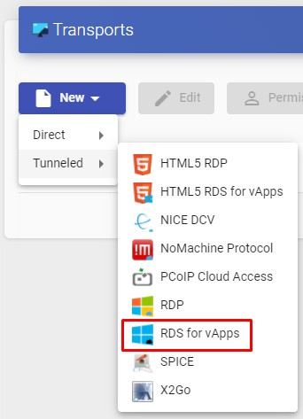

В "***RDS Transport (tunneled)***" минимальные параметры для настройки:

*Главный:

**Имя:** Название транспорта.

**Приоритет:** Приоритет, который будет иметь транспорт. Чем ниже этот приоритет, тем выше он будет отображаться в списке доступных транспортов для службы. Транспорт с самым низким приоритетом будет использоваться по умолчанию при нажатии на изображение сервиса

**Доступ к сетям:** Разрешает или запрещает доступ пользователя к сервису в зависимости от сети, из которой осуществляется доступ, и сети, указанной в поле «***Сети***».

**Сети:** Диапазоны сети, подсети или IP-адреса, указанные в поле "***Сети**_" поля "_**Connectivity**_". t используется вместе с полем "_**Доступ к сети***" для разрешения или отключения доступа пользователя к сервису в зависимости от его сетевого расположения.

**Разрешенные устройства:** Разрешает доступ к сервису только с выбранных устройств. Если ни один из них не выбран, фильтрация не выполняется.

**Пулы служб:** Позволяет назначить этот транспорт непосредственно одному или нескольким ранее созданным "*** пулам служб***".


*Верительные грамоты:

**Пустые creds:** Если установлено значение "***Yes**_", то при подключении к сервису у него будут запрошены учетные данные для доступа к виртуальному приложению. Если установлено значение "_**Нет***", учетные данные, введенные на портале входа в UDS, будут перенаправлены.

**Без домена:** Указывает, перенаправляется ли доменное имя вместе с пользователем.

**Домен:** Доменное имя, которое будет отправлено с учетными данными пользователя.

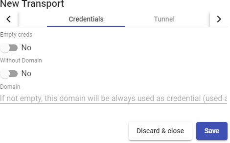

*Туннель:

**Сервер туннеля:** IP-адрес или имя с портом подключения сервера туннеля UDS. Если доступ к рабочему столу осуществляется из глобальной сети, необходимо ввести общедоступный IP-адрес или имя сервера туннеля UDS. Формат: _IP_Tunnel_:443 (порт по умолчанию).

**Время ожидания туннеля:** Срок действия билета сервера UDS Tunnel для соединения.

**Принудительная проверка SSL-сертификата:** Включает проверку сертификата. На сервере UDS Tunnel должен быть установлен действительный сертификат.

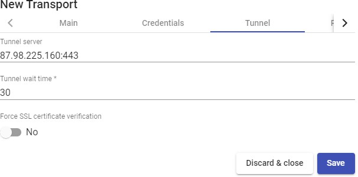

*Параметры:

**Разрешить смарт-карты:** Включает перенаправление смарт-карт.

**Разрешить принтеры:** Включает перенаправление принтера.

**Политика локальных дисков:** Включает перенаправление дисков:

* **Не разрешать:** Диск не перенаправляется.
* **Разрешить PnP-диски:** Во время активного сеанса перенаправляются только подключенные диски.
* **Разрешить любой диск:** Все диски перенаправляются.

**Force drives:** Принудительное перенаправление определенных дисков. Можно указать несколько через запятую. (Пример: F:,G: )

**Разрешить последовательные порты:** Включает перенаправление последовательных портов.

**Включить буфер обмена:** Если эта опция активирована, она позволит копировать/вставлять данные между клиентами подключения и виртуальным приложением.

**Поддержка Credssp:** Если он активирован, он будет использовать "Credential Security Support Provider".

**Включить звук:** Если включено, это позволит перенаправить звук из виртуального приложения на клиент подключения.

**Включить веб-камеру:** Если эта опция активирована, она позволит перенаправлять веб-камеры между клиентом подключения и виртуальным приложением.


*Дисплей:

**Глубина цвета:** Указывает глубину цвета.

**Состояние Windows:** Указывает оконный режим, в котором будет запускаться приложение.

**Сглаживание шрифта:** Включить сглаживание шрифта.

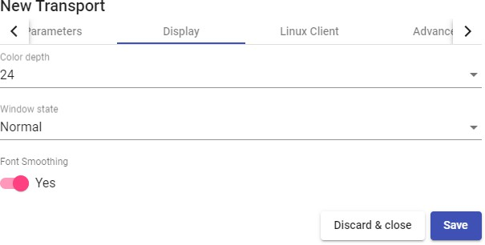

* Клиент Linux:

**Выполнение как оболочка:** Запуск приложения в режиме сеанса, обеспечивающий лучшую визуализацию.

**Синхронизация мультимедиа:** Включает параметр мультимедиа во FreeRDP.

**Использовать Alsa:** Позволяет использовать аудио через Alsa.

**Строка принтера:** Пример: "Zebra","ZDesigner TM400 200 dpi (ZPL)"

_("Zebra" — это имя локального принтера, «ZDesigner TM400 200 dpi (ZPL)» — точное имя драйвера принтера в Windows)._

**Строка смарт-карты:** Пример: "Gemalto PC Twin Reader 00 00" ("Gemalto PC Twin Reader 00 00" _is имя смарт-карты)._

**Пользовательские параметры:** Вы можете указать любой параметр, поддерживаемый клиентом FreeRDP. Они будут применены при установлении соединения с виртуальным приложением.

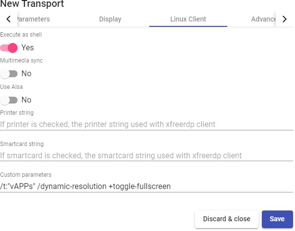

###### ПРИМЕЧАНИЕ: {#note-38 .ненумерованный}

На скриншоте в качестве примера показаны некоторые важные параметры: /t:"name_aplication" позволяет принудительно присвоить окну заголовок (если не указано, то имя будет именем пула сервисов), /dynamic- resolution +toggle-fullscreen позволяет развернуть окно приложения...

*Продвинутый:

**Порт RDP:** Порт подключения к RDP-серверу

**Метка:** Позволяет группировать транспорты, которые будут показаны через имя метки в мета-пуле. Используя эти теги, мы можем указать, что метапул имеет несколько транспортов.


#### SPICE (туннельный)

Ранспорт "***SPICE (tunneled)***" позволяет получить доступ к виртуальным рабочим столам Windows/Linux пользователям, находящимся в глобальной сети, используя протокол SPICE. На клиентах подключения должен быть установлен SPICE-клиент (Virt-Manager).

Транспорт SPICE можно использовать только с поставщиками услуг, такими как oVirt/Red Hat Enterprise Virtualization (RHV) и OpenNebula.

Этот транспорт использует сервер туннеля UDS для подключения к виртуальным приложениям. Его необходимо предварительно настроить для корректной работы.


В транспорте "***SPICE (tunneled)***" минимальные параметры для настройки:

*Главный:

**Имя:** Название транспорта.

**Приоритет:** Приоритет, который будет иметь транспорт. Чем ниже этот приоритет, тем выше он будет отображаться в списке доступных транспортов для службы. Транспорт с наименьшим приоритетом будет использоваться по умолчанию при нажатии на изображение сервиса.

**Сертификат:** Сертификат, сгенерированный в ovirt-engine / RHV-manager или OpenNebula

необходим для подключения к виртуальным рабочим столам (обычно размещенным по адресу **/etc/pki/ovirt-engine/certs/ca.cer** ).

**Доступ к сетям:** Разрешает или запрещает доступ пользователя к сервису в зависимости от сети, из которой он получает доступ, и сети, указанной в поле «***Сети***».

**Сети:** Диапазоны сети, подсети или IP-адреса, указанные в поле "***Сети**_" поля "_**Connectivity**_". Он используется вместе с полем «__Network Access_*», чтобы разрешить или запретить доступ пользователя к сервису в зависимости от его сетевого расположения.

**Разрешенные устройства:** Разрешает доступ к сервису только с выбранных устройств. Если ни один из них не выбран, фильтрация не выполняется.

**Пулы служб:** Позволяет назначить этот транспорт непосредственно одному или нескольким ранее созданным "**пулам служб**".


*Туннель:

**Сервер туннеля:** IP-адрес или имя с портом подключения сервера туннеля UDS. Если доступ к рабочему столу осуществляется из глобальной сети, необходимо ввести общедоступный IP-адрес или имя сервера туннеля UDS. Формат:

_IP_Tunnel_:443

**Время ожидания туннеля:** Срок действия билета сервера UDS Tunnel для подключения.

**Принудительная проверка SSL-сертификата:** Включает проверку сертификата. На сервере UDS Tunnel должен быть установлен действительный сертификат.

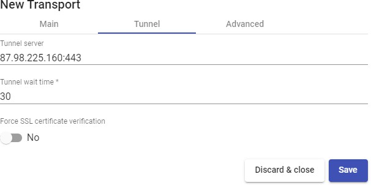

*Продвинутый:

**Полноэкранный режим:** Включает полноэкранный режим при подключении к виртуальному рабочему столу.

**Перенаправление смарт-карт:** Включает перенаправление смарт-карт на виртуальном рабочем столе.

**Включить USB:** Разрешает перенаправление устройств, подключенных к USB-порту.

**Новый автоматический общий доступ к USB:** Позволяет перенаправлять устройства PnP, подключенные к USB-порту.

**Метка:** Позволяет группировать транспорты, которые будут показаны через имя метки в мета-пуле. Используя эти теги, мы можем указать, что метапул имеет несколько транспортов.

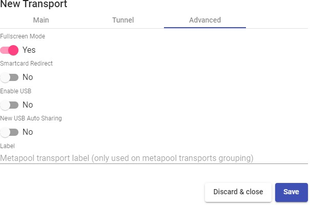

#### X2Go (туннельный)

Транспорт "***X2Go (tunneled)***" позволяет пользователям получить доступ к виртуальным рабочим столам Linux с помощью программного обеспечения X2Go.

Как для клиентов подключения (клиент), так и для виртуальных рабочих столов (сервер) должен быть установлен и включен X2Go.

Этот транспорт использует сервер туннеля UDS для подключения к виртуальным рабочим столам. Его необходимо предварительно настроить для корректной работы.


В транспорте "***X2Go (tunneled)***" минимальные параметры для настройки:

*Главный:

**Имя:** Название транспорта.

**Приоритет:** Приоритет, который будет иметь транспорт. Чем ниже этот приоритет, тем выше он будет отображаться в списке доступных транспортов для службы. Транспорт с наименьшим приоритетом будет использоваться по умолчанию при нажатии на изображение сервиса.

**Доступ к сетям:** Разрешает или запрещает доступ пользователя к сервису в зависимости от сети, из которой осуществляется доступ, и сети, указанной в поле «***Сети***».

**Сети:** Диапазоны сети, подсети или IP-адреса, указанные в поле "***Сети**_" поля "_**Connectivity**_". Он используется вместе с полем "_**Доступ к сети***" для разрешения или отключения доступа пользователей к службе в зависимости от их сетевого расположения.

**Разрешенные устройства:** Разрешает доступ к сервису только с выбранных устройств. Если ничего не выбрано, фильтрация не выполняется.

**Пулы служб:** Позволяет назначить этот транспорт непосредственно одному или нескольким "*** пулам служб***", созданным ранее.


*Туннель:

**Сервер туннеля:** Имя адреса P с портом подключения сервера туннеля UDS. Если доступ к рабочему столу осуществляется из глобальной сети, необходимо ввести общедоступный IP-адрес или имя сервера туннеля UDS. Формат:

_IP_Tunnel_:443

**Время ожидания туннеля:** Срок действия билета сервера UDS Tunnel для подключения.

**Принудительная проверка SSL-сертификата:** Включает проверку сертификата. На сервере UDS Tunnel должен быть установлен действительный сертификат.


*Верительные грамоты:

**Имя пользователя:** Имя пользователя, которое будет использоваться для входа на виртуальный рабочий стол.

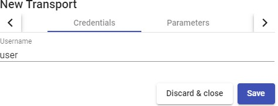

*Параметры:

**Рабочий стол:** Выбор менеджера рабочего стола (xfce, Mate, Gnome и т.д.) или виртуализация приложений Linux (UDS vAPP).

**vAPP:** Путь выполнения виртуализируемого приложения (применимо только в том случае, если выбран параметр "Desktop" "UDS vAPP").

**Включить звук:** Включить звук.

**Перенаправление домашней папки:** Перенаправляет /home пользователя.

**Скорость:** Оптимизация соединения.


*Продвинутый:

**Звук:** Выбор типа аудио сервера.

**Клавиатура:** Язык клавиатуры.

**Pack:** Метод, используемый для сжатия изображений

**Качество:** Качество изображения (0-9)

**Метка:** Позволяет группировать транспорты, которые будут показаны через имя метки в мета-пуле. Используя эти теги, мы можем указать, что метапул имеет несколько транспортов.


### Сети

UDS позволяет регистрировать различные сети для просмотра или скрытия доступа клиентов подключения к виртуальным рабочим столам или приложениям (при доступе к порталу входа в UDS определяется IP-адрес клиента подключения). Именно эти сети вместе с «***Транспортом***» будут определять, какой тип доступа пользователи будут иметь к своим виртуальным рабочим столам или приложениям, сгенерированным UDS.

Чтобы добавить сеть, перейдите в раздел «***Подключение**_» и выберите «_**Сети***».

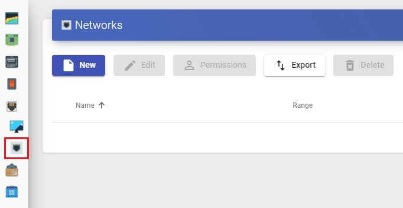

Укажите описательное имя и диапазон сети, полную подсеть или IP-адрес. Поддерживаются следующие форматы:

* Уникальный IP-адрес: xxx.xxx.xxx.xxx (например: 192.168.11.33).
* Вся подсеть: xxx.xxx.xxx.xxx/x (например: 192.168.11.0/24).
* Диапазон IP-адресов: xxx.xxx.xxx.xxx-xxx.xxx.xxx.xxx (например: 192.168.11.1- 192.168.11.155).


Определенные сети появятся доступными в транспортах. Вы можете настроить, будет ли клиент подключения, находящийся в этой сети, отображать транспорт или нет:


Если у пользователя есть права администрирования, он увидит IP-адрес, который UDS обнаружит в клиенте подключения, в панели управления сервисами пользователя.

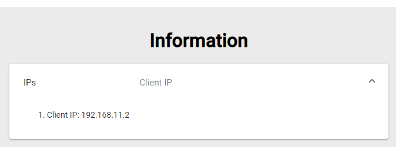

Если на транспорте не определены сети, система не будет ограничивать доступ к службам рабочего стола и виртуальным приложениям из какого-либо места

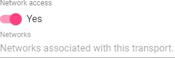

### Service Pools

Создание «пула сервисов***» позволит развернуть службы рабочего стола или виртуальные приложения, которые будут доступны для доступа разным группам пользователей.

Необходимыми элементами для создания "**Service Pools**" являются "**Base Service**" (состоящий из "**Service Providers**" + сервис, созданный в нем) и "**OS Manager**". После создания вам нужно будет назначить одну или несколько групп пользователей и один или несколько транспортов, чтобы разрешить доступ пользователей.

Чтобы создать "***Пул услуг**_", перейдите в раздел "_**Пулы**_" и выберите "_**Пул услуг***".


Для настройки "***Service Pool***" необходимо указать:

*Главный:

**Имя:** Имя "***Пула служб***" (это имя будет показано пользователю для доступа к его рабочему столу или виртуальному приложению).

В этом разделе вы можете добавить переменные для отображения информации об услугах:

* **{use}**: Указывает процент использования пула (рассчитывается на основе максимального количества предоставляемых услуг и назначенных услуг).
* **{total}**: общее количество компьютеров (данные, извлеченные из максимального количества служб, которые должны быть предоставлены из пула сервисов).
* **{usec}**: Количество компьютеров, используемых пользователями в пуле.
* **{left}**: Количество компьютеров, доступных в пуле для подключения пользователей.

**Краткое наименование:** Если указано; Это будет название сервиса, которое будет показано пользователю. При наведении на него появится содержимое поля «***Имя***».

**Базовая служба:** Базовая служба, используемая (виртуальный рабочий стол или приложение). Он состоит из поставщика услуг и базовой службы, предварительно настроенной в разделе "***Services***".

**OS Manager:** "***OS Manager**_" ранее созданный, конфигурация которого будет применена к каждому из сгенерированных виртуальных рабочих столов. В случае публикации vAPP-сервиса он также потребуется. Но если вы используете "_**Static IP***", тип service, это поле не будет использоваться.

**Публикация при создании:** Если включено, то при сохранении пула сервисов система автоматически запустит первую публикацию. Если установлено значение "***Нет**_", то необходимо будет запустить публикацию сервиса вручную (из вкладки "_**Публикации***").

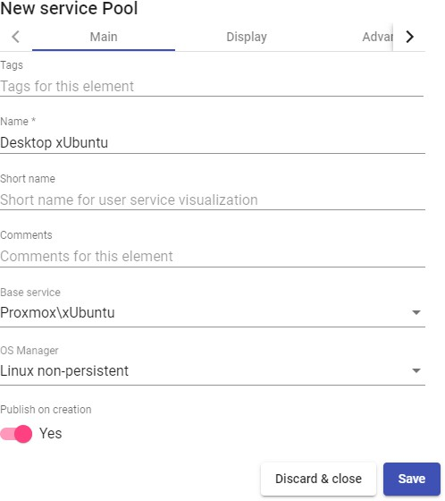

*Дисплей:

**Видимость:** Если эта опция отключена, "**Пул служб**" не будет отображаться как доступный пользователям на странице служб UDS ("***Пользовательский режим***").

**Ассоциированный образ**: Образ, связанный со службой. Он должен быть предварительно добавлен в репозиторий образов, доступный из раздела "***Tools**_" -- "_**Gallery***".

**Группа пула**: Позволяет группировать различные сервисы. Чтобы присвоить "***Pool group**_", она должна быть предварительно создана в разделе "_**Pools**_" -- "_**Groups***".

**Текст отказа в доступе к календарю**: Текст, который будет отображаться, если доступ к службе запрещен приложением календаря доступа.


*Продвинутый:

**Разрешить удаление пользователями:** Если этот параметр включен, пользователи могут удалять назначенные им службы. Если услуга является виртуальным рабочим столом, автоматически сгенерированным UDS, она будет удалена и ей будет назначен новый при следующем подключении. Если это другой тип услуги (vAPP / Static IP), назначение будет удалено только и при следующем подключении будет назначено новое.

**Разрешить сброс пользователями:** Если она активирована, пользователь сможет перезапустить или сбросить назначенные ему службы (применимо только к виртуальным рабочим столам, автоматически сгенерированным UDS).

**Игнорирует неиспользуемые:** Если этот параметр включен, временные пользовательские службы, которые не используются, не будут удалены.

**Показать транспорты:** Если эта опция активирована, будут отображаться все транспорты, назначенные сервису. Если она не активирована, то будет отображаться только транспорт по умолчанию с наивысшим приоритетом (Наименьшее число в поле "***priority***" транспорта).

**Бухгалтерский учет:** Назначение услуги ранее созданным "***Учетным записям**_" ("_**Пулы**_" -- "_**Учетные записи***")

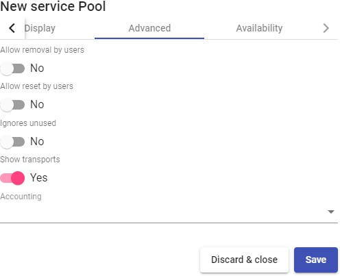

*Наличие:

**Начальные доступные службы:** Минимальное количество виртуальных рабочих столов, созданных, настроенных и назначенных/доступных для службы.

**Сервисы для хранения в кэше:** Количество доступных виртуальных рабочих столов. Они всегда будут настроены и готовы к назначению пользователю (они будут сгенерированы автоматически

до тех пор, пока не будет достигнуто максимальное количество машин, указанное в поле «***Максимальное количество предоставляемых услуг***»).

**Сервисы, хранящиеся в кэше L2:** Количество виртуальных рабочих столов в спящем режиме или состоянии выключения. Эти настольные компьютеры будут настроены и готовы к выделению, когда системе потребуются новые кэшированные рабочие столы.

Виртуальные рабочие столы, сгенерированные на уровне кэша L2, будут кэшированы, как только они потребуются системе. Они никогда не будут напрямую назначены пользователям.

**Максимальное количество предоставляемых сервисов:** Максимальное количество виртуальных рабочих столов, созданных системой в "***Service Pool***" (рабочие столы, сгенерированные в кэше L2, учитываться не будут).

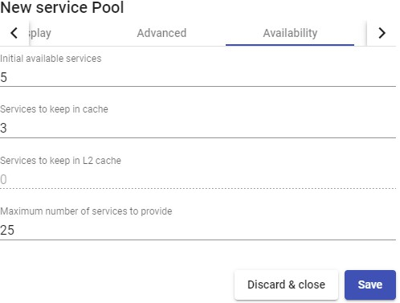

Сохраните "***Service Pool***", и система начнет генерировать виртуальные рабочие столы на основе настроенного кэша (вкладка "Доступность").

С помощью кнопки "***Удалить**_" вы можете полностью удалить "_**Пул услуг**_", а с помощью "_**Редактировать***" вы можете изменить его.


Если вы зайдете в созданный "***Service Pool**_", то в разделе "_**publications**_" (если вы отметили "_**Publish on creation***"), система запустится с публикации

Служба, создающая базовый компьютер, на котором будут базироваться виртуальные рабочие столы.

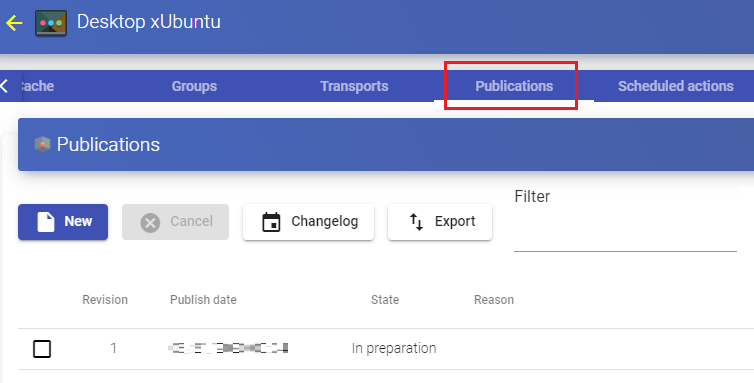

После того, как вы создали "***Service Pool***", если вы получите доступ к нему, вы найдете следующие меню управления и конфигурации:

* **Назначенные службы:** Виртуальные рабочие столы, назначенные пользователям. Отображает сведения о дате создания рабочего стола, номере редакции (или публикации), на котором создается рабочий стол, MAC-адресе сетевой карты виртуальной машины, DNS и IP-имени виртуального рабочего стола, состоянии рабочего стола, если он используется, имени и IP-адресе клиента подключения, владельце компьютера и версии субъекта UDS, установленного на компьютере шаблона.


Выбрав виртуальный рабочий стол и нажав на «***Сменить владельца***», вы можете изменить пользователя, назначенного на рабочий стол


Нажав на "***Удалить**_" вы можете удалить его вручную, а на "_**Журналы**_" вы увидите всю информацию, сообщаемую "_**Actor UDS***", установленным на рабочем столе.

* **Кэш**: Виртуальные рабочие столы, доступные для подключения пользователей (включая машины с кэшем L2). Эти рабочие столы будут проходить через различные состояния:
* **В подготовке**: В этом состоянии виртуальные рабочие столы создаются на платформе виртуализации.
* **Ожидание ОС:** В этом состоянии виртуальные рабочие столы настраиваются с параметрами, указанными в "***OS Manager***" (смена имени, включение в домен и т.д...)
* **Действительно:** Когда виртуальный рабочий стол находится в этом состоянии, это означает, что он доступен для доступа пользователей.


* Группы: Чтобы разрешить пользователям подключаться, необходимо назначить группы доступа или метагруппы. Эти группы или метагруппы должны быть созданы в разделе «Аутентификаторы», и вы можете назначить одну или несколько групп доступа или метагрупп каждому «Пулу услуг».

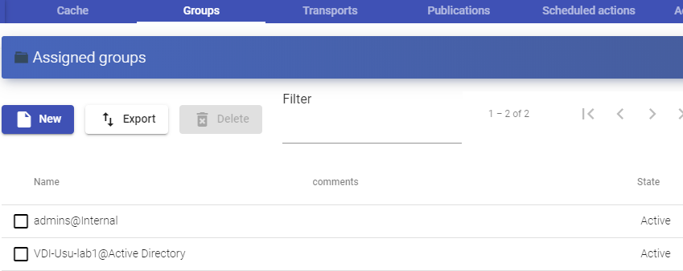

Выберите "**Authenticator**" и, исходя из вашего выбора, выберите "**Имя группы**".

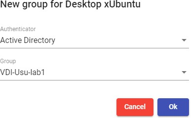

* Транспорты: "Транспорты" для подключения к виртуальному рабочему столу

(Ранее добавлено в разделе "**Транспорты**") будет указано. "**Транспорты**" с самым низким приоритетом будут теми, которые настроены системой по умолчанию. Чтобы воспользоваться остальными транспортами, пользователю придется открыть выпадающее меню на экране доступа к виртуальному рабочему столу и выбрать тот, который соответствует.


Выберите "**Транспорт**", который вы хотите использовать в этом пуле "**Сервис**" и сохраните.


* **Публикации:** В этом меню вы можете создать новую публикацию службы (например, если вы обновили свой базовый компьютер новыми приложениями или исправлениями ОС и хотите, чтобы все ваши виртуальные рабочие столы приняли эти изменения). Как только процесс публикации будет завершен, весь системный кэш будет пересоздан на новых рабочих столах на основе этой последней публикации.


Если вы создадите новую публикацию, будет сгенерирован новый базовый компьютер, и, как только он станет доступен, система приступит к удалению виртуальных рабочих столов предыдущей версии и созданию новых на основе новой публикации


### Мета-пулы

Создание «**Meta Pool**» позволит получить доступ к десктопным сервисам или виртуальным приложениям, состоящим из различных «**Пулов сервисов**». Эти пулы будут работать вместе, предоставляя различные услуги совершенно прозрачным для пользователей способом.

«**Пулы услуг**», образующие «**Пул Meta**», будут работать в соответствии с политикой, которая позволит предоставлять услуги в соответствии с потребностями Пула. В настоящее время поддерживаемые политики будут определяться приоритетами, емкостью платформы и ее использованием.

Чтобы создать "**Meta Pool**", перейдите в раздел "**Пулы**" и выберите "**Meta Pools**".

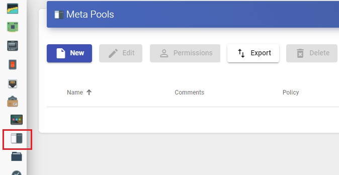

Для настройки "***Meta Pool***" необходимо указать:

*Главный:

**Имя:** Имя "**Meta Pool**" (это имя будет тем, которое будет показано пользователю для доступа к его сервису: виртуальному рабочему столу или приложению)

**Краткое название:** Если указано, то пользователю будет показано название сервиса. При наведении на него появится содержимое поля «**Имя**».

**Политика**: Политика, которая будет применяться при создании сервисов в "**Пулах сервисов**", которые являются частью "**Meta Pool**".

* **Равномерно распределенные**: Сервисы будут создаваться и потребляться в равной степени во всех "**Пуле услуг**", которые составляют "**Meta Pool**".
* **Приоритет**: Службы с наивысшим приоритетом будут создаваться и потребляться из "**Пула услуг**" (приоритет определяется полем "**priority**"). Чем меньше значение этого поля, тем больший приоритет будет иметь элемент). Когда "**Service Pool**" достигнет максимального количества сервисов, будут израсходованы сервисы следующего.
* **Больший % доступности**: Службы будут создаваться и потребляться из «**Пула услуг**» с наибольшим процентом бесплатного использования.


*Дисплей:

**Ассоциированное изображение**: Изображение, связанное с "**Meta Pool**". Он должен быть предварительно добавлен в репозиторий образов и доступен из раздела "**Инструменты**" -- "**Галерея**".

.

**Группа пула**: Включает возможность группировать различные "**Meta Pools**" для назначения "**Группы пула**". Он должен быть предварительно создан в разделе "**Пулы**" -- "Группы".

**Видимость:** Если эта опция отключена, "**Meta Pool**" не будет отображаться как доступный пользователям на странице UDS-сервисов ("**Пользовательский режим**").

**Текст отказа в доступе к календарю**: текст, который будет отображаться, когда приложению календаря доступа будет отказано в доступе к **Meta Pool**

**Выбор транспорта:** Он укажет, как транспорты будут назначены "***meta pool***":

* **Автоматический выбор**: Доступный транспорт с самым низким приоритетом, назначенный "**Пулу услуг**", будет доступен в "**метапуле**". Выбор транспорта не допускается.
* **Использовать только общие транспорты**: Те существующие транспорты, которые являются общими для всех "**Service Pool**", будут доступны в "**meta pool**".
* **Группировать транспорты по метке**: Те транспорты, которые имеют разные и сгруппированные "l**abels**", будут доступны в "**meta pool**" (это поле находится внутри каждого "**Transport**" на вкладке "**advanced**").


Сохраните конфигурацию, и у вас будет действительный "**Meta Pool**", чтобы начать регистрацию "**Services Pools**".

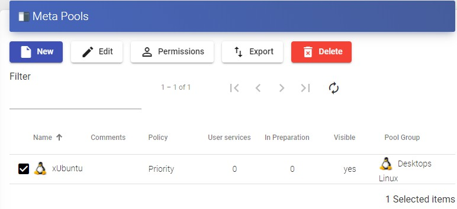

Чтобы изменить любой параметр в существующем "**Meta Pool**", выберите его и нажмите "**Редактировать**".

После создания необходимо добавить "**Services Pools**". Для этого дважды кликаем по созданному "**Meta Pool**" или выбираем "**Detai**l" в меню провайдера:

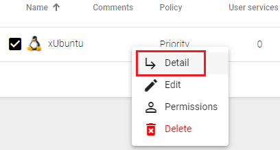

Нажмите «**Создать**», чтобы добавить все «**Пулы сервисов**», которые будут содержаться в «**Meta Pool**». Вы можете добавить столько сервисов, сколько вам нужно, комбинируя сервисы, размещенные на различных платформах виртуализации (VMware, KVM, Azure и т. д.), серверах приложений и статических устройствах.

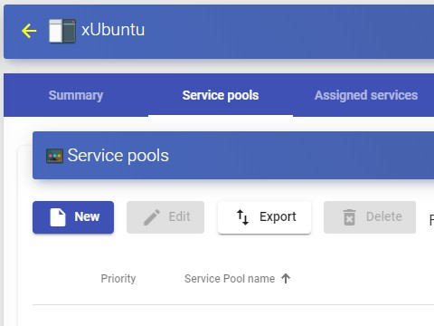

Для добавления "**Service Pool**" необходимо указать следующие параметры:

**Приоритет:** Приоритет, который будет иметь "**Пул сервисов**" в "**Meta Pool**". Чем ниже значение, тем больший приоритет он имеет по отношению к остальным элементам.

**Пул служб:** Имя "**Пул служб**", который вы хотите добавить. Он должен быть предварительно создан

**Включено:** Включает или отключает видимость "**Meta Pool**"


Вы можете добавить столько сервисов, сколько вам нужно, комбинируя сервисы, размещенные на различных платформах виртуализации (VMware, KVM, Azure и т. д.), серверах приложений и статических устройствах.

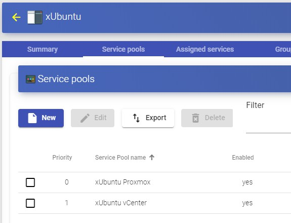

Как и в "**Пуле служб**", здесь у вас также будут следующие вкладки с информацией и конфигурацией:

* **Назначенные службы:** Показывает службы, назначенные пользователям, позволяя удалить их вручную и переназначить другому пользователю.
* **Группы:** Указывает, какие группы пользователей различных аутентификаторов, зарегистрированных в системе, будут иметь доступ к сервису.
* **Доступ к календарю:** Позволяет применить ранее созданный календарь доступа.
* **Журналы:** Показывает все проблемы, возникшие в "***Meta Pool***".

### Группы

UDS позволяет группировать сервисы для облегчения доступа к ним и их расположения. Кроме того, каждой группе сервисов можно присвоить имя и образ. Если "**Группы**" не определены, то сервисы будут располагаться на сайте по умолчанию, который создается системой

Чтобы создать "**Группы**", перейдите в раздел "Пулы" и выберите "**Группы**":

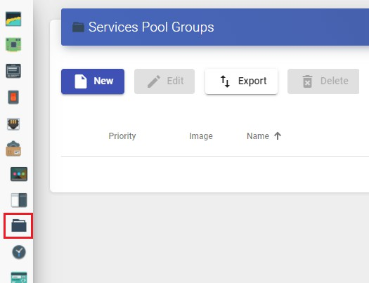

Выберите **"Создать**" и укажите описательное имя. Присвойте приоритет группе пула (чем меньше значение, тем больший приоритет она будет иметь по отношению к остальным элементам.) и свяжите изображение:

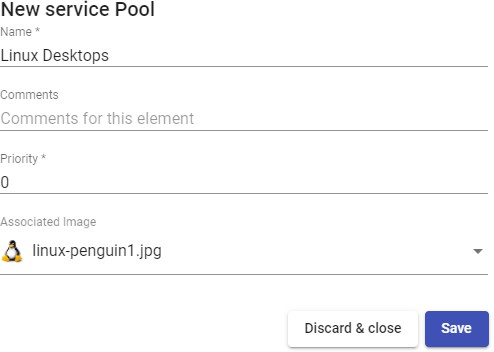

После создания он будет доступен для назначения в "***Пул услуг***".

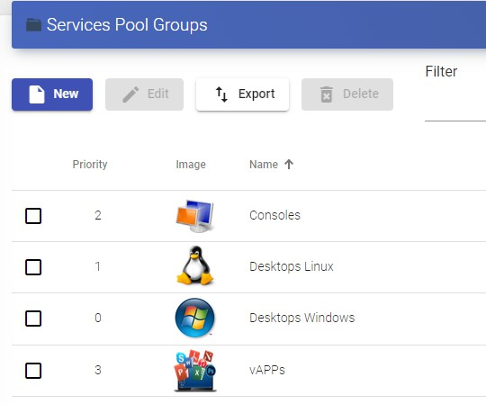

### Доступ к календарям и запланированным задачам

OpenUDS включает в себя систему разрешения или запрета доступа через календари. Они позволяют разрешать или ограничивать доступ пользователей к десктопным сервисам и виртуальным приложениям по дате и временным интервалам.

С помощью календарей также можно планировать и автоматизировать определенные задачи в "**Пуле услуг**", такие как создание новых публикаций, настройка значений системного кэша, добавление или удаление групп и транспортов или изменение максимального количества сервисов.

#### Календари

Чтобы создать «**Календари**», перейдите в раздел «Пулы» и выберите «**Календари**».


Укажите описательное имя для идентификации календаря.


Сохраните, и у вас уже будет действующий календарь, чтобы начать создавать правила, которые вы позже будете применять к сервису через "**Services Pool**".


В «Календаре» вы можете зарегистрировать различные типы правил, чтобы запланировать доступность услуг в определенное время.

Чтобы создать правило, откройте календарь и нажмите «***Новый***».

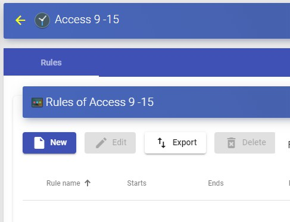

Минимальные параметры для настройки в "**Rule**":

**Имя:** Название правила.

**Событие:** Настройка периодов выполнения. Для этого укажите время начала и продолжительность события (в минутах, часах, днях и месяцах).

**Повторение:** В этом разделе вы можете настроить, что правило повторяется в днях, неделях, месяцах, годах, и даже позволяет указывать рабочие дни. Наконец, вы можете указать интервалы повторения в день.

**Сводка:** Показывает сводку всех ранее сделанных конфигураций.

После сохранения у вас будет действительное правило, которое будет назначено "**Пулу служб**" (виртуальному рабочему столу и/или приложению).

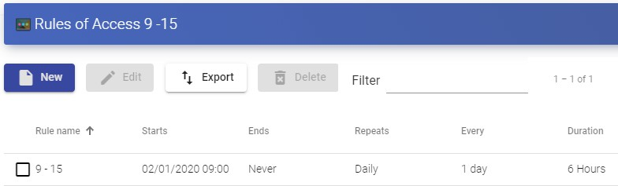

##### Включение или запрет доступа пользователей

После настройки правил в календарях их можно использовать для включения или запрета доступа пользователей к службам рабочего стола и виртуальным приложениям.

Чтобы применить эти календари с их правилами, выберите "**Пул услуг**", перейдите на вкладку "**Доступ к календарям**" и нажмите "**Создать**":


Укажите приоритет доступа, выберите существующий календарь и отметьте действие, которое будет применяться при доступе к сервису

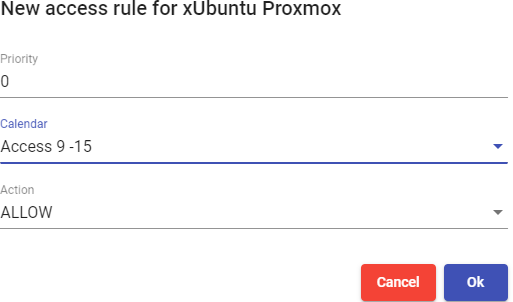

После сохранения у вас будет "**Пул услуг**" с настроенным календарем доступа.


###### ПРИМЕЧАНИЕ: {#note-39 .unnumbered}

La Вам придется настроить правило по умолчанию "FallBack" в зависимости от потребностей службы, чтобы разрешить или запретить доступ к службе, когда календарь не применяется.

##### Запланированные действия:

После того, как правила в календарях настроены, вы можете использовать их для планирования определенных задач в "**Пуле служб**".

Чтобы применить эти календари с их правилами, выберите "**Пул услуг**", перейдите на вкладку "**Запланированные действия**" и нажмите "**Создать**".


Укажите существующий календарь, время, в течение которого будет выполняться действие и выберите действие, которое нужно выполнить:

**Установить начальные службы:** Сбрасывает минимальное количество созданных и настроенных виртуальных рабочих столов.

**Установить размер кэша:** Сбрасывает виртуальные рабочие столы, доступные в системном кэше. Эти рабочие столы будут настроены и готовы к назначению пользователю.

**Установить максимальное количество служб:** Изменяет максимальное количество виртуальных рабочих столов в "***Пуле служб***".

**Опубликовать:** Создание новой публикации в "***Service Pool***".

**Добавить транспорт:** Добавляет существующий транспорт в "***Пул сервисов***".

**Удалить транспорт:** Удаляет транспорт из "***Пул служб***".

**Добавить группу:** Добавляет существующую группу в "***Пул услуг***".

**Удалить группу:** Удаляет группу из "***Пул служб***".

**Устанавливает игнорирование неиспользуемых:** Устанавливает параметр "***Игнорирует неиспользуемые***".

**Удалить ВСЕ назначенные пользовательские службы:** Удаляет все службы, назначенные пользователям в "***Пуле сервисов***".

Мы сохраняем, и у нас будет запланированная задача, которая выполняет определенное действие в "**Пуле служб**".


### Настройка разрешений

В рамках администрирования OpenUDS можно назначать права доступа и управления различным элементам, пользователям и группам пользователей. Тем

Права будут назначены непосредственно каждому элементу, а также будут применяться к его подэлементам.

Чтобы разрешить пользователю доступ к администрированию и подать заявку на получение этих разрешений, у пользователя должна быть включена опция "**Сотрудник**":


Чтобы включить разрешения в различных элементах администрирования, выберите элемент и нажмите на "**Разрешения**". Например, в "**Поставщик услуг**".

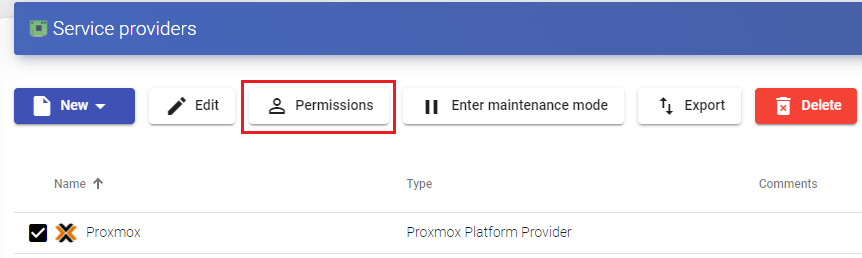

В окне разрешений нажмите «**Новое разрешение**...» для групп и пользователей и выберите аутентификатор и группу/пользователя, к которым будет применено разрешение.


Вам нужно будет указать, будет ли этот пользователь или группа иметь доступ на чтение элемента ("**Только чтение**") или полный контроль ("**Полный доступ**").

После применения пользователи, у которых включена опция «**Сотрудник**», смогут получить доступ к этому элементу администрирования с теми разрешениями, которые были назначены

Чтобы удалить разрешения для группы или пользователя, нажмите на кнопку "***X***".

Разрешения типа "***Полный доступ**_" ("_**Управление**_") могут быть применены только к элементам, имеющим второй уровень ("_**Services**_", "_**Calendars**_", "_**Service Pools***" и т.д.).

## ДОСТУП К ВИРТУАЛЬНЫМ РАБОЧИМ СТОЛАМ С ПОМОЩЬЮ OpenUDS

После того, как у вас есть один или несколько "**Пулов служб**" с опубликованными службами в допустимом состоянии, вы можете установить подключение к виртуальному рабочему столу. Через веб-браузер вы получите доступ к адресу или имени UDS-сервера. Введите действительное имя пользователя и пароль и выберите аутентификатор в случае, если доступно более одного.

На экране доступных сервисов вы увидите сервисы, к которым имеет доступ пользователь, с которым вы вошли в систему UDS. Нажмите на тот, с которого вы хотите начать подключение.

По умолчанию, если вы нажмете на изображение сервиса напрямую, вы создадите соединение с "**Транспорт**" с самым низким приоритетом. Если вы настроили несколько, появится выпадающее меню, где можно выбрать «**Транспорт**», с помощью которого вы будете подключаться к виртуальному рабочему столу.

При необходимости, или в случае наличия нескольких типов сервисов (приложения, рабочие столы Linux или рабочие столы Windows), вы можете сгруппировать службы для облегчения доступа пользователей:

Чтобы начать соединение с виртуальной машиной, необходимо, чтобы на клиентской машине подключения был установлен "UDS Client". Необходимо начать соединение со всеми транспортами, кроме HTML5

Для подключения к виртуальному рабочему столу или приложению необходимо установить клиенты каждого протокола (RDP, NX, RGS, SPICE и т.д.).

Пример подключения HTML5:

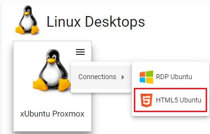

### Инструменты

OpenUDS предоставляет ряд инструментов, которые придают системе большую гибкость, обеспечивая настройку, отчеты об использовании, расширенные параметры и т. д.

### Галерея

UDS имеет репозиторий образов, которые могут быть связаны с «пулом служб» или «группой пула» для упрощения идентификации виртуального рабочего стола. Допустимые форматы: PNG, JPEG и GIF. Если размер изображения превышает 128x128, его размер будет изменен.

Чтобы получить доступ к галерее образов UDS, перейдите в раздел "**Инструменты**" и выберите "**Галерея**":

Выберите "**New**", чтобы добавить новый образ в репозиторий. Необходимо будет указать имя и, используя кнопку «**Выбрать изображение**», вы будете искать изображение, которое хотите загрузить.

После того, как образ будет сохранен, он будет доступен для назначения "**Пул служб**" или "**Группа пула**"

### Отчеты

UDS позволяет автоматически формировать отчеты по различным элементам платформы Чтобы получить доступ к отчетам, войдите в раздел «Инструменты» и выберите «**Отчеты**»:

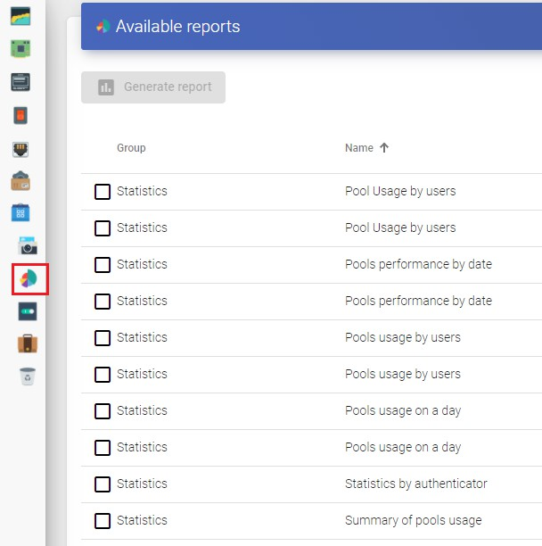

В UDS можно создавать различные отчеты. Среди них выделяются:

* **Список пользователей:** Генерирует отчет со всеми пользователями, принадлежащими аутентификатору. Выберите аутентификатор и нажмите «**Сохранить**».

После создания у вас будет список всех пользователей, принадлежащих этому аутентификатору:

* **Отчет о доступе пользователей по дате:** Генерирует отчет со всеми обращениями пользователей к системе за определенный диапазон дат. Вы можете указать диапазон дат и количество интервалов:
* **Производительность пулов по дате:** Генерирует отчет об использовании пула сервисов в определенном диапазоне дат. Вы можете указать пул, по которому вы хотите создать отчет, диапазон дат и количество интервалов

### Конфигурация

OpenUDS предоставляет ряд параметров, которые будут определять работу системы. Эти параметры будут отвечать за определение таких аспектов, как безопасность, режим работы, подключение и т. д. как самой системы UDS, так и ее связи с виртуальными платформами, зарегистрированными в UDS.

В данном руководстве показаны лишь некоторые системные переменные, которые считаются наиболее полезными для управления виртуальными рабочими столами.

В остальных переменных рекомендуется не изменять значения по умолчанию, так как некоторые из них указывают системе, как она должна работать (количество одновременных задач, время выполнения задачи, запланированные проверки и т.д...) и некорректное изменение параметра может привести к полной остановке системы или ее некорректной работе.

###### ПРИМЕЧАНИЕ: {#note-40 .unnumbered}

После изменения значений любой из дополнительных переменных конфигурации UDS необходимо перезапустить сервер UDS, чтобы изменения вступили в силу

Если вы хотите изменить какое-либо значение, которое не описано в этом разделе, рекомендуется обратиться в службу поддержки OpenUDS, чтобы проверить указанное изменение и убедиться, что оно не оказывает негативного влияния на работу системы UDS

Чтобы получить доступ к параметрам расширенной конфигурации UDS, зайдите в раздел "**Инструменты**" и выберите "**Конфигурация**":

#### УДС

**UDS ID:** Идентификация установки OpenUDS

**AutorunService =** Выполняет прямой доступ к сервису пользователя, если пользователю назначена только одна служба.

Активировав этот параметр, пользователи, которым назначена одна услуга, будут напрямую подключаться к ней, скрывая экран выбора услуги и используя настроенный сначала "**Транспорт**".

По умолчанию: нет.

**DisallowGlobalLogin =** Если опция включена, глобальный список аутентификаторов не отображается.

Если эта опция включена, пользователи будут проверяться на аутентификаторе «по умолчанию» или с более высоким приоритетом. Чтобы выполнить валидацию с помощью других аутентификаторов и разрешить пользователю доступ к системе, необходимо использовать «метку» в URL-адресе доступа (определенном в аутентификаторе).

По умолчанию: нет.

**KeepInfoTime =** Определяет время, в течение которого завершенные события "Пула служб" остаются видимыми. Выражается в секундах

По умолчанию: 14401 секунда (4 часа)

**RedirectToHttps =** Автоматически перенаправляет доступ к OpenUDS с http на https. По умолчанию: нет

**SessionExpireTime** = Указывает максимальное время, в течение которого сеанс пользователя будет открыт после создания новой публикации. По истечении этого времени система закроет пользовательскую сессию и приступит к удалению службы. Если служба имеет диспетчер ОС с политикой сохраняемости "**Сохранять службу назначенной даже при новой публикации**" на виртуальном рабочем столе, это не будет применяться.

По умолчанию: 24 часа.

**StatsDuration =** Время, в течение которого система будет хранить статистику. По умолчанию: 365 дней.

#### Безопасность

Описаны параметры, связанные с безопасностью системы UDS:

**AllowRootWebAccess =** Позволяет суперпользователю (пользователю, созданному в мастере настройки UDS-сервера) войти в систему на портале входа в UDS.

Изменение этой переменной не повлияет на доступ пользователя root через консоль ОС Linux

По умолчанию: да.

**За прокси-сервером =** Указывает системе, что серверы UDS находятся "**за**" прокси-сервером (например, среда UDS с высоким уровнем доступности и подсистемой балансировки нагрузки типа прокси-сервера высокой доступности).

По умолчанию: нет.

**Блокировать ip-адрес при неудачном входе в систему**: Включает, что в дополнение к блокировке пользователя, который несколько раз потерпел неудачу на портале входа, также блокируется IP-адрес его клиента подключения.

По умолчанию: нет.

**LoginBlockTime:** Время, в течение которого пользователь будет заблокирован (в секундах) после неправильного ввода пароля, время, указанное в переменной "**maxLoginTries**".

По умолчанию: 300 секунд (5 минут).

**Мастер-ключ:** Код безопасности для субъекта UDS (применимо только к версиям, предшествующим UDS 3.0)

**MaxLoginTries:** Количество попыток, которые пользователь должен будет ввести свой пароль, прежде чем система заблокирует его.

**RootPass =** Пароль суперпользователя, созданный в мастере настройки UDS-сервера.

**SuperUser =** Имя суперпользователя, созданного в мастере настройки UDS-Server.

**Тайм-аут сеанса для администратора =** Время в секундах до выхода из системы администратора, который не выполняет никаких действий.

**Тайм-аут сеанса для пользователя =** Время в секундах до тех пор, пока пользователь, не выполнивший никаких действий, не выйдет из системы.

**Доверенные узлы =** Узлы, которые UDS считает безопасными. Эти узлы могут выполнять "**конфиденциальные**" запросы к UDS, такие как туннели.

Он позволяет заполнять подсети, диапазон IP-адресов и определенные публичные IP-адреса По умолчанию: "*" (все разрешено), допускает значения диапазона адресов.

#### Администратор

**Включить VNC для пользовательских сервисов =** Если эта опция включена, в назначенных сервисах "**Service Pool**" появится новая опция, разрешающая подключение через VNC.

При нажатии на "**VNC**" будет сгенерирован файл со всей информацией для подключения к сервису через VNC-клиент (клиент должен быть предварительно установлен, а также должно быть прямое сетевое подключение к сервису)

По умолчанию: нет

**Размер страницы списка =** Количество отображаемых элементов. Распространяется на все разделы администрации. По умолчанию: 10

**Доверенные хосты для администратора:** Фильтруйте, с каких IP-адресов можно управлять UDS (в том числе от веб-доступа до администрирования с помощью API), разделенных запятыми.

Он позволяет заполнять подсети, диапазон IP-адресов и конкретные публичные IP-адреса.


#### Пользовательский

Описаны параметры, связанные с графической настройкой УДС (вход в систему и портал обслуживания пользователей):

**CSS =** Поддерживает код для изменения страниц стилей UDS по умолчанию

**Название логотипа =** Текст, который отображается рядом с верхним левым изображением строки меню пользователя.

**Min. Services to show filter =** Минимальное количество сервисов, которые должны существовать в окне пользовательских сервисов (пользовательском режиме) для отображения опции фильтра.

**Показать фильтр сверху =** Позволяет изменить расположение строки поиска сервисов на странице пользовательских сервисов (пользовательский режим).

**Информация об авторских правах на сайт =** Текст, который будет отображаться в правой нижней части страницы входа в систему и пользовательских услуг.

**Ссылка на авторские права на сайт =** Веб-адрес в тексте раздела "***Информация об авторских правах на сайт***".

**Информация о сайте =** HTML-код для частичной настройки страницы входа в UDS. Введенный код появится под полем входа пользователя на портале входа в UDS

**Site name =** Texto que aparecerá en la parte superior del cuadro de login de los usuarios en el portal de login de UDS.

#### PCoIP

Описаны параметры, относящиеся к Teradici PCoIP "**Transport**":

**DownloadUrl =** Адрес загрузки клиентского программного обеспечения PCoIP.

#### САМЛ

Описаны параметры, связанные с работой аутентификатора SAML:

**Глобальный выход при выходе =** Указывает на режим "**logout**".

Если этот параметр включен, то при выходе из UDS также выполняется SAML. По умолчанию: нет.

**Кэш метаданных IDP =** Время хранения кэшированных метаданных IDP. По умолчанию: 86400 секунд (24 часа).

**Отображаемое название организации =** Отображаемое название организации.

**Название организации =** Название организации.

**URL организации =** Веб-адрес организации.

#### WYSE

Описаны параметры, связанные с подключением к клиентам Wyse:

**Автоподключение =** Разрешает автоматическое подключение устройства. По умолчанию: нет.

**Colors =** Определяет качество цветов, предлагаемых во время соединения. По умолчанию: Высокий.

**DefaultUser =** Пользователь по умолчанию, перенаправленный на устройство. По умолчанию: UDS.

**Язык =** Язык устройства. По умолчанию: us.

**Привилегия =** Уровень привилегий пользователя. По умолчанию: НЕТ.

Более подробную информацию об этих параметрах можно найти в официальной документации Wyse, а также в этом справочном руководстве:

[[http://www.freewysemonkeys.com/downloads/wtos/Wyse%20Thin%20OS%2064%20Parameters.p]{.underline}](http://www.freewysemonkeys.com/downloads/wtos/Wyse%20Thin%20OS%2064%20Parameters.pdf) [[df]{.подчеркивание}](http://www.freewysemonkeys.com/downloads/wtos/Wyse%20Thin%20OS%2064%20Parameters.pdf)

#### ПРЕДПРИЯТИЕ

Описаны параметры, связанные с подпиской OpenUDS (видимые только в средах, перенесенных из предыдущих версий):

**Серийный номер =** Код активации подписки.

### Очистка кэша

Чтобы очистить кэш системы UDS, перейдите в раздел "**Инструменты**" и выберите "**Очистить кэш**":

Наиболее распространенными причинами очистки системного кэша являются:

* **Блокировка пользователя:** Когда пользователь неправильно вводит свой пароль, время, указанное в переменной "**maxloginTries**" (раздел безопасности в UDS)

конфигурации), система блокирует указанного пользователя. Чтобы разблокировать его сразу, необходимо будет очистить системный кэш.

* **Обновление инвентаря:** Возможно, что при редактировании "**Службы**" некоторые элементы, такие как хранилища данных, сети, базовые машины и т.д. ... недавно добавленные, недоступны (так как они были кэшированы, чтобы избежать ненужных запросов). Для их просмотра придется очистить системный кэш. Таким образом, брокер снова сделает запрос к гипервизору и данные будут обновлены.

-**КОНЕЦ ДОКУМЕНТА**-
