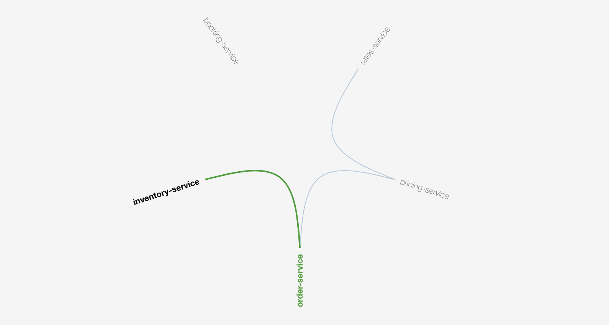

# Contract Testing

Contract testing is a methodology for ensuring that two separate systems (such as two microservices) are compatible with one other. It captures the interactions that are exchanged between each service, storing them in a contract, which can then be used to verify that both parties adhere to it.

## Terminology

- **Consumer** - An application that makes use of the functionality or data from another application to do its job.
- **Provider** - An application (often called a service) that provides functionality or data for other applications to use, often via an API.
- **Interaction** - An individual message that combines a request sent by the consumer & minimal expected response replied by the provider.
- **Minimal Expected Response** - It describes the parts of the response the consumer wants the provider to return.

## Workflow

Different tools follow different patterns for contract testing. [Pact](https://pact.io/) and [Spring Cloud Contracts](https://spring.io/projects/spring-cloud-contract) are examples of **Consumer-Driven Contract Testing** pattern.

**PactumJS** follows a different approach for contract testing. It is a mix of **consumer-driven** & **provider-driven** contract testing or simply call it as bi-directional contract testing framework. It converts all our existing *unit tests* or *component tests* that are written using this library into contract tests.

Contract Testing with pactum has two steps

- Publish Actual Behavior (By Provider) - `flow()`
- Publish Assumed Behavior (From Consumer) - `interaction`

Once we publish the actual & assumed behavior to [PactumJS Flow Server](https://hub.docker.com/r/pactumjs/flows) and it will compare these behaviors to produce compatibility results.

## PactumJS Flow Server

Before starting with contract testing, we need to set up the **pactumjs-flow-server** to save the assumed & actual behavior in a centralized location. Find official docker image of **pactumjs-flow-server** at https://hub.docker.com/r/pactumjs/flows. Follow the instructions to set it up.

Open your browser & navigate to [http://localhost:8080](http://localhost:8080). You should be able to find the below page.

By default three users are created - `admin`, `viewer` and `scanner`. Passwords are same as usernames.


## Publish Actual Behavior

Actual behavior is recorded during component tests that are executed in providers pipeline. Each actual behavior is recorded as a **flow**. All these flows are published to **pactumjs-flow-server** using [pactum-flow-plugin](https://www.npmjs.com/package/pactum-flow-plugin).

- Convert an existing component test to contract test, use `flow()` in the place of `spec()`.
- Provide a unique name for each flow.
- Add pactum-flow-plugin reporter.

```js
const { reporter, flow } = require('pactum');
const pf = require('pactum-flow-plugin');

function addFlowReporter() {
  pf.config.url = 'http://localhost:8080'; // pactum flow server url
  pf.config.projectId = 'team2_inventory-service';
  pf.config.projectName = '[TEAM2] Inventory-Service';
  pf.config.version = '1.0.18';
  pf.config.username = 'scanner';
  pf.config.password = 'scanner';
  reporter.add(pf.reporter);
}

// global before
before(async () => {
  addFlowReporter();
});

// global after
after(async () => {
  await reporter.end();
});

it('get a product in-stock from inventory-service', async () => {
  await flow('get a product in-stock')
    .get('/api/inventory-service/products')
    .withQueryParams('product', 'iPhone')
    .expectJson({
      "InStock": true
    })
    .expectStatus(200);
});
```

Once you run the tests, actual behavior is published to **pactumjs-flow-server**.


Click on the project to see more details about it.


## Assumed Behavior

Assumed behavior is recorded during unit tests or component tests that are executed in consumers pipeline. Each assumed behavior is recorded as an **interaction**. All these interactions are published to **PactumJS Flow Server** using [pactum-flow-plugin](https://www.npmjs.com/package/pactum-flow-plugin).

- Use interactions in your component tests or unit tests.
- Specify the provider id & flow name in the interactions.
- Add pactum-flow-plugin reporter.

Tests for **order-service** which depends upon **inventory-service** to accept orders.

```js
const { reporter, flow, mock, handler } = require('pactum');
const pf = require('pactum-flow-plugin');

function addFlowReporter() {
  pf.config.url = 'http://localhost:8080'; // pactum flow server url
  pf.config.projectId = 'team1_order-service';
  pf.config.projectName = '[TEAM1] Order-Service';
  pf.config.version = '2.1.16';
  pf.config.username = 'scanner';
  pf.config.password = 'scanner';
  reporter.add(pf.reporter);
}

// global before
before(async () => {
  addFlowReporter();
  await mock.start(4000);
});

// global after
after(async () => {
  await mock.stop();
  await reporter.end();
});

handler.addInteractionHandler('get a product in-stock from inventory-service', () => {
  return {
    provider: 'team2_inventory-service', // same as provider project
    flow: 'get a product in-stock', // same as provider flow name
    request: {
      method: 'GET',
      path: '/api/inventory-service/products',
      queryParams: {
        product: 'iPhone'
      }
    },
    response: {
      status: 200,
      body: {
        "InStock": true
      }
    }
  }    
});

it('post an orders to order-service', async () => {
  await flow('post an order')
    .useInteraction('get a product in-stock from inventory-service')
    .post('/api/order-service/orders')
    .withJson({
      'product': 'iPhone',
      'quantity': 1
    })
    .expectStatus(200);
});
```

Once you run the tests, assumed behavior is published to **pactumjs-flow-server**. Click on the **INTERACTIONS**.


Click on the required interaction to compare the actual behavior and assumed behavior.


## Compatibility Matrix


## Network Page



## API

To access the backend API (swagger page), navigate to [http://localhost:8080/api/flow/v1/](http://localhost:8080/api/flow/v1/). It has APIs for managing

- Projects
- Environments
- Quality Gates
- Compatibility Results

::: warning WARNING
Contract Testing is still in beta phase.
:::