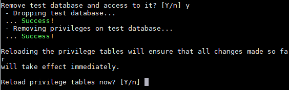
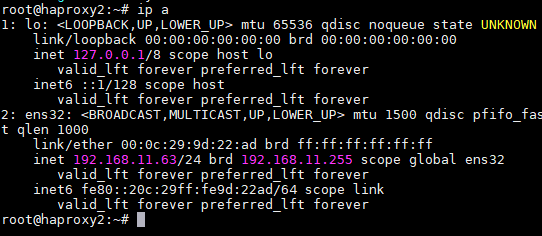

# Configuring OpenUDS 3.5 in High Availability

[Introduction 3](#introduction)

[Necessary elements 4](#necessary-elements)

[MySQL Server 4](#mysql-server)

[HAProxy Server 4](#haproxy-server)

[UDS-Server Servers 4](#uds-server-servers)

[UDS-Tunnel Servers 5](#uds-tunnel-servers)

[Deployment requirements 6](#deployment-requirements)

[MySQL Server configuration 7](#mysql-server-configuration)

[Replication configuration between servers
11](#replication-configuration-between-servers)

[Main node (Master) 11](#main-node-master-1)

[Secondary node (Slave) 12](#secondary-node-slave-1)

[Testing replication 15](#testing-replication)

[Server crash 17](#server-crash)

[Master (main node) 17](#master-main-node)

[Slave (secondary node) 19](#slave-secondary-node)

[Configuration of HAProxy servers 20](#configuration-of-haproxy-servers)

[Installing HAProxy on Linux Debian
28](#installing-haproxy-on-linux-debian)

[Configuration of the UDS and Tunnel servers
45](#configuration-of-the-uds-and-tunnel-servers)

[UDS Server configuration (UDS-Server)
45](#uds-server-configuration-uds-server)

[Tunnel servers configuration (UDS-Tunnel)
52](#tunnel-servers-configuration-uds-tunnel)

# Introduction 

OpenUDS allows the configuration of its different components in high availability (HA). This configuration mode allows the VDI environment to be given continuity in the event of a virtualization node failure or due to the failure of the O.S. itself or any of the components of the environment.

To provide the VDI environment with full high availability, in addition to configuring multiple UDS-Server and UDS-Tunnel machines, it will also be necessary to have a replication of the database to which the UDS servers connect. Another necessary element, and that you will also have to configure in high availability, will be the load balancer that manages and distributes the different connections to the UDS-Server and UDS-Tunnel components.

OpenUDS supports balancers of physical type (ex: F5) or virtual type (ex: HAProxy). Both must support TCP and HTTP modes.

In this document, through a complete configuration example, we will show all the steps to configure OpenUDS in high availability, from the UDS\'s elements (UDS-Server and UDS-Tunnel) to a software load balancer (HAProxy) and a MySQL Database.

# Necessary elements 

In this guide, we will use the necessary components for most deployments of a UDS environment in HA. They are as follows:

## MySQL Server 

The database servers (DB) that we will use will be those provided by the UDS team. All UDS logs and settings will be stored on these servers.

In this document, we'll show the configuration of two MySQL servers, one primary and one secondary (Master and Slave), in active/passive replication mode.

##### NOTE: 

Starting with version 3.0 of OpenUDS, active/active MySQL cluster configurations are supported.

The database component is one of the most important components of the VDI environment with UDS. Therefore, for production deployments, it is highly recommended to have a backup of this component, either via full machine backup, DB instance used in UDS, cluster configuration, or as will be shown in this document, an active/passive replica configuration.

## HAProxy Server 

It will be the server in charge of balancing the connections of the UDS servers and the Tunnel. Through it, user/administrator access will be made in the UDS login portal and connections to different services will be performed.

In this document, two HAProxy machines are configured, in active/passive mode.

##### NOTE: 

In the different HAProxy servers we will configure an IP address that will be active only on the main server. In the event of a crash or isolation of this server, it will be automatically activated on the other secondary HAProxy servers.

## UDS-Server Servers 

You can add all the UDS-Server machines you need and make them work in active/active mode. This will allow continuous access to the login portal for users and administrators even if you lose some of the UDS-Server machines.

In this document, two UDS-Server machines are configured, in active/active mode.

## UDS-Tunnel Servers 

You can add all the UDS-Tunnel machines you need and make them work in active/active mode. This will allow access to services (desktops or applications) through tunnelled connections and HTML5, even if you lose some of the UDS-Tunnel machines.

In this document, two UDS-Tunnel machines are configured, in active/active mode.

##### NOTE: 

If a user is connected to a service (desktop or application) and the Tunnel server through which he is connected falls, the connection will be lost. But when he reconnects, he will regain access to the service through another active Tunnel server automatically.

# Deployment requirements 

In this example of configuring OpenUDS in HA, the following resources have been used:

###### MySQL: 

-   2 MySQL servers (provided by the OpenUDS team). The minimum     requirements for each machine are: 2 vCPUs, 1 GB of vRAM and 8 GB of     disk.

-   IP data: 2 IP addresses, one for each server (Master-Slave),     Netmask, Gateway and DNS.

-   Database data: Instance, user and password (by default, instance:     uds, user: uds, password: uds).

###### HAProxy: 

-   2 machines with Linux Debian O.S. (you can use UDS-provided     preconfigured servers available in this repository:     [[http://images.udsenterprise.com/files/UDS_HA/HAProxy/3.5/OVA-3.5/]](http://images.udsenterprise.com/files/UDS_HA/HAProxy/3.5/OVA-3.5/)     with at least 2 vCPUs, 1GB vRAM, 10GB disk.

-   IP data: 3 IP addresses, one for each server (Master-Slave) and a     shared virtual IP between the two servers that will be used for     balancing), Netmask, Gateway and DNS.

-   Internet access.

-   Certificate: It is necessary to have (or generate) a valid     certificate for SSL connections in PEM format. This example shows     how to create a temporary certificate.

###### UDS-Server: 

-   2 UDS-Server machines (provided by the OpenUDS team). The     minimum requirements for each machine are: 2 vCPUs, 2 GB of vRAM and     8 GB of disk.

-   IP data: 2 IP addresses, one for each server, Netmask, Gateway and     DNS.

-   Valid subscription.

-   MySQL database connection data: IP address, instance, username and     password.

###### UDS-Tunnel: 

-   2 UDS-Tunnel machines (provided by the OpenUDS team). The     minimum requirements for each machine are: 2 vCPUs, 2 GB of vRAM and     10 GB of disk.

-   IP data: 2 IP addresses, one for each server, Netmask, Gateway and     DNS.

-   Balancing IP address of HAProxy servers.

# MySQL Server configuration 

You will validate yourself on the database servers provided by the UDS Enterprise team and use the following credentials:

-   **User:** root

-   **Password:** uds

You will configure the new DNS name of the servers with the command:

hostnamectl set-hostname ***nombre_servidor***

And you will make the IP configuration of the MySQL machines through the file:

/etc/network/interfaces

###### Main node (Master): 

Once these settings are updated in the main database node, you will restart the server to apply the changes.

###### Secondary node (Slave): 

Once these settings are updated on the secondary database node, you will restart the server to apply the changes.

#### The following configuration is not mandatory but it is recommended to perform it on both servers (Master-Slave) 

You launch the configuration script, to protect your database:

mysql_secure_installation

The installation wizard asks you to enter the current password for the root user, since to perform the process you need administrator permissions.

You'll be asked if you want to change the password of the root user. In this case you select the option: **No**

You'll be asked if you want to delete existing anonymous users. In this case you select the option: **Yes**

You'll be asked if you want to disable the login of the root user remotely. In this example you select the option: **No**

You'll be asked if you want to delete the test database. In this example you select the option:

###### Yes 

You'll be asked if you want to reload the privilege tables. In this example you will select the option: **Yes**

After completing the process on **both servers**, you will proceed to the next configuration task.

## Replication configuration between servers 

### Main node (Master) 

Edit the file: /etc/mysql/mariadb.conf.d/50-server.cnf

In the parameter: **bind-address** you indicate the IP address of the server (in this case the IP of the main server):

A few lines below, you remove the \# symbol and leave the parameters:
**server-id** and

**log_bin** as indicated in the following image:

After modifying the file and saving the changes, you restart the MySQL service to apply the changes:

Now you will create a new user for replication. For this, access the MySQL console with root permissions:

Once validated, you will execute the following statement to create the user:

CREATE USER \'replica\'@\'%\' IDENTIFIED BY \'uds\';

**"Replica**" will be the name of the new user and "**uds**" the password.

Next you will provide the "replication Slave" permission to the user:

GRANT REPLICATION SLAVE ON \*.\* TO \'replica\'@\'%\' IDENTIFIED BY \'uds\';

Finally, you will execute the following command to obtain information about the name of the binary file and its position:

SHOW MASTER STATUS\\G

You will record the file name, in this case: **mysql-bin.000001** and its position: **666**. This data will be necessary for the configuration of the secondary or Slave server.

##### NOTE: 

The data obtained may vary depending on the installation.

### Secondary node (Slave) 

You proceed to edit the same configuration file as in the main node, but instead of indicating the value **1** in the **server-id** parameter, you indicate **2.**

Edit the file: /etc/mysql/mariadb.conf.d/50-server.cnf

In the parameter: **bind-address** you indicate the IP address of the server (in this case the IP of the secondary server):

A few lines below, you remove the \# symbol and leave the parameters: **server-id** (in this case, since it is the secondary node, you must change the value to **2**) and **log_bin**, as indicated in the following image:

After modifying the file and saving the changes, you restart the MySQL service to apply the changes:

Now you will configure the parameters that the secondary server (Slave) will use to connect to the main server (Master). Access the MySQL console with root permissions:

Once validated, execute the following command to stop any operation on the server:

STOP SLAVE;

Once stopped, you will execute the following statement to configure the replica between the main server and the secondary server:

CHANGE MASTER TO MASTER_HOST=\'192.168.11.60\', MASTER_USER=\'replica\', MASTER_PASSWORD=\'uds\', MASTER_LOG_FILE=\'mysql-bin.000001\', MASTER_LOG_POS=666;

When "**192.168.11.60**" will be the IP address of the main server, "**replica**" the replication user configured in the previous steps, "**uds**" the password of the replication [user, "**myslq-**](http://www.udsenterprise.com/) **bin.000001**" the name of the binary file obtained previously from the m[ain server, and "**666**"](http://www.udsenterprise.com/) the position of the binary file.

You start operations on the server:

START SLAVE;

To confirm that the configuration introduced is correct, you execute the following command:

SHOW SLAVE STATUS\\G

Confirm that the IP address of the main server is correct and that "**Slave_IO_Running**" and  "**Slave_SQL_Running**" are in "**Yes**"

### Testing replication 

You can perform a simple test to see if the configured replication is active and correct. To do this, you will create a new database on the main server and check if it automatically replicates on the secondary server:

1.  Access the MySQL console of the main server and create a new test     database, called

"**replicatest**":

CREATE DATABASE replicatest;

2.  You list the databases to confirm the correct creation of the DDBB:

SHOW DATABASES;

3.  Access the MySQL console of the secondary server and confirm (with     the command: SHOW DATABASES;) that the database previously created     on the main server has been replicated to this server (Slave):

After verifying that the replication is working, you can now connect your UDS servers to the main server database created by default: \"**uds**\"

##### NOTE: 

To delete the database created ("replicatest") in the test process, you can run the following  command on the main server:

DROP DATABASE replicatest;

## Server crash 

If you lose one of the database servers (either due to the fall of the virtualization host that hosts it, due to the failure of the O.S. itself, etc \...), you must perform a series of tasks.

Depending on the server that you lose (Master or Slave), the tasks that you will have to perform, both for the continuity of the VDI service with UDS and to have an active replica, will be the following:

### Master (main node) 

If the main database server (Master) falls or is lost, you will **lose access** to the VDI environment. You will have to manually connect the different UDS-Server servers to the secondary database (Slave), which has all the information of the VDI environment until the moment of the fall of the main one.

To make the new connection to the database on UDS servers, we can run the configuration wizard on UDS-Server machines (it must be done on all UDS-Server servers). In the database configuration section, we will indicate the new data (the Slave server data):

Another option, perhaps faster and easier, to connect to the new database, would be to edit the configuration file on the UDS-Server machines (it must be done on [all UDS-Server](http://www.udsenterprise.com/) servers) and indicate the parameters of the new database. The configu[ration file is located in](http://www.udsenterprise.com/) the following path of the UDS-Server machine:

/var/server/server/settings.py

Once the IP address or name of the new database host has been modified, you must restart the server. You will repeat this task on all UDS-Server machines.

Once the server is restarted, you will have access to the VDI environment again.

Now it will be necessary to re-equip the system with another database replication machine. To do this, you will have several options, including:

-   Configure the current database machine as Master and generate a new     replica machine, which you will have to configure and recover a     backup with the existing data (since only the new data will be     replicated).

-   Directly make a backup of the current database machine (previously     stopping all UDS-Server machines). It will be necessary to generate     a new Master database machine, recovering the backup there and redo     the replication configuration.

##### NOTE: 

In order not to lose any data, before applying any method to rebuild the replication, it is recommended to have a backup of the database in order not to lose any data. The following command can be used to perform the backup:

mysqldump -u ***usuario*** -p***password*** \--databases
***instancia*** \

/***ruta***/***nombre_dump**.sql*

When making this backup, it is necessary that all UDS-Server machines are off. In this way, you ensure data consistency and that there is no data difference between the Master and Slave server before configuring the replica.

### Slave (secondary node) 

If the secondary database server (Slave) falls or is lost, you will **not lose access** to the VDI environment but you will have to reconfigure a Slave replica server. Before performing this configuration, it will be necessary to restore a backup with the current state of the main database since only the new replica data will be synchronized (the existing data will not be replicated in the database).

It is important that during all this process the UDS-Server machines are turned off to avoid differences between the DBs of the Master and Slave servers.

# Configuration of HAProxy servers 

This document will use the HAProxy servers provided by the UDS Enterprise team. These servers are preconfigured and it will only be necessary to modify certain data to have them fully configured.

The servers can be downloaded from the following repository:
[[https://images.udsenterprise.com/files/UDS_HA/HAProxy/3.5/OVA-3.5/]](https://images.udsenterprise.com/files/UDS_HA/HAProxy/3.5/OVA-3.5/)

Both servers are configured with the following resources: 2 vCPUs, 1 GB of VRAM, 10 GB of disk and 1 vNIC.

The servers have a created user: ***user***, with the password: ***uds***. The password of the root user is: ***uds***

Once imported into the virtualization platform, you will proceed to its configuration.

##### NOTE: 

These servers are provided in .OVA format ready to import into VMware environments. If it is necessary to import them into a different virtualization platform, you can extract (ex: Winrar) your .vmdk disk and convert (ex: qemu.img) to the format of the target platform.

It is highly recommended to modify the default password for a more secure one.

##### TASKS TO BE DONE ON THE MAIN HAPROXY SERVER

Once the machine is imported to the virtual platform and turned on, you must validate yourself with the user: ***root*** and the password: ***uds***

You will configure the new IP data by modifying the file:
/etc/network/interfaces

Confirm that you have valid DNS data and Internet access.

Restart the server to apply the new IP configuration.

First, you must execute the update commands in case there are important security patches and other components that you can apply:

apt-get update apt-get upgrade

Now you proceed to modify the data configured in the HAProxy service.
For this you will edit the file: /etc/haproxy/haproxy.cfg

Only a few parameters will be referenced in this document. It is recommended to thoroughly review the rest of the preconfigured parameters and modify them depending on the needs of each environment.

The service is preconfigured with a self-generated temporary certificate:

Frontend access rule to the UDS server in http mode. Port 80:

Frontend access rule to the UDS server in http mode (you will indicate the path of the previously generated .pem certificate). Port 443:

Frontend access rule to the Tunnel server in TCP mode on **port 1443** (tunnelled connections). In case of using a different port, it will be necessary to modify it (this port is the one that has been indicated in the Tunnel tab of transport via tunnel).

Frontend access rule to the Tunnel server in TCP mode through **port 10443** (HTML5 connections). In case of using a different port it will be necessary to modify it (this port is the one indicated in the Tunnel tab of an HTML5 transport).

Backend access rule to the UDS server. **You must indicate the IP addresses of our UDS- Server machines** (the listening ports of the UDS server are 80 or 443).

Backend access rule to the Tunnel server for tunnelled connections. **You must indicate the IP addresses of our UDS-Tunnel machines** (the Tunnel server listeni[ng port for tunnelled](http://www.udsenterprise.com/) connections is 443).

Backend access rule to the Tunnel server for HTML5 connections. **You must indicate the IP addresses of our UDS-Tunnel machines** (the Tunnel server listening port for HTML5 connections is 10443).

Finally, you will indicate the virtual IP of balancing that the main and secondary servers will have. For this, you edit the file:
/etc/keepalived/keepalived.conf

In this file, you must also confirm that the network interface is correct (it can be confirmed with the ip a command) and that the assigned \"role\" will be that of the [main server (Master):](http://www.udsenterprise.com/)

You will restart the server to apply all the changes and you will verify that the virtual IP of balancing is active:

##### NOTE: 

The balancing virtual IP address will be the one that gives us access to the UDS environment. This address will always remain active on the main server and if it falls, it will automatically be activated on the secondary server.

##### TASKS TO BE PERFORMED ON THE SECONDARY HAPROXY SERVER

The tasks to be performed will be the same as on the main server. You will indicate your IP data:

You will restart the server to apply the new IP configuration.

Run the update commands in case there are important security patches and other components that you can apply:

apt-get update apt-get upgrade

Modify the same data configured in the HAProxy service as in the main server (mainly the IP addresses of the UDS and Tunnel servers), editing the file: /etc/haproxy/haproxy.cfg

Finally, you will indicate the virtual IP of balancing that the main and secondary servers will have, editing the file:
/etc/keepalived/keepalived.conf

###### And the only noteworthy change to be made in the secondary server, in addition to confirming that the network interface is correct, will be that the \"role\" assigned to the secondary server has to be SLAVE: 

You will restart the server to apply all the changes and, in this case, you will verify that the balancing virtual IP is not active. It will only be activated in the event of [the main server](http://www.udsenterprise.com/) crash:

## Installing HAProxy on Linux Debian 

Although the HAProxy servers preconfigured and provided by the UDS Enterprise team are used in this document, their complete installation and configuration are also possible starting from a new O.S.

In this section, we will show an example of its complete installation and configuration on a Linux Debian O.S. You will use some basic resources: 2 vCPUs, 1 GB of vRAM, 8 GB of disk and 1 vNic.

The primary node configuration will be displayed. Most of the tasks will also need to be performed on the primary node, except for the generation of the certificate, which should only be generated on one of the servers. The Keepalived component configuration, in the case of the secondary server, will use SLAVE mode.

##### NOTE: 

If you have already deployed the HAProxy machines pre-configured and provided by the OpenUDS team, you can skip this section.

In this example, we will install a Linux Debian 11 O.S.

###### Step 1 

Run the installation wizard:

Select the installation language, localization, keyboard language, etc...

Indicate the hostname, domain, users and passwords.

Perform disk partitioning (using the default configuration). Indicate a source of apt packages, and install the base system.

It will not be necessary to install a desktop environment, but you will install the SSH service:

You will finish the installation of the O.S.

###### Step 2 

You will access the server and configure the IP data (if you have not done so during the O.S. installation). Confirm that the DNS servers are correct and you have Internet access:

Once the IP data is configured, you must execute the update commands in case there are important security patches and other components that you can apply:

apt-get update apt-get upgrade

###### Step 3 

If you do not have a certificate, you will generate a temporary one with [the following command](http://www.udsenterprise.com/):

openssl req -x509 -nodes -days 3650 -newkey rsa:2048 -keyout /root/ssl.key  -out /root/ssl.crt

Indicate all the requested data and we will confirm that we have the files ssl.key and ssl.crt in the specified path (/root).

Now you will join both files and create the .pem file. It will be the one that you specified in the HAProxy configuration.

To create the .pem file you will execute the following command:

cat /root/ssl.crt /root/ssl.key \/etc/ssl/private/haproxy.pem

Create the new certificate file and confirm that it is hosted on the indicated path:

##### NOTE: 

This certificate created on the primary HAProxy server will need to be copied to the same path as the secondary server.

If you are using your own certificate, it will be necessary to copy it to both servers (primary and secondary).

###### Step 4 

You perform the HAProxy service installation.

apt-get install haproxy

After installing the HAProxy service, you will edit the configuration file **haproxy.cfg**, to configure the service located in the path /etc/haproxy/

You will delete all the content of the file, adding the following text (you can download the file from the following repository: [[http://images.udsenterprise.com/files/UDS_HA/HAProxy/3.5/haproxy.cfg]](http://images.udsenterprise.com/files/UDS_HA/HAProxy/3.5/haproxy.cfg)

global

log /dev/log local0

log /dev/log local1 notice chroot /var/lib/haproxy

stats socket /run/haproxy/admin.sock mode 660 level admin stats
timeout 30s

maxconn 2048 user haproxy group haproxy daemon

\# Default SSL material locations ca-base /etc/ssl/certs

crt-base /etc/ssl/private

\# Default ciphers to use on SSL-enabled listening sockets.

\# For more information, see ciphers(1SSL). This list is from: \#
https://hynek.me/articles/hardening-your-web-servers-ssl-ciphers/

ssl-default-bind-options ssl-min-ver TLSv1.2 prefer-client-ciphers ssl-default-bind-ciphersuites

TLS_AES_128_GCM_SHA267:TLS_AES_267_GCM_SHA384:TLS_CHACHA20_POLY1305_SHA267

ssl-default-bind-ciphers ECDH+AESGCM:ECDH+CHACHA20:ECDH+AES267:ECDH+AES128:!aNULL:!SHA1:!AESCCM

\# ssl-default-server-options ssl-min-ver TLSv1.2 \# ssl-default-server-ciphersuites

TLS_AES_128_GCM_SHA267:TLS_AES_267_GCM_SHA384:TLS_CHACHA20_POLY1305_SHA267

\# ssl-default-server-ciphers ECDH+AESGCM:ECDH+CHACHA20:ECDH+AES267:ECDH+AES128:!aNULL:!SHA1:!AESCCM

tune.ssl.default-dh-param 2048

defaults

log global

mode http option httplog

option dontlognull option forwardfor retries 3

option redispatch

stats enable

stats uri /haproxystats

stats realm Strictly\\ Private stats auth stats:haproxystats

  ----------------------------------------------------------------------------------------------------------
  timeout       connect                                         5000
  ------------- --------- ------ ------------------------------ --------------------------------------------
  timeout       client                                          50000

  timeout       server                                          50000

  errorfile               400    /etc/haproxy/errors/400.http   

  errorfile               403    /etc/haproxy/errors/403.http   

  errorfile               408    /etc/haproxy/errors/408.http   

  errorfile               500    /etc/haproxy/errors/500.http   

  errorfile               502    /etc/haproxy/errors/502.http   

  errorfile               503    /etc/haproxy/errors/503.http   

  errorfile               504    /etc/haproxy/errors/504.http   
  ----------------------------------------------------------------------------------------------------------

frontend http-in

bind \*:80 mode http

http-request set-header X-Forwarded-Proto http default_backend
uds-backend

frontend https-in

bind \*:443 ssl crt /etc/ssl/private/haproxy.pem mode http

http-request set-header X-Forwarded-Proto https

default_backend uds-backend

frontend tunnel-in

bind \*:1443 mode tcp option tcplog

default_backend tunnel-backend-ssl

frontend tunnel-in-guacamole \# HTML5 bind \*:10443

mode tcp option tcplog

default_backend tunnel-backend-guacamole backend uds-backend

option http-keep-alive balance roundrobin

server udss1 192.168.11.65:80 check inter 2000 rise 2 fall 5

server udss2 192.168.11.66:80 check inter 2000 rise 2 fall 5 backend
tunnel-backend-ssl

mode tcp option tcplog

balance roundrobin

server udst1 192.168.11.67:443 check inter 2000 rise 2 fall 5

server udst2 192.168.11.68:443 check inter 2000 rise 2 fall 5

backend tunnel-backend-guacamole mode tcp

option tcplog balance source

server udstg1 192.168.11.67:10443 check inter 2000 rise 2 fall 5

server udstg2 192.168.11.68:10443 check inter 2000 rise 2 fall 5

###### Where: 

Certificate path

\# Default SSL material locations ca-base /etc/ssl/certs

crt-base /etc/ssl/private

Access to statistics:

stats enable

stats uri /haproxystats

stats realm Strictly\\ Private stats auth stats:haproxystats

Frontend access rule to the UDS server in http mode. Port 80.

frontend http-in

bind \*:80 mode http

http-request set-header x-forwarded-proto http default_backend uds-backend

Frontend access rule to the UDS server in http mode (you will indicate the path of the previously generated .pem certificate). Port 443.

frontend https-in

bind \*:443 ssl crt /etc/ssl/private/haproxy.pem mode http

http-request set-header X-Forwarded-Proto https default_backend uds-backend

Frontend access rule to the Tunnel server in TCP mode on **port 1443** (tunnelled connections). In case of using a different port, it will be necessary to modify it (this port is the one indicated in the Tunnel tab of transport via tunnel).

frontend tunnel-in

bind \*:1443 mode tcp option tcplog

default_backend tunnel-backend-ssl

Frontend access rule to the Tunnel server in TCP mode on **port 10443** [(HTML5](http://www.udsenterprise.com/) connections). In case of using a different port, it will be necessary to modify it (this port is the one indicated in the Tunnel tab of an HTML5 transport).

frontend tunnel-in-guacamole \# HTML5 bind \*:10443

mode tcp option tcplog

default_backend tunnel-backend-guacamole

Backend access rule to the UDS server. **You must indicate the IP addresses of our UDS- Server machines** (the listening ports of the UDS server are 80 or 443).

backend uds-backend

option http-keep-alive balance roundrobin

server udss1 192.168.11.65:80 check inter 2000 rise 2 fall 5

server udss2 192.168.11.66:80 check inter 2000 rise 2 fall 5

Backend access rule to the Tunnel server for tunnelled connections. **You must indicate the IP addresses of our UDS-Tunnel machines** (the Tunnel server listening port for tunnelled connections is 443).

backend tunnel-backend-ssl

mode tcp option tcplog

balance roundrobin

server udst1 192.168.11.67:443 check inter 2000 rise 2 fall 5

server udst2 192.168.11.68:443 check inter 2000 rise 2 fall 5 

Backend access rule to the Tunnel server for HTML5 connections. **You will have to indicate the IP addresses of your UDS-Tunnel machines** (the listening port of the Tunnel server for HTML5 connections is 10443).

backend tunnel-backend-guacamole mode tcp

option tcplog balance source

server udstg1 192.168.11.67:10443 check inter 2000 rise 2 fall 5

server udstg2 192.168.11.68:10443 check inter 2000 rise 2 fall 5

After configuring the file, you save it and restart the HAProxy service:

service haproxy restart

###### Step 5 

Once you have finished the installation and configuration of HAProxy, you will install Keepalive, which will provide you with a balancing virtual IP between the different HAProxy servers.

In the event of a failure of the primary HAProxy server, the rolling virtual IP will be automatically activated on the secondary server. Once the service is recovered on the main server, the virtual IP will be activated again on that server.

To perform the Keepalive installation, you will execute the following command:

apt-get install keepalived

Once installed, you will edit the /etc/sysctl.conf file and add the following line to the end of the file:

net.ipv4.ip_nonlocal_bind=1

To verify that the modification has been carried out correctly you can execute the following command:

sysctl --p

Now you must configure the Keepalived service. For this, you create the file keepalived.conf in the path /etc/keepalived/

Depending on the node that you are configuring (main or secondary), you will have to indicate a configuration:

##### FILE KEEPALIVED.CONF IN MAIN NODE

The file can be downloaded from the following repository:

[[http://images.udsenterprise.com/files/UDS_HA/HAProxy/3.5/keepalived-]](http://images.udsenterprise.com/files/UDS_HA/HAProxy/3.5/keepalived-master/keepalived.conf)
[[master/keepalived.conf]](http://images.udsenterprise.com/files/UDS_HA/HAProxy/3.5/keepalived-master/keepalived.conf)

In case it was created manually, you must indicate the following:

global_defs {

\# Keepalived process identifier lvs_id haproxy_DH

}

\# Script used to check if HAProxy is running vrrp_script
check_haproxy {

script \"killall -0 haproxy\" interval 2

weight 2

}

\# Virtual interface

\# The priority specifies the order in which the assigned [interface to take](http://www.udsenterprise.com/) over in a failover

vrrp_instance VI_01 { state MASTER interface ens33 virtual_router_id 51

priority 101

\# The virtual ip address shared between the two loadbalancers virtual_ipaddress {

192.168.11.64

}

track_script { check_haproxy

}

}

###### Where: 

You will indicate the name of the network interface of the machine (with the ip a command you can check the name of our network interface).

interface ***ens33***

You will define the role of the server (MASTER= main, SLAVE= secondary).

state ***MASTER***

You will indicate the balancing virtual IP address.

virtual_ipaddress {

***192.168.11.64***

}

##### FILE KEEPALIVED.CONF IN SECONDARY NODE

The file you can download from the following repository: The file can be [downloaded from the](http://www.udsenterprise.com/) following repository:

[[http://images.udsenterprise.com/files/UDS_HA/HAProxy/3.5/keepalived-slave/kepalived.conf]](http://images.udsenterprise.com/files/UDS_HA/HAProxy/3.5/keepalived-slave/keepalived.conf)
In case it was created manually, you must indicate the following:

global_defs {

\# Keepalived process identifier lvs_id haproxy_DH_passive

}

\# Script used to check if HAProxy is running vrrp_script check_haproxy {

script \"killall -0 haproxy\" interval 2

weight 2

}

\# Virtual interface

\# The priority specifies the order in which the assigned interface to take over in a failover

vrrp_instance VI_01 { state SLAVE interface ens33 virtual_router_id 51

priority 100

\# The virtual ip address shared between the two loadbalancers virtual_ipaddress {

192.168.11.64

}

track_script { check_haproxy

}

}

###### Where: 

You will indicate the name of the network interface of the machine (with the ip a command you can check the name of our network interface).

interface ***ens33***

You will define the role of the server (MASTER= main SLAVE= secondary).

state ***SLAVE***

You will indicate the balancing virtual IP address.

virtual_ipaddress {

***192.168.11.64***

}

Once the files are created on both servers (primary and secondary), it will be necessary to restart the keepalived service:

service keepalived restart

Verify with the ip a command that the balancing virtual IP is active on the main server:

# Configuration of the UDS and Tunnel servers 

Once the database server has been configured with its replica machine and the HAProxy servers as balancers, you will proceed to install and configure the UDS-Server and UDS- Tunnel components.

You will start with the UDS-Server component since the configuration of the UDS-Tunnel machines will require to have at least one active and configured UDS-Server machine.

## UDS Server configuration (UDS-Server) 

You will start the UDS-Server machines and proceed to their configuration.

The first task will be to assign an IP address to the server to be able to access the configuration assistant via web browser. To do this, you need to execute the command:

uds ip set *dirección_IP*/*mascara* *gateway* *hostname*

After indicating the IP data, restart the server to apply the changes

If the network where you have deployed the UDS server has a DHCP server, it will take an IP address via DHCP that will serve to access the configuration wizard:

Through a web browser, you access the indicated URL to start the UDS server configuration wizard (in this example: http://192.168.11.101:9900).

Select the language of the configuration wizard:

In the networks section, you indicate the IP data, name and domain (optional) for your UDS server:

Confirm that the data is correct. The new data will be applied (in case of accessing via a DHCP address and indicating a different address, you will automatically be redirected, in the browser, to the new IP address).

Select the keyboard language, the time zone, and optionally you can
indicate an NTP server:

Now you select the type of database: MySQL (remote) indicating the data of the **main MySQL** server:

The next task will be to activate your UDS server with a valid serial number. In this example, you will use the online activation method, which requires the UDS-Serve[r machine to have](http://www.udsenterprise.com/) Internet access:

##### NOTE: 

If the UDS servers do not have Internet access, you must perform the activation process offline (for more information on this procedure, you can consult the OpenUDS Installation, Administration and User Manual available in the [[Documentation]](https://www.udsenterprise.com/en/uds-enterprise/documentacion/) section of the udsenterprise.com website)

You will indicate the credentials of the superuser, which will have access to the UDS administration. The indicated password will also be applied to the root user of the Linux O.S. hosting the UDS service:

You can install the certificates on the UDS server. In this case, when accessing via balancer (HAProxy), it will not be necessary to install them, although if you want [the communication](http://www.udsenterprise.com/) between the UDS-Server and UDS-Tunnel components to be done via HTTPS, their configuration will be necessary.

You will restart the server to finish its configuration process.

Once the server has been restarted, you can now access the UDS environment. The access will be done via name or IP address of the data configured in the virtual [IP address of](http://www.udsenterprise.com/) balancing configured in the HAProxy server.

The first access will be done with the superuser configured in the configuration wizard:

**You will have to repeat all the steps previously detailed in the second UDS-Server machine.** Logically, the IP data and name of the second server will be different, but we must connect to the same database instance (main node) and indicate the same serial number for activation.

Both servers will work in active/active mode and if one of them falls, all login requests will be made automatically on the active node.

## Tunnel servers configuration (UDS-Tunnel) 

You will start the UDS-Tunnel machines and proceed to their configuration.

The first task will be to assign an IP address to the server in order to access the configuration assistant via web browser. To do this, you will execute the command:

uds ip set *dirección_IP*/*mascara* *gateway* *hostname*

After entering the IP data, you restart the server to apply the
changes.

If the network where you have deployed the Tunnel server has a DHCP server, it will take an IP address via DHCP that will be used to access the configuration wizard.

Through a web browser, you access the indicated URL to start the Tunnel server configuration wizard (in this example: http://192.168.11.37:9900).

Select the language of the configuration wizard:

In the networks section, you indicate the IP data, name and domain (optional) that our Tunnel server will have:

You confirm that the data is correct. The new data will be applied (in case [of accessing via a](http://www.udsenterprise.com/) DHCP address and indicating a different address, you will automatically be redirected, in the browser, to the new IP address).

You select the language of the keyboard, the time zone and optionally you can indicate an NTP server:

You will indicate the credentials of the root user of the Linux O.S. hosting the UDS-Tunnel service:

Select how the connection with the UDS server will be made and indicate its IP address. As in this case, it is configured through a balancer (HAProxy. This address will be the balancing virtual IP previously configured on the HAProxy server using the Keepalived service.

You can install the certificates on the Tunnel server so that the HTML5 connections have a valid certificate (in this example, the self-signed certificates will be left by [default).](http://www.udsenterprise.com/)

You will restart the server to finish its configuration process.

Once the server has been restarted, it will be available for use in tunnelled connections (RDP, X2Go, Spice, etc \...) and HTML5.

**You will have to repeat all the steps previously detailed in the second UDS-Tunnel machine.** Logically, the IP data and name of the second server will be different, but you must connect to the same balancing virtual IP address to provide connection access to the UDS servers.

Both servers will work in active/active mode, each user who makes a connection via tunnel will connect randomly to these servers. If one of them falls, the connections of the users who are using that server will be cut, but when making this connection again, it will access through the active Tunnel server automatically.
