# Настройка OpenUDS 3.5 в режиме высокой доступности

# Введение 

OpenUDS позволяет конфигурировать различные компоненты в режиме высокой доступности (HA). Этот режим конфигурации позволяет обеспечить непрерывность среды VDI в случае сбоя узла виртуализации или из-за сбоя самой операционной системы или любого из компонентов среды.

To provide the VDI environment with full high availability, in addition to configuring multiple UDS-Server and UDS-Tunnel machines, it will also be necessary to have a replication of the database to which the UDS servers connect. Another necessary element, and that you will also have to configure in high availability, will be the load balancer that manages and distributes the different connections to the UDS-Server and UDS-Tunnel components.

OpenUDS поддерживает балансировщики физического типа (например, F5) или виртуального типа (например, HAProxy). Оба должны поддерживать режимы TCP и HTTP.

В этом документе на примере полной конфигурации мы покажем все шаги по настройке OpenUDS в условиях высокой доступности, от элементов UDS (UDS-Server и UDS-Tunnel) до программного балансировщика нагрузки (HAProxy) и базы данных MySQL.

# Необходимые элементы 

В этом руководстве мы будем использовать необходимые компоненты для большинства развертываний среды UDS в высокой доступности. Они заключаются в следующем:

## MySQL Server 

Серверы баз данных (БД), которые мы будем использовать, будут предоставлены командой UDS. Все логи и настройки UDS будут храниться на этих серверах.

В этом документе мы покажем конфигурацию двух серверов MySQL, одного основного и одного вторичного (Master и Slave), в режиме активной/пассивной репликации.

##### ПРИМЕЧАНИЕ: 

Начиная с версии 3.0 OpenUDS, поддерживаются конфигурации кластера MySQL «активный/активный».

Компонент базы данных является одним из наиболее важных компонентов среды VDI с UDS. Поэтому для производственных развертываний настоятельно рекомендуется иметь резервную копию этого компонента либо с помощью полного резервного копирования компьютера, либо инстанса БД, используемого в UDS, конфигурации кластера, либо, как будет показано в этом документе, конфигурации активнойпассивной реплики.

## HAProxy Server 

Это будет сервер, отвечающий за балансировку соединений между UDS-серверами и туннелем. Через него будет осуществляться доступ пользователя/администратора на портале входа в UDS и будут выполняться подключения к различным сервисам.

В этом документе описаны две машины HAProxy, работающие в активном/пассивном режиме.

##### ПРИМЕЧАНИЕ: 

На разных серверах HAProxy мы настроим IP-адрес, который будет активен только на главном сервере. В случае сбоя или изоляции этого сервера, он будет автоматически активирован на других вторичных серверах HAProxy.

## Серверы UDS-Server 

Вы можете добавить все необходимые вам машины UDS-Server и заставить их работать в режиме «активный/активный». Это обеспечит постоянный доступ к порталу входа для пользователей и администраторов даже в случае потери части компьютеров UDS-Server.

В этом документе описаны две машины UDS-Server в режиме «активный-активный».

## UDS-Tunnel Servers 

Вы можете добавить все необходимые вам машины UDS-Tunnel и заставить их работать в режиме «активный/активный». Это позволит получить доступ к сервисам (рабочим столам или приложениям) через туннельные соединения и HTML5, даже если вы потеряете часть компьютеров UDS-Tunnel.

В этом документе описаны две машины UDS-Tunnel в режиме «активный/активный».

##### ПРИМЕЧАНИЕ: 

Если пользователь подключен к сервису (рабочему столу или приложению) и сервер Tunnel, через который он подключен, падает, соединение будет потеряно. Но когда он снова подключится, он автоматически восстановит доступ к сервису через другой активный сервер Tunnel.

# Требования к развертыванию 

В этом примере настройки OpenUDS в HA были использованы следующие ресурсы:

###### MySQL: 

* 2 сервера MySQL (предоставлены командой OpenUDS). Минимальные требования для каждой машины: 2 виртуальных процессора, 1 ГБ vRAM и 8 ГБ диска.
* IP-данные: 2 IP-адреса, по одному для каждого сервера (Master-Slave), Netmask, Gateway и DNS.
* Данные базы данных: экземпляр, пользователь и пароль (по умолчанию экземпляр: uds, пользователь: uds, пароль: uds).

###### HAProxy: 

* 2 машины с Linux Debian O.S. (вы можете использовать предварительно настроенные серверы, предоставленные UDS, доступные в этом репозитории: [[http://images.udsenterprise.com/files/UDS_HA/HAProxy/3.5OVA-3.5/]](http://images.udsenterprise.comfiles/UDS_HA/HAProxy/3.5/OVA-3.5) с не менее чем 2 виртуальными процессорами, 1 ГБ vRAM, 10 ГБ диска.
* IP-данные: 3 IP-адреса, по одному для каждого сервера (Master-Slave) и общий виртуальный IP-адрес между двумя серверами, которые будут использоваться для балансировки), маска сети, шлюз и DNS.
* Доступ в Интернет.
* Сертификат: Необходимо иметь (или сгенерировать) действующий сертификат для SSL-соединений в формате PEM. В этом примере показано, как создать временный сертификат.

###### UDS-сервер: 

* 2 машины UDS-Server (предоставлены командой OpenUDS). Минимальные требования для каждой машины: 2 vCPU, 2 ГБ vRAM и 8 ГБ диска.
* IP-данные: 2 IP-адреса, по одному для каждого сервера, маска сети, шлюз и DNS.
* Действующая подписка.
* Данные о подключении к базе данных MySQL: IP-адрес, инстанс, имя пользователя и пароль.

###### UDS-туннель: 

* 2 машины UDS-Tunnel (предоставлены командой OpenUDS). Минимальные требования для каждой машины: 2 vCPU, 2 ГБ vRAM и 10 ГБ диска.
* IP-данные: 2 IP-адреса, по одному для каждого сервера, маска сети, шлюз и DNS.
* Балансировка IP-адресов серверов HAProxy.

# Конфигурация MySQL Server 

Вы проверите себя на серверах баз данных, предоставленных группой UDS Enterprise, и будете использовать следующие учетные данные:

* **Пользователь:** root
* **Пароль:** uds

Вы настроите новое DNS-имя серверов с помощью команды:

hostnamectl set-hostname ***nombre_servidor***

И вы сделаете IP-конфигурацию машин MySQL через файл:

/etc/сеть/интерфейсы

###### Главный узел (Master): 

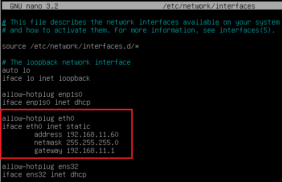

Как только эти параметры будут обновлены в главном узле базы данных, вы перезапустите сервер, чтобы изменения вступили в силу.

###### Вторичный узел (ведомый): 

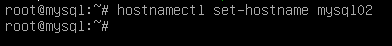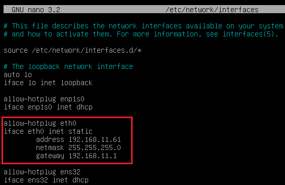

После обновления этих параметров на узле базы данных-получателя необходимо перезапустить сервер, чтобы изменения вступили в силу.

#### Следующая настройка не является обязательной, но рекомендуется выполнять ее на обоих серверах (Master-Slave) 

Вы запускаете конфигурационный сценарий, чтобы защитить свою базу данных:

mysql_secure_installation

Мастер установки попросит ввести текущий пароль для пользователя root, так как для выполнения процесса необходимы права администратора.

Вам будет предложено изменить пароль пользователя root. В этом случае вы выбираете опцию: **Нет**

Вам будет предложено удалить существующих анонимных пользователей. В этом случае вы выбираете опцию: **Да**

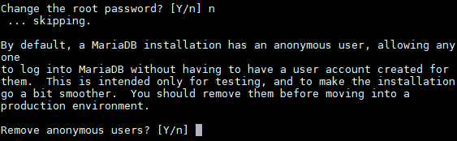

Вас спросят, хотите ли вы удаленно отключить вход пользователя root. В этом примере вы выбираете опцию: **Нет**

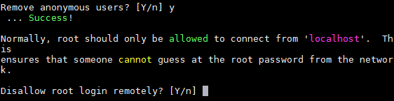

Вам будет предложено удалить тестовую базу данных. В этом примере вы выбираете один из следующих вариантов:

###### Да 

Вам будет предложено перезагрузить таблицы привилегий. В этом примере вы выберете опцию: **Да**

После завершения процесса на **обоих серверах** вы перейдете к следующей задаче настройки.

## Конфигурация репликации между серверами 

### Главный узел (Master) 

Отредактируйте файл: /etc/mysql/mariadb.conf.d/50-server.cnf

В параметре: **bind-address** указывается IP-адрес сервера (в данном случае IP главного сервера):

Несколькими строками ниже вы удаляете символ # и оставляете параметры:
**server-id** и

**log_bin**, как показано на следующем рисунке:

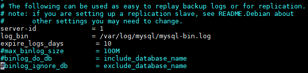

После изменения файла и сохранения изменений вы перезапускаете службу MySQL, чтобы изменения вступили в силу:

Теперь вы создадите нового пользователя для репликации. Для этого войдите в консоль MySQL с правами root:

После проверки вы выполните следующую инструкцию для создания пользователя:

CREATE USER 'replica'@'%' ИДЕНТИФИЦИРОВАН ПО 'uds';

**"Replica**" будет именем нового пользователя, а "**uds**" - паролем.

Далее вы предоставите пользователю разрешение "replication Slave":

GRANT REPLICATION SLAVE ON *.* TO 'replica'@'%' IDENTIFIED BY 'uds';

Наконец, вы выполните следующую команду, чтобы получить информацию об имени двоичного файла и его позиции:

ПОКАЗАТЬ СТАТУС МАСТЕРАG

Вы запишете имя файла, в данном случае: **mysql-bin.000001** и его позицию: **666**. Эти данные понадобятся для настройки вторичного или ведомого сервера.

##### ПРИМЕЧАНИЕ: 

Полученные данные могут отличаться в зависимости от установки.

### Вторичный узел (Slave) 

Вы переходите к редактированию того же конфигурационного файла, что и в главном узле, но вместо значения **1** в параметре **server-id** вы указываете **2.**

Отредактируйте файл: /etc/mysql/mariadb.conf.d/50-server.cnf

В параметре: **bind-address** указывается IP-адрес сервера (в данном случае IP вторичного сервера):

Несколькими строками ниже вы удаляете символ # и оставляете параметры: **server-id** (в данном случае, поскольку это вторичный узел, вы должны изменить значение на **2**) и **log_bin**, как показано на следующем рисунке:

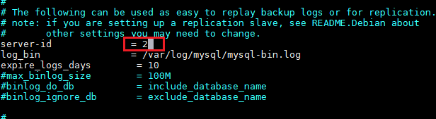

После изменения файла и сохранения изменений вы перезапускаете службу MySQL, чтобы изменения вступили в силу:

Теперь вы настроите параметры, которые вторичный сервер (Slave) будет использовать для подключения к главному серверу (Master). Войдите в консоль MySQL с правами root:

После проверки выполните следующую команду, чтобы остановить любую операцию на сервере:

СТОП РАБ;

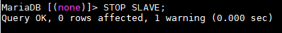

После остановки вы выполните следующую инструкцию для настройки реплики между главным и вторичным серверами:

ИЗМЕНИТЕ MASTER НА MASTER_HOST='192.168.11.60', MASTER_USER='replica', MASTER_PASSWORD='uds', MASTER_LOG_FILE='mysql-bin.000001', MASTER_LOG_POS=666;

Когда "**192.168.11.60**" будет IP-адресом главного сервера, "**replica**" - пользователем репликации, настроенным на предыдущих шагах, "**uds**" - паролем репликации [user, "**myslq-**](http:/www.udsenterprise.com/) **bin.000001**" - именем двоичного файла, полученного ранее от сервера m[ain", а "**666**"](http:/www.udsenterprise.com) - позицией двоичного файла.

Вы начинаете работу на сервере:

ЗАПУСК ВЕДОМОГО;

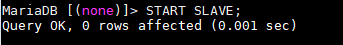

Чтобы убедиться в правильности введенной конфигурации, выполните следующую команду:

ПОКАЗАТЬ СТАТУС ВЕДОМОГО УСТРОЙСТВАG

Убедитесь, что IP-адрес главного сервера указан верно и что "**Slave_IO_Running**" и "**Slave_SQL_Running**" находятся в поле "**Yes**"

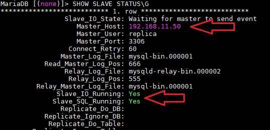

### Тестирование репликации 

Вы можете выполнить простой тест, чтобы проверить, активна ли и правильно ли настроена репликация. Для этого вы создадите новую базу данных на главном сервере и проверите, реплицируется ли она автоматически на вторичном сервере:

1. Войдите в консоль MySQL главного сервера и создайте новую тестовую базу данных, которая называется

"**replicatest**":

CREATE DATABASE replicatest;

2. Вы перечисляете базы данных для подтверждения правильности создания DDBB:

ПОКАЗЫВАТЬ БАЗЫ ДАННЫХ;

3. Зайдите в консоль MySQL вторичного сервера и подтвердите (командой: SHOW DATABASES;), что база данных, ранее созданная на главном сервере, была реплицирована на этот сервер (Slave):

Убедившись, что репликация работает, теперь можно подключать UDS-серверы к основной базе данных сервера, созданной по умолчанию: "**uds**"

##### ПРИМЕЧАНИЕ: 

Чтобы удалить базу данных, созданную ("replicatest") в процессе тестирования, вы можете выполнить следующую команду на главном сервере:

DROP DATABASE replicatest;

## Падение сервера 

Если вы потеряли один из серверов баз данных (либо из-за падения узла виртуализации, на котором он размещен, либо из-за сбоя самой операционной системы и т. д.), вы должны выполнить ряд задач.

В зависимости от того, какой сервер вы потеряете (Master или Slave), задачи, которые вам придется выполнить, как для обеспечения непрерывности службы VDI с UDS, так и для наличия активной реплики, будут следующими:

### Мастер (главный узел) 

Если главный сервер базы данных (Master) выйдет из строя или будет потерян, вы потеряете доступ к среде VDI. Вам придется вручную подключать различные серверы UDS-Server к базе данных-вторичной базе данных (Slave), которая имеет всю информацию среды VDI до момента падения основной.

Для того, чтобы установить новое подключение к базе данных на UDS-серверах, мы можем запустить мастер настройки на машинах UDS-Server (это необходимо сделать на всех серверах UDS-Server). В разделе конфигурации базы данных укажем новые данные (данные Slave сервера):

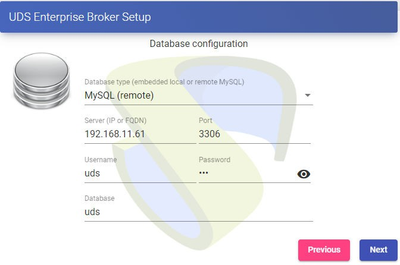

Другим вариантом, возможно, более быстрым и простым, для подключения к новой базе данных, будет редактирование конфигурационного файла на машинах UDS-Server (это необходимо сделать на [всех серверах UDS-Server](http://www.udsenterprise.com)) и указание параметров новой базы данных. Файл configu[ration находится в](http:/www.udsenterprise.com) следующем пути машины UDS-Server:

/var/server/server/settings.py

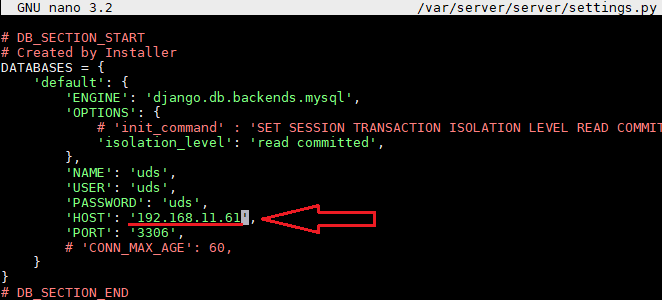

После изменения IP-адреса или имени нового узла базы данных необходимо перезапустить сервер. Вы повторите эту задачу на всех компьютерах UDS-Server.

После перезапуска сервера вы снова получите доступ к среде VDI.

Теперь необходимо будет переоборудовать систему еще одной машиной репликации баз данных. Для этого у вас будет несколько вариантов, среди которых:

* Сконфигурируйте текущую машину с базой данных как Мастер и сгенерируйте новую машину-реплику, которую вам нужно будет настроить и восстановить резервную копию с существующими данными (так как будут реплицироваться только новые данные).
* Непосредственно сделать резервную копию текущей машины базы данных (предварительно остановив все машины UDS-Server). Необходимо будет сгенерировать новую машину с базой данных Master, восстановить там резервную копию и переделать настройку репликации.

##### ПРИМЕЧАНИЕ: 

Чтобы не потерять данные, перед применением любого метода для восстановления репликации рекомендуется иметь резервную копию базы данных, чтобы не потерять данные. Для выполнения резервного копирования можно использовать следующую команду:

mysqldump -u ***usuario*** -p***password*** --databases
instancia***

/***рута**_/_**nombre_dump**.sql*

При создании этой резервной копии необходимо, чтобы все машины UDS-Server были выключены. Таким образом, вы обеспечиваете согласованность данных и отсутствие разницы в данных между ведущим и подчиненным серверами перед настройкой реплики.

### Slave (вторичный узел) 

Если сервер-получатель базы данных (ведомый) выйдет из строя или будет потерян, вы не потеряете доступ к среде VDI, но вам придется перенастроить подчиненный сервер-реплику. Перед выполнением этой настройки необходимо будет восстановить резервную копию с текущим состоянием основной базы данных, так как будут синхронизированы только новые данные реплики (существующие данные не будут реплицироваться в базе данных).

Важно, чтобы во время всего этого процесса машины UDS-Server были выключены, чтобы избежать различий между БД Ведущего и Ведомого серверов.

# Конфигурация серверов HAProxy 

В этом документе будут использоваться серверы HAProxy, предоставленные группой UDS Enterprise. Эти серверы предварительно настроены, и для их полной настройки потребуется только изменить определенные данные.

Серверы можно скачать из следующего репозитория:
[[https://images.udsenterprise.com/files/UDS_HA/HAProxy/3.5/OVA-3.5/]] (https://images.udsenterprise.comfiles/UDS_HA/HAProxy/3.5OVA-3.5/)

Оба сервера настроены со следующими ресурсами: 2 виртуальных процессора, 1 ГБ видеопамяти, 10 ГБ диска и 1 виртуальная сетевая карта.

На серверах создан пользователь: ***user**_, с паролем: _**uds**_. Пароль пользователя root: _**uds***

После импорта в платформу виртуализации вы перейдете к ее настройке.

##### ПРИМЕЧАНИЕ: 

Эти серверы предоставляются в формате . Формат OVA, готовый к импорту в среды VMware. Если необходимо импортировать их на другую платформу виртуализации, вы можете извлечь (например, Winrar) ваш диск .vmdk и преобразовать (например, qemu.img) в формат целевой платформы.

Настоятельно рекомендуется изменить пароль по умолчанию на более безопасный.

##### ЗАДАЧИ, КОТОРЫЕ НЕОБХОДИМО ВЫПОЛНИТЬ НА ГЛАВНОМ СЕРВЕРЕ HAPROXY

После того, как машина будет импортирована на виртуальную платформу и включена, вы должны подтвердить себя с помощью пользователя: ***root*** и пароля: ***uds***

Вы настроите новые IP-данные, изменив файл:
/etc/сеть/интерфейсы

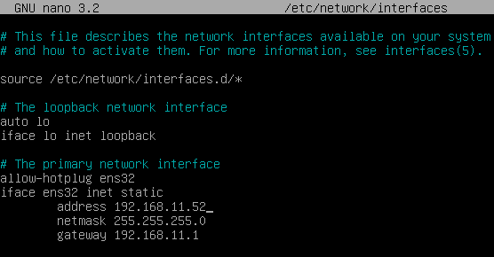

Убедитесь, что у вас есть действительные данные DNS и доступ к Интернету.

Перезапустите сервер, чтобы применить новую конфигурацию IP-адреса.

Во-первых, вы должны выполнить команды update в случае, если есть важные исправления безопасности и другие компоненты, которые вы можете применить:

apt-get update apt-get upgrade

Теперь перейдем к изменению данных, настроенных в службе HAProxy.
Для этого вам нужно отредактировать файл: /etc/haproxy/haproxy.cfg

В этом документе будут приведены ссылки только на некоторые параметры. Рекомендуется тщательно изучить остальные предварительно настроенные параметры и модифицировать их в зависимости от потребностей каждой среды.

Сервис предварительно настроен с помощью самостоятельно сгенерированного временного сертификата:

Правило фронтенд-доступа к UDS-серверу в http-режиме. Порт 80:

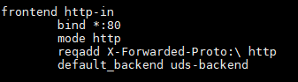

Правило доступа фронтенда к UDS-серверу в режиме http (вы укажете путь к ранее сгенерированному .pem сертификату). Порт 443:

Правило фронтенд-доступа к Туннельному серверу в режиме TCP на **порт 1443** (туннельные соединения). В случае использования другого порта, его необходимо будет модифицировать (это тот порт, который был указан во вкладке Туннель транспорта через туннель).

Правило доступа фронтенда к серверу Tunnel в режиме TCP через **порт 10443** (HTML5 соединения). В случае использования другого порта, его необходимо будет модифицировать (этот порт указан во вкладке Tunnel HTML5-транспорта).

Внутреннее правило доступа к UDS-серверу. **Вы должны указать IP-адреса наших машин UDS-сервера** (порты прослушивания UDS-сервера 80 или 443).

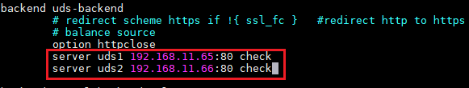

Внутреннее правило доступа к серверу Tunnel для туннельных подключений. **Вы должны указать IP-адреса наших машин UDS-Tunnel** (порт прослушивания сервера Tunneli[ng для туннельных](http://www.udsenterprise.com) соединений - 443).

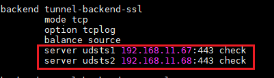

Правило доступа к серверу Tunnel для подключений HTML5. **Вы должны указать IP-адреса наших машин UDS-Tunnel** (порт прослушивания сервера Tunnel для соединений HTML5 - 10443).

Наконец, вы укажете виртуальный IP балансировки, который будет у главного и вторичного серверов. Для этого необходимо отредактировать файл:
/etc/keepalived/keepalived.conf

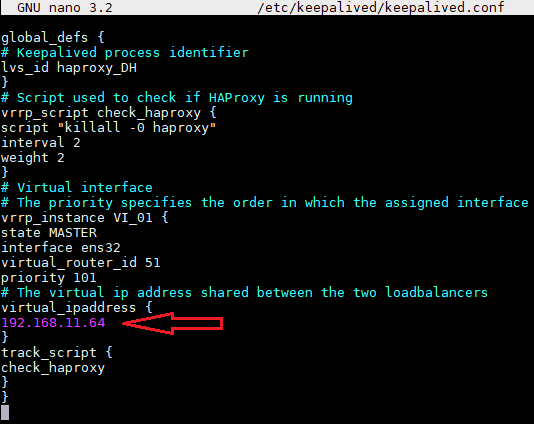

В этом файле вы также должны подтвердить, что сетевой интерфейс корректен (это можно подтвердить командой ip a) и что назначенная "роль" будет ролью [главного сервера (Master):](http:/www.udsenterprise.com/)

Вы перезапустите сервер, чтобы применить все изменения, и убедитесь, что виртуальный IP-адрес балансировки активен:

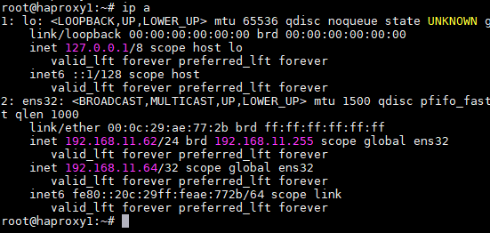

##### ПРИМЕЧАНИЕ: 

Балансирующий виртуальный IP-адрес будет тем, который дает нам доступ к среде UDS. Этот адрес всегда будет оставаться активным на главном сервере, и если он выпадет, он будет автоматически активирован на вторичном сервере.

##### ЗАДАЧ, ВЫПОЛНЯЕМЫХ НА ДОПОЛНИТЕЛЬНОМ СЕРВЕРЕ HAPROXY

Задачи, которые необходимо выполнить, будут такими же, как и на основном сервере. Вы укажете свои IP-данные:

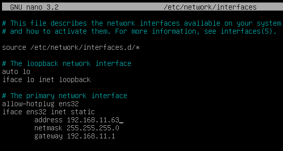

Вы перезапустите сервер, чтобы применить новую конфигурацию IP-адресов.

Выполните команды обновления, если есть важные исправления безопасности и другие компоненты, которые вы можете применить:

apt-get update apt-get upgrade

Измените те же данные, настроенные в сервисе HAProxy, что и на главном сервере (в основном IP-адреса серверов UDS и Tunnel), отредактировав файл: /etc/haproxy/haproxy.cfg

Наконец, вы укажете виртуальный IP балансировки, который будет у главного и вторичного серверов, отредактировав файл:
/etc/keepalived/keepalived.conf

###### И единственное заслуживающее внимания изменение, которое должно быть сделано на вторичном сервере, в дополнение к подтверждению правильности сетевого интерфейса, будет заключаться в том, что "роль", назначенная вторичному серверу, должна быть SLAVE: 

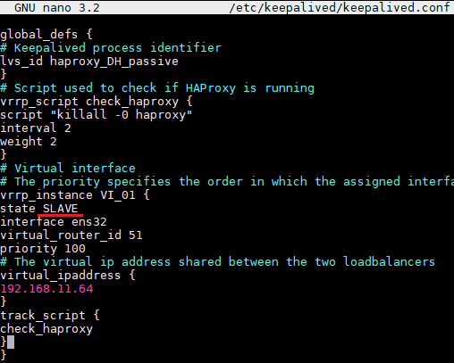

Вы перезапустите сервер, чтобы применить все изменения, и в этом случае убедитесь, что балансирующий виртуальный IP-адрес не активен. Он будет активирован только в случае сбоя [основного сервера](http://www.udsenterprise.com):

## Установка HAProxy в Linux Debian 

Несмотря на то, что в этом документе используются серверы HAProxy, предварительно настроенные и предоставленные командой UDS Enterprise, их полная установка и настройка также возможны, начиная с новой операционной системы.

В этом разделе мы покажем пример его полной установки и настройки на Linux Debian O.S. Вы будете использовать некоторые основные ресурсы: 2 виртуальных процессора, 1 ГБ виртуальной памяти, 8 ГБ диска и 1 виртуальный сетевой адаптер.

Отобразится конфигурация первичного узла. Большинство задач также нужно будет выполнять на первичном узле, за исключением генерации сертификата, который должен быть сгенерирован только на одном из серверов. Конфигурация компонента Keepalived, в случае вторичного сервера, будет использовать режим SLAVE.

##### ПРИМЕЧАНИЕ: 

Если вы уже развернули компьютеры HAProxy, предварительно настроенные и предоставленные группой OpenUDS, вы можете пропустить этот раздел.

В этом примере мы установим Linux Debian 11 O.S.

###### Шаг 1 

Запустите мастер установки:

Выберите язык установки, локализацию, язык клавиатуры и т.д.

Укажите имя хоста, домен, пользователей и пароли.

Выполните разбиение диска на разделы (используя конфигурацию по умолчанию). Укажите источник apt-пакетов и установите базовую систему.

Устанавливать окружение рабочего стола не нужно, но вы установите службу SSH:

Вы закончите установку ОС.

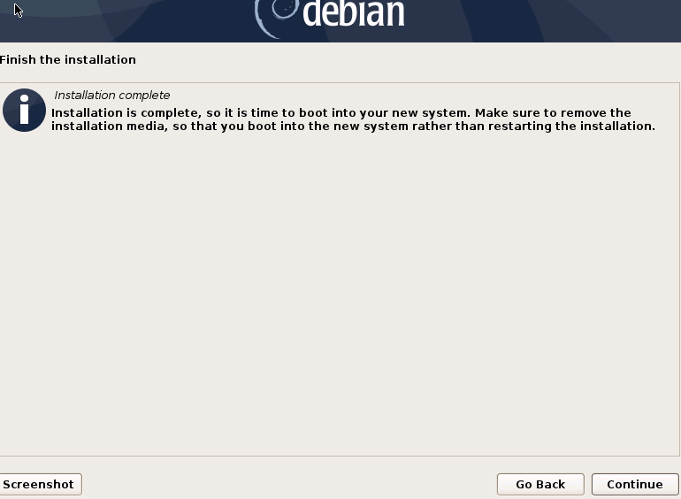

###### Шаг 2 

Вы получите доступ к серверу и настроите IP-данные (если вы не сделали этого во время установки ОС). Убедитесь, что DNS-серверы установлены правильно и у вас есть доступ в Интернет:

После настройки IP-данных необходимо выполнить команды обновления на случай, если есть важные исправления безопасности и другие компоненты, которые можно применить:

apt-get update apt-get upgrade

###### Шаг 3 

Если у вас нет сертификата, вы сгенерируете временный сертификат с помощью [следующей команды](http://www.udsenterprise.com/):

openssl req -x509 -nodes -days 3650 -newkey rsa:2048 -keyout /root/ssl.key -out /root/ssl.crt

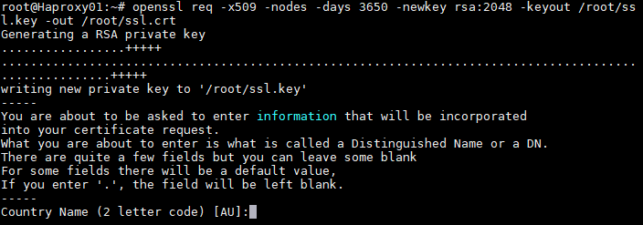

Укажите все запрашиваемые данные и мы подтвердим, что у нас есть файлы ssl.key и ssl.crt по указанному пути (/root).

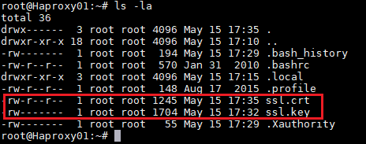

Теперь вы соедините оба файла и создадите файл .pem. Это будет тот, который вы указали в конфигурации HAProxy.

Чтобы создать файл .pem, выполните следующую команду:

cat /root/ssl.crt /root/ssl.key /etc/ssl/private/haproxy.pem

Создайте новый файл сертификата и убедитесь, что он размещен по указанному пути:

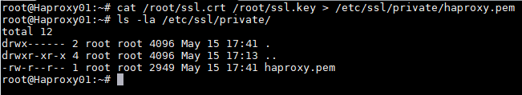

##### ПРИМЕЧАНИЕ: 

Этот сертификат, созданный на первичном сервере HAProxy, необходимо скопировать по тому же пути, что и на сервере-получателе.

Если вы используете свой собственный сертификат, необходимо будет скопировать его на оба сервера (основной и вторичный).

###### Шаг 4 

Вы выполняете установку службы HAProxy.

apt-get install haproxy

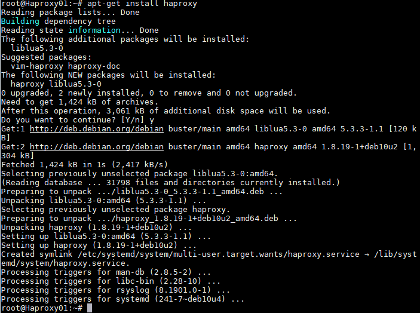

После установки службы HAProxy вы отредактируете конфигурационный файл **haproxy.cfg**, чтобы настроить службу, расположенную по пути /etc/haproxy/

Вы удалите все содержимое файла, добавив следующий текст (вы можете скачать файл из следующего репозитория: [[http://images.udsenterprise.com/files/UDS_HA/HAProxy/3.5haproxy.cfg]](http:/images.udsenterprise.comfiles/UDS_HA/HAProxy/3.5/haproxy.cfg)

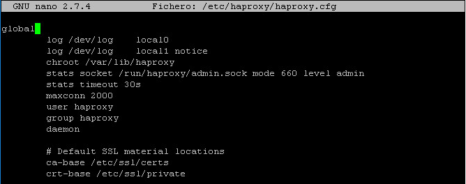

глобальный

log /dev/log local0

log /dev/log local1 notice chroot /var/lib/haproxy

stats socket /run/haproxy/admin.sock mode 660 уровень admin stats
Тайм-аут 30с

maxconn 2048 пользователь haproxy group haproxy демон

# Расположение материалов SSL по умолчанию ca-base /etc/ssl/certs

crt-база /etc/ssl/private

# Шифры по умолчанию для использования на SSL-совместимых сокетах прослушивания.

# Для получения дополнительной информации смотрите ciphers(1SSL). Этот список из: #
https://hynek.me/articles/hardening-your-web-servers-ssl-ciphers/

ssl-default-bind-options ssl-min-ver TLSv1.2 prefer-client-ciphers ssl-default-bind-ciphersuites

TLS_AES_128_GCM_SHA267:TLS_AES_267_GCM_SHA384:TLS_CHACHA20_POLY1305_SHA267

ssl-default-bind-ciphers ECDH+AESGCM:ECDH+CHACHA20:ECDH+AES267:ECDH+AES128:!aNULL:! SHA1:! АЭСКСМ

# ssl-default-server-options ssl-min-ver TLSv1.2 # ssl-default-server-ciphersuites

TLS_AES_128_GCM_SHA267:TLS_AES_267_GCM_SHA384:TLS_CHACHA20_POLY1305_SHA267

# ssl-default-server-ciphers ECDH+AESGCM:ECDH+CHACHA20:ECDH+AES267:ECDH+AES128:!aNULL:! SHA1:! АЭСКСМ

tune.ssl.default-dh-param 2048

По умолчанию

Глобальный журнал

mode http option httplog

опция dontlognull опция forwardдля повторных попыток 3

Опция пересылки

Включить статистику

stats uri /haproxystats

stats realm Строго Приватная статистика auth stats:haproxystats

---

тайм-аут подключение 5000

---

Тайм-аут клиента 50000

Сервер тайм-аута 50000

errorfile 400 /etc/haproxy/errors/400.http

errorfile 403 /etc/haproxy/errors/403.http

errorfile 408 /etc/haproxy/errors/408.http

errorfile 500 /etc/haproxy/errors/500.http

errorfile 502 /etc/haproxy/errors/502.http

errorfile 503 /etc/haproxy/errors/503.http

## errorfile 504 /etc/haproxy/errors/504.http

Веб-интерфейс http-in

привязка *:80 режим http

http-request set-header X-Forwarded-Proto http default_backend
uds-бэкенд

Веб-интерфейс https-in

bind *:443 ssl crt /etc/ssl/private/haproxy.pem mode http

http-запрос set-header X-Forwarded-Proto https

default_backend uds-backend

Фронтенд-туннельный вход

привязка *:1443 режим tcp опция tcplog

default_backend tunnel-backend-ssl

frontend tunnel-in-guacamole # привязка HTML5 *:10443

Режим TCP Опция TCPlog

default_backend tunnel-backend-guacamole backend uds-backend

опция http-keep-alive balance roundrobin

Сервер udss1 192.168.11.65:80 Проверка Inter 2000 Rise 2 Fall 5

сервер udss2 192.168.11.66:80 check inter 2000 rise 2 fall 5 backend
туннель-бэкенд-ssl

Режим TCP Опция TCPlog

Баланс Roundrobin

Сервер udst1 192.168.11.67:443 Check Inter 2000 Rise 2 Fall 5

Сервер udst2 192.168.11.68:443 Check Inter 2000 Rise 2 Fall 5

backend tunnel-backend-guacamole mode tcp

Опция tcplog источник баланса

Сервер udstg1 192.168.11.67:10443 Check Inter 2000 Rise 2 Fall 5

Сервер udstg2 192.168.11.68:10443 Проверка Inter 2000 Rise 2 Fall 5

###### Где: 

Путь к сертификату

# Расположение материалов SSL по умолчанию ca-base /etc/ssl/certs

crt-база /etc/ssl/private

Доступ к статистике:

Включить статистику

stats uri /haproxystats

stats realm Строго Приватная статистика auth stats:haproxystats

Правило фронтенд-доступа к UDS-серверу в http-режиме. Порт 80.

Веб-интерфейс http-in

привязка *:80 режим http

http-request set-header x-forwarded-proto http default_backend uds-backend

Правило доступа фронтенда к UDS-серверу в режиме http (вы укажете путь к ранее сгенерированному .pem сертификату). Порт 443.

Веб-интерфейс https-in

привязка *:443 ssl crt /etc/ssl/private/haproxy.pem mode http

http-request set-header X-Forwarded-Proto https default_backend uds-backend

Правило фронтенд-доступа к Туннельному серверу в режиме TCP на **порт 1443** (туннельные соединения). В случае использования другого порта, его необходимо будет модифицировать (этот порт указан во вкладке Туннель транспорта через туннель).

Фронтенд-туннельный вход

привязка *:1443 режим tcp опция tcplog

default_backend tunnel-backend-ssl

Правило фронтенд-доступа к серверу Tunnel в режиме TCP на **порт 10443** [(HTML5](http://www.udsenterprise.com/) соединения). В случае использования другого порта, его необходимо будет модифицировать (этот порт указан во вкладке Tunnel HTML5-транспорта).

frontend tunnel-in-guacamole # привязка HTML5 *:10443

Режим TCP Опция TCPlog

default_backend туннель-бэкенд-гуакамоле

Внутреннее правило доступа к UDS-серверу. **Вы должны указать IP-адреса наших машин UDS-сервера** (порты прослушивания UDS-сервера 80 или 443).

Бэкенд uds-backend

опция http-keep-alive balance roundrobin

Сервер udss1 192.168.11.65:80 Проверка Inter 2000 Rise 2 Fall 5

Сервер udss2 192.168.11.66:80 Check Inter 2000 Rise 2 Fall 5

Внутреннее правило доступа к серверу Tunnel для туннельных подключений. **Вы должны указать IP-адреса наших машин UDS-Tunnel** (порт прослушивания туннельного сервера для туннельных соединений - 443).

backend tunnel-backend-ssl

Режим TCP Опция TCPlog

Баланс Roundrobin

Сервер udst1 192.168.11.67:443 Check Inter 2000 Rise 2 Fall 5

Сервер udst2 192.168.11.68:443 Check Inter 2000 Rise 2 Fall 5

Правило доступа к серверу Tunnel для подключений HTML5. **Вам нужно будет указать IP-адреса ваших машин UDS-Tunnel** (порт прослушивания сервера Tunnel для HTML5-соединений - 10443).

backend tunnel-backend-guacamole mode tcp

Опция tcplog источник баланса

Сервер udstg1 192.168.11.67:10443 Check Inter 2000 Rise 2 Fall 5

Сервер udstg2 192.168.11.68:10443 Проверка Inter 2000 Rise 2 Fall 5

После настройки файла вы сохраняете его и перезапускаете сервис HAProxy:

Перезапуск сервиса Haproxy

###### Шаг 5 

После того, как вы закончите установку и настройку HAProxy, вы установите Keepalive, который предоставит вам балансировку виртуального IP-адреса между различными серверами HAProxy.

В случае сбоя основного сервера HAProxy на дополнительном сервере будет автоматически активирован скользящий виртуальный IP-адрес. Как только служба будет восстановлена на главном сервере, виртуальный IP-адрес будет снова активирован на этом сервере.

Чтобы выполнить установку Keepalive, выполните следующую команду:

apt-get install keepalived

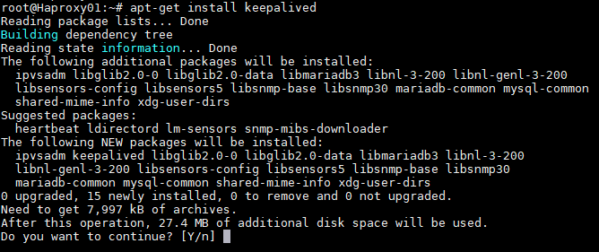

После установки вы отредактируете файл /etc/sysctl.conf и добавите следующую строку в конец файла:

net.ipv4.ip_nonlocal_bind=1

Чтобы убедиться в том, что модификация была выполнена правильно, можно выполнить следующую команду:

sysctl --p

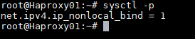

Теперь необходимо настроить сервис Keepalived. Для этого создайте файл keepalived.conf по пути /etc/keepalived/

В зависимости от узла, который вы настраиваете (главный или дополнительный), вам нужно будет указать конфигурацию:

##### ФАЙЛ KEEPALIVED. CONF В ГЛАВНОМ УЗЛЕ

Файл можно скачать из следующего репозитория:

[[http://images.udsenterprise.com/files/UDS_HA/HAProxy/3.5/keepalived-]] (http://images.udsenterprise.com/files/UDS_HA/HAProxy/3.5/keepalived-master/keepalived.conf)
[[masterkeepalived.conf]] (http:/images.udsenterprise.comfiles/UDS_HA/HAProxy/3.5/keepalived-masterkeepalived.conf)

В случае, если он был создан вручную, необходимо указать следующее:

global_defs {

# Идентификатор процесса Keepalived lvs_id haproxy_DH

}

# Скрипт, используемый для проверки того, запущен ли HAProxy vrrp_script
check_haproxy {

Скрипт "killall -0 haproxy" интервал 2

Вес 2

}

# Виртуальный интерфейс

# Приоритет определяет порядок, в котором назначенный [интерфейс для захвата](http://www.udsenterprise.com/) при отработке отказа

vrrp_instance VI_01 { state MASTER interface ens33 virtual_router_id 51

Приоритет 101

# Виртуальный ip-адрес, общий для двух балансировщиков нагрузки virtual_ipaddress {

192.168.11.64

}

track_script { check_haproxy

}

}

###### Где: 

Вы укажете имя сетевого интерфейса машины (с помощью команды ip a вы можете проверить имя нашего сетевого интерфейса).

Интерфейс ***ens33***

Вы определите роль сервера (MASTER= main, SLAVE= secondary).

состояние ***МАСТЕР***

Вы укажете балансирующий виртуальный IP-адрес.

virtual_ipaddress {

192.168.11.64***

}

##### ФАЙЛ KEEPALIVED. CONF ВО ВТОРИЧНОМ УЗЛЕ

Файл можно скачать из следующего репозитория: Файл может быть [загружен из](http://www.udsenterprise.com/) следующего репозитория:

[[http://images.udsenterprise.com/files/UDS_HA/HAProxy/3.5/keepalived-slave/kepalived.conf]] (http://images.udsenterprise.com/files/UDS_HA/HAProxy/3.5keepalived-slave/keepalived.conf)
В случае, если он был создан вручную, необходимо указать следующее:

global_defs {

# Идентификатор процесса Keepalived lvs_id haproxy_DH_passive

}

# Скрипт, используемый для проверки того, запущен ли HAProxy vrrp_script check_haproxy {

Скрипт "killall -0 haproxy" интервал 2

Вес 2

}

# Виртуальный интерфейс

# Приоритет определяет порядок, в котором назначенный интерфейс должен взять на себя управление при отработке отказа

vrrp_instance VI_01 { состояние SLAVE интерфейса ens33 virtual_router_id 51

Приоритет 100

# Виртуальный ip-адрес, общий для двух балансировщиков нагрузки virtual_ipaddress {

192.168.11.64

}

track_script { check_haproxy

}

}

###### Где: 

Вы укажете имя сетевого интерфейса машины (с помощью команды ip a вы можете проверить имя нашего сетевого интерфейса).

Интерфейс ***ens33***

Вы определите роль сервера (MASTER= main, SLAVE= secondary).

состояние ***РАБ***

Вы укажете балансирующий виртуальный IP-адрес.

virtual_ipaddress {

192.168.11.64***

}

После того, как файлы будут созданы на обоих серверах (основном и дополнительном), необходимо будет перезапустить сервис keepalived:

Перезапуск сервиса keepalived

Проверьте с помощью команды ip, что балансирующий виртуальный IP-адрес активен на главном сервере:

# Конфигурация серверов UDS и Tunnel 

После того, как сервер базы данных будет сконфигурирован с его репликой и серверами HAProxy в качестве балансировщиков, вы перейдете к установке и настройке компонентов UDS-Server и UDS-Tunnel.

Вы начнете с компонента UDS-Server, так как конфигурация машин UDS-Tunnel потребует наличия хотя бы одной активной и настроенной машины UDS-Server.

## Конфигурация UDS-сервера (UDS-Server) 

Вы запустите машины UDS-Server и приступите к их настройке.

Первой задачей будет присвоение IP-адреса серверу, чтобы иметь возможность доступа к помощнику по настройке через веб-браузер. Для этого нужно выполнить команду:

Набор IP-адресов UDS _dirección_IP_/_mascara_ _gateway_ _hostname_

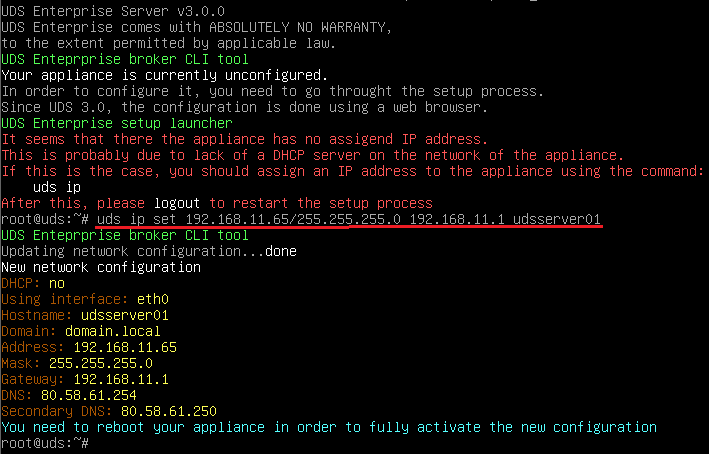

После указания IP-данных перезапустите сервер, чтобы изменения вступили в силу

Если в сети, в которой вы развернули UDS-сервер, есть DHCP-сервер, он возьмет IP-адрес через DHCP, который будет служить для доступа к мастеру настройки:

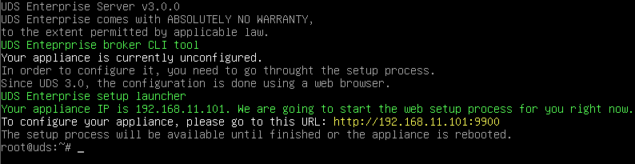

Через веб-браузер вы получаете доступ к указанному URL-адресу, чтобы запустить мастер настройки UDS-сервера (в данном примере: http://192.168.11.101:9900).

Выберите язык мастера настройки:

В разделе networks вы указываете IP-данные, имя и домен (опционально) для вашего UDS-сервера:

Убедитесь, что данные верны. Новые данные будут применены (в случае доступа через DHCP-адрес и указания другого адреса, вы будете автоматически перенаправлены в браузере на новый IP-адрес).

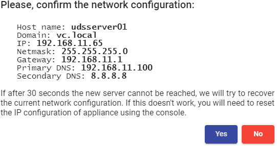

Выберите язык клавиатуры, часовой пояс и, при желании, вы можете
укажите NTP-сервер:

Теперь вы выбираете тип базы данных: MySQL (удаленная) с указанием данных **основного сервера MySQL**:

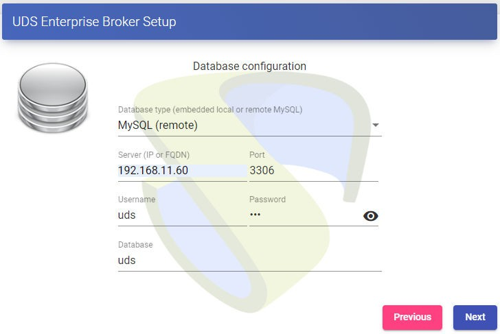

Следующей задачей будет активация вашего UDS-сервера с действительным серийным номером. В этом примере вы будете использовать метод онлайн-активации, который требует, чтобы машина UDS-Serve[r имела](http:/www.udsenterprise.com/) доступ в Интернет:

##### ПРИМЕЧАНИЕ: 

Если UDS-серверы не имеют доступа к Интернету, необходимо выполнить процесс активации в автономном режиме (для получения дополнительной информации об этой процедуре вы можете обратиться к Руководству по установке, администрированию и использованию OpenUDS, доступному в разделе [[Документация]](https:/www.udsenterprise.comen/uds-enterprise/documentacion) на веб-сайте udsenterprise.com)

Вы укажете учетные данные суперпользователя, который будет иметь доступ к администрированию UDS. Указанный пароль также будет применен к пользователю root ОС Linux, на котором размещен сервис UDS:

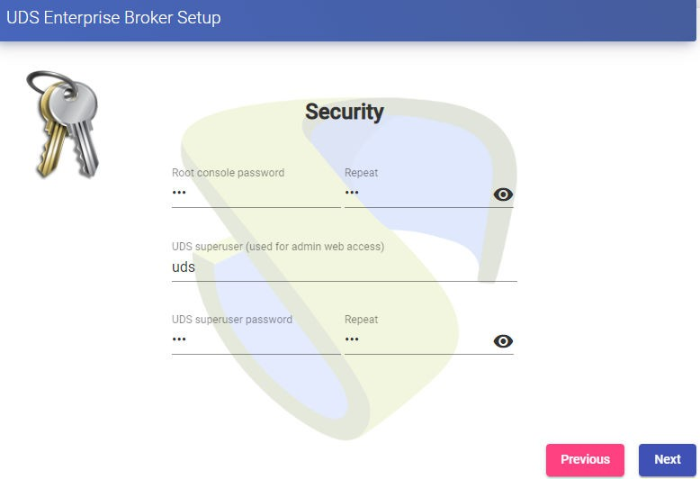

Сертификаты можно установить на UDS-сервере. В этом случае при доступе через балансировщик (HAProxy) устанавливать их не придется, хотя если вы хотите, чтобы [связь](http://www.udsenterprise.com) между компонентами UDS-Server и UDS-Tunnel осуществлялась по протоколу HTTPS, их настройка будет необходима.

Вы перезапустите сервер, чтобы завершить процесс его настройки.

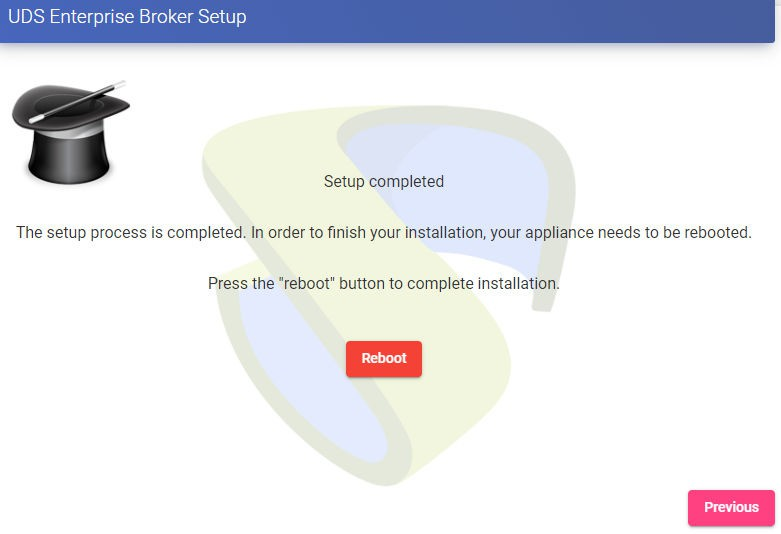

После перезапуска сервера вы можете получить доступ к среде UDS. Доступ будет осуществляться по имени или IP-адресу данных, настроенных в балансировке virtual [IP-адрес](http://www.udsenterprise.com), настроенной на сервере HAProxy.

Первый доступ будет осуществлен с помощью суперпользователя, настроенного в мастере настройки:

**Вам придется повторить все шаги, описанные ранее на второй машине UDS-Server.** Логично, что IP-данные и имя второго сервера будут отличаться, но мы должны подключиться к тому же экземпляру базы данных (главному узлу) и указать один и тот же серийный номер для активации.

Оба сервера будут работать в режиме «активный/активный», и если один из них упадет, все запросы на вход будут делаться автоматически на активном узле.

## Конфигурация туннельных серверов (UDS-Tunnel) 

Вы запустите машины UDS-Tunnel и приступите к их настройке.

Первой задачей будет присвоение IP-адреса серверу для доступа к помощнику по настройке через веб-браузер. Для этого вы выполните команду:

Набор IP-адресов UDS _dirección_IP_/_mascara_ _gateway_ _hostname_

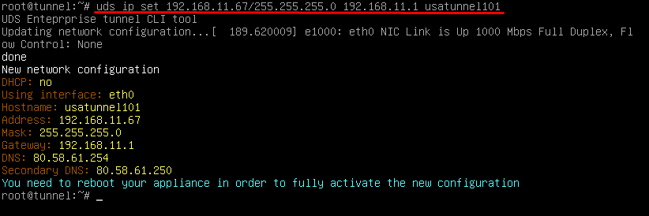

После ввода IP-данных вы перезапускаете сервер, чтобы применить
Изменения.

Если в сети, в которой развернут сервер Tunnel, есть DHCP-сервер, он получит IP-адрес через DHCP, который будет использоваться для доступа к мастеру настройки.

Через веб-браузер вы получаете доступ к указанному URL-адресу, чтобы запустить мастер настройки сервера Tunnel (в данном примере: http://192.168.11.37:9900).

Выберите язык мастера настройки:

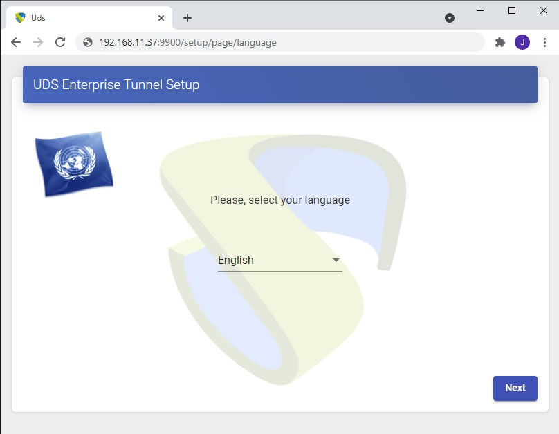

В разделе networks вы указываете IP-данные, имя и домен (опционально), которые будут у нашего Tunnel-сервера:

Вы подтверждаете, что данные верны. Новые данные будут применены (в случае [доступа через](http://www.udsenterprise.com/) DHCP-адрес и указание другого адреса, вы будете автоматически перенаправлены в браузере на новый IP-адрес).

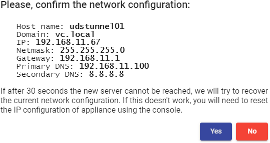

Вы выбираете язык клавиатуры, часовой пояс и опционально можете указать NTP-сервер:

Вы укажете учетные данные пользователя root ОС Linux, на которой размещена служба UDS-Tunnel:

Выберите, как будет осуществляться соединение с UDS-сервером и укажите его IP-адрес. Как и в данном случае, он настраивается через балансировщик (HAProxy. Этот адрес будет балансировочным виртуальным IP, ранее настроенным на сервере HAProxy с помощью сервиса Keepalived.

Вы можете установить сертификаты на сервере Tunnel, чтобы подключения HTML5 имели действительный сертификат (в этом примере самозаверяющие сертификаты будут оставлены [по умолчанию)]. (http://www.udsenterprise.com)

Вы перезапустите сервер, чтобы завершить процесс его настройки.

После перезапуска сервера он будет доступен для использования в туннельных соединениях (RDP, X2Go, Spice и т.д.) и HTML5.

**Вам придется повторить все шаги, описанные ранее на второй машине UDS-Tunnel.** Логично, что IP-данные и имя второго сервера будут отличаться, но вы должны подключиться к одному и тому же балансирующему виртуальному IP-адресу, чтобы предоставить доступ к подключению к UDS-серверам.

Оба сервера будут работать в режиме активный/активный, каждый пользователь, который установит соединение через туннель, будет подключаться к этим серверам случайным образом. Если один из них упадет, соединения пользователей, использующих этот сервер, будут прерваны, но при повторном подключении он будет автоматически подключаться через активный сервер Tunnel.
