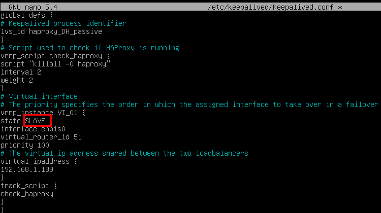
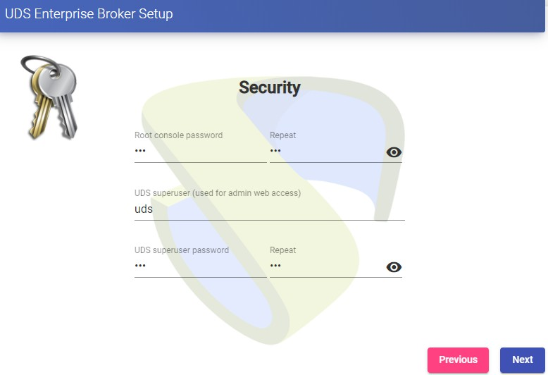

[Introduction 2](#introduction)

[Necessary elements 3](#necessary-elements)

[MySQL database servers 3](#mysql-database-servers)

[HAProxy servers 3](#haproxy-servers)

[OpenUDS-Server servers 4](#openuds-server-servers)

[OpenUDS-Tunneler servers 4](#openuds-tunneler-servers)

[Deployment Requirements 5](#deployment-requirements)

[Configuration of MySQL servers 6](#configuration-of-mysql-servers)

[Galera cluster configuration with 3 database servers
6](#galera-cluster-configuration-with-3-database-servers.)

[Database Replication Verification
12](#database-replication-verification)

[Configuration of the HAProxy servers
13](#configuration-of-the-haproxy-servers)

[Installing HAProxy on Linux Debian
22](#installing-haproxy-on-linux-debian)

[Configuration of the OpenUDS Server and Tunnel servers
40](#configuration-of-the-uds-server-and-tunnel-servers)

[OpenUDS server configuration (OpenUDS-Server)
40](#openuds-server-configuration-uds-server)

[Tunnel server configuration (OpenUDS-Tunnel)
47](#tunnel-server-configuration-uds-tunnel)

[Response to HA Proxy Master server crash
54](#response-to-ha-proxy-master-server-crash)

[Galera Cluster Recovery Tasks 55](#galera-cluster-recovery-tasks)

[Node 1 stops Correctly 55](#g1node-1-stops-correctly)

[Two nodes stop gracefully 55](#g2two-nodes-stop-gracefully)

[All three nodes stop Correctly 56](#all-three-nodes-stop-correctly.)

[A node disappears from the cluster
56](#a-node-disappears-from-the-cluster.)

[Two nodes disappear from the cluster
57](#two-nodes-disappear-from-the-cluster)

[All nodes go down without a proper shutdown procedure
57](#all-nodes-go-down-without-a-proper-shutdown-procedure)

[Cluster loses its primary status due to \"split brain\"
59](#cluster-loses-its-primary-status-due-to-split-brain)

# Introduction

OpenUDS Enterprise allows you to configure its different components in high availability (HA). This configuration mode makes it possible to provide the VDI environment with continuity in the event of the failure of any virtualization node or due to the failure of the OS itself of any of the components of the environment.
In order to provide the VDI environment with complete high availability, in addition to configuring several OpenUDS-Server and OpenUDS-Tunnel machines, it will also be necessary to have a replication or cluster configuration of the database to which the OpenUDS servers connect. Another necessary element and that we will also have to configure in high availability, will be the load balancer that manages and distributes the different connections to the OpenUDS-Server and OpenUDS-Tunnel components and our database cluster.
OpenUDS supports balancers of physical type (eg: F5) or virtual type (eg: HAProxy), these must have support for TCP and HTTP modes.
In this document, through a complete configuration example, we will try to address all the steps to configure OpenUDS in High Availability, from OpenUDS\'s own elements (OpenUDS-Server and OpenUDS-Tunnel) to a software load balancer ( HAProxy) and a MySQL Database configured with a galera cluster.

# Necessary elements
 In this guide we will use the necessary components for most deployments of a OpenUDS environment in HA. They are the following:

## MySQL database servers
 The database servers (BBDD) that we will use will be those provided by the OpenUDS team. All OpenUDS records and configurations will be stored on these servers.
In this document we show the configuration of three MySQL servers in active/active replication mode.
NOTE:
As of version 3.0 of OpenUDS Enterprise, active/active MySQL cluster configurations are supported.
The database component is one of the most important components of the VDI environment with OpenUDS. Therefore, for production deployments, it is strongly recommended to have a backup of this component, either via full machine backup, DB instance used in OpenUDS, cluster configuration, or as will be shown in this document, an active/replica configuration. asset.

## HAProxy servers
 It will be the server in charge of balancing the connections of the OpenUDS Server and Tunnel servers. Through it, the access of users/administrators in the OpenUDS login portal and the connections to the different services will be carried out.
In this document two HAProxy machines are configured, in active/passive mode.
NOTE:
In the different HAProxy servers we will configure an IP address that will be active only in the main server. In case of failure or isolation of this server, it will be automatically activated in the other secondary HAProxy servers.

## OpenUDS-Server servers
 We will be able to add all the OpenUDS-Server machines that we need and make them work in active/active mode. This will allow continuous access to the login portal for users and administrators, even if we lose some of the OpenUDS-Server machines.
In this document, two OpenUDS-Server machines are configured, in active/active mode.

## OpenUDS-Tunneler servers
 We will be able to add all the OpenUDS-Tunnel machines that we need and make them work in active/active mode, this will allow access to services (desktops or applications) through tunnelled and HTML5 connections even if we lose some of the OpenUDS-Tunnel machines.
In this document, two OpenUDS-Tunnel machines are configured, in active/active mode.
NOTE:
If a user is connected to a service (desktop or application) and the tunnel server through which they are connected goes down, the connection will be lost. But when you make the connection again, you will regain access to the service through another active tunnel server automatically.

# Deployment Requirements
 In this OpenUDS configuration example in HA, the following resources have been used:
MySQL:

-   3 MySQL servers (provided by the OpenUDS team). The minimum
    requirements for each machine are: 2 vCPUs, 1 GB of vRAM and 10 GB
    of disk

-   IP data: At least 3 IP addresses, one for each server, netmask,
    Gateway and DNS.

-   Database data: Instance, username and password (by default,
    instance: uds, user: uds, password: uds).

-   It should be taken into account that this appliance does not have
    direct support from
 OpenUDS HAProxy:

-   2 machines with Linux Debian OS (you can use preconfigured servers
    provided by OpenUDS available in thisrepository:
    [[https://images.udsenterprise.com/files/OpenUDS_HA/HAProxy/3.6/OVA-]{.underline}](https://images.udsenterprise.com/files/OpenUDS_HA/HAProxy/3.6/OVA-3.6/)
 [[3.6](https://images.udsenterprise.com/files/OpenUDS_HA/HAProxy/3.6/OVA-3.6/)/]{.underline} with at least 2 vCPUs, 1 GB of vRAM, 10 GB of disk.

-   IP data: 3 IP addresses, one for each server (Master - Slave) and a
    virtual IP shared between the two servers that will be used for
    balancing), network mask, gateway and DNS.

-   Internet access.

-   Certificate: It is necessary to have (or generate) a valid
    certificate for SSL connections in PEM format. This example shows
    how to create a temporary certificate.
 OpenUDS-Server:

-   2 OpenUDS-Server machines (provided by the OpenUDS team). The
    minimum requirements for each machine are: 2 vCPUs, 2 GB of vRAM and
    8 GB of disk.

-   IP data: 2 IP addresses, one for each server, netmask, gateway and
    DNS.

-   Valid serial number.

-   Connection data with the MySQL database: IP address, instance,
    username and password.
 OpenUDS-Tunnel:

-   2 OpenUDS-Tunnel machines (provided by the OpenUDS team). The
    minimum requirements for each machine are: 2 vCPUs, 2 GB of vRAM and
    14 GB of disk.

-   IP data: 2 IP addresses, one for each server, netmask, gateway and
    DNS.

-   Balancing IP address of the HAProxy servers.

# Configuration of MySQL servers
 In order to connect OpenUDS with a MariaDB cluster, you will need the following components:

-   3 or more machines with a MariaDB server installed. (In this case it
    will be done with the example database machine provided by the OpenUDS
    team)
 Node 1: 192.168.1.69
Node 2: 192.168.1.67
Node 3: 192.168.1.70

-   Have 1 or more OpenUDS Server in the platform to be able to make the
    connection with the database.

# Galera cluster configuration with 3 database servers.
 In our 3 machines you will have to perform a package update:
sudo apt update -y sudo apt upgrade -y
It is important to configure all the IPs of the nodes that we are going to use, the IP of the node to configure, as well as its personalized hostname (command:hostnamectl set-hostname \--static server_name). We do this on all nodes based on their network configuration.
To begin we will create the cluster configuration file on each node in the path:

#### /etc/mysql/conf.d/galera.cnf
 You will introduce in each node the necessary information for the correct functioning of the cluster:
In the first node, this will be the format to follow.

```
[mysqld] binlog_format=ROW
default-storage-engine=innodb 
innodb_autoinc_lock_mode=2 
bind-address=0.0.0.0
# Galera Provider Configuration 
wsrep_on=ON
wsrep_provider=/usr/lib/galera/libgalera_smm.so
# Galera Cluster Configuration 
wsrep_cluster_name="galera_cluster"
wsrep_cluster_address="gcomm://node1-ip-address,node2-ip-address,node3-ip-address"
# Galera Synchronization Configuration 
wsrep_sst_method=rsync
# Galera Node Configuration 
wsrep_node_address="node1-ip-address" 
wsrep_node_name="node1"
```

{}

 node1
Node number 2, in the same path as the previous one we will create the file with the following format
```
[mysqld] binlog_format=ROW
default-storage-engine=innodb 
innodb_autoinc_lock_mode=2 
bind-address=0.0.0.0
# Galera Provider Configuration 
wsrep_on=ON
wsrep_provider=/usr/lib/galera/libgalera_smm.so
# Galera Cluster Configuration 
wsrep_cluster_name="galera_cluster"
wsrep_cluster_address="gcomm://node1-ip-address,node2-ip-address,node3-ip-address"
# Galera Synchronization Configuration 
wsrep_sst_method=rsync
# Galera Node Configuration 
wsrep_node_address="node2-ip-address" 
wsrep_node_name="node2"
```

{}

 Node2
Node number 3, in the same path as the previous one we will create the file with the following format.
```
[mysqld] binlog_format=ROW
default-storage-engine=innodb 
innodb_autoinc_lock_mode=2 
bind-address=0.0.0.0
# Galera Provider Configuration 
wsrep_on=ON
wsrep_provider=/usr/lib/galera/libgalera_smm.so
# Galera Cluster Configuration 
wsrep_cluster_name="galera_cluster"
wsrep_cluster_address="gcomm://node1-ip-address,node2-ip-address,node3-ip-address"
# Galera Synchronization Configuration 
wsrep_sst_method=rsync
# Galera Node Configuration 
wsrep_node_address="node3-ip-address" 
wsrep_node_name="node3"
```

{}

 node3
After configuring the file on all the nodes of our platform, we will need to stop the mariadb service on all the nodes in order to initialize the cluster.

*systemctl stop mariadb*

{}

 On the first node, the MariaDB Galera cluster is initialized with the following command:
 
*galera_new_cluster*

{}

 Now we can see the status of the cluster with the following command:

``` 
mysql -u root -p -e "SHOW STATUS LIKE 'wsrep_cluster_size'"
```

{}

 *You should see the number "1".*
Next, on the second node the mariadb service will be started: 

```
systemctl start mariadb
```

{}

 Now we can see the cluster status again with the following command (in node 2):

``` 
mysql -u root -p -e "SHOW STATUS LIKE 'wsrep_cluster_size'"
```

{}

 {}
Next, on the third node the mariadb service will be started: 

```
systemctl start mariadb
```

Now we can see the cluster status again with the following command (In node 3): 

```
mysql -u root -p -e "SHOW STATUS LIKE 'wsrep_cluster_size'"
```

{}

 As we can see, the 3 nodes are active and connected to each other.

# Database Replication Verification
 Next, the replication of the databases will be verified. In the first node we will connect with maríadb:
 
```
mysql -u root -p
```

*Once inside we will create some databases with the following command:*

{}

 *In node 2 and 3 we will verify that these databases exist*

{}
{}

 In this way we have verified that all the information stored in the first database will be automatically replicated in the rest.

# Configuration of the HAProxy servers
 In this document, the HAProxy servers provided by the OpenUDS Enterprise team will be used. These servers are preconfigured and it will only be necessary to modify certain data to have them fully configured.
The servers can be downloaded from the following repository: [[https://images.udsenterprise.com/files/OpenUDS_HA/HAProxy/3.6/OVA-3.6/]{.underline}](https://images.udsenterprise.com/files/OpenUDS_HA/HAProxy/3.6/OVA-3.6/)
Both servers are configured with the following resources: 2 vCPUs, 1 GB of vRAM, 10 GB of disk, and 1 vNIC.
The servers have a user created: ***user***, with the password ***uds***. The root user password is: ***uds***
Once imported to the virtualization platform, we will proceed to its configuration
NOTE:
These servers are provided in .OVA format ready to import into VMware environments. If it were necessary to import them into a different virtualization platform, their disk can be extracted (eg Winrar). vmdk and convert (eg: qemu.img) to the format of the target platform.
It is strongly recommended to change the default password to a stronger one.

-   TASKS TO BE PERFORMED ON THE MAIN HAPROXY SERVER
 Once the machine has been imported to the virtual platform and turned on, we must validate ourselves with the user: ***root*** and the password: ***uds***

{}

 We will configure the new IP data by modifying the file: /etc/network/interfaces

{}

 And we will confirm that we have valid DNS data and that we have access to the Internet.

{}

 Restart the server to apply the new IP configuration.
First we must execute the update commands in case there are important security patches and other components that we can apply:

```
apt get update 

apt-get upgrade
```

Now we proceed to modify the data configured in the HAProxy service. To do this we will edit the file:
/etc/haproxy/haproxy.cfg
Only some parameters will be referenced in this document. It is recommended to thoroughly review the rest of the preconfigured parameters and modify them based on the needs of each environment.
The service is pre-configured with an auto-generated temporary certificate:

{}

 Frontend access rule to the OpenUDS server in http mode. port 80

{}

 Frontend access rule to the OpenUDS server in http mode (we will indicate the path of the previously generated. pem certificate). port 443

{}

 Frontend access rule to the Tunnel server in TCP mode through port 1443 (tunneled connections). In case of using a different port, it will be necessary to modify it (this port is the one that has been indicated in the Tunnel tab of a transport via tunnel).

{}

 Frontend access rule to the Tunnel server in TCP mode through port 10443 (HTML5 connections). In case of using a different port, it will be necessary to modify it (this port is the one that has been indicated in the Tunnel tab of an HTML5 transport).

{}

 Backend access rule to the OpenUDS server. We must indicate the IP addresses of our OpenUDS-Server machines (OpenUDS server listening ports are 80 or 443).

{}

 Backend access rule to the Tunnel server for tunneled connections. We must indicate the IP addresses of our OpenUDS-Tunnel machines (the listening port of the Tunnel server for tunnelled connections is 443).

{}

 Backend access rule to the Tunnel server for HTML5 connections. We must indicate the IP addresses of our OpenUDS-Tunnel machines (the Tunnel server listening port for HTML5 connections is 10443).

{}

 Access rules to the different databases, we must indicate the different IPs of our database servers (listening port for database connections is 3306)

{}

```
 frontend galera_cluster_frontend 
 bind *:3306
mode tcp 
option tcplog
default_backend galera_cluster_backend
backend galera_cluster_backend 
mode tcp
tcpka option 
balance source
server db1 192.168.0.5:3306 check weight 30
db2 server 192.168.0.8:3306 check weight 20
server db3 192.168.0.9:3306 check weight 10

```
Finally, we will indicate the balancing virtual IP that the main and secondary servers will have. To do this we edit the file: /etc/keepalived/keepalived.conf

{}

 In this file we must also confirm that the network interface is correct (it can be confirmed with the commandip a) and that the "role" assigned will be the main server (Master):
{}

Restart the server to apply all the changes and we will verify that the balancing virtual IP is active:

{}

 NOTE:
The balancing virtual IP address will be the one that gives us access to the OpenUDS environment. This address will always remain active on the main server and, when it suffers a crash, it will automatically activate on the secondary server.

-   TASKS TO BE PERFORMED ON THE SECONDARY HAPROXY SERVER
 The tasks to be carried out will be exactly the same as in the main server, we will indicate your IP data:

{}

 Restart the server to apply the new IP configuration.
Execute the update commands in case there are important security and other component patches that we can apply:

```
apt get update 

apt-get upgrade
```

Modify the same data configured in the HAProxy service as in the main server (mainly the IP addresses of the OpenUDS and Tunnel servers), editing the file: /etc/haproxy/haproxy.cfg

Finally, indicate the balancing virtual IP that the main and secondary servers will have, editing the file:
/etc/keepalived/keepalived.conf

{}

 And the only significant change that the secondary server will have, besides confirming that the network interface is correct, will be that the "role" assigned to the secondary server has to be SLAVE:

{}

 Restart the server to apply all the changes and, in this case, check that the balancing virtual IP is not active. It will only be activated in the event of a main server crash:

{}


## Installing HAProxy on Linux Debian
 Although in this document the preconfigured HAProxy servers provided by the OpenUDS team are used, it is also possible to install and configure them completely starting from a new OS.
In this section, we will show an example of its complete installation and configuration on a Debian Linux OS. We will use some basic resources: 2 vCPUs, 1 GB of vRAM, 8 GB of disk and 1 vNic.
The configuration of the primary node will be displayed. Most of the tasks will also need to be carried out on the primary node, except for the generation of the certificate, which should only be generated on one of the servers, and the configuration of the Keepalived component, which in the case of the secondary server will use Slave mode.
NOTE:
If you have already deployed the preconfigured HAProxy machines provided by the OpenUDS team, you can skip this section.
In this installation we will install a Linux Debian 11 OS
Step 1
We run the installation wizard:
We will select the installation language, localization, keyboard language, etc...

{}

 We will indicate the host name, domain, users and passwords.

{}

 We perform the disk partitioning (using the default configuration). We indicate a source of apt packages, and install the base system.

{}

 It will not be necessary to install a desktop environment, but we will install the SSH service

{}

 We will finish the installation of the OS

{}

 Step 2
We access the server and configure the IP data (if we have not done so during the installation of the OS). We confirm that the DNS servers are correct, and we have access to the Internet:

{}
{}

 Once the IP data is configured, we must execute the update commands in case there are important security patches and other components that we can apply:
 
 ```
apt get update 
apt-get upgrade
```

{}

Step 3
If you do not have a certificate, we will generate a temporary one with the following command:

```
openssl req -x509 -nodes -days 3650 -newkey rsa:2048 -keyout /root/ssl.key -out /root/ssl.crt
```

{}

 Indicate all the data that you request and we will confirm that in the specified path (/root) we have the files ssl.key and ssl.crt

{}

 Now we will join both files and create the .pem file that will be the one that we specify in the HAProxy configuration.
To create the file. pem we will execute the following command:

```
cat /root/ssl.crt /root/ssl.key \/etc/ssl/private/haproxy.pem
```

We create the new certificate file and confirm that it is hosted in the indicated path:

{}

 NOTE:
This certificate created in the primary HAProxy server will need to be copied to the same path of the secondary server.
If you are using your own certificate, it will be necessary to copy it to both servers (primary and secondary).

Step 4
Install the HAProxy service:

```
apt-get install haproxy
```

{}

 After installing the HAProxy service, we will edit the haproxy.cfg configuration file, to configure the service located in the path /etc/haproxy/
Delete all the content of the file, adding the following text (you can download the file from the following repository): [[https://images.udsenterprise.com/files/OpenUDS_HA/HAProxy/3.6/haproxy.cfg]{.underline}](https://images.udsenterprise.com/files/OpenUDS_HA/HAProxy/3.6/haproxy.cfg)
{}

```
global
log /dev/log local0
log /dev/log local1 notice chroot /var/lib/haproxy
stats socket /run/haproxy/admin.sock mode 660 level admin stats timeout 30s
maxconn 2048 user haproxy group haproxy daemon

# Default SSL material locations ca-base /etc/ssl/certs
crt-base /etc/ssl/private


# Default ciphers to use on SSL-enabled listening sockets.
# For more information, see ciphers(1SSL). This list is from:
# https://hynek.me/articles/hardening-your-web-servers-ssl-ciphers/
ssl-default-bind-options ssl-min-ver TLSv1.2 prefer-client-ciphers ssl-default-bind-ciphersuites
TLS_AES_128_GCM_SHA267:TLS_AES_267_GCM_SHA384:TLS_CHACHA20_POLY1305_SHA267
ssl-default-bind-ciphers ECDH+AESGCM:ECDH+CHACHA20:ECDH+AES267:ECDH+AES128:!aNULL:!SHA1:!AESCCM

# ssl-default-server-options ssl-min-ver TLSv1.2 # ssl-default-server-ciphersuites
TLS_AES_128_GCM_SHA267:TLS_AES_267_GCM_SHA384:TLS_CHACHA20_POLY1305_SHA267
 
#ssl-default-server-ciphers ECDH+AESGCM:ECDH+CHACHA20:ECDH+AES267:ECDH+AES128:!aNULL:!SHA1:!AESCCM


tune.ssl.default-dh-param 2048


defaults global log mode http option httplog
option dontlognull option forwardfor retries 3
option redispatch


stats enable
stats uri /haproxystats
stats realm Strictly\ Private stats auth stats:haproxystats

timeout connect 5000
timeout client 14000
server timeout 14000

errorfile	400	/etc/haproxy/errors/400.http
errorfile	403	/etc/haproxy/errors/403.http
errorfile	408	/etc/haproxy/errors/408.http
errorfile	500	/etc/haproxy/errors/500.http
errorfile	502	/etc/haproxy/errors/502.http
errorfile	503	/etc/haproxy/errors/503.http
errorfile	504	/etc/haproxy/errors/504.http
http-in frontend bind *:80
mode http
 
http-request set-header X-Forwarded-Proto http default_backend pcs-backend
https-in frontend
bind *:443 ssl crt /etc/ssl/private/haproxy.pem mode http
http-request set-header X-Forwarded-Proto https default_backend pcs-backend

tunnel-in frontend bind *:1443
mode tcp option tcplog
default_backend tunnel-backend-ssl


tunnel-in-guacamole frontend # HTML5 bind *:10443
mode tcp option tcplog
default_backend tunnel-backend-guacamole backend pcs-backend
option http-keep-alive balance roundrobin
server udss1 192.168.1.183:80 check inter 2000 rise 2 fail 5 ssl verify none
server udss2 192.168.1.184:80 check inter 2000 rise 2 fail 5 ssl verify none backend tunnel-backend-ssl
mode tcp option tcplog
balance roundrobin
server udst1 192.168.1.185:443 check inter 2000 rise 2 fail 5
server udst2 192.168.1.186:443 check inter 2000 rise 2 fail 5


backend tunnel-backend-guacamole mode tcp
option tcplog balance source
 

server udstg1 192.168.1.185:10443 check	inter	2000	rise	2	fail	5
server udstg2 192.168.1.186:10443 check	inter	2000	rise	2	fail	5


# Galera Cluster Frontend configuration frontend galera_cluster_frontend
bind *:3306 mode tcp option tcplog
default_backend galera_cluster_backend


# Galera Cluster Backend configuration backend galera_cluster_backend
mode tcp tcpka option
balance source
server dbserver1 192.168.1.67:3306 check weight 30
server dbserver2 192.168.1.69:3306 check weight 20
server dbserver3 192.168.1.70:3306 check weight 10
```

Where:
Certificate path.

```
# Default SSL material locations 
ca-base /etc/ssl/certs
crt-base /etc/ssl/private
```

Access to statistics.

```
stats enable
stats uri /haproxystats
stats realm Strictly\ Private 
stats auth stats:haproxystats
```

Frontend access rule to the OpenUDS server in http mode. Port 80.

```
http-in frontend bind *:80
mode http
http-request set-header X-Forwarded-Proto http 
default_backend pcs-backend
```

Frontend access rule to the OpenUDS server in http mode (we will indicate the path of the previously generated .pem certificate). Port 443.

```
https-in frontend
bind *:443 ssl crt /etc/ssl/private/haproxy.pem 
mode http
http-request set-header X-Forwarded-Proto https 
default_backend pcs-backend
```

Frontend access rule to the Tunnel server in TCP mode through port 1443 (tunneled connections). In case of using a different port, it will be necessary to modify it (this port is the one that has been indicated in the Tunnel tab of a transport via tunnel).

```
tunnel-in frontend bind *:1443
mode tcp option tcplog
default_backend tunnel-backend-ssl
```

Frontend access rule to the Tunnel server in TCP mode through port 10443 (HTML5 connections). In case of using a different port, it will be necessary to modify it (this port is the one that has been indicated in the tunnel tab of an HTML5 transport).

```
tunnel-in-guacamole frontend # HTML5 
bind *:10443
mode tcp 
option tcplog
default_backend tunnel-backend-guacamole
```
Backend access rule to the OpenUDS server. We must indicate the IP addresses of our OpenUDS-Server machines (OpenUDS server listening ports are 80 or 443).

```
backend pcs-backend 
option http-keep-alive 
balance roundrobin
server udss1 192.168.1.183:80 check inter 2000 rise 2 fail 5
server udss2 192.168.1.184:80 check inter 2000 rise 2 fail 5
```

Backend access rule to the Tunnel server for tunneled connections. We must indicate the IP addresses of our OpenUDS-Tunnel machines (the listening port of the Tunnel server for tunnelled connections is 443).

```
backend tunnel-backend-ssl 
mode tcp
option tcplog 
balance roundrobin
server udst1 192.168.1.185:443 check inter 2000 rise 2 fail 5 ssl verify none
server udst2 192.168.1.186:443 check inter 2000 rise 2 fail 5 ssl verify none
```

Backend access rule to the Tunnel server for HTML5 connections. We must indicate the IP addresses of our OpenUDS-Tunnel machines (the Tunnel server listening port for HTML5 connections is 10443).

```
backend tunnel-backend-guacamole 
mode tcp
option tcplog 
balance source
server udstg1 192.168.1.185:10443 check inter 2000 rise 2 fail 5
server udstg2 192.168.1.186:10443 check inter 2000 rise 2 fail 5
```

Access rules to the different databases, we must indicate the different ips of our database servers (the listening port for connections with the databases is 3306)

```
bind *:3306 
mode tcp 
option tcplog
default_backend galera_cluster_backend
backend galera_cluster_backend
mode tcp 
tcpka option
balance source
server dbserver1 192.168.1.67:3306 check weight 30
server dbserver2 192.168.1.69:3306 check weight 20
server dbserver3 192.168.1.70:3306 check weight 10
```

After configuring the file, we save it and restart the HAProxy service:
service haproxy restart

{}

Step 5
Once we have finished installing and configuring HAProxy, we will install keepalive, which will provide us with a balancing virtual ip between the different HAProxy servers.
In the event of a failure of the main HAProxy server, the balancing virtual IP will be automatically activated on the secondary server. Once the service is recovered on the main server, the virtual IP will be activated again on said server.
To perform the Keepalive installation, we will execute the following command:

```
apt-get install keepalived
```

{}

 Once installed, we will edit the /etc/sysctl.conf file and add the following line to the end of the file:

``` 
net.ipv4.ip_nonlocal_bind=1
```

{}

To verify that the modification has been carried out correctly, we can execute the following command:

```
sysctl -p
```

{}

 Now we will configure the Keepalived service. To do this we create the file keepalived.conf in the path
/etc/keepalived/
It depends on the node that we are configuring (main or secondary), we will have to indicate a configuration:

-   KEEPALIVED.CONF FILE ON MAIN NODE
 The file can be downloaded from the following repository: [[https://images.udsenterprise.com/files/OpenUDS_HA/HAProxy/3.6/keepalived-master/keepalived.conf]{.underline}](https://images.udsenterprise.com/files/OpenUDS_HA/HAProxy/3.6/keepalived-master/keepalived.conf) In case of creating it manually, we must indicate the following:
 
```
	global_defs {
	\# Keepalived process identifier lvs_id haproxy_DH
	}
	\# Script used to check if HAProxy is running vrrp_script check_haproxy {
	script "killall -0 haproxy" interval 2
	weight 2
	}
	\# Virtual interface
	\# The priority specifies the order in which the assigned interface to take over in a failover
	vrrp_instance VI_01 { state MASTER interface enp1s0 virtual_router_id 51
	priority 101
	\# The virtual ip address shared between the two loadbalancers virtual_ipaddress {
	192.168.11.64/24
	}
	track_script { check_haproxy
	}
	}
```

Where:

We will indicate the name of the network interface of the machine (with the commandip awe can check the name of our network interface):

```
interface enp1s0
```

Define the role of the server (MASTER= main, SLAVE= secondary)

```
state MASTER
```

Indicate the balancing virtual IP address:

```
virtual_ipaddress {
192.168.1.189/24
}
```

{}


-   KEEPALIVED.CONF FILE ON SECOND NODE
 The file can be downloaded from the following repository: [[https://images.udsenterprise.com/files/OpenUDS_HA/HAProxy/3.6/keepalived-slave/keepalived.conf]{.underline}](https://images.udsenterprise.com/files/OpenUDS_HA/HAProxy/3.6/keepalived-slave/keepalived.conf) In case of creating it manually, we must indicate the following:
 
```
	global_defs {
	\# Keepalived process identifier lvs_id haproxy_DH_passive
	}
	\# Script used to check if HAProxy is running vrrp_script check_haproxy {
	script "killall -0 haproxy" interval 2
	weight 2
	}
	\# Virtual interface
	\# The priority specifies the order in which the assigned interface to take over in a failover
	vrrp_instance VI_01 { status SLAVE interface enp1s0 virtual_router_id 51
	priority 100
	\# The virtual ip address shared between the two loadbalancers virtual_ipaddress {
	192.168.1.189/24
	}
	track_script { check_haproxy
	}
	}
```

Where:
We will indicate the name of the network interface of the machine (with the commandip awe can check the name of our network interface):

```
interface enp1s0
```

Define the role of the server (MASTER= main, SLAVE= secondary)

```
state SLAVE
```

Indicate the balancing virtual IP address

```
virtual_ipaddress {
192.168.1.189/24
}
```

{}

Once the files have been created on both servers (main and secondary), it will be necessary to restart the keepalived service:

```
service keepalived restart
```

{}

 Verify with the command ip a that the balancing virtual IP is active on the main server:

{}


# Configuration of the OpenUDS Server and Tunnel servers
 Once the database servers and HAProxy servers have been configured as balancers, we will proceed to install and configure the OpenUDS-Server and OpenUDS-Tunnel components.
We will start with the OpenUDS-Server component, since the configuration of the OpenUDS-Tunnel machines will require us to have at least one OpenUDS-Server machine active and configured.

## OpenUDS server configuration (OpenUDS-Server)
 We will start the OpenUDS-Server machines and proceed to configure them.
The first task will be to assign an IP address to the server in order to access the configuration wizard via browser. To do this we will execute the command:
uds ip set *IP adress*/*mask gateway hostname*

{}

 After indicating the IP data, we restart the server to apply the changes
If the network where we have deployed the OpenUDS server has a DHCP server, it will take an IP address via DHCP that will be used to access the configuration wizard:

{}

 Through a browser, we access the indicated URL to start the OpenUDS server configuration wizard (in this example: https://192.168.1.183:9900).
We select the language of the configuration wizard:

{}

 In the network section, we indicate the IP data, name and domain (optional) that our OpenUDS server will have:

{}

 We confirm that the data is correct. The new data will be applied (in case of accessing via a DHCP address and indicating a different address, we will automatically be redirected, in the browser, to the new IP address).

{}

 We select the keyboard language, the time zone and optionally we can indicate an NTP server

{}

 Now we select the type of database:MySQL (remote)indicating the data of the main MySQL server

{}

 In this case we will have to use the virtual ip shared by the HAProxy (192.168.1.189 in this case)
The next task will be to activate our OpenUDS server with a valid serial number. In this example we will use the online activation method, which requires that the OpenUDS-Server machine have access to the Internet.

{}

 NOTE:
If the OpenUDS servers do not have access to the Internet, we must apply the offline activation process (for more information on this procedure, you can consult the OpenUDS Installation, Administration and User Manual available in the [[Documentation](https://www.udsenterprise.com/en/uds-enterprise/documentacion/)]{.underline} from the website udsenterprise.com)
Indicate the credentials of the superuser, who will have access to the OpenUDS administration. The indicated password will also be applied to the root user of the Linux OS that hosts the OpenUDS service:

{}

 You will be able to install the certificates on the OpenUDS server. In this case, when accessing via balancer (HAProxy), it will not be necessary to install them, although if you want the communication between the OpenUDS-Server and OpenUDS-Tunnel components to be carried out via HTTPS, its configuration will be necessary.

{}

 Restart the server to finish its configuration process.

{}

 Once the server has restarted, we will be able to access the OpenUDS environment. The access will be done via name or IP address of the data configured in the balancing virtual IP address configured in the HAProxy server.
The first access will be done with the superuser configured in the configuration wizard:

{}

 You will have to repeat all the previously detailed steps on the second OpenUDS-Server machine. Logically, the IP data and name of the second server will be different, but we must connect to the same database instance (main node) and indicate the same serial number for activation.
Both servers will work in active/active mode and in the event of a crash of one of them, all login requests will be made on the active node automatically.

## Tunnel server configuration (OpenUDS-Tunnel)
 We will start the OpenUDS-Tunnel machines and proceed to configure them.
The first task will be to assign an IP address to the server in order to access the configuration wizard via browser. To do this we will execute the command:
uds ip set *IP adress*/*mask gateway hostname*

{}

 After indicating the IP data, we restart the server to apply the changes.
If the network where we have deployed the Tunnel server has a DHCP server, it will take an IP address via DHCP that will be used to access the configuration wizard.

{}

 Through a browser, we access the indicated URL to start the Tunnel server configuration wizard (in this example: https://192.168.1.185:9900).
Select the language of the configuration wizard:

{}

 In the network section, indicate the IP data, name and domain (optional) that our Tunnel server will have:

{}

 Confirm that the data is correct. The new data will be applied (in case of accessing via a DHCP address and indicating a different address, we will automatically be redirected, in the browser, to the new IP address).

{}

 Next, add the security code that appears on our Appliance:

{}

 We select the keyboard language, the time zone and optionally we can indicate an NTP server:

{}

 We select how the connection to the OpenUDS server will be made and indicate its IP address. As in this case it is configured through a balancer (HAProxy), this address will be the balancing virtual IP previously configured in the HAProxy server using the Keepalived service.
In order for the OpenUDS Tunnel to trust the self-signed certificate of the HAProxy and to be able to validate the connection, we will have to use the \"uds trust\" command.

{}

 {}

{}
Once done we will have to tell the OpenUDS Tunnel the name of our OpenUDS Server \"vc\" Editing the /etc/hosts file
Once the process is done, you can continue with the Tunnel configuration

### NOTE:

### For more information about the uds ip command, consult the OpenUDS 3.6 Installation, administration and user manual.

{}

 You can install the certificates in the Tunnel server so that the HTML5 connections have a valid certificate (in this example, the self-signed certificates will be left by default).
restart the server to finish its configuration process.
Once the server is restarted, it will be available to be used in tunneled connections (RDP, X2Go, Spice, etc\...) and HTML5.
You will have to repeat all the previously detailed steps in the second OpenUDS-Tunnel machine. Logically, the IP data and name of the second server will be different, but we must connect with the same balancing virtual IP address to provide connection access to the OpenUDS servers.
Both servers will work in active/active mode, each user that makes a connection via tunnel will connect randomly to these servers. In the event of a crash of one of them, the connections of the users who are using that server will be cut, but when making said connection again they will access through the active Tunnel server automatically.

# Response to HA Proxy Master server crash
 In the event of a master HA Proxy server crash, the virtual IP that our slave server has will automatically become active:

{}

 With this change, which is made automatically, it will be possible to continue working normally. In the event of the removal of the master server, the virtual IP will be activated again on the master server.

# Galera Cluster Recovery Tasks
 A Galera cluster works as a logical entity, controlling the state and consistency of its nodes, as well as the state of the entire cluster. This allows you to maintain data integrity more efficiently than with asynchronous replication, without losing secure writes to multiple nodes at the same time.
However, there may be scenarios where the database service can stop without any node being able to service requests. These scenarios are described in the following sections.

## {}
Node 1 stops Correctly
 In a three-node cluster (node 1, 2, and 3), node 1 is stopped gracefully, for maintenance, configuration change, and so on.
In this case, the other nodes receive a \"goodbye\" message from the stopped node, and the cluster size is reduced; some properties, like [[the quorum calculation]{.underline}](https://galeracluster.com/library/documentation/glossary.html#term-quorum)or auto increment, are changed automatically. As soon as
node 1 boots again, it joins the cluster based on its wsrep_cluster_address variable in my.cnf.
If the write set cache (gcache.size) on nodes 2 and/or 3 still has all transactions executed while node 1 was down, the join is possible via [[ist]{.underline}](https://galeracluster.com/library/documentation/glossary.html#term-ist). If IST is impossible due to missing transactions in the donor\'s cache, the fallback decision is made by the donor and SST is started automatically.

## {}
Two nodes stop gracefully
 As in the first point, the cluster size is reduced to 1, even the only remaining node 3 forms the main component and can serve client requests. To bring the nodes back to the cluster, you just have to start them.
However, when a new node joins the cluster, node 3 will switch to the \"Donor/Unsynchronized\" state, since it has to
provide state transfer to at least the first joining node. It\'s still possible to read/write to it during that process, but it can be much slower, depending on the large amount of data that needs to be sent during the state transfer. Also, some load balancers may consider the donor node to be down and remove it from the pool. Therefore, it is better to avoid the situation when only one node is active.
If you reboot node 1 and then node 2, make sure that node 2 does not use node 1 as a state transfer donor: node 1 might not have all the necessary write sets in its gcache. Specify node 3 as donor in the configuration file and start the mysql service:

```
$systemctl start mysql
```

## All three nodes stop Correctly.
 {}
The cluster is completely stopped and the problem is how to initialize it again. It is important for a node to write its last executed position to the grastate.dat file.
By comparing the seqno number in this file, you can see which is the most advanced node (probably the last stopped). The cluster must start using this node, otherwise the nodes that had a more advanced position will have to do the full SST to join the cluster initialized from the less advanced one. As a result, some transactions will be lost.)
To boot the first node, call the startup script like this:

For MySQL:

```
$ mysqld_bootstrap --wsrep-new-cluster 
```

For PXC:

```
$systemctl start <mysql@bootstrap.service
```

For MariaDB:

```
galera_new_cluster $ Note
```

Even though you boot from the most advanced node, the other nodes have a lower sequence number. They will still have to join through the full SST, as the galera cache is not persisted on reboot. For this reason, it is recommended to stop writes to the cluster before its complete shutdown, so that all nodes can stop at the same position. See also [[pc.recovery.]{.underline}](https://galeracluster.com/library/documentation/galera-parameters.html#pc-recovery)

## A node disappears from the cluster.
 This is the case when a node becomes unavailable due to, for example, a power outage, hardware failure, kernel panic, mysqld crash, or kill -9 in mysqld pid.
The two remaining nodes notice that the connection to node 1 is down and start trying to connect to it again. After several timeouts, node 1 is removed from the cluster. Quorum is saved (two out of three nodes are up), so there is no service interruption. After it reboots, node 1 automatically joins, as described in Node 1 stops gracefully.

## Two nodes disappear from the cluster
 {}
Two nodes are not available and the remaining node (node 3) cannot form the quorum by itself. The cluster has to switch to non-primary mode, where MySQL refuses to serve any SQL queries. In this state, the \"mysqld\" process on node 3 is still running and can connect, but any data-related statements fail with an error.

```
MySQL> Select * from test.sbtest1;

ERROR 1047 (08S01): WSREP has not yet prepared the node for application use
```

Reads are possible until node 3 decides that it cannot access node 1 and node 2. New writes are prohibited.

As soon as the other nodes are available, the cluster is automatically re-formed. If Node 2 and Node 3 have simply detached from Node 1's network, but are still able to communicate with each other, they will continue to function as they still form the quorum.
If node 1 and node 2 crashed, you must enable the parent on node 3 manually, before you can open node 1 and node 2. The command to do this is:

```
mysql> SET GLOBAL wsrep_provider_options='pc.bootstrap=true';
```

NOTE: This approach only works, if the other nodes are down before doing so otherwise you will end up with two clusters with different data.

## All nodes go down without a proper shutdown procedure
 {}
This scenario is possible in the event of a data center power failure or when MySQL or Galera fails. Also, it can happen as a result of data consistency being compromised when the cluster detects that each node has different data. The grastate.dat file is not updated and does not contain a valid sequence number (seqno). It can look like this:

```
$cat /var/lib/mysql/grastate.dat
```


#Galera Saved State Version: 2.1

```
UUID: 220dcdcb-1629-11e4-add3-aec059ad3734 
second: -1
safe_to_bootstrap: 0
```

In this case, you cannot be sure that all nodes are consistent with each other. We cannot use the safe_to_bootstrap variable to determine the node that has the last committed transaction, as it is set to 0 for each node. An attempt to boot from that node will fail unless you start mysqld with the --wsrep-recover parameter:

```
$mysqld --wsrep-recover
```

Look in the output for the line reporting the position retrieved after the UUID of the node (1122 in this case):

```
...
... [Note] WSREP: Retrieved position: 220dcdcb-1629-11e4-add3-aec059ad3734:1122
...
```

The node where the retrieved position is marked by the largest number is the best bootstrap candidate. In your grastate.dat file, set the safe_to_bootstrap variable to 1. Then boot from this node.

Note

After a shutdown, you can bootstrap from the node that is marked safe in the grastate.dat file.

```
...
safe_to_bootstrap: 1
...
```

The pc.recovery option (enabled by default) saves the cluster state to a file named gvwstate.dat on each member node. As the name of this option (pc -- parent) suggests, it only saves a cluster in the PRIMARY state. An example content of a gvwstate.dat file might look like this:

```
cat /var/lib/mysql/gvwstate.dat
my_uuid: 76DE8AD9-2AAC-11E4-8089-D27FD06893B9

#vwbeg
view_id: 3 6C821ECC-2AAC-11E4-85A5-56FE513C651F 3
Boot: 0
Member: 6C821ECC-2AAC-11E4-85A5-56FE513C651F 0
Member: 6D80EC1B-2AAC-11E4-8D1E-B2B2F6CAF018 0
Member: 76DE8AD9-2AAC-11E4-8089-D27FD06893B9 0
#vwend
```

We can see a three-node cluster with all members active. Thanks to this feature, nodes will try to restore the parent component once all members start seeing each other. This causes the cluster to automatically recover from being shut down without any manual intervention!

## Cluster loses its primary status due to \"split brain\"

{}

 Suppose we have a cluster consisting of an even number of nodes: six, for example. Three of them are in one location, while the other three are in another location and lose network connectivity. It is recommended to avoid such a topology: if you cannot have an odd number of real nodes, you can use an additional arbitrator node (garbd) or set a higher pc.weight for some nodes. But when the \"[[split brain](https://galeracluster.com/library/documentation/glossary.html#term-split-brain)"]{.underline} happens somehow, none of the detached clusters can maintain quorum: all nodes must stop servicing requests, and both parts of the cluster will continually try to reconnect.
If you want to restore service even before the network link is restored, you can make one of the clusters primary again with the same command described in Two nodes disappear from cluster.

```
SET GLOBAL wsrep_provider_options='pc.bootstrap=true';
```

After this, you can work on the manually restored part of the cluster, and the other half should be able to automatically rejoin using IST, as soon as the network link is restored.

Warning

If you set the boot option to both separate parts, you\'ll end up with two live cluster instances, with data likely to diverge from each other. Restoring a network link in this case will not cause them to rejoin until the nodes are rebooted and the members specified in the configuration file reconnect. Then, as Galera\'s replication model really cares about data consistency: once inconsistency is detected, nodes that cannot execute the row change statement due to a data difference will shutdown. emergency and the only way to return the nodes to the cluster is through the full SST.

This article is based on the blog post Galera Replication - how to recover a PXC cluster by
Przemysław Malkowski: [[Galera Replication: How to recover a PXC cluster]{.underline}](https://www.percona.com/blog/2014/09/01/galera-replication-how-to-recover-a-pxc-cluster/)
