# OpenUDS Logs Guide

This document will describe information for administrators about allthe important logs found in the different components of a OpenUDS environment.

# OpenUDS-Server
The logs of the OpenUDS Server component are found in the path/var/server/log

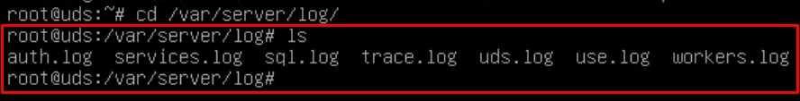

Next, each one of them is detailed:

## auth.log

- In this log we can see the users who have been validated on the
  platform, their IP address and the machine from which they connected.

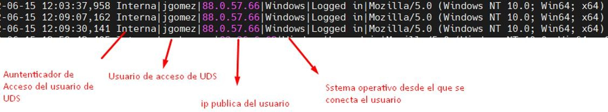

## sql.log

- Here we can see all the changes that are made in the OpenUDS
  database. These changes are generally made during the installation or
  update of OpenUDS.

## trace.log

- In this log we can see data on user access to services: the name of
  the service, the OpenUDS user requesting it, the transport used and the IP
  of the machine.

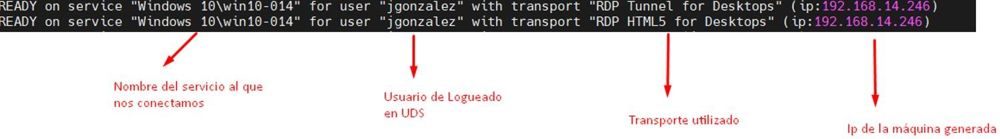

## uds.log

- This log is the main one of the system, in which we can see all the
  information related to the connections made by the server and the
  errors that may appear.

## use.log

- In this log we can see more data on user access to services: the time,
  the day of login and logout, the name or IP of the connection client
  computer, the user and authenticator, the name of the service, the
  pool of services to which it belongs, etc…

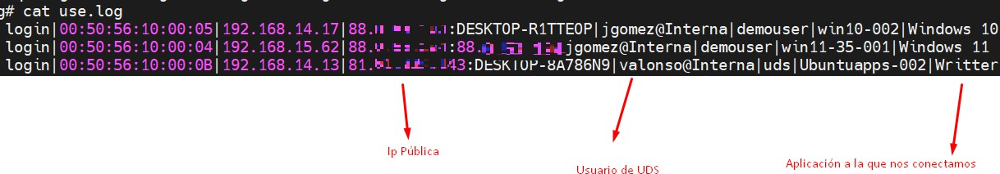

## workers.log

- In this log we can see the internal tasks performed by the OpenUDS Server
  machine: self-cleaning tasks, scheduled tasks, check the cache, etc...
A process that can be carried out on the OpenUDS server, in order to generate more information in the logs, is to enable **DEBUG mode**.

To put the logs of the OpenUDS Server component in debug mode, we will have to access the server, edit the file/**var/server/server/settings.py** and in the DEBUG section set it to“**True”**.

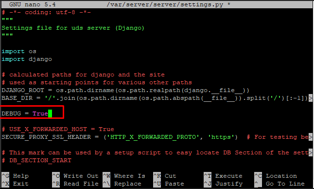

It is important to disable it (reset the DEBUG parameter to “False”) once the necessary logs have been obtained, since it generates manylogs, blocks memory and, in short, can cause storage and performance problems on the server.

To apply the changes and to generate logs in Debug mode, it will be necessary to restart the server or the services: uds (restarts thebackend part) and udsweb (restarts the frontend part).

In addition to the specific logs of the OpenUDS elements, it is also important to take into account the log of the web server used by OpenUDS,which is NGINX. The web server logs are stored in the path:**/var/log/nginx/**

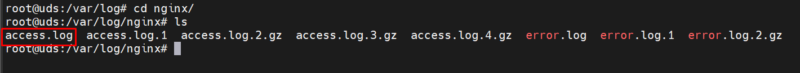

## access.log

- In this log we can find valuable information about the accesses of
  third-party elements (such as SAML authenticators, Opengnsys, etc...)
  and accesses to the web portal (including the administration
  interface).

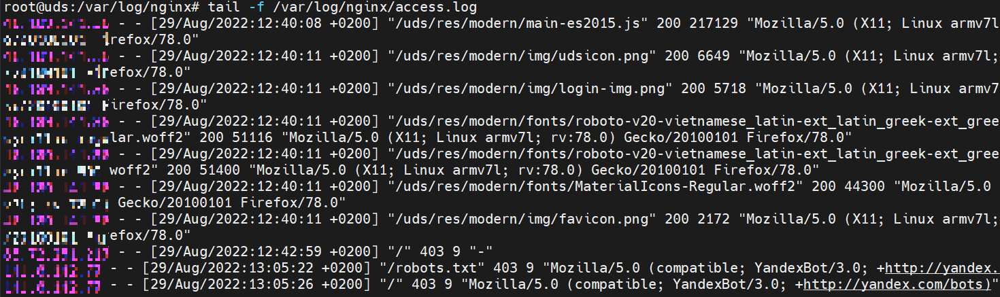
**NOTE:** with the command tail -f /var/log/nginx/access.log we can easily see the information in real time

# OpenUDS Tunnel
One of the OpenUDS Tunneler logs can be found in the path**/var/log/Syslog**
In it, in addition to the OS records themselves, we can findinformation on the tunneled connections made by OpenUDS, such as the user's public IP, the machine's IP, the port through which we accessthe service, etc...

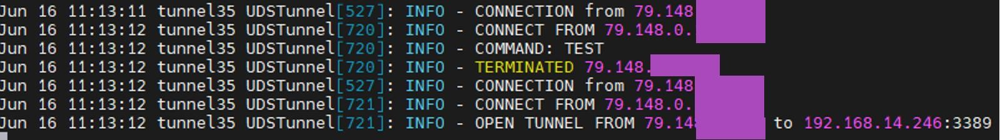

In the path **/var/log/tomcat9/catalina.out** we will find another logfile where we can see everything related to HTML5 connections.

# OpenUDS Client - Windows
The log file of the OpenUDS Client component can be found in the user's temporary folder (%temp%).

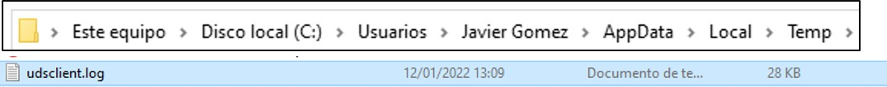

In this log we can view any error that has occurred in the connection client when we make the connection to services published in OpenUDS.

# OpenUDS Client - Linux
The log file of the OpenUDS Client component can be found in the user'shome folder:

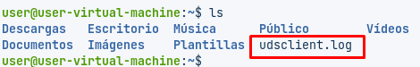

In this log we can view any error that has occurred in the connection client when we make the connection to services published in OpenUDS.

# OpenUDS Actor - Windows
The OpenUDS Actor component in a Windows OS will offer us two different logs, one related to the service in charge of configuring the virtual desktop (change of name, domain inclusion, machine status, etc…) andanother related to the control of the session of the user accessingthe desktop.
The log in charge of service preparation tasks is generated in theWindows temporary folder: C:\Windows\Temp

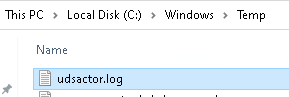

The log in charge of the control tasks of a user's session isgenerated in the temporary folder of the user's profile:C:\Users\\*username*\AppData\Local\Temp (%temp%)

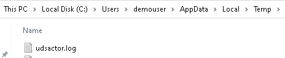

# OpenUDS Actor - Linux
The OpenUDS Actor component in a Linux OS will offer us two different logs, one related to the service in charge of configuring the virtual desktop (name change, connectivity, machine status, etc…) and anotherrelated to session control of the user accessing the desktop.
The log in charge of service preparation tasks is generated in the/var/log/ folder

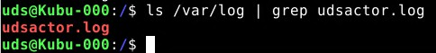

The log in charge of a user's session control tasks is generated inthe user's home folder:

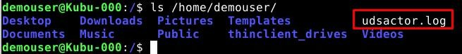

# Logs in OpenUDS administration
From the OpenUDS Enterprise administration you can get additional information on the different configurable sections and services.
Here are some examples:

- **Service Providers**: In the service providers configured in OpenUDS we
  can find the "Logs" section, which can provide us with information
  about possible errors.
  
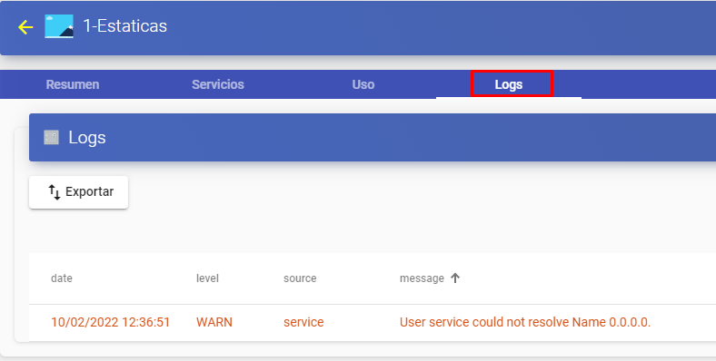

- **Authenticators**: In the authenticators configured in OpenUDS Enterprise
  we can find a "Logs" section that can provide us with information such
  as the user who has accessed or the OS from which it is accessed, etc.

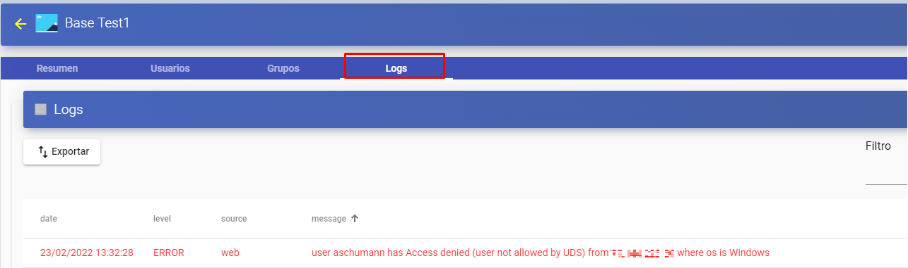

- **service pools**: In the service pools created in OpenUDS Enterprise
  there is a "Logs" section where you can view all the changes made to
  said pool and the user who made said change.

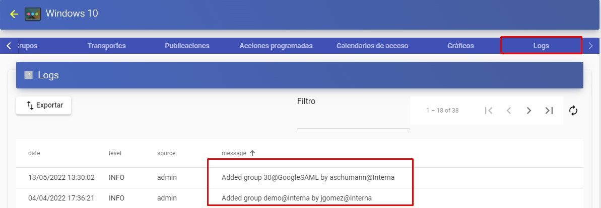

Within our service pool we can also access the logs of each deployed machine, as can be seen in the following image (for example, if youhave a restricted service, you can see the reason here)

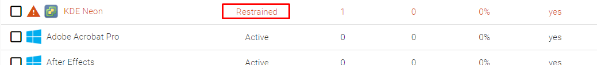

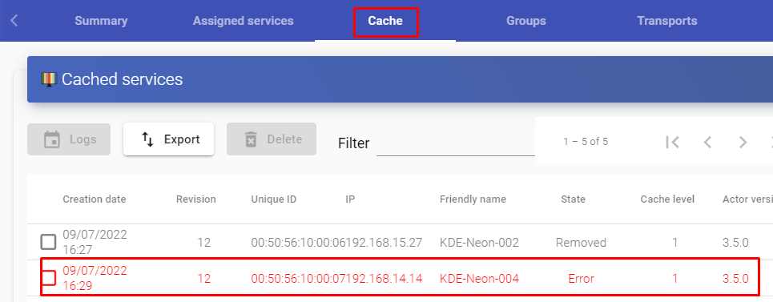

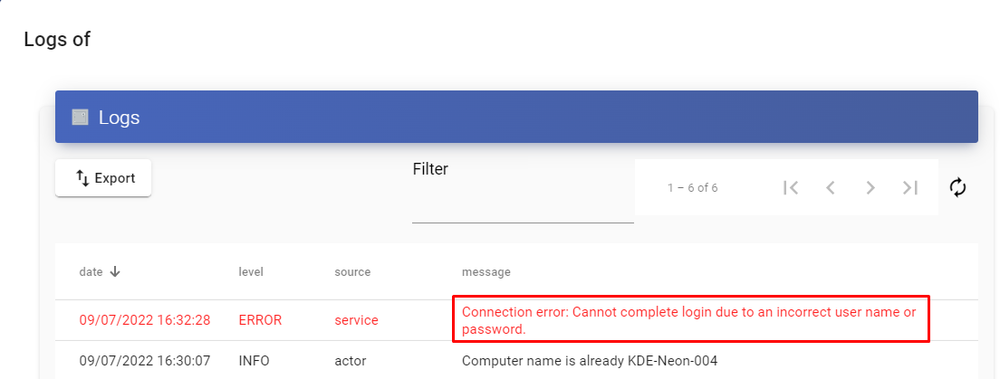

From here we can see the reason for the service restriction.
